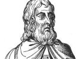

  
[Intangible Textual Heritage](../../index)  [Sub Rosa](../index) 
[Index](index)  [Next](sma01) 

------------------------------------------------------------------------

[Buy this Book at
Amazon.com](https://www.amazon.com/exec/obidos/ASIN/B0022NGKTI/internetsacredte)

------------------------------------------------------------------------

  
*Secret Societies of the Middle Ages*, by Thomas Keightley, \[1837\], at
Intangible Textual Heritage

------------------------------------------------------------------------

# SECRET SOCIETIES OF THE MIDDLE AGES.

## by Thomas Keightley

#### Charles Knight & Co., London

#### \[1837\]

Scanned at Intangible Textual Heritage, April 2006. Proofed and
formatted by John Bruno Hare. This text is in the public domain because
it was published prior to 1923.

------------------------------------------------------------------------

[Next: Contents](sma01)
