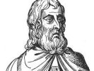

  
[Intangible Textual Heritage](../../index)  [Sub Rosa](../index) 
[Index](index)  [Previous](sma28)  [Next](sma30) 

------------------------------------------------------------------------

[Buy this Book at
Amazon.com](https://www.amazon.com/exec/obidos/ASIN/B0022NGKTI/internetsacredte)

------------------------------------------------------------------------

  
*Secret Societies of the Middle Ages*, by Thomas Keightley, \[1837\], at
Intangible Textual Heritage

------------------------------------------------------------------------

p. 372

### CHAPTER IV.

The General Chapter--Rights of the Emperor--Of his
Lieutenant--Of the Stuhlherrn, or Tribunal-Lords.

To complete the sketch of the Fehm-tribunals and their proceedings, we
must state the rights and powers of the general chapter and of the
emperor, his lieutenant, and the tribunal-lords.

The general chapter was a general assembly of the Westphalian
tribunal-lords, counts, and schöppen, summoned once a-year by the
emperor or his lieutenant. Every count was bound by oath to appear at
it. It could only be holden in Westphalia, and almost exclusively at
Dortmund or Arensberg. No one could appear at it who was not initiated,
not even the emperor himself. The president was the emperor, if present
and initiated, otherwise the lieutenant or his substitute.

The business of the general chapter was to inquire into the. conduct and
proceedings of the different Fehm-courts. The counts were therefore to
give an account of all their proceedings during the past year; to
furnish a list of the names of the schöppen who had been admitted, as
well as of the suits which had been commenced, with the names of the
accusers, the accused, the forfehmed, &c. Such counts as had neglected
their duty were deposed by the general chapter.

The general chapter was, as we have above observed, a court of appeal
from all the Fehm-tribunals. In matters of great importance the decrees
of the

p. 373

lower courts were, to give them greater weight, confirmed by the general
chapter. It was finally at the general chapter that all regulations,
laws, and reformations, concerning the Fehm-law and courts, were made.

The emperor, even when the imperial authority was at the lowest, was
regarded in Germany as the fountain of judicial authority. The right of
passing capital sentence in particular was considered to emanate either
mediately or immediately from him. The Fehm-courts were conspicuous for
their readiness to acknowledge him as the source of their authority, and
all their decrees were pronounced in his name.

As superior lord and judge of all the counts and tribunals, the emperor
had a right of inspection and reformation over them. He could summon and
preside in a general chapter.; he might enter any court; and the
presiding count was obliged to give way and allow him to preside in his
stead. He had the power to make new schöppen, provided he did so on
Westphalian soil. Every schöppe was moreover bound to give a true answer
to the emperor when he asked whether such a one was *forfehmed* or not,
and in what court. He could also depose disobedient counts, but only in
Westphalia.

The emperor could even withdraw a cause out of the hands of the
tribunals. The right of appeal to him has been already noticed; but,
besides this, he had a power of forbidding the count to proceed in the
cause when the accused offered himself to him *for honour and right;*
and it was at his own risk then that the count proceeded any further in
the business. The emperor could also grant a safe-conduct to any person
who might apply for it under apprehension of having been *forfehmed*,
which safe-conduct the schöppen dared not violate. Even when

p. 374

a person had been *forfehmed*, the emperor could save him by issuing his
command to stay execution of the sentence for a hundred years, six
weeks, and a day.

It is plain, that, to be able to exercise these rights, the emperor must
be himself *initiated*, for otherwise he could not, for instance, appear
where a court was sitting, make alterations in laws with which, if
*ignorant*, he must necessarily be unacquainted, or extend mercy when he
could not know who was *forfehmed* or not. In the laws establishing the
rights of the emperor it was therefore always inserted, *provided he be
initiated*, and the acts of uninitiated emperors were by the Fehm-courts
frequently declared invalid. The emperor had, therefore, his choice of
setting a substitute over the Fehm-courts, or of being himself
initiated. The latter course was naturally preferred, and each emperor,
at his coronation at Aix-la-Chapelle, was initiated by the hereditary
Count of Dortmund. Though Aix-la-Chapelle was not in Westphalia, the law
sanctioned this departure from the general rule that frei-schöppen
should only be made in that country.

The emperor's lieutenant, who was almost always the Archbishop of
Cologne, had the right of confirming such counts as were presented to
him by the Tribunal-lords, and of investing them with the powers of life
and death. He could also summon general chapters, and preside and
exercise the other imperial rights in them. He might decide, with the
aid of some schöppen, in cases of appeal to him, without bringing the
affair before the general chapter; and he had the power of making
schöppen at any tribunal in Westphalia, which proves that, like the
emperor, he had free access to them all. Hence it is clear that he also
must have been initiated.

The dignity and pre-eminence of the [Archbishop](errata.htm#25)

p. 375

of Cologne, when this office had been conferred on him, caused a good
deal of envy and jealousy among the lords of Westphalia, who had been
hitherto his equals, and who considered themselves equally entitled to
it with him. They never let slip an occasion of showing their feelings,
and they always had their counts invested by the emperor, and not by the
archbishop; nay, there are not wanting instances of their having such
counts as he had invested confirmed and re-invested by the emperor.

There now remain only the Tribunal-Lords (*Stuhlherrn*) to be
considered.

The Tribunal-lord was the lord of the district in which there was a
Fehm-tribunal. He might himself, if initiated, become the count of it,
having previously obtained the power of life and death from the emperor,
or his lieutenant; or, if he did not choose to do so, he might, as we
have already seen, present a count to be invested, for whose conduct he
was held responsible; and, if the count appointed by him misconducted
himself, the Stuhl-herr was liable to a forfeiture of his rights. He
was, in consequence, permitted to exercise a right of inspection over
the Fehm-courts in his territory; no schöppé could be made, no cause
brought into the court, not even a summons issued, without his
approbation. There even lay a kind of appeal to him from the sentence of
the count; and he could also, like the emperor, withdraw certain persons
and causes from his jurisdiction. But as his power did not extend beyond
his own [territory](errata.htm#26), the count might refer those causes
in which he wished, but was prohibited, to proceed, to the courts in
other territories; he might also, if he apprehended opposition from the
Tribunal-lord, require him (if initiated) to be present at the
proceedings.

The Tribunal-lord, if uninitiated, could, like the

p. 376

emperor in the same case, exercise these powers only by initiated
deputies.

The great advantage which resulted from the right of having
Fehm-tribunals induced the high lords, both spiritual and temporal, to
be very anxious to become possessed of this species of territorial
property, and in consequence nearly all the lords in Westphalia had
Fehm-tribunals. Even towns, such as Dortmund, Soëst, Münster, and
Osnabrück, had these tribunals, either within their walls, or in their
districts, or their neighbourhood, for it would not have been good
policy in them to suffer this sort of *Status in Statu*, to be
independent of their authority.

------------------------------------------------------------------------

[Next: Chapter V](sma30)
