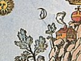

  
[Intangible Textual Heritage](../../index)  [Sub Rosa](../index.md) 
[Index](index)  [Previous](wta06)  [Next](wta08.md) 

------------------------------------------------------------------------

[Buy this Book at
Amazon.com](https://www.amazon.com/exec/obidos/ASIN/0892540761/internetsacredte.md)

------------------------------------------------------------------------

  
*With the Adepts, An Adventure Among the Rosicrucians*, by Franz
Hartmann \[1910\], at Intangible Textual Heritage

------------------------------------------------------------------------

p. 88

### V

### RECOLLECTIONS OF PAST LIVES

WE passed through an alley formed by oleander bushes in full bloom, and
arrived at a small round pavilion standing upon a little eminence, which
afforded a beautiful view of the country and the tall mountain tops in
the distance. The roof of the pavilion was supported by marble columns
surrounded by ivy, which grew around the pillars and nearly covered the
roof, hanging down at intervals in the open spaces. We seated ourselves,
and after a short pause, my friend, whom I will call Leila, said: "I owe
you an explanation in regard to the remarks I made when I saw your
astonishment at seeing the female sex represented among the Brothers of
the Golden and Rosy Cross. Your intuition told you right. It does not
indeed very often happen that an individual attains adeptship while
inhabiting a female organism, because such an organism is not as well
adapted as a male one to develop energy and strength, and it is,
therefore frequently the case that those

p. 89

women who have far advanced on the road to adeptship must reincarnate in
a male organism, before they can achieve the final result. Nevertheless,
exceptions are found. You know that the organism of a man is not
fundamentally different from that of a woman, and in each human being
are male and female elements combined. In women usually the female
elements preponderate, and in men the male ones are usually most active,
although we meet with women of a masculine character, and with men who
are of a womanish nature. In a perfect human being the male and female
elements are nearly equally strong, with a slight preponderance of the
male element, which represents the productive power in nature, while the
female element represents the formative principle. This occult law,
which to explain at present would lead us deep into the mysteries of
nature, will become comprehensible to you if you will study the laws of
harmony. You will then find that the *Moll*-accord is the harmonious
counterpart of the *Dur*-accord, but that the greatest beauty finds its
expression in *Dur*. Other and numerous analogies may be found, and we
shall leave it to your own ingenuity to find them out.

"If you therefore find an Adept inhabiting a female organism, you will
be right in concluding that such an abnormal circumstance is due to some
extraordinary conditions and experiences

p. 90

through which such an Adept has passed during his last incarnation. A
plant in a hot-house will grow faster than one which is not cared for,
and, likewise, extraordinary suffering may cause the early development
of the flower of spirituality, which without such suffering would have
taken place, perhaps, much later in some other incarnation."

This revelation stirred my curiosity, and I begged the lady to give me
an account of her past life, as it was before she became an Adept.

"It is sometimes painful," answered Leila, "to dwell on the memories of
the past, but perhaps our sister Helen will give you such an account of
her life."

The lady addressed smiled, and said: "I will certainly do so to afford a
pleasure to our visitor, but my life in comparison with yours has been
very uninteresting. If you will proceed with your history, I will add
mine at the end."

"Very well, then," answered Leila; "but to simplify matters, and to save
time, I will show you its pictorial representation in the Astral Light.
Look upon the table before you."

I looked upon the polished surface of the round marble table standing in
the centre of the pavilion, and, as I looked, there appeared upon its
surface the life-like image of a battlefield.

p. 91

\[paragraph continues\] There were the
contending armies fighting with swords and spears, men on horseback and
men on foot, knights in glistening armour, and common soldiers. Hot
grows the fight; the dead and wounded cover the ground, and the soldiers
to the left begin to give way, while those to the right press forward.
Suddenly there appears at the left a beautiful woman, dressed in armour,
carrying a sword in one hand and in the other a banner. Her features
resemble those of the Lady-Adept. At sight of her the men to the left
seem to become filled with strength, while their enemies seem to be
stricken with terror. The latter flee, pursued by the men on the left,
and a shout of triumph arises, and the picture fades away.

Now there appears another picture upon the table. It seems to be the
interior of a Catholic church. There is a great assembly of dignitaries
of church and state, of knights and nobles, bishops and priests, and a
multitude of people. In front of the altar kneels an armoured knight,
who seems to be the king, and a bishop, ornamented with the insignia of
his office, puts a golden crown upon his head; but by the side of the
king stands again that noble-looking woman, with a smile of triumph upon
her face and holding a banner. A solemn music is heard, but as the crown
rests upon the

p. 92

head of the king and he arises, a thousand voices hail him, and the
picture fades away.

The next picture represents a dungeon filled with instruments of
torture, such as were used at the time of the Inquisition. There are
some men dressed in black, and in their eyes burns the fire of hate;
there are others dressed in red; they are evidently the executioners.
Some people with torches appear, and in their midst is Leila bound with
chains. She looks at the men in black with pity and contempt. They ask
her some silly questions, which she refuses to answer, and then they
begin to torture her in a most cruel manner. I averted my sight, and
when I looked again, the picture was gone.

In its place appeared another. There is a pile of wood, and in its midst
a stake to which a chain is fastened. A procession approaches, led by
villainous-looking monks and guarded by soldiers. Crowds of people
surround the pile, but they give way as the procession approaches. In
the midst of the monks and hangmen walks Leila, looking pale and
emaciated from torture and sufferings; her hands are tied, and a rope is
fastened round her neck. She mounts the pile and is fastened to the
stake. She attempts to speak, but the praying monks dash water into her
face to force her to remain silent. A

p. 93

hangman appears with a brand of fire; the wood begins to burn; the
flames touch the body of the beautiful woman. I desired to see no more;
I buried my face in my hands; I knew who Leila was.

After I had recovered from the impression which this horrible sight had
made upon my mind, I expressed to Leila my admiration for her valour and
virtue. I had always admired her as a historical character, and desired
to see her portrait. Now she stood before me, the living original,
youthful and strong, noble and beautiful, and yet, according to history,
over 450 years of age.

It is useless to attempt to conceal a thought in the presence of the
Adepts. Leila observed my thought, and answered it.

"No," she said, "I am much older than you think. I and you, and we all,
are as old as creation. When the spirit began to breathe after the Great
*Pralaya* was over, sending out of the centre the light of the *Logos*,
which called the world into existence, we lived already, and we shall
continue to live until this light returns to its source. God in us knows
no age; He is eternal and independent of the conditions of time. Nor can
our spiritual bodies be destroyed by fire."

p. 94

"But," I said, "your body was destroyed by fire."

"That which was destroyed," answered Leila, "was merely the grossest
material substance of my physical organisation. As the fire consumed the
gross matter, my ethereal form arose above the fire and the smoke; it
was invisible to the multitude present, whose senses are so gross that
they can only perceive gross matter; but it was visible to the Adepts
who were present in their ethereal forms, and who took care of me, and
after a short period of unconsciousness I awoke again to external life.
Gradually my body hardened again by the action of the influences
prevailing in my new home, and therefore I am now as visible and
tangible to you as if I were still inhabiting my material form."

"Then, I presume," I said, "that the astral body of every human being or
animal could be so hardened, after having left the physical form, and
thus the spirits of the dead could be made to appear in a tangible and
visible form."

"It could be done, and it has often been done," answered Leila, "by the
vile practices of the necromantic art. It can be done with the
earth-bound astral shades of some who have suddenly died by accident or
murder,

p. 95

and in whose astral forms is therefore still a great deal of molecular
adhesion; but the astral forms of those who have died long ago cannot be
thus evoked, because their astral corpses have already been decomposed
by the influences of the astral plane. But those materialised' forms
have no life of their own, and cannot endure. They only live by the
life-principle infused into them by the necromancer who performs such
acts consciously, or by the medium who performs them unconsciously. To
enable an astral form to continue to live after the death of the
physical form, it must have attained spiritual life during the life of
the physical body."

"Surely," I said, "in every human being the astral form contained within
the physical body has life."

"True," she answered, "but not in every human being is it the centre of
life and of consciousness. In ordinary mortals the seat of life is in
the blood contained in the veins and arteries of the physical form, and
the astral form lives only, so to say, from the reflex of that physical
life. In the Adept, the centre of life and consciousness has been
established in the organism of his soul, clothed with the astral form,
and is therefore self-conscious and independent of the life of the

p. 96

physical body. I had already during former incarnations acquired that
life and consciousness of the spirit. I was on the way to adeptship
before I was born in a peasant's hut. During my childhood I had
spiritual intercourse with Adepts, although I knew them not
intellectually, because my intellectual activity, the result of my
physical organisation, was then not sufficiently perfect to understand
that which my spirit perceived. But," she continued, "let us drop these
metaphysical speculations, which I see fatigue your brain, and which are
still more difficult of comprehension, in that there is no rule without
some exception, and the laws of nature are liable to produce endless
varieties."

"Many thanks for your kindness in giving me so much information," I
said; "but permit me to ask one more question. What were the voices you
heard and the apparition you saw? Was it truly the archangel Michael who
gave you your mission and aided you in your victories?"

"No," was the reply. "Angels do not interfere personally in mundane
matters; spiritually developed man is higher than they. It was the
influence of one of our Brothers, who was formerly a great warrior and
patriot, whose power entered within myself and took

p. 97

the shape of a knight, representing the archangel for whom I always had
a great veneration and whose image was foremost in my mind . . . But
see. . . ."

To my great astonishment Leila became suddenly transformed into the
luminous shape of a knight in a brilliant armour, which shone like the
sun, so that I had to avert my eyes for fear of getting blinded. The
apparition disappeared within a few moments, and Leila stood there again
in her previous form.

I had for a long time observed the features of the other Lady-Adept; and
it seemed to me as if I had seen her somewhere, perhaps in my dreams.
Yes, I remember that when I was a mere child I once had a vision, while
in a state between sleeping and waking, when it seemed to me as if an
angel or a super-terrestrial being, clad in white and holding a white
lily in her hand, were floating in the air over my head, extending the
lily towards me. How often had I prayed in my heart to see that
beautiful form again; and now, if I did not mistake, this lady was the
form I had seen in my dream.

She was of exceeding great beauty; her long, black, waving hair formed a
strong contrast to her plain, white, and flowing robe, covering her form
with graceful folds. Her

p. 98

tint was pale and delicate, her profile was pure Greek; her dark eyes
seemed to penetrate to the innermost centre of my soul, and to kindle
there a fire of pure love and admiration without any admixture of the
animal element.

"My life," said Helen, "was one of little importance. I was born at St.
Petersburg, and my father was an officer in the imperial army. He died
while I was very young, and left his family in great poverty. Besides
the company of my mother, my relatives, and a teacher, there was nothing
to attract me to earth. My mind unfolded and revelled in
superterrestrial joys; I loved poetry; I loved to look at the clouds
sailing in the sky, and to see in them objects of beauty; I communicated
in spirit with the heroes of the past. But the development of my
physical form could not keep step with the unfoldment of the mind. Cold,
starvation, and want hastened its dissolution. After having reached my
eighteenth year, I left my wasted, consumptive form, and was kindly
received by the Brothers."

Her plain and modest tale filled my heart with pity. "And was there no
one," I said, "among your country people intelligent enough to perceive
your genius and to give you support?"

"They erected a costly monument to my

p. 99

memory," she answered, "after my body had succumbed. A part of the money
expended for it would have procured me the necessaries to prolong my
life. Those who knew me while living admired my poetry and my talents,
but they were poor like myself. But let that pass. The conditions under
which men live are the effects of previously acquired Karma. My poverty
and suffering were my gain. I have cause to be well satisfied with my
lot."

While the lady spoke, I scanned her features. Was it really she who had
appeared to me years ago in a dream? Was it she who waved that lily as
if pronouncing a blessing? Was it the magnetic current which seemed to
stream through that symbol into the depths of my heart, and to call
there a higher life into activity? Could that event have been a dream?
Did it not fill my whole being with happiness at the time when it
happened? Did its memory not remain deeply engraved in my heart, when
thousands of other dreams had faded away?

Helen rose, and reaching out through one of the open spaces between the
pillars, she broke a white lily flower which grew close by the wall.
This she gave to me, and said, "Keep this flower; it will not fade like
a dream; and when you see it you will know that I am not a product of
hallucination."

p. 100

I thanked her and begged her to remain my protector in the future, as
she had been in the past. To this she answered: "We can only assist
those who protect themselves. We can only influence those who are ready
to receive our influence. We can only approach those who spiritually
approach our own sphere. Love causes mutual attraction; the pure will be
attracted to the pure, the evil ones to that which is evil. To give
presupposes the capacity to receive on the part of him who is to
receive. The sunlight is open to all, but not all are able to see it.
The eternal fountain of truth is inexhaustible and universal; but those
who open their hearts to the sunshine of truth are few. Seek continually
to rise above the sphere of selfishness, and you will be in company of
those who have thrown off their animal elements and live in the spirit."

As the lady finished speaking, another Adept approached the pavilion. He
was a man of small stature, but with a highly intellectual expression
upon his face which at once indicated that he must be a Master. His head
was almost bald on the top, and showed a most remarkable formation of
his skull; at each side, however, there were gray locks of hair, and I
immediately recognised in him one whose picture I had often seen and
whose presence I

p. 101

had often felt, and whom I will call Theodorus. He had been a great
Adept and Rosicrucian during his earthly life; he had been a great
physician, and performed most wonderful cures. He had been a great
alchemist, and knew the secret of the *Cross* and the *Rose*, of the
*Red Lion* and the *White Eagle*.

As he entered, he announced that the Imperator had been called away to
attend to some important affairs connected with politics on the mundane
plane. He jocularly remarked that he had gone to prevent a certain
statesman from committing an act of imbecility, which would, if he did
not succeed in stopping it, be productive of a great war. He was
therefore deputed by the Imperator to show me the alchemical laboratory
and to correct some of my misconceptions in regard to alchemy. I was
rather reluctant to leave the presence of the ladies, and I would have
been willing to die at that moment to enable my soul to remain in their
presence; but I could not with propriety decline the invitation. The
ladies permitted me to retire, and I went with Theodorus into the halls
of the Monastery.

------------------------------------------------------------------------

[Next: VI. The Alchemical Laboratory](wta08.md)

