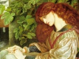

  
[Intangible Textual Heritage](../../index)  [Sub Rosa](../index.md) 
[Index](index)  [Previous](zan59)  [Next](zan61.md) 

------------------------------------------------------------------------

[Buy this Book at
Amazon.com](https://www.amazon.com/exec/obidos/ASIN/1595478779/internetsacredte.md)

------------------------------------------------------------------------

  
*Zanoni*, by Edward Bulwer Lytton, \[1842\], at Intangible Textual
Heritage

------------------------------------------------------------------------

# BOOK VI.—SUPERSTITION DESERTING FAITH.

     Why do I yield to that suggestion, Whose horrid image doth unfix  
     my hair.—Shakespeare

### CHAPTER I.

     Therefore the Genii were painted with a platter full of garlands  
     and flowers in one hand, and a whip in the other.—Alexander  
     Ross, "Mystag. Poet."

According to the order of the events related in this narrative, the
departure of Zanoni and Viola from the Greek isle, in which two happy
years appear to have been passed, must have been somewhat later in date
than the arrival of Glyndon at Marseilles. It must have been in the
course of the year 1791 when Viola fled from Naples with her mysterious
lover, and when Glyndon sought Mejnour in the fatal castle. It is now
towards the close of 1793, when our story again returns to Zanoni. The
stars of winter shone down on the lagunes of Venice. The hum of the
Rialto was hushed,—the last loiterers had deserted the Place of St.
Mark's, and only at distant intervals might be heard the oars of the
rapid gondolas, bearing reveller or lover to his home. But lights still
flitted to and fro across the windows of one of the Palladian palaces,
whose shadow slept in the great canal; and within the palace watched the
twin Eumenides that never sleep for Man,—Fear and Pain.

"I will make thee the richest man in all Venice, if thou savest her."

"Signor," said the leech; "your gold cannot control death, and the will
of Heaven, signor, unless within the next hour there is some blessed
change, prepare your courage."

Ho—ho, Zanoni! man of mystery and might, who hast walked amidst the
passions of the world, with no changes on thy brow, art thou tossed at
last upon the billows of tempestuous fear? Does thy spirit reel to and
fro?—knowest thou at last the strength and the majesty of Death?

He fled, trembling, from the pale-faced man of art,—fled through stately
hall and long-drawn corridor, and gained a remote chamber in the palace,
which other step than his was not permitted to profane. Out with thy
herbs and vessels. Break from the enchanted elements, O silvery-azure
flame! Why comes he not,—the Son of the Starbeam! Why is Adon-Ai deaf to
thy solemn call? It comes not,—the luminous and delightsome Presence!
Cabalist! are thy charms in vain? Has thy throne vanished from the
realms of space? Thou standest pale and trembling. Pale trembler! not
thus didst thou look when the things of glory gathered at thy spell.
Never to the pale trembler bow the things of glory: the soul, and not
the herbs, nor the silvery-azure flame, nor the spells of the Cabala,
commands the children of the air; and THY soul, by Love and Death, is
made sceptreless and discrowned!

At length the flame quivers,—the air grows cold as the wind in charnels.
A thing not of earth is present,—a mistlike, formless thing. It cowers
in the distance,—a silent Horror! it rises; it creeps; it nears
thee—dark in its mantle of dusky haze; and under its veil it looks on
thee with its livid, malignant eyes,—the thing of malignant eyes!

"Ha, young Chaldean! young in thy countless ages,—young as when, cold to
pleasure and to beauty, thou stoodest on the old Firetower, and heardest
the starry silence whisper to thee the last mystery that baffles
Death,—fearest thou Death at length? Is thy knowledge but a circle that
brings thee back whence thy wanderings began! Generations on generations
have withered since we two met! Lo! thou beholdest me now!"

"But I behold thee without fear! Though beneath thine eyes thousands
have perished; though, where they burn, spring up the foul poisons of
the human heart, and to those whom thou canst subject to thy will, thy
presence glares in the dreams of the raving maniac, or blackens the
dungeon of despairing crime, thou art not my vanquisher, but my slave!"

"And as a slave will I serve thee! Command thy slave, O beautiful
Chaldean! Hark, the wail of women!—hark, the sharp shriek of thy beloved
one! Death is in thy palace! Adon-Ai comes not to thy call. Only where
no cloud of the passion and the flesh veils the eye of the Serene
Intelligence can the Sons of the Starbeam glide to man. But \_I\_ can
aid thee!—hark!" And Zanoni heard distinctly in his heart, even at that
distance from the chamber, the voice of Viola calling in delirium on her
beloved one.

"Oh, Viola, I can save thee not!" exclaimed the seer, passionately; "my
love for thee has made me powerless!"

"Not powerless; I can gift thee with the art to save her,—I can place
healing in thy hand!"

"For both?—child and mother,—for both?"

"Both!"

A convulsion shook the limbs of the seer,—a mighty struggle shook him as
a child: the Humanity and the Hour conquered the repugnant spirit.

"I yield! Mother and child—save both!"

....

In the dark chamber lay Viola, in the sharpest agonies of travail; life
seemed rending itself away in the groans and cries that spoke of pain in
the midst of frenzy; and still, in groan and cry, she called on Zanoni,
her beloved. The physician looked to the clock; on it beat: the Heart of
Time,—regularly and slowly,—Heart that never sympathised with Life, and
never flagged for Death! "The cries are fainter," said the leech; "in
ten minutes more all will be past."

Fool! the minutes laugh at thee; Nature, even now, like a blue sky
through a shattered temple, is smiling through the tortured frame. The
breathing grows more calm and hushed; the voice of delirium is dumb,—a
sweet dream has come to Viola. Is it a dream, or is it the soul that
sees? She thinks suddenly that she is with Zanoni, that her burning head
is pillowed on his bosom; she thinks, as he gazes on her, that his eyes
dispel the tortures that prey upon her,—the touch of his hand cools the
fever on her brow; she hears his voice in murmurs,—it is a music from
which the fiends fly. Where is the mountain that seemed to press upon
her temples? Like a vapour, it rolls away. In the frosts of the winter
night, she sees the sun laughing in luxurious heaven,—she hears the
whisper of green leaves; the beautiful world, valley and stream and
woodland, lie before, and with a common voice speak to her, "We are not
yet past for thee!" Fool of drugs and formula, look to thy
dial-plate!—the hand has moved on; the minutes are with Eternity; the
soul thy sentence would have dismissed, still dwells on the shores of
Time. She sleeps: the fever abates; the convulsions are gone; the living
rose blooms upon her cheek; the crisis is past! Husband, thy wife lives;
lover, thy universe is no solitude! Heart of Time, beat on! A while, a
little while,—joy! joy! joy!—father, embrace thy child!

------------------------------------------------------------------------

[Next: Chapter II](zan61.md)
