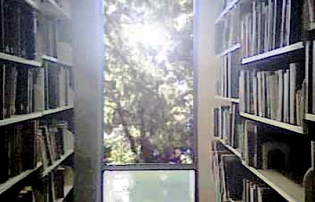

 

### Etext Bibliograpy

------------------------------------------------------------------------

This is a comprehensive bibliography of all *complete* books scanned at,
or for, the Internet Sacred Text Archive. If a file is listed here, it
normally indicates that this is the first place it was posted anywhere
on the Internet, as far as we can determine. This does not list etexts
of journal articles, nor files scanned elsewhere and posted or
reformatted for sacred-texts. All of these texts are believed to be in
the public domain. Their files may be used for any non-commercial
purpose freely, as long as they are attributed correctly. Commercial use
of these files *may* require licensing arrangements with the Internet
Sacred Text Archive per the [Terms of Service](tos.htm#commercialuse)
[Terms of Service](tos.htm#commercialuse) Terms of Service, [contact
ISTA for details](contact).

**Staff members:** John Bruno Hare \[JBH\]; Melissa Ellen Casey \[MEC\]

**Volunteers:**  
(past and present)  
\[CW\] is Chris Weimer.  
\[Some Dude (BT)\] is a volunteer who wishes to remain anonymous. \[HG\]
is a volunteer who wishes to remain anonymous.  
\[PB\] Phillip Brown, who ran the belinus.co.uk Celtic folklore site for
many years, has donated his collection to sacred-texts.  
\[CJ\] is Chetan Jain at BharatLiterature.  
\[SS\] is Srinivasan Sriram (as part of the sripedia.org initiative).  
\[MC\] is Mantra Caitanya.  
\[DP\] is Distributed Proofing.  
\[EY\] is Eliza Yetter from
[sacredspiral.com](https://sacredspiral.com/).  
\[NV\] is [northvegr.org](https://www.northvegr.org/),  
\[SM\] is the volunteer known as 'Simon Magus'.  
\[MR\] is a volunteer from
[www.reuniting.info](https://www.reuniting.info).  
\[BAR\] is Jason Barrera  

J.B. Hare is responsible for the transcription of all books listed here
which are otherwise unattributed.

#### Age of Reason

The Heroic Enthusiasts by Giordano Bruno; L. Williams, translator;
London, Part I: George Redway \[1887\]; Part II: Bernard Quaritch
\[1889\]  
[https://ith.oarc.science/aor/bruno/the/index.htm](https://ith.oarc.science/aor/bruno/the/index)

Friar Bacon: His Discovery of the Miracles Of Art, Nature, And Magick by
Roger Bacon \[1659\]  
[https://ith.oarc.science/aor/bacon/miracle.htm](https://ith.oarc.science/aor/bacon/miracle)
\[contributed by Dr. Alan R. Young, Ph.D.\]

The Notebooks of Leonardo Da Vinci (original title, The Literary Works
of Leonardo Da Vinci), translated by Jean Paul Richter. Sampson Low,
Marston, Searle and Rivington, London \[1883\]  
[https://ith.oarc.science/aor/dv/index.htm](https://ith.oarc.science/aor/dv/index)

#### African, Afro-Caribbean, and African-American

Jamaica Anansi Stories by Martha Warren Beckwith \[1924\]  
[https://ith.oarc.science/afr/jas/index.htm](https://ith.oarc.science/afr/jas/index)

Specimens of Bushman Folklore by W.H.I. Bleek and L.C. Lloyd \[1911\]  
[https://ith.oarc.science/afr/sbf/index.htm](https://ith.oarc.science/afr/sbf/index)

The Religious System of the Amazulu, by Henry Callaway; Springvale,
Natal \[1870\]  
[https://ith.oarc.science/afr/rsa/index.htm](https://ith.oarc.science/afr/rsa/index)
\[CW\]

Folk Stories From Southern Nigeria, West Africa by Elphinstone Dayrell
\[1910\]  
[https://ith.oarc.science/afr/fssn/index.htm](https://ith.oarc.science/afr/fssn/index)

Notes on the Folklore of the Fjort (French Congo). by Richard Edward
Dennett \[1898\]  
[https://ith.oarc.science/afr/fjort/index.htm](https://ith.oarc.science/afr/fjort/index)

At the Back of the Black Man's Mind by R. E. Dennett \[1906\]  
[https://ith.oarc.science/afr/mind/index.htm](https://ith.oarc.science/afr/mind/index)

The Negro, by W.E.B. Du Bois, New York: Henry Holt and Company
\[1915\]  
[https://ith.oarc.science/afr/dbn/index.htm](https://ith.oarc.science/afr/dbn/index)

Yoruba-Speaking Peoples of the Slave Coast of West Africa by A. B. Ellis
\[1894\]  
[https://ith.oarc.science/afr/yor/index.htm](https://ith.oarc.science/afr/yor/index)

Drums and Shadows; Survival Studies Among the Georgia Coastal Negroes;
Savannah Unit, Georgia Writer's Project; Work Projects Administration;
Mary Granger, District Supervisor; University of Georgia Press \[1940,
copyright not renewed\]  
[https://ith.oarc.science/afr/das/index.htm](https://ith.oarc.science/afr/das/index)

South-African Folk-Tales by James A. Honeÿ \[1910\]  
[https://ith.oarc.science/afr/saft/index.htm](https://ith.oarc.science/afr/saft/index)

Wonderful Ethiopians of the Ancient Cushite Empire, Book I., by Drusilla
Dunjee Houston; The Universal Publishing Company, Oklahoma City, OK
\[1926, copyright not renewed\]  
[https://ith.oarc.science/afr/we/index.htm](https://ith.oarc.science/afr/we/index)

Stolen Legacy, by George G. M. James; New York: Philosophical Library
\[1954\]  
[https://ith.oarc.science/afr/stle/index.htm](https://ith.oarc.science/afr/stle/index)

Religion and Myth, by James Macdonald; London: D. Nutt; New York:
Scribner \[1883\]  
[https://ith.oarc.science/afr/ram/index.htm](https://ith.oarc.science/afr/ram/index)

The Promised Key, by G.G. Maragh (Leonard Percival Howell) \[1935?\]  
[https://ith.oarc.science/afr/tpk/index.htm](https://ith.oarc.science/afr/tpk/index)

Fetichism in West Africa, Forty Years' Observation of Native Customs and
Superstitions by Robert Hamill Nassau \[1904\]  
[https://ith.oarc.science/afr/fiwa/index.htm](https://ith.oarc.science/afr/fiwa/index)

Yoruba Legends, by M.I. Ogumefu, London \[1929\]  
[https://ith.oarc.science/afr/yl/index.htm](https://ith.oarc.science/afr/yl/index)
\[SM\]

The Royal Parchment Scroll of Black Supremacy, by Fitz Balintine
Pettersburg \[1926?\]  
[https://ith.oarc.science/afr/rps/index.htm](https://ith.oarc.science/afr/rps/index)

The Holy Piby, by Robert Athlyi Rogers; Newark, New Jersey \[1924-8, no
renewal\]  
[https://ith.oarc.science/afr/piby/index.htm](https://ith.oarc.science/afr/piby/index)

Hausa Folk-Lore by Maalam Shaihu, translated by R. Sutherland Rattray
\[1913\]  
[https://ith.oarc.science/afr/hausa/index.htm](https://ith.oarc.science/afr/hausa/index)

Woman's Mysteries of a Primitive People by D. Amaury Talbot, London
\[1915\]  
[https://ith.oarc.science/afr/wmp/index.htm](https://ith.oarc.science/afr/wmp/index)

Kaffir {Xhosa} Folk-lore: A Selection from the Traditional Tales by
George McCall Theal \[1886\]  
[https://ith.oarc.science/afr/xft/index.htm](https://ith.oarc.science/afr/xft/index)

Myths and Legends of the Bantu by Alice Werner \[1933\]  
[https://ith.oarc.science/afr/mlb/index.htm](https://ith.oarc.science/afr/mlb/index)

Voodoos and Obeahs, by Joseph J. Williams, S.J. New York \[1932\]  
[https://ith.oarc.science/afr/vao/index.htm](https://ith.oarc.science/afr/vao/index)

Psychic Phenomena of Jamaica, by Joseph J. Williams, S.J. New York
\[1934\]  
[https://ith.oarc.science/afr/ppj/index.htm](https://ith.oarc.science/afr/ppj/index)

Myths of Ífè, by John Wyndham. London \[1921\]  
[https://ith.oarc.science/afr/ife/index.htm](https://ith.oarc.science/afr/ife/index)
\[CW\]

#### Alchemy

Alchemy Rediscovered and Restored, by A. Cockren; Philadelphia, David
McKay \[1941, copyright not renewed\]  
[https://ith.oarc.science/alc/arr/index.htm](https://ith.oarc.science/alc/arr/index)

The Hermetic Museum, tr. by Arthur Edward Waite; London, J. Elliot and
Co. \[1893\]  
[https://ith.oarc.science/alc/hermmuse/index.htm](https://ith.oarc.science/alc/hermmuse/index)

Collectanea Chemica, ed. by A.E. Waite, London: J. Elliot and Co.
\[1893\]  
[https://ith.oarc.science/alc/cc/index.htm](https://ith.oarc.science/alc/cc/index)

#### Americana

Little Known Facts about the Amish and the Mennonites, By Ammon Monroe
Aurand, Jr. The Aurand Press; Harrisburg, Pennsylania. \[1938, copyright
not renewed\]  
[https://ith.oarc.science/ame/amish/index.htm](https://ith.oarc.science/ame/amish/index)

The Realness of Witchcraft in America, By Ammon Monroe Aurand, Jr. The
Aurand Press; Lancaster, Pennsylania. \[1942, copyright not renewed\]  
[https://ith.oarc.science/ame/row/index.htm](https://ith.oarc.science/ame/row/index)
\[EY\]

Early Life of the Pennsylvania Germans, By Ammon Monroe Aurand, Jr. The
Aurand Press; Lancaster, Pennsylania. \[194?, copyright not renewed\]  
[https://ith.oarc.science/ame/elpg/index.htm](https://ith.oarc.science/ame/elpg/index)
\[EY\]

Coffee in the Gourd, edited by Frank Dobie; Texas Folk-Lore Society
\[1924\]  
[https://ith.oarc.science/ame/cig/index.htm](https://ith.oarc.science/ame/cig/index)
\[EY\]

Pow-wows or Long-Lost Friend by John George Hohman \[1820\].  
[https://ith.oarc.science/ame/pow/index.htm](https://ith.oarc.science/ame/pow/index)

#### Native American

The Delight Makers, by Adolf F. Bandelier; New York, Dodd, Mead and
Company \[1890\]  
[https://ith.oarc.science/nam/sw/tdm/index.htm](https://ith.oarc.science/nam/sw/tdm/index)

Pomo Bear Doctors, by S.A. Barrett, University of California
Publications in American Archaeology and Ethnology 12:11 pp. 443-465
University of California Press, Berkeley \[1917\]  
[https://ith.oarc.science/nam/ca/pbd/index.htm](https://ith.oarc.science/nam/ca/pbd/index)

Tales of the Cochiti Indians, by Ruth Benedict; U.S. Bureau of American
Ethnology, Bulletin no. 98; US Government Printing Office; \[1931\]  
[https://ith.oarc.science/nam/sw/tci/index.htm](https://ith.oarc.science/nam/sw/tci/index)

Chinook Texts, by Franz Boas; U.S. Bureau of American Ethnology,
Bulletin no. 20; US Government Printing Office; \[1894\]  
[https://ith.oarc.science/nam/nw/chinook/index.htm](https://ith.oarc.science/nam/nw/chinook/index)

Kwakiutl Tales, by Franz Boas; (Columbia University Contributions to
Anthropology, Volume II) New York: Columbia University Press; \[1910\]  
[https://ith.oarc.science/nam/nw/kt/index.htm](https://ith.oarc.science/nam/nw/kt/index)

Tsimshian Texts (Nass River Dialect), by Franz Boas; U.S. Bureau of
American Ethnology Bulletin no. 27., USGPO, Washington D.C.; \[1902\]  
[https://ith.oarc.science/nam/nw/nass/index.htm](https://ith.oarc.science/nam/nw/nass/index)

Tsimshian Texts (New Series), by Franz Boas; (Publications of the
American Ethnological Society Volume III, Part 2); Late E. J. Brill,
Publishers and Printers, Leyden \[1912\]  
[https://ith.oarc.science/nam/nw/tst/index.htm](https://ith.oarc.science/nam/nw/tst/index)

Chinigchinich; A Historical Account of the Origin, Customs, and
Traditions of the Indians at the Missionary Establishment of St. Juan
Capistrano, Alta-California; By the Reverend Father Friar Geronimo
Boscana; Translated by Alfred Robinson; Wiley and Putnam, New York
\[1846\]  
[https://ith.oarc.science/nam/ca/bosc/index.htm](https://ith.oarc.science/nam/ca/bosc/index)

The Walam Olum. From The Lenâpé and Their Legends, by Daniel G. Brinton.
Brinton's Library of Aboriginal Literature number V. Phildelphia,
\[1885\].  
[https://ith.oarc.science/nam/walam/index.htm](https://ith.oarc.science/nam/walam/index)

Rig Veda Americanus: Sacred Songs of the Ancient Mexicans, with a Gloss
in Nahuatl by Daniel G. Brinton; Illustrations. Vol VIII of Brinton's
Library of Aboriginal Literature. Philadelphia, \[1890\].  
[https://ith.oarc.science/nam/aztec/rva/index.htm](https://ith.oarc.science/nam/aztec/rva/index)

Zuñi Religion, by Ruth Bunzel. From The Forty-Seventh Annual Report of
the Bureau of American Ethnology, 1929-1930. Includes complete text of
the following papers: Introduction to Zuñi Ceremonialism, Zuñi Origin
Myths, and Zuñi Ritual Poetry. Smithsonian, Washington D.C. \[1930\].  
[https://ith.oarc.science/nam/zuni/bunzel/index.htm](https://ith.oarc.science/nam/zuni/bunzel/index)

Indians of the Yosemite Valley and Vicinity, by Galen Clark; Yosemite
Valley, California, Galen Clark \[1904\]  
[https://ith.oarc.science/nam/ca/ioy/index.htm](https://ith.oarc.science/nam/ca/ioy/index)

American Indian Fairy Tales: Snow Bird, the Water Tiger, etc., by
Margaret Compton; Dodd, Mead & Company, New York \[1907\]  
[https://ith.oarc.science/nam/ait/index.htm](https://ith.oarc.science/nam/ait/index)

The Path on the Rainbow, ed. by George W. Cronyn; New York: Boni and
Liveright, Inc. \[1918\]  
[https://ith.oarc.science/nam/por/index.htm](https://ith.oarc.science/nam/por/index)

Creation Myths of Primitive America, by Jeremiah Curtin; Boston; Little,
Brown \[1898\]  
[https://ith.oarc.science/nam/ca/cma/index.htm](https://ith.oarc.science/nam/ca/cma/index)

Seneca Indian Myths, by Jeremiah Curtin; New York; E.P. Dutton & Company
\[1922\]  
[https://ith.oarc.science/nam/iro/sim/index.htm](https://ith.oarc.science/nam/iro/sim/index)

Zuñi Folk Tales, by Frank Hamilton Cushing \[1901\]. Introduction by
John Wesley Powell.  
[https://ith.oarc.science/nam/zuni/zft/index.htm](https://ith.oarc.science/nam/zuni/zft/index)

Yucatan Before and After the Conquest, by Diego de Landa, translated,
with notes by William Gates, Publication 20 of the Maya Society;
Baltimore, the Maya Society \[1937\]  
[https://ith.oarc.science/nam/maya/ybac/index.htm](https://ith.oarc.science/nam/maya/ybac/index)

Maidu Texts, by Roland B. Dixon; Publications of the American
Ethnological Society, Volume IV; Late E. J. Brill Publishers and
Printers, Leyden, \[1912\]  
[https://ith.oarc.science/nam/ca/mdut/index.htm](https://ith.oarc.science/nam/ca/mdut/index)

The Religion of the Luiseño Indians of Southern California, by Constance
Goddard Du Bois; University of California Publications in American
Archaeology and Ethnology 8:3, pp. 69-186 \[1908\]  
[https://ith.oarc.science/nam/ca/roli/index.htm](https://ith.oarc.science/nam/ca/roli/index)

Dancing Gods: Indian Ceremonials of New Mexico and Arizona, by Erna
Fergusson. New York, Alfred A. Knopf, \[1931, copyright not renewed\]  
[https://ith.oarc.science/nam/sw/dg/index.htm](https://ith.oarc.science/nam/sw/dg/index)

Coos Texts, by Leo J. Frachtenberg; Columbia University Contributions to
Anthropology, Volume I; Columbia University Press, New York; \[1913\]  
[https://ith.oarc.science/nam/nw/coos/index.htm](https://ith.oarc.science/nam/nw/coos/index)

Yaqui Myths and Legends, by Ruth Warner Giddings; Illustrated by Laurie
Cook; University of Arizona Press, Tucson, AZ (Univ. Ariz.
Anthropological Paper No. 2) \[1959\]  
[https://ith.oarc.science/nam/sw/yml/index.htm](https://ith.oarc.science/nam/sw/yml/index)

Hupa Texts, by Pliny Earle Goddard; (University of California
Publications in American Archaeology and Ethnology 1:2); \[1904\]  
[https://ith.oarc.science/nam/ca/hut/index.htm](https://ith.oarc.science/nam/ca/hut/index)

Jicarilla Apache Texts, by Pliny Earle Goddard; New York:
Anthropological Papers of the American Museum of Natural History, Vol.
VIII; \[1911\]  
[https://ith.oarc.science/nam/pla/jat/index.htm](https://ith.oarc.science/nam/pla/jat/index)

In the Beginning: A Navaho Creation Myth, told by Frank Goldtooth,
recorded by Stanley A. Fishler; Anthropological Papers, Department of
Anthropology, University of Utah No. 13, \[January 1953, copyright not
renewed\]  
[https://ith.oarc.science/nam/nav/itb/index.htm](https://ith.oarc.science/nam/nav/itb/index)
\[SM\]

The Punishment of the Stingy and Other Indian Stories, by George Bird
Grinnell; New York; London: Harper & Brother Publishers \[1901\]  
[https://ith.oarc.science/nam/pla/pots/index.htm](https://ith.oarc.science/nam/pla/pots/index)

The Iroquois Book of Rites by Horatio E. Hale. Volume II of Brinton's
Library of Aboriginal American Literature. Philadelphia, \[1883\]  
[https://ith.oarc.science/nam/iro/ibr/index.htm](https://ith.oarc.science/nam/iro/ibr/index)

Iroquoian Cosmology, by J. N. B. Hewitt; Twenty-First Annual Report of
the Bureau of American Ethnology, 1899-1900 Washington D.C., Government
Printing Office \[1903\]  
[https://ith.oarc.science/nam/iro/irc/index.htm](https://ith.oarc.science/nam/iro/irc/index)

Navajo Creation Myth, The Story of the Emergence, By Hasteen Klah,
Recorded by Mary C. Wheelwright; Navajo Religion Series, Volume I, Santa
Fe, \[1942, no renewal\]  
[https://ith.oarc.science/nam/nav/ncm/index.htm](https://ith.oarc.science/nam/nav/ncm/index)
\[SM\]

Two Myths of the Mission Indians, by A. L. Kroeber; Journal of American
Folklore Vol. XIX, No. 75, pp. 309-21.
[https://ith.oarc.science/nam/ca/tmmi/index.htm](https://ith.oarc.science/nam/ca/tmmi/index)

Religion of the Indians of California, by A. L. Kroeber; University of
California Publications in American Anthropology and Ethnography Vol. 4,
No. 6, pp. 319-356 \[1907\]  
[https://ith.oarc.science/nam/ca/ric/index.htm](https://ith.oarc.science/nam/ca/ric/index)

Indian Myths of South Central California, by A. L. Kroeber; University
of California Publications in American Anthropology and Ethnography Vol.
4, No. 4, pp. 167-250 \[1907\]  
[https://ith.oarc.science/nam/ca/ric/index.htm](https://ith.oarc.science/nam/ca/ric/index)

A Mission Record of the California Indians, by A. L. Kroeber; University
of California Publications in American Anthropology and Ethnography Vol.
8, No. 1, pp. 1-27 \[1908\]  
[https://ith.oarc.science/nam/ca/mrci/index.htm](https://ith.oarc.science/nam/ca/mrci/index)

Ethnography of the Cahuilla Indians, by A. L. Kroeber; University of
California Publications in American Archaeology and Ethnology 8:2, pp.
29-68 \[1908\]  
[https://ith.oarc.science/nam/ca/eci/index.htm](https://ith.oarc.science/nam/ca/eci/index)

Notes on the Shoshoean Dialects of Southern California, by A. L.
Kroeber; University of California Publications in American Archaeology
and Ethnology 8:5, pp. 235-269 \[1908\]  
[https://ith.oarc.science/nam/ca/nsd/index.htm](https://ith.oarc.science/nam/ca/nsd/index)

Algonquin Legends of New England, or Myths and Folk Lore of the Micmac,
Passamaquoddy, and Penobscot Tribes; by Charles G. Leland; Boston and
New York; Houghton, Mifflin and Company, \[1884\]  
[https://ith.oarc.science/nam/ne/al/index.htm](https://ith.oarc.science/nam/ne/al/index)

Aw-aw-tam Indian Nights; The Myths and Legends of the Pimas of Arizona,
by J. William Lloyd; The Lloyd Group, Westfield, N.J. \[1911\]  
[https://ith.oarc.science/nam/sw/ain/index.htm](https://ith.oarc.science/nam/sw/ain/index)

Pueblo Indian Folk-Stories, by Charles F. Lummis; New York: Century Co.,
\[1910\]  
[https://ith.oarc.science/nam/sw/pifs/index.htm](https://ith.oarc.science/nam/sw/pifs/index)

Apu Ollantay; translated by Clements Markham; London, J. Murray
\[1910\]  
[https://ith.oarc.science/nam/inca/oll/index.htm](https://ith.oarc.science/nam/inca/oll/index)

Narratives of the Rites and Laws of the Yncas; trans. and ed. by
Clements R. Markham London, the Hakluyt Society \[1873\]  
[https://ith.oarc.science/nam/inca/rly/index.htm](https://ith.oarc.science/nam/inca/rly/index)
\[CW\]

The Mountain Chant: A Navajo Ceremony by Washington Matthews. from Fifth
Annual Report of the Bureau of American Ethnology, 1883-84; Washington,
D.C.; \[1887\]  
[https://ith.oarc.science/nam/nav/tmc/index.htm](https://ith.oarc.science/nam/nav/tmc/index)
\[SM\]

Navaho Myths, Prayers, and Songs With Texts and Translations; by
Washington Matthews; Edited by Pliny Earle Goddard; (University of
California Publications in American Archaeology and Ethnology 5:2);
\[1906\]  
[https://ith.oarc.science/nam/nav/nmps/index.htm](https://ith.oarc.science/nam/nav/nmps/index)

The Old North Trail, or Life, Legends and Religion of the Blackfeet
Indians, by Walter McClintock; London: Macmillan and Co. \[1910\]  
[https://ith.oarc.science/nam/pla/ont/index.htm](https://ith.oarc.science/nam/pla/ont/index)

Mission Memories, by John Steven McGroarty, illustrations by Frederick
V. Carpenter, Neuner Corporation, Los Angeles \[1929, not renewed\]  
[https://ith.oarc.science/nam/ca/mm/index.htm](https://ith.oarc.science/nam/ca/mm/index)

The Dawn of the World; Myths and Weird Tales Told by the Mewan \[Miwok\]
Indians of California; Collected and Edited by C. Hart Merriam;
Cleveland: Arthur H. Clarke Co., \[1910\]  
[https://ith.oarc.science/nam/ca/dow/index.htm](https://ith.oarc.science/nam/ca/dow/index)

Sacred Formulas of the Cherokees by James Mooney. 7th Annual report,
Bureau of American Ethnology. pp. 302-97 \[1891\].  
[https://ith.oarc.science/nam/cher/sfoc/index.htm](https://ith.oarc.science/nam/cher/sfoc/index)

Myths of the Cherokee by James Mooney. From the Nineteenth Annual Report
of the Bureau of American Ethnology 1897-98, Part I. \[1900\]  
[https://ith.oarc.science/nam/cher/motc/index.htm](https://ith.oarc.science/nam/cher/motc/index)

Truth of a Hopi, by Edmund Nequatewa; Museum of Northern Arizona
Bulletin No. 8. \[1936, copyright not renewed\]  
[https://ith.oarc.science/nam/hopi/toah/index.htm](https://ith.oarc.science/nam/hopi/toah/index)

The Dîné: Origin Myths of the Navaho Indians, by Aileen O'Bryan.
Bulletin 163 of the Bureau of American Ethnology of the Smithsonian
Institution \[1956\].  
[https://ith.oarc.science/nam/nav/omni/index.htm](https://ith.oarc.science/nam/nav/omni/index)

The Code of Handsome Lake, the Seneca Prophet by Arthur C. Parker
\[1913\].  
[https://ith.oarc.science/nam/iro/parker/index.htm](https://ith.oarc.science/nam/iro/parker/index)

The Peyote Cult, by Paul Radin; from The Winnebago Tribe, ch. xvi, pp.
340-78 (ARBAE 37); Smithsonian Institution, Washington, D.C. \[1925\]  
[https://ith.oarc.science/nam/pla/pey/index.htm](https://ith.oarc.science/nam/pla/pey/index)

Eskimo Folk-Tales, collected by Knud Rasmussen, translated and edited by
W. Worster; London \[1921\]  
[https://ith.oarc.science/nam/inu/eft/index.htm](https://ith.oarc.science/nam/inu/eft/index)
\[CW\]

Spider Woman, by Glady A. Reichard; New York: Macmillan \[1934\]  
[https://ith.oarc.science/nam/nav/sws/index.htm](https://ith.oarc.science/nam/nav/sws/index)
\[MEC\]

Tales and Traditions of the Eskimo, by Henry Rink; London \[1875\]  
[https://ith.oarc.science/nam/inu/tte/index.htm](https://ith.oarc.science/nam/inu/tte/index)
\[CW\]

The Book of Chilam Balam of Chumayel, by Ralph L. Roys; Washington D.C.,
Carnegie Institution of Washington \[1930\]  
[https://ith.oarc.science/nam/maya/cbc/index.htm](https://ith.oarc.science/nam/maya/cbc/index)

Yana Texts, by Edward Sapir. University of California Publications in
American Archaeology and Ethnology Vol. 9, No. 1, pp. 1-235 \[1910\]  
[https://ith.oarc.science/nam/ca/yat/index.htm](https://ith.oarc.science/nam/ca/yat/index)

The Myths of Mexico and Peru, by Lewis Spence \[1913\]  
[https://ith.oarc.science/nam/mmp/index.htm](https://ith.oarc.science/nam/mmp/index)

The Culture of the Luiseño Indians, by Philip Stedman Sparkman;
University of California Publications in American Archaeology and
Ethnology 8:4, pp. 187-234 \[1908\]  
[https://ith.oarc.science/nam/ca/coli/index.htm](https://ith.oarc.science/nam/ca/coli/index)

Songs of the Tewa, tr. by Herbert Joseph Spinden; New York: The
Exposition of Indian Arts \[1933\]  
[https://ith.oarc.science/nam/sw/sot/index.htm](https://ith.oarc.science/nam/sw/sot/index)

Some Western Shoshoni Myths, by Julian H. Steward; Bureau of American
Ethnology Bulletin 136, pp. 249-299; Anthropological Papers No. 31;
Washington D.C., Smithsonian Institution; US Government Printing Office
\[1942\]  
[https://ith.oarc.science/nam/ca/wsm/index.htm](https://ith.oarc.science/nam/ca/wsm/index)

Origin Myth of Acoma and Other Records, by Matthew W. Stirling (Bureau
of American Ethnology Bulletin 135); Washington D.C., Smithsonian
Institution; US Government Printing Office \[1942\]  
[https://ith.oarc.science/nam/sw/oma/index.htm](https://ith.oarc.science/nam/sw/oma/index)

When the Storm God Rides: Tejas and other Indian Legends, by Florence
Stratton, collected by Bessie M. Reid, Illustrated by Berniece Burrough,
Charles Scribner's Sons, New York, etc. \[1936, not renewed\]  
[https://ith.oarc.science/nam/se/wsgr/index.htm](https://ith.oarc.science/nam/se/wsgr/index)

Tlingit Myths and Texts, by John R. Swanton; Smithsonian Institution;
Bureau of American Ethnology Bulletin 39; Washington, Government
Printing Office; \[1909\]  
[https://ith.oarc.science/nam/nw/tmt/index.htm](https://ith.oarc.science/nam/nw/tmt/index)

Haida Songs, by John R. Swanton; (Publications of the American
Ethnological Society Volume III, Part 1); Late E. J. Brill, Publishers
and Printers, Leyden \[1912\]  
[https://ith.oarc.science/nam/nw/hs/index.htm](https://ith.oarc.science/nam/nw/hs/index)

Myths and Tales of the Southeastern Indians, by John R. Swanton;
Smithsonian Institution, USGPO, Washington, D.C.; Bureau of American
Ethnology Bulletin 88 \[1929\]  
[https://ith.oarc.science/nam/se/mtsi/index.htm](https://ith.oarc.science/nam/se/mtsi/index)

Maya Hieroglyphic Writing, by J. Eric S. Thompson; Publication 589 of
the Carnegie Institution of Washington, Washington, D.C. \[1950\]
(selections: Work in progress)  
[https://ith.oarc.science/nam/maya/mhw/index.htm](https://ith.oarc.science/nam/maya/mhw/index)

Tales of the North American Indians, by Stith Thompson \[1929\]  
[https://ith.oarc.science/nam/tnai/index.htm](https://ith.oarc.science/nam/tnai/index)

Traditions of the Hopi, by H.R. Voth. Field Columbian Museum Publication
96, Anthropological Series Vol VIII. Chicago. \[1905\]  
[https://ith.oarc.science/nam/hopi/toth/index.htm](https://ith.oarc.science/nam/hopi/toth/index)

The Sun Dance and Other Ceremonies of the Oglala Division of the Teton
Dakota, by J. R. Walker; American Museum of Natural History, \[1917\]  
(*Anthropological Papers of the American Museum of Natural History* Vol.
XVI, Part II)  
[https://ith.oarc.science/nam/pla/sdo/index.htm](https://ith.oarc.science/nam/pla/sdo/index)

The Religious Practices of the Diegueño Indians, by T. T. Waterman;
Berkeley: UC Press, University of California Publications in American
Archaeology and Ethnology Vol. 8, No. 6, pp. 271-358. \[1910\]  
[https://ith.oarc.science/nam/ca/rpdi/index.htm](https://ith.oarc.science/nam/ca/rpdi/index)

The Thunder Bird "Tootooch" Legends, by W.L. Webber; Seattle Wash., Ace
Printing Co. \[1936\]  
[https://ith.oarc.science/nam/nw/ttb/index.htm](https://ith.oarc.science/nam/nw/ttb/index)

The Lore and the Lure of the Yosemite: The Indians, Their Customs,
Legends and Beliefs, and the Story of Yosemite; by Herbert Earl Wilson;
San Francisco; A. M. Robertson \[1922\]  
[https://ith.oarc.science/nam/ca/lly/index.htm](https://ith.oarc.science/nam/ca/lly/index)

#### Arthurian

King Arthur: Tales of the Round Table, by Andrew Lang; Illustrations by
H.J. Ford; Longmans, London \[1902\]  
[https://ith.oarc.science/neu/trt/index.htm](https://ith.oarc.science/neu/trt/index)

The Vita Merlini Latin text by Geoffrey of Monmouth, Bishop of St.
Asaph; Translated by John Jay Parry; The University of Illinois, Urbana,
IL. \[1925, copyright not renewed\]  
[https://ith.oarc.science/neu/eng/vm/index.htm](https://ith.oarc.science/neu/eng/vm/index)

The Story of the Champions of the Round Table, Written and Illustrated
by Howard Pyle; New York: Charles Scribner's Sons \[1905\]  
[https://ith.oarc.science/neu/eng/crt/index.htm](https://ith.oarc.science/neu/eng/crt/index)

#### Asia

The Religions of South Vietnam in Faith and Fact, by the US Department
of the Navy, Bureau of Naval Personnel, Chaplains Division; NAVPERS
15991, US Government Printing Office, Washington D.C. \[1967\]  
[https://ith.oarc.science/asia/rsv/index.htm](https://ith.oarc.science/asia/rsv/index)

The Laughable Stories of Bar-Hebraeus, tr. by E.A.W. Budge; London:
Luzac and Co. \[1897\]  
[https://ith.oarc.science/asia/lsbh/index.htm](https://ith.oarc.science/asia/lsbh/index)

Chukchee Mythology, by Waldemar Bogoras; The Jessup North Pacific
Expedition; Memoir of the American Museum of Natural History, New York,
Volume VIII, No I. Leiden & New York, \[1910\]  
[https://ith.oarc.science/asia/cm/index.htm](https://ith.oarc.science/asia/cm/index)
\[CW\]

Koryak Texts, by Waldemar Bogoras; Publications of the American
Ethnological Society vol. V; Leyden \[1917\].  
[https://ith.oarc.science/asia/kort/index.htm](https://ith.oarc.science/asia/kort/index)

The Eskimo of Siberia, by Waldemar Bogoras; The Jessup North Pacific
Expedition; Memoir of the American Museum of Natural History, New York,
Volume VIII, No III. Leiden & New York, \[1913\]  
[https://ith.oarc.science/nam/inu/eos/index.htm](https://ith.oarc.science/nam/inu/eos/index)
\[CW\]

Tales of Yukaghir, Lamut, and Russianized Natives of Eastern Siberia, by
Waldemar Bogoras; Anthropological Papers of the American Museum of
Natural History, Vol. XX, Part I; New York; \[1918\]  
[https://ith.oarc.science/asia/tes/index.htm](https://ith.oarc.science/asia/tes/index)

An Inquiry into the Religious Tenets of the Yezeedees, from The
Nestorians and their Rituals, Volume I. (pp. 111-134); by the Rev.
George Percy Badger, London; Joseph Masters \[1852\]  
[https://ith.oarc.science/asia/rty/index.htm](https://ith.oarc.science/asia/rty/index)

Armenian Legends and Poems, by Zabelle C. Boyajian; London: J. M. Dent &
Sons Ltd., New York: Columbia University Press \[1916\]  
[https://ith.oarc.science/asia/alp/index.htm](https://ith.oarc.science/asia/alp/index)

A Journey in Southern Siberia, by Jeremiah Curtin; Little, Brown and
Company, Boston \[1909\]  
[https://ith.oarc.science/asia/jss/index.htm](https://ith.oarc.science/asia/jss/index)

Folk-lore of the Holy Land; Moslem, Christian and Jewish; by J. E.
Hanauer; Edited by Marmaduke Pickthall; London, Duckworth & Co.
\[1907\]  
[https://ith.oarc.science/asia/flhl/index.htm](https://ith.oarc.science/asia/flhl/index)

Devil Worship: The Sacred Books and Traditions of the Yezidiz, by Isya
Joseph; Boston, R.G. Badger \[1919\]  
[https://ith.oarc.science/asia/sby/index.htm](https://ith.oarc.science/asia/sby/index)

The Origins of the Druze People and Religion with Extracts from their
Sacred Writings, by Philip K. Hitti; New York, Columbia University Press
\[1928\]  
[https://ith.oarc.science/asia/odpr/index.htm](https://ith.oarc.science/asia/odpr/index)

Forty-four Turkish Fairy Tales, by Ignácz Kúnos, Illustrations by Willy
Pogany; London, George G. Harrap & Co. \[1913\]  
[https://ith.oarc.science/asia/ftft/index.htm](https://ith.oarc.science/asia/ftft/index)

Tibetan Folk Tales, by A.L. Shelton; Edited by Flora Beal Shelton;
Illustrated by Mildred Bryant; St. Louis, MO, United Christian
Missionary Society \[1925, not renewed\]  
[https://ith.oarc.science/asia/tft/index.htm](https://ith.oarc.science/asia/tft/index)

Folklore and Legends: Oriental, by Charles John Tibbitts; London: W.W.
Gibbings \[1889\]  
[https://ith.oarc.science/asia/flo/index.htm](https://ith.oarc.science/asia/flo/index)

The Man in the Panther's Skin, A Romantic Epic by Shot'ha Rust'haveli, A
Close Rendering from the Georgian, attempted by Marjory Scott Wardrop;
The Royal Asiatic Society; London \[1912\]  
[https://ith.oarc.science/asia/mps/index.htm](https://ith.oarc.science/asia/mps/index)

Georgian Folk Tales, translated by Marjory Wardrop; Published by David
Nutt in the Strand, London \[1894\]  
[https://ith.oarc.science/asia/geft/index.htm](https://ith.oarc.science/asia/geft/index)

#### Atlantis, etc.

Atlantida (L'Antlantide), by Pierre Benoit; tr. by Mary C. Tongue and
Mary Ross; New York: Duffield and Company \[1920\]  
[https://ith.oarc.science/atl/ant/index.htm](https://ith.oarc.science/atl/ant/index)

The Sacred Symbols of Mu, by James Churchward; Ives Washburn, New York
\[1933, copyright not renewed\]  
[https://ith.oarc.science/atl/ssm/index.htm](https://ith.oarc.science/atl/ssm/index)

Atlantis the Antediluvian World, by Ignatius Donnelly \[1882\]  
[https://ith.oarc.science/atl/ataw/index.htm](https://ith.oarc.science/atl/ataw/index)

Ragnarok: The Age of Fire and Gravel, by Ignatius Donnelly \[1883\]  
[https://ith.oarc.science/atl/rag/index.htm](https://ith.oarc.science/atl/rag/index)

The Treasure of Atlantis, by J. Allan Dunn; Originally published in All
Around Magazine \[1916\]  
[https://ith.oarc.science/atl/toa/index.htm](https://ith.oarc.science/atl/toa/index)

The Lost Continent, by Cutcliffe Hyne; New York and London, Harper and
Brothers \[1900\]  
[https://ith.oarc.science/atl/tlc/index.htm](https://ith.oarc.science/atl/tlc/index)

A Dweller on Two Planets, by Frederick S. Oliver \[1905\]  
[https://ith.oarc.science/atl/dtp/index.htm](https://ith.oarc.science/atl/dtp/index)

The Oera Linda Book, by William R. Sandbach; London: Trübner and Co.
\[1876\]  
[https://ith.oarc.science/atl/olb/index.htm](https://ith.oarc.science/atl/olb/index)

How I Found the Lost Atlantis, The Source of All Civilization; by Dr.
Paul Schliemann (New York American, October 20, 1912) \[1912\]  
[https://ith.oarc.science/atl/hif/index.htm](https://ith.oarc.science/atl/hif/index)

The Story of Atlantis, A Geographical, Historical and Ethnological
Sketch by W. Scott-Elliot \[1896\]  
[https://ith.oarc.science/atl/soa/index.htm](https://ith.oarc.science/atl/soa/index)

The Lost Lemuria, by W. Scott-Elliot; The Theosophical Publishing House,
Ltd.; London \[1904\]  
[https://ith.oarc.science/atl/tll/index.htm](https://ith.oarc.science/atl/tll/index)

Selestor's Men of Atlantis, by Clara Iza von Ravn; Boston: The
Christopher Publishing House \[1937\]  
[https://ith.oarc.science/atl/smoa/index.htm](https://ith.oarc.science/atl/smoa/index)

#### Australia

The Aborigines of Western Australia, by Albert F. Calvert. London:
Simpkin, Marshall, Hamilton, Kent & Co. \[1894\].  
[https://ith.oarc.science/aus/awa/index.htm](https://ith.oarc.science/aus/awa/index)

Australian Legendary Tales: Folk-Lore of the Noongahburrahs, by K.
Langloh Parker \[1897\]  
[https://ith.oarc.science/aus/alt/index.htm](https://ith.oarc.science/aus/alt/index)

The Euahlayi Tribe; A Study of Aboriginal Life in Australia by K.
Langloh Parker \[1905\]  
[https://ith.oarc.science/aus/tet/index.htm](https://ith.oarc.science/aus/tet/index)

Australian Legends by C. W. Peck \[1925\]  
[https://ith.oarc.science/aus/peck/index.htm](https://ith.oarc.science/aus/peck/index)

Some Myths and Legends of the Australian Aborigines by William Jenkyn
Thomas \[1923\]  
[https://ith.oarc.science/aus/mla/index.htm](https://ith.oarc.science/aus/mla/index)

Native Tribes of the Northern Territory of Australia, by Baldwin
Spencer; MacMillan and Co., London; \[1914\]  
[https://ith.oarc.science/aus/ntna/index.htm](https://ith.oarc.science/aus/ntna/index)

The Native Tribes of Central Australia, by Baldwin Spencer and F.J.
Gillen; MacMillan and Co., Limited, London \[1899\]  
[https://ith.oarc.science/aus/ntca/index.htm](https://ith.oarc.science/aus/ntca/index)

The Customs and Traditions of the Aboriginal Natives of North Western
Australia; by John G. Withnell; Roebourne, Australia \[1901\].  
[https://ith.oarc.science/aus/cat/cat.htm](https://ith.oarc.science/aus/cat/cat)

#### Basque

Legends and Popular Tales of the Basque People, by Mariana Monteiro,
with illustrations by Harold Copping; London: Fisher Unwin \[1887\]  
[https://ith.oarc.science/neu/basque/lbp/index.htm](https://ith.oarc.science/neu/basque/lbp/index)

Basque Legends: Collected, Chiefly in the Labourd, by Wentworth Webster;
London: Griffith and Farran \[1879\]  
[https://ith.oarc.science/neu/basque/bl/index.htm](https://ith.oarc.science/neu/basque/bl/index)

#### Bible and Apocrypha

The Biography of the Bible, by Ernest Sutherland Bates; New York: Simon
and Shuster \[1937\]  
[https://ith.oarc.science/bib/biob/index.htm](https://ith.oarc.science/bib/biob/index)

Self-Contradictions of the Bible, by William Henry Burr, A. J. Davis &
Company, New York \[1860\]  
[https://ith.oarc.science/bib/cv/scb/index.htm](https://ith.oarc.science/bib/cv/scb/index)

The Book of Enoch, translated by R. H. Charles, with an Introduction by
W. O. E. Oesterley; London, Society for Promoting Christian Knowledge
\[1917\]  
[https://ith.oarc.science/bib/boe/index.htm](https://ith.oarc.science/bib/boe/index)

The Book of Jubilees, translated by R. H. Charles, with an Introduction
by G. H. Box; London, Society for Promoting Christian Knowledge
\[1917\]  
[https://ith.oarc.science/bib/jub/index.htm](https://ith.oarc.science/bib/jub/index)

Chronicles of Jerahmeel, tr. by Moses Gaster; London: Oriental
Translation Fund new ser., vol. 11 \[1899\]  
[https://ith.oarc.science/bib/coj/index.htm](https://ith.oarc.science/bib/coj/index)

The World's Sixteen Crucified Saviors, by Kersey Graves; Sixth Edition,
Revised and Enlarged; Boston, Colby and Rich \[1875\]  
[https://ith.oarc.science/bib/cv/wscs/index.htm](https://ith.oarc.science/bib/cv/wscs/index)

The Legends of Genesis, by Hermann Gunkel, Translated by W.H. Carruth;
Open Court, Chicago \[1901\].  
[https://ith.oarc.science/bib/log/index.htm](https://ith.oarc.science/bib/log/index)

The Complete Sayings of Jesus, by Arthur Hinds, Introduction by Norman
Vincent Peale; Williamsburg, Mass., D.H. Pierpont and Company \[1927\]  
[https://ith.oarc.science/bib/csj/index.htm](https://ith.oarc.science/bib/csj/index)

The Life and Morals of Jesus of Nazareth (The Jefferson Bible); by
Thomas Jefferson; N. D. Thompson Publishing Co. St. Louis, Chicago and
New York \[1902\]  
[https://ith.oarc.science/bib/jb/index.htm](https://ith.oarc.science/bib/jb/index)

The Biblical Antiquities of Philo, translated by M. R. James; London:
S.P.C.K., \[1917\]  
[https://ith.oarc.science/bib/bap/index.htm](https://ith.oarc.science/bib/bap/index)

The Book of Enoch the Prophet, translated by Richard Laurence, London:
Kegan Paul, Trench and Co. \[1883\]  
[https://ith.oarc.science/bib/bep/index.htm](https://ith.oarc.science/bib/bep/index)

The Forgotten Books of Eden, edited by Rutherford H. Platt, Jr.; New
York, N.Y.; Alpha House \[1926\]  
[https://ith.oarc.science/bib/fbe/index.htm](https://ith.oarc.science/bib/fbe/index)

The Lost Books of the Bible, edited by Rutherford H. Platt, Jr.; New
York, N.Y.; Alpha House \[1926\]  
[https://ith.oarc.science/bib/lbob/index.htm](https://ith.oarc.science/bib/lbob/index)

Pagan Christs: Studies in Comparative Hierology, by John M. Robertson;
2nd ed.; London: Watts & Co.; pp. 456+xxvi. \[1911\]  
[https://ith.oarc.science/bib/cv/pch/index.htm](https://ith.oarc.science/bib/cv/pch/index)

Prolegomena to the History of Ancient Israel, by Julius Wellhausen,
Edinburgh: Adam and Charles Black \[1885\]  
[https://ith.oarc.science/bib/cv/phai/index.htm](https://ith.oarc.science/bib/cv/phai/index)

#### Baha'i

The Splendour of God, by Eric Hammond; New York: E.P. Dutton and Company
\[1909\]  
[https://ith.oarc.science/bhi/sog/index.htm](https://ith.oarc.science/bhi/sog/index)

#### Buddhism

Jataka Tales, by Ellen C. Babbitt; illustrations by Ellsworth Young; New
York, The Century Co. \[1912\]  
[https://ith.oarc.science/bud/jt/index.htm](https://ith.oarc.science/bud/jt/index)
\[EY\]

The Path of Light, by L.D. Barnett, New York: E.P. Dutton and Company;
\[1909\]  
[https://ith.oarc.science/bud/tpol/index.htm](https://ith.oarc.science/bud/tpol/index)

Buddhism and Immortality, by William Sturgis Bigelow; Boston and New
York: Houghton Mifflin Company \[1908\]  
[https://ith.oarc.science/bud/bai/index.htm](https://ith.oarc.science/bud/bai/index)

The Fo-Sho-Hing-Tsan-King: A Life of Buddha by Asvaghosha Bodhisattva,
translated from Sanskrit into Chinese by Dharmaraksha A.D. 420, and From
Chinese into English, by Samuel Beal; (Sacred Books of the East Vol. 19)
Oxford, The Clarendon Press; \[1883\]  
[https://ith.oarc.science/bud/sbe19/index.htm](https://ith.oarc.science/bud/sbe19/index)

The She-rab Dong-bu (The Tree of Wisdom) by Nagarjuna; edited and
translated by W. L. Cambell; Calcutta, \[1919\]  
[https://ith.oarc.science/bud/srdb/index.htm](https://ith.oarc.science/bud/srdb/index)
\[CW\]

Buddhist Mahâyâna Texts; (Sacred Books of the East, vol. 49)  
pt. 1. The Buddha-karita of Asvaghosha, translated from the Sanskrit by
E. B. Cowell.  
pt. 2. The larger Sukhâvatî-vyûha, the smaller Sukhâvatî-vyûha, the
Vagrakkedikâ, the larger Pragñâ-pâramitâ-hridaya-sûtra, the smaller
Pragñâ-pâramitâ-hridaya-sûtra, translated by F. Max Müller.  
The Amitâyur dhyâna-sûtra, translated by J. Takakusu. Oxford, The
Clarendon Press; \[1894\]  
[https://ith.oarc.science/bud/sbe49/index.htm](https://ith.oarc.science/bud/sbe49/index)
\[CW\]

The Jātaka, Volume I. Translated by Robert Chalmers; edited by E. B.
Cowell, Cambridge University Press \[1895\]  
[https://ith.oarc.science/bud/j1/index.htm](https://ith.oarc.science/bud/j1/index)

The Jātaka, Volume II. Translated by W.H.D. Rouse; edited by E. B.
Cowell, Cambridge University Press \[1895\]  
[https://ith.oarc.science/bud/j2/index.htm](https://ith.oarc.science/bud/j2/index)

The Jātaka, Volume III. tr by H.T. Francis and R.A. Neil; ed. by E. B.
Cowell, Cambridge University Press \[1897\]  
[https://ith.oarc.science/bud/j3/index.htm](https://ith.oarc.science/bud/j3/index)
\[MEC\]

The Jātaka, Volume IV. tr by W.H.D. Rouse; ed. by E. B. Cowell,
Cambridge University Press \[1901\]  
[https://ith.oarc.science/bud/j4/index.htm](https://ith.oarc.science/bud/j4/index)
\[MEC\]

The Jātaka, Volume V. tr by H.T. Francis; ed. by E. B. Cowell, Cambridge
University Press \[1905\]  
[https://ith.oarc.science/bud/j5/index.htm](https://ith.oarc.science/bud/j5/index)
\[MEC\]

The Jātaka, Volume VI. tr by E. B. Cowell and W.H. D. Rouse, Cambridge
University Press \[1907\]  
[https://ith.oarc.science/bud/j6/index.htm](https://ith.oarc.science/bud/j6/index)
\[MEC\]

Buddhist Suttas; (Sacred Books of the East Vol. 11); The
Mahâ-parinibbâna Suttanta, The Dhamma-kakka-ppavattana Sutta, The
Tevi*gg*a Suttanta, The Âka<u>n</u>kheyya Sutta, The Ketokhila Sutta,
The Mahâ-Sudassana Suttanta, The Sabbâsava Sutta; Translated from Pâli
by T. W. Rhys Davids. Oxford, The Clarendon Press; \[1881\]  
[https://ith.oarc.science/bud/sbe11/index.htm](https://ith.oarc.science/bud/sbe11/index)
\[CW\]

Vinaya Texts (Part 1 of 3); (Sacred Books of the East, Vol. 13); The
Pâtimokkha and The Mahâvagga, I-IV; Translated from the Pâli by T.W.
Rhys Davids and Herman Oldenberg; Oxford, The Clarendon Press;
\[1881\]  
[https://ith.oarc.science/bud/sbe13/index.htm](https://ith.oarc.science/bud/sbe13/index)
\[CW\]

Vinaya Texts (Part 2 of 3); (Sacred Books of the East, Vol. 17); The
Mahâvagga, V-X, and the *K*ullavagga, I-III, Translated from the Pâli by
T.W. Rhys Davids and Herman Oldenberg; Oxford, The Clarendon Press;
\[1882\]  
[https://ith.oarc.science/bud/sbe17/index.htm](https://ith.oarc.science/bud/sbe17/index)

Vinaya Texts (Part 3 of 3); (Sacred Books of the East, Vol. 20); the
*K*ullavagga, IV-XII, Translated from the Pâli by T.W. Rhys Davids and
Herman Oldenberg; Oxford, The Clarendon Press; \[1885\]  
[https://ith.oarc.science/bud/sbe20/index.htm](https://ith.oarc.science/bud/sbe20/index)

The Questions of King Milinda, translated by T. W. Rhys Davids. Part I
of II; the Sacred Books of the East volume 35. Oxford, The Clarendon
Press \[1890\]  
[https://ith.oarc.science/bud/sbe35/index.htm](https://ith.oarc.science/bud/sbe35/index)

The Questions of King Milinda, translated by T. W. Rhys Davids. Part II
of II; the Sacred Books of the East volume 36. Oxford, The Clarendon
Press \[1894\]  
[https://ith.oarc.science/bud/sbe36/index.htm](https://ith.oarc.science/bud/sbe36/index)

Dialogues of the Buddha (The Dîgha-Nikâya)  
Translated from the Pâli by T.W. Rhys Davids; London, H. Frowde; Oxford,
The Clarendon Press; \[1899\]  
(Volume II of the Sacred Books of the Buddhists).  
[https://ith.oarc.science/bud/dob/index.htm](https://ith.oarc.science/bud/dob/index)
\[CW\]

Chinese Buddhism, A Volume of Sketches, Historical, Descriptive and
Critical, by Joseph Edkins; London, Kegan Paul, Trench, Trubner & Co.
Ltd. \[1893\]  
[https://ith.oarc.science/bud/cbu/index.htm](https://ith.oarc.science/bud/cbu/index)

A Buddhist Bible, by Dwight Goddard (1st ed.); Thetford, Vermont \[1932,
copyright not renewed\]  
[https://ith.oarc.science/bud/bb/index.htm](https://ith.oarc.science/bud/bb/index)

Gleanings In Buddha-Fields, by Lafcadio Hearn; London, Kegan Paul,
Trench, Trübner & Company; \[1897\]  
[https://ith.oarc.science/bud/gbf/index.htm](https://ith.oarc.science/bud/gbf/index)

The Life of Buddha, by Andre Ferdinand Herold, translated from the
French by Paul C. Blum; New York, A. & C. Boni \[1927\]  
[https://ith.oarc.science/bud/lob/index.htm](https://ith.oarc.science/bud/lob/index)

The Creed of Buddha, by Edmond Holmes, New York: J. Lane \[1908\]  
[https://ith.oarc.science/bud/cob/index.htm](https://ith.oarc.science/bud/cob/index)

Saddharma-Pundarika or The Lotus of the True Law, Translated by H. Kern,
(Sacred Books of the East, Vol 21.) \[1884\]  
[https://ith.oarc.science/bud/lotus/index.htm](https://ith.oarc.science/bud/lotus/index)

India in Primitive Christianity, by Arthur Lillie; London: Kegan, Paul,
Trench, Trübner & Co., Ltd. \[1909\]  
[https://ith.oarc.science/bud/ipc/index.htm](https://ith.oarc.science/bud/ipc/index)

Shinran and His Work: Studies in Shinshu Theology, by Arthur Lloyd;
Tokyo: Kyobunkwan \[1910\]  
[https://ith.oarc.science/bud/sahw/index.htm](https://ith.oarc.science/bud/sahw/index)

The Creed of Half Japan, by Arthur Lloyd; London: John Murray \[1911\]  
[https://ith.oarc.science/bud/chj/index.htm](https://ith.oarc.science/bud/chj/index)

The Dhammapada and The Sutta Nipâta; (Sacred Books of the East, vol.
10); Dhammapada tr. by Max Müller; Sutta-Nipâta tr. by V. Fausböll;
Oxford, The Clarendon Press; \[1881\]  
[https://ith.oarc.science/bud/sbe10/index.htm](https://ith.oarc.science/bud/sbe10/index)
\[CW\]

Esoteric Teachings of the Tibetan Tantra, by C.A. Musés; Indiana Hills,
Colorado: The Falcon's Wing Press \[1961\]  
[https://ith.oarc.science/bud/ettt/index.htm](https://ith.oarc.science/bud/ettt/index)

The Gateless Gate, by Ekai, called Mu-mon, transcribed by Nyogen Senzaki
and Paul Reps; Los Angeles, John Murray \[1934\]  
[https://ith.oarc.science/bud/glg/index.htm](https://ith.oarc.science/bud/glg/index)

The Religion of the Samurai by Kaiten Nukariya \[1913\]  
[https://ith.oarc.science/bud/rosa/index.htm](https://ith.oarc.science/bud/rosa/index)

The Buddhist Catechism, by Henry S. Olcott (42nd ed.); London and
Benares, The Theosophist Publishing Society \[1908\].  
[https://ith.oarc.science/bud/tbc/index.htm](https://ith.oarc.science/bud/tbc/index)

Principal Teachings of the True Sect of Pure Land, by Yejitsu Okusa;
Kyoto, the Otaniha Hongwanji \[1915\]  
[https://ith.oarc.science/bud/ptpl/index.htm](https://ith.oarc.science/bud/ptpl/index)

The Way to Nirvana, by L. de la Vallée Poussin; Cambridge: at the
University Press \[1917\]  
[https://ith.oarc.science/bud/w2n/index.htm](https://ith.oarc.science/bud/w2n/index)

The Awakening of Faith in the Mahayana Doctrine: The New Buddhism by the
Patriarch Ashvagosha, Translated into Chinese by Paramartha, Translated
into English in 1894 by Timothy Richard; Shanghai, Christian Literature
Society \[1907\]  
[https://ith.oarc.science/bud/aof/index.htm](https://ith.oarc.science/bud/aof/index)

Açvaghosha's Discourse on the Awakening of Faith in the Mahâyâna,
translated by Teitaro Suzuki; Preface by Paul Carus; Open Court; Chicago
\[1900\]  
[https://ith.oarc.science/bud/taf/index.htm](https://ith.oarc.science/bud/taf/index)

Amitabha, A Story of the Buddhist Theology, by Paul Carus; Chicago: Open
Press \[1906\]  
[https://ith.oarc.science/bud/ami/index.htm](https://ith.oarc.science/bud/ami/index)

Sermons of a Buddhist Abbot \[Zen For Americans\], by Soyen Shaku, tr.
by Daisetz Teitaro Suzuki. Chicago, The Open Court Publishing Company;
\[1906\]  
[https://ith.oarc.science/bud/zfa/index.htm](https://ith.oarc.science/bud/zfa/index)

Mysticism, Christian and Buddhist, by Daisetz Teitaro Suzuki; New York;
Harper & Brothers Publishers \[1957, copyright not renewed\]  
[https://ith.oarc.science/bud/mcb/index.htm](https://ith.oarc.science/bud/mcb/index)

Manual of Zen Buddhism by Daisetz Teitaro Suzuki \[1935\]  
[https://ith.oarc.science/bud/mzb/index.htm](https://ith.oarc.science/bud/mzb/index)

The Udâna; Translated from the Pali by Dawsonne Melanchthon Strong;
Luzac & Co., London; \[1902\]  
[https://ith.oarc.science/bud/udn/index.htm](https://ith.oarc.science/bud/udn/index)
\[CW\]

Buddhist Scriptures, by E.J. Thomas; London: John Murray, Wisdom of the
East Series \[1913\]  
[https://ith.oarc.science/bud/busc/index.htm](https://ith.oarc.science/bud/busc/index)

The Buddha's "Way of Virtue", A Translation of the Dhammapada from the
Pali Text by W.D.C. Wagiswara and K.J. Saunders; London: John Murray
\[1920\]  
[https://ith.oarc.science/bud/wov/index.htm](https://ith.oarc.science/bud/wov/index)
\[MEC\]

Buddhism in Translations by Henry Clarke Warren \[1896\]  
[https://ith.oarc.science/bud/bits/index.htm](https://ith.oarc.science/bud/bits/index)
\[CW\]

Buddhist Psalms, translated from the Japanese of Shinran Shonin, by S.
Yamabe and L. Adams Beck; London: John Murray, Wisdom of the East
\[1921\] \[MEC\]  
[https://ith.oarc.science/bud/bups/index.htm](https://ith.oarc.science/bud/bups/index)

#### Celtic

On the Study of Celtic Literature, by Matthew Arnold; London, Smith,
Elder and Co. \[1867\]  
[https://ith.oarc.science/neu/celt/scl/index.htm](https://ith.oarc.science/neu/celt/scl/index)
\[PB\]

A Book of Folk-Lore, by Sabine Baring-Gould; London,
Collins'-Clear-Type-Press \[1913\]  
[https://ith.oarc.science/neu/celt/bof/index.htm](https://ith.oarc.science/neu/celt/bof/index)
\[PB\]

Traditions and Hearthside Stories of West Cornwall, Volume 1, by William
Bottrell; Penzance, Printed for the Author \[1870\]  
[https://ith.oarc.science/neu/celt/swc1/index.htm](https://ith.oarc.science/neu/celt/swc1/index)

Traditions and Hearthside Stories of West Cornwall, Volume 2, by William
Bottrell; Penzance, Printed for the Author, by Beare and Son \[1873\]  
[https://ith.oarc.science/neu/celt/swc2/index.htm](https://ith.oarc.science/neu/celt/swc2/index)

The Phynodderree and Other Legends of the Isle of Man, by Edward Callow;
Illustrations by W. J. Watson; London; J. Dean & Son \[1882\]  
[https://ith.oarc.science/neu/celt/phy/index.htm](https://ith.oarc.science/neu/celt/phy/index)
\[EY\]

Popular Tales of the West Highlands, by John Francis Campbell, Volume I;
Second Edition; Alexander Gardner; Paisley and London; \[1890\]  
[https://ith.oarc.science/neu/celt/pt1/index.htm](https://ith.oarc.science/neu/celt/pt1/index)

Popular Tales of the West Highlands, by John Francis Campbell, Volume
II; Second Edition; Alexander Gardner; Paisley and London; \[1890\]  
[https://ith.oarc.science/neu/celt/pt2/index.htm](https://ith.oarc.science/neu/celt/pt2/index)

Popular Tales of the West Highlands, by John Francis Campbell, Volume
III; Second Edition; Alexander Gardner; Paisley and London; \[1890\]  
[https://ith.oarc.science/neu/celt/pt3/index.htm](https://ith.oarc.science/neu/celt/pt3/index)

Popular Tales of the West Highlands, by John Francis Campbell, Volume
IV; Second Edition; Alexander Gardner; Paisley and London; \[1890\]  
[https://ith.oarc.science/neu/celt/pt4/index.htm](https://ith.oarc.science/neu/celt/pt4/index)

The Celtic Dragon Myth, by John Francis Campbell and George Henderson;
Edinburgh: J. G. Grant \[1911\]  
[https://ith.oarc.science/neu/celt/cdm/index.htm](https://ith.oarc.science/neu/celt/cdm/index)

Carmina Gadelica, Ortha Nan Gaidheal, Volume I, by Alexander Carmichael;
T. and A. Constable, Edinburgh \[1900\]  
[https://ith.oarc.science/neu/celt/cg1/index.htm](https://ith.oarc.science/neu/celt/cg1/index)

Carmina Gadelica, Ortha Nan Gaidheal, Volume II, by Alexander
Carmichael; T. and A. Constable, Edinburgh \[1900\]  
[https://ith.oarc.science/neu/celt/cg2/index.htm](https://ith.oarc.science/neu/celt/cg2/index)

Tom Tit Tot, An Essay on Savage Philosophy in Folk-Tale, by Edward Clodd
London, Duckworth and Co., \[1898\]  
[https://ith.oarc.science/neu/celt/ttt/index.htm](https://ith.oarc.science/neu/celt/ttt/index)
\[PB\]

The King of Ireland's Son, by Padraic Colum; illustrations and
decorations by Willy Pogány; New York, H. Holt and Company \[1916\]  
[https://ith.oarc.science/neu/celt/kis/index.htm](https://ith.oarc.science/neu/celt/kis/index)
\[PB\]

Fairy Legends and Traditions of the South of Ireland, by Thomas Crofton
Croker; London, J. Murray \[1825-8\]  
[https://ith.oarc.science/neu/celt/flat/index.htm](https://ith.oarc.science/neu/celt/flat/index)
\[PB\]

Myths and Folk-lore of Ireland, by Jeremiah Curtin; Boston: Little,
Brown \[1890\]  
[https://ith.oarc.science/neu/celt/mfli/index.htm](https://ith.oarc.science/neu/celt/mfli/index)
\[PB\]

Tales of the Fairies and of the Ghost World, Collected From Oral
Tradition in South-West Munster, by Jeremiah Curtin; Boston; Little,
Brown & Co. \[1895\]  
[https://ith.oarc.science/neu/celt/tfgw/index.htm](https://ith.oarc.science/neu/celt/tfgw/index)
\[PB\]

Scottish Fairy and Folk Tales, by Sir George Douglas; A. L. Burt
Company, New York \[1901?\]  
[https://ith.oarc.science/neu/celt/sfft/index.htm](https://ith.oarc.science/neu/celt/sfft/index)

The Fairy-Faith in Celtic Countries, by W.Y. Evans-Wentz; London, New
York: Oxford, The Clarendon Press \[1911\]  
[https://ith.oarc.science/neu/celt/ffcc/index.htm](https://ith.oarc.science/neu/celt/ffcc/index)
\[PB\]

The Cattle Raid of Cualgne, by L. Winifred Faraday; London: David Nutt
\[1904\]  
[https://ith.oarc.science/neu/celt/crc/index.htm](https://ith.oarc.science/neu/celt/crc/index)

Fairies, by Gertrude M. Faulding; Fellowship Books, Edited by Mary
Stratton; London: B.T. Batsford; Printed at the Ballantyne Press;
\[1913\]  
[https://ith.oarc.science/neu/celt/fau/index.htm](https://ith.oarc.science/neu/celt/fau/index)
\[PB\]

Notes on the Folk-Lore of the North-East of Scotland, by Walter Gregor,
London: The Folk-Lore Society \[1881\]  
[https://ith.oarc.science/neu/celt/nes/index.htm](https://ith.oarc.science/neu/celt/nes/index)

Cuchulain of Muirthemne, by Lady Augusta Gregory, with a preface by W.
B. Yeats; London, J. Murray; \[1902\]  
[https://ith.oarc.science/neu/celt/cuch/index.htm](https://ith.oarc.science/neu/celt/cuch/index)
\[PB\]

Gods and Fighting Men; The Story of the Tuatha De Danaan and of the
Fianna of Ireland, arranged and put into English by Lady Augusta Gregory
with a preface by W. B. Yeats; London, J. Murray; \[1904\]  
[https://ith.oarc.science/neu/celt/gafm/index.htm](https://ith.oarc.science/neu/celt/gafm/index)
\[PB\]

A Book of Saints and Wonders, Put Down Here by Lady Gregory According to
the Old Writings and Memory of the People of Ireland; Dundrum, Ire.: The
Dun Emer Press, \[1906\]  
[https://ith.oarc.science/neu/celt/saw/index.htm](https://ith.oarc.science/neu/celt/saw/index)
\[PB\]

Visions and Beliefs in the West of Ireland; Collected and Arranged by
Lady Augusta Gregory; with Two Essays and Notes by W.B. Yeats; G. P.
Putman's sons, New York and London \[1920\]  
[https://ith.oarc.science/neu/celt/vbwi/index.htm](https://ith.oarc.science/neu/celt/vbwi/index)
\[PB\]

The Mabinogion (2nd Edition), by Lady Charlotte Guest; London: Bernard
Quartich \[1877\]  
[https://ith.oarc.science/neu/celt/mab/index.htm](https://ith.oarc.science/neu/celt/mab/index)

The Science of Fairy Tales: An Enquiry Into Fairy Mythology, by Edwin
Sidney Hartland; New York: Scribner & Welford \[1891\]  
[https://ith.oarc.science/neu/celt/sft/index.htm](https://ith.oarc.science/neu/celt/sft/index)
\[PB\]

Survivals in Belief Among the Celts, by George Henderson; James
Maclehose and Sons, Glasgow \[1911\]  

The Ancient Irish Goddess of War, by WM Hennessey; Revue Celtique, Vol.
1, pp. 27-57, Paris \[1870\]  
[https://ith.oarc.science/neu/celt/aigw/index.htm](https://ith.oarc.science/neu/celt/aigw/index)

Beside the Fire, by Douglas Hyde; Additional Notes by Alfred Nutt;
London, David Nutt; Second Edition \[1910\]  
[https://ith.oarc.science/neu/celt/btf/index.htm](https://ith.oarc.science/neu/celt/btf/index)
\[PB\]

Celtic Fairy Tales, by Joseph Jacobs; London, D. Nutt; Illustrated by
John D. Batten \[1892\]  
[https://ith.oarc.science/neu/celt/cft/index.htm](https://ith.oarc.science/neu/celt/cft/index)
\[PB\]

More Celtic Fairy Tales, by Joseph Jacobs; London, D. Nutt \[1894\]  
[https://ith.oarc.science/neu/celt/mcft/index.htm](https://ith.oarc.science/neu/celt/mcft/index)
\[PB\]

The Fairy Mythology, Illustrative of the Romance and Superstition of
Various Countries. by Thomas Keightley London, H. G. Bohn, \[1870\]  
[https://ith.oarc.science/neu/celt/tfm/index.htm](https://ith.oarc.science/neu/celt/tfm/index)
\[PB\]

Legendary Fictions of the Irish Celts, by Patrick Kennedy; New York and
London, Macmillan; \[1891\]  
[https://ith.oarc.science/neu/celt/lfic/index.htm](https://ith.oarc.science/neu/celt/lfic/index)
\[PB\]

Traces of the Norse Mythology in the Isle of Man, by P.M.C. Kermode;
London: Bemrose & Sons, Ltd. \[1904\]  
[https://ith.oarc.science/neu/celt/tnm/index.htm](https://ith.oarc.science/neu/celt/tnm/index)

The Secret Commonwealth of Elves, Fauns & Fairies; by Robert Kirk,
\[1691\]. Introduction and notes by Andrew Lang; David Nutt; London
\[1893\]  
[https://ith.oarc.science/neu/celt/sce/index.htm](https://ith.oarc.science/neu/celt/sce/index)

The Voyage of Bran, Son of Febal, to the Land of the Living, by Kuno
Meyer; London, David Nutt \[1895\]  
[https://ith.oarc.science/neu/celt/vob/index.htm](https://ith.oarc.science/neu/celt/vob/index)

Heroic Romances of Ireland, by A. H. Leahy. (2 Vols.) \[1905-6\]  
[https://ith.oarc.science/neu/hroi/index.htm](https://ith.oarc.science/neu/hroi/index)

Legends and Stories of Ireland, by Samuel Lover; Baldwin and Cradock,
London \[1831, 1834\]  
[https://ith.oarc.science/neu/celt/lasi/index.htm](https://ith.oarc.science/neu/celt/lasi/index)
\[PB\]

The Religion of the Ancient Celts, by John Arnott MacCulloch; T. & T.
Clark, Edinburgh \[1911\]  
