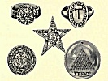

  
[Intangible Textual Heritage](../../index)  [Symbolism](../index) 
[Astrology](../../astro/index)  [Index](index)  [Previous](bot01) 
[Next](bot03) 

------------------------------------------------------------------------

[Buy this Book at
Amazon.com](https://www.amazon.com/exec/obidos/ASIN/1564594610/internetsacredte)

------------------------------------------------------------------------

[Buy this Book on
Kindle](https://www.amazon.com/exec/obidos/ASIN/B0030IM7KK/internetsacredte)

------------------------------------------------------------------------

  
*The Book of Talismans, Amulets and Zodiacal Gems*, by William Thomas
and Kate Pavitt, \[1922\], at Intangible Textual Heritage

------------------------------------------------------------------------

p. x p. xi

### CONTENTS

|                                                                                                                                                                                                                                                                                                                                                                                                                                                                                           |                                   |
|-------------------------------------------------------------------------------------------------------------------------------------------------------------------------------------------------------------------------------------------------------------------------------------------------------------------------------------------------------------------------------------------------------------------------------------------------------------------------------------------|-----------------------------------|
| PART I                                                                                                                                                                                                                                                                                                                                                                                                                                                                                    |                                   |
|                                                                                                                                                                                                                                                                                                                                                                                                                                                                                           |                                   |
| CHAPTER I                                                                                                                                                                                                                                                                                                                                                                                                                                                                                 |                                   |
|                                                                                                                                                                                                                                                                                                                                                                                                                                                                                           | PAGES  |
| The Psychic and Magnetic Influence of Talismans and Gems                                                                                                                                                                                                                                                                                                                                                                                                                                  | [3](bot04.htm#page_3)-12          |
|                                                                                                                                                                                                                                                                                                                                                                                                                                                                                           |                                   |
| CHAPTER II                                                                                                                                                                                                                                                                                                                                                                                                                                                                                |                                   |
| Talismans of Primitive Races—The Axe—Arrow-head—The Swastika—The Serpent—The Interlaced Triangles                                                                                                                                                                                                                                                                                                                                                                                         | [13](bot05.htm#page_13)-22        |
|                                                                                                                                                                                                                                                                                                                                                                                                                                                                                           |                                   |
| CHAPTER III                                                                                                                                                                                                                                                                                                                                                                                                                                                                               |                                   |
| The Tau Cross—Aum Ma Ni Pad Me Hum—Indian Talismans—Ganesa the Elephant-headed—Hanuman the Monkey God—The Eight Glorious Emblems of Buddha—The Wheel of Life—The Conch Shell—The Two Fishes—The Lucky Diagram—The Lotus—The Frog—The Three Gems                                                                                                                                                                                                                                           | [23](bot06.htm#page_23)-33        |
|                                                                                                                                                                                                                                                                                                                                                                                                                                                                                           |                                   |
| CHAPTER IV                                                                                                                                                                                                                                                                                                                                                                                                                                                                                |                                   |
| Talisman for Wisdom—Buddha's Footprints—The Doric.—Knots—Chinese Talismans—The Trigrams—The Five Bats—The Goose—Stork—Pine Tree—Peach—Lucky Sentence—The Phœnix—The Dragon—Horse Hoof—Siva's Charm—The Money Sword—Red in Talismans—The Lock—Bells—The Tortoise—The Tiger—Pigs—The Black Cat                                                                                                                                                                                              | [34](bot07.htm#page_34)-43        |
| p. xii                                                                                                                                                                                                                                                                                                                                                                                                                                                         |                                   |
|                                                                                                                                                                                                                                                                                                                                                                                                                                                                                           |                                   |
| CHAPTER V                                                                                                                                                                                                                                                                                                                                                                                                                                                                                 |                                   |
|                                                                                                                                                                                                                                                                                                                                                                                                                                                                                           | PAGES  |
| The Pear Charm—Show Fu—Jade—The Blue Gown for Longevity—Japanese—The Tiger—Wolf—Fox—The Thunder, Fire and Echo—The Fan of Power—Hotei, the God of Contentment—The Eagle—The Millet Dumpling—Carp—Sacred Dog—Stork—Tortoise—Crane—Child's Hand—Mitsu-Domoe—Hammer of Daikoku—The Keys—Anchor—Crystal Ball—Leaf Talisman—Ota-fu-ku—Bow—Temple at Ise                                                                                                                                        | [44](bot08.htm#page_44)-54        |
|                                                                                                                                                                                                                                                                                                                                                                                                                                                                                           |                                   |
| CHAPTER VI                                                                                                                                                                                                                                                                                                                                                                                                                                                                                |                                   |
| Egyptian Beliefs—Crux Ansata—The Menat—The Two Plumes—The Single Plume—The Nefer—The Cartouche—The Angles and Plummet—The God Bes—Aper—The Tat—The Heart                                                                                                                                                                                                                                                                                                                                  | [55](bot09.htm#page_55)-65        |
|                                                                                                                                                                                                                                                                                                                                                                                                                                                                                           |                                   |
| CHAPTER VII                                                                                                                                                                                                                                                                                                                                                                                                                                                                               |                                   |
| The Buckle of the Girdle of Isis—The Scarab—The Eye of Osiris—The Two Fingers—The Collar—The Hawk—The Sma—The Ladder and Steps—The Snake's Head—The Serpent—The Sun's Disc—The Frog—The Fish—The Vulture—The Sa, or Tie                                                                                                                                                                                                                                                                   | [66](bot10.htm#page_66)-75        |
|                                                                                                                                                                                                                                                                                                                                                                                                                                                                                           |                                   |
| CHAPTER VIII                                                                                                                                                                                                                                                                                                                                                                                                                                                                              |                                   |
| Gnosticism—Abraxas—Sacred Names—Khnoubis—The Seven Vowels—The Magic Symbols—The Archangels—Lion-headed Serpent—Aum—The Ineffable Name—Horus—Osiris—Isis—Etruscan, Greek, and Roman—The Crescent Symbol—The Horseshoe—Tusk, or Horn—Stable Keys—Amalthæa's Horn, or Cornucopia—Serapis—Bull's Head—Diana—Harpokrates—Anubis—Bellerophon—Salus Ring—Hygiea                                                                                                                                  | [76](bot11.htm#page_76)-85        |
| p. xiii                                                                                                                                                                                                                                                                                                                                                                                                                                                       |                                   |
|                                                                                                                                                                                                                                                                                                                                                                                                                                                                                           |                                   |
| CHAPTER IX                                                                                                                                                                                                                                                                                                                                                                                                                                                                                |                                   |
|                                                                                                                                                                                                                                                                                                                                                                                                                                                                                           | PAGES  |
| The Bulla—The Tusk—Pine Cone—The Frog—Skull of an Ass—Key Talismans—Grylli, or Chimeræ—Goat—The Ox—Lion—Eagle—The Caduceus—Mercury—Health Rings—Boar's Head—Clenched Hand—Open Hand—Figured Hands—The Lizard—The Spider—The Fish—Snails                                                                                                                                                                                                                                                   | [86](bot12.htm#page_86)-96        |
|                                                                                                                                                                                                                                                                                                                                                                                                                                                                                           |                                   |
| CHAPTER X                                                                                                                                                                                                                                                                                                                                                                                                                                                                                 |                                   |
| The Orient—The Koran—Jochebed—Bead Necklaces—Mashallah—Hassan and Hussein—Hand of the Lady Fatima—Five Principal Commandments—Zufur Tukiah—Nasiree—Gadiri—Mohammed—Merzoum—The Diamond—Cube of Amber—Scorpion-charming—Early Christian and Mediæval Talismans—Clement of Alexandria—The Fish—Dag—Palm Branch—The Ship—Sacred Monogram—Shen—Constantine the Great—Thoth—The Cross—Household Cross—Yucatan—Hand and Cross—Wheel Cross                                                       | [97](bot13.htm#page_97)-106       |
|                                                                                                                                                                                                                                                                                                                                                                                                                                                                                           |                                   |
| CHAPTER XI                                                                                                                                                                                                                                                                                                                                                                                                                                                                                |                                   |
| The Agnus Dei—The Coventry Ring—Ananizapta—Tau Cross—Cross of St. Benedict—Byzantine Ring—Simsum Ring—Abracadabra—Pentalpha, Pentacle, Pentagram, or Five-pointed Star—The Kabala—The Table of Jupiter—The Ten Divine Names—The Planetary Angels—The Agla—Dr. Dee                                                                                                                                                                                                                         | [107](bot14.htm#page_107)-117     |
|                                                                                                                                                                                                                                                                                                                                                                                                                                                                                           |                                   |
| CHAPTER XII                                                                                                                                                                                                                                                                                                                                                                                                                                                                               |                                   |
| Tetragrammaton—Phylactery—Talismans against all mischiefs, the *Magus*—Venus Talisman—Totaphoth—Abraxas—Eye of a Cock—Bells—Gargoyles—Cramp Rings—Blessing of Rings—Musseltaub—Posie Rings—Gemmel Rings—Zodiacal Rings—The Signs of the Zodiac in Rhyme—General Talismans—The Lee Penny—Crystal—The Moon Talismans—Peacock—Juno—Fire Talismans—Gold Nugget—Coins—Card Talismans—Badger's Tooth—Four-leaved Clover                                                                         | [118](bot15.htm#page_118)-130     |
| p. xiv                                                                                                                                                                                                                                                                                                                                                                                                                                                         |                                   |
|                                                                                                                                                                                                                                                                                                                                                                                                                                                                                           |                                   |
| PART II                                                                                                                                                                                                                                                                                                                                                                                                                                                                                   |                                   |
|                                                                                                                                                                                                                                                                                                                                                                                                                                                                                           |                                   |
| CHAPTER I                                                                                                                                                                                                                                                                                                                                                                                                                                                                                 |                                   |
| ARIES—THE RAM                                                                                                                                                                                                                                                                                                                                                                                                                                                                             |                                   |
|                                                                                                                                                                                                                                                                                                                                                                                                                                                                                           | PAGES  |
| The Zodiac—Zodiacal and Calendar Months—The New Year—The Constellation—Hamal—The Passover—Characteristics of Aries People—Gems of Aries—The Bloodstone and Heliotrope—Mars the Ruling Planet—Marbodeus Gallus—The Diamond—The Qualities of the Diamond—Tavernier—The Regent—The Koh-i-Noor—The Hope Diamond                                                                                                                                                                               | [133](bot16.htm#page_133)-48      |
|                                                                                                                                                                                                                                                                                                                                                                                                                                                                                           |                                   |
| CHAPTER II                                                                                                                                                                                                                                                                                                                                                                                                                                                                                |                                   |
| TAURUS—THE BULL                                                                                                                                                                                                                                                                                                                                                                                                                                                                           |                                   |
| The Constellation—Aldebaran—The Chaldeans—The Temples—Apis Bull—Aphrodite—Characteristics of Taurus—Training—Gems of Taurus—The Sapphire—Bishop's Ring—St. Jerome—Qualities of the Sapphire—Star Sapphire—Solomon's Seal—Charlemagne's Talisman—The Turquoise—Bœtius de Boot—Horseman's Talisman—Qualities of the Stone                                                                                                                                                                   | [149](bot17.htm#page_149)-60      |
|                                                                                                                                                                                                                                                                                                                                                                                                                                                                                           |                                   |
| CHAPTER III                                                                                                                                                                                                                                                                                                                                                                                                                                                                               |                                   |
| GEMINI—THE TWINS                                                                                                                                                                                                                                                                                                                                                                                                                                                                          |                                   |
| Period—The Twins, Castor and Pollux—The Argonauts—King Solomon's Pillars—Maia—Ovid and Wedding of Mary Queen of Scots—Gemini Number—Characteristics—Agates and their Virtues—Orpheus—Chrysoprase—Alexander the Great—Virtues of the Stone                                                                                                                                                                                                                                                 | [161](bot18.htm#page_161)-73      |
| p. xv                                                                                                                                                                                                                                                                                                                                                                                                                                                           |                                   |
|                                                                                                                                                                                                                                                                                                                                                                                                                                                                                           |                                   |
| CHAPTER IV                                                                                                                                                                                                                                                                                                                                                                                                                                                                                |                                   |
| CANCER—THE CRAB                                                                                                                                                                                                                                                                                                                                                                                                                                                                           |                                   |
|                                                                                                                                                                                                                                                                                                                                                                                                                                                                                           | PAGES  |
| The Dark Sign—Its Duration—Origins—Summer Solstice—Hercules and the Crab—Characteristics—Goddess Esmeralda and the Ancient Peruvians—The Emerald Isle—Moonstones—Blue Moon—Pearls—Cat's Eyes—Rock Crystals—Crystal-gazing—Virtues of the Crystal                                                                                                                                                                                                                                          | [174](bot19.htm#page_174)-86      |
|                                                                                                                                                                                                                                                                                                                                                                                                                                                                                           |                                   |
| CHAPTER V                                                                                                                                                                                                                                                                                                                                                                                                                                                                                 |                                   |
| LEO—THE LION                                                                                                                                                                                                                                                                                                                                                                                                                                                                              |                                   |
| Period—Constellation—The Fiery Sign—Hercules and the Lion—Characteristics—Personal Magnetism of the Type—Disposition—Money-makers—Entertainers—Health Defects—Marriage and Love Affairs—Artistic Tendencies—Gems of the House—The Sardonyx Qualities of the Stone—The Chrysolite and the Romans—The Tourmaline—Peculiarities of the Stone—Amber—Virtues and Medicinal Uses—The Topaz                                                                                                      | [187](bot20.htm#page_187)-98      |
|                                                                                                                                                                                                                                                                                                                                                                                                                                                                                           |                                   |
| CHAPTER VI                                                                                                                                                                                                                                                                                                                                                                                                                                                                                |                                   |
| VIRGO—THE VIRGIN                                                                                                                                                                                                                                                                                                                                                                                                                                                                          |                                   |
| Period—Constellation—Mythology—Symbols—Paris under Virgo—Reflecting Qualities of the Sign—Characteristics—Marriage—Professions—Ailments—Harmonious Types—Gems of the House—Cornelian—Virtues of the Cornelian—Napoleon's Seal Talisman—Clairvoyant Properties of the Stone—Jade—New Zealanders’ Faith—The Tiki—Jade as Racing Talisman                                                                                                                                                    | [199](bot21.htm#page_199)-211     |
| p. xvi                                                                                                                                                                                                                                                                                                                                                                                                                                                         |                                   |
|                                                                                                                                                                                                                                                                                                                                                                                                                                                                                           |                                   |
| CHAPTER VII                                                                                                                                                                                                                                                                                                                                                                                                                                                                               |                                   |
| LIBRA—THE BALANCE                                                                                                                                                                                                                                                                                                                                                                                                                                                                         |                                   |
|                                                                                                                                                                                                                                                                                                                                                                                                                                                                                           | PAGES  |
| Period—Constellation—Origin of the Sign—The Yoke—The Altar—Characteristics of the Type—Influence of Saturn—Inclination for Companionship—Marriage—Moods—Partnership—Professions—Health Defects of the Type—Gems of the House—The Opal—Coral—Lapis Lazuli—The Modern Ill-luck of the Opal—Its Ancient Virtues—Sensitiveness of the Opal—Its Virtues as a Libra Gem—Coral—Virtues—As Infant's Talisman—Lapis Lazuli—Egyptian Talisman—Qualities of the Stone                                | [212](bot22.htm#page_212)-23      |
|                                                                                                                                                                                                                                                                                                                                                                                                                                                                                           |                                   |
| CHAPTER VIII                                                                                                                                                                                                                                                                                                                                                                                                                                                                              |                                   |
| SCORPIO—THE SCORPION                                                                                                                                                                                                                                                                                                                                                                                                                                                                      |                                   |
| Period—Ruling Planet—Mythology—Symbology—Characteristics of the Type—Effect of the Malefic Aspects—Health Defects—Professions—Religion—Marriage—The Gems of the House—The Beryl and Aquamarine differing only in Colour—Qualities of the Beryl—Clairvoyant Properties—The Carbuncle as Transmitter of Light—Noah's Lamp—Talisman against Infection—The Lodestone—Magnetic Qualities as an Amulet against Shipwreck and Gout                                                               | [224](bot23.htm#page_224)-34      |
|                                                                                                                                                                                                                                                                                                                                                                                                                                                                                           |                                   |
| CHAPTER IX                                                                                                                                                                                                                                                                                                                                                                                                                                                                                |                                   |
| SAGITTARIUS—THE ARCHER                                                                                                                                                                                                                                                                                                                                                                                                                                                                    |                                   |
| Period—The Constellation—The Bow in the Cloud—Mythology—Characteristics of the Type—Appropriateness of the Symbol—Fresh Air a Necessity—Professions—Ailments—Marriage Relations—Gem of the House—The Topaz—Nan Ratan—Pliny and the Topaz—Discovery of the Stone—The Emperor Hadrian and his Ring—Appropriateness of the Stone to the Type—The Stone of Strength—As a Talisman against Asthma—Marbodus and the Topaz—Chrysolite also Favourable                                            | [235](bot24.htm#page_235)-44.     |
| p. xvii                                                                                                                                                                                                                                                                                                                                                                                                                                                       |                                   |
|                                                                                                                                                                                                                                                                                                                                                                                                                                                                                           |                                   |
| CHAPTER X                                                                                                                                                                                                                                                                                                                                                                                                                                                                                 |                                   |
| CAPRICORNUS—THE GOAT                                                                                                                                                                                                                                                                                                                                                                                                                                                                      |                                   |
|                                                                                                                                                                                                                                                                                                                                                                                                                                                                                           | PAGES  |
| Constellation—Period—Ruling Planet Saturn—Mythology—The Symbol of the Goat—Characteristics—Constitution and Health Defects—India under the Rule of Capricorn—Professions—Marriage—Saturn favourable for the Elderly—Gems of the House—The Ruby—Spinel—Qualities of the Gem—Sensitiveness for Good or Evil—The Malachite—Copper as a Talisman against Colic and Cholera—Black Onyx—Favourable and Unfavourable Influence of the Stone—Jet—The Afflictions of Saturn—Effects on other Types | [245](bot25.htm#page_245)-56      |
|                                                                                                                                                                                                                                                                                                                                                                                                                                                                                           |                                   |
| CHAPTER XI                                                                                                                                                                                                                                                                                                                                                                                                                                                                                |                                   |
| AQUARIUS—THE WATER-BEARER                                                                                                                                                                                                                                                                                                                                                                                                                                                                 |                                   |
| Constellation—Period—Symbol—Early Religious Teachings—The Glyph—Rulers of the House—Saturn and Uranus—Characteristics of the Type—Temper—Professions—Health Defects—Marriage and Friendships—Gems of the House—Garnets and Zircons—The Garnet and Ruby—Qualities of the Stone—Virtue, as a Keepsake—The Zircon—The Hyacinth—The Jargoon—The Jacinth as a Talisman for Sleep—Set in Gold for Restlessness—The Lyncurion of the Ancients: its Virtues                                       | [257](bot26.htm#page_257)-68      |
|                                                                                                                                                                                                                                                                                                                                                                                                                                                                                           |                                   |
| CHAPTER XII                                                                                                                                                                                                                                                                                                                                                                                                                                                                               |                                   |
| PISCES—THE FISHES                                                                                                                                                                                                                                                                                                                                                                                                                                                                         |                                   |
| Period—Constellation—Precession of the Equinoxes—Ichthyes the Fishes—Mythology—Symbol—The Rulers of the House—Characteristics—Ailments of the Type—Professions—Friendship and Marriage—Harmonious and                                                                                                                                                                                                                                                                                     |                                   |
| p. xviii                                                                                                                                                                                                                                                                                                                                                                                                                                                     |                                   |
|                                                                                                                                                                                                                                                                                                                                                                                                                                                                                           | PAGES. |
| Inharmonious Types—The Gem of the House—The Amethyst—Virtues of the Stone—Talisman against Inebriety—Its Calming Influence—The Stone of St. Valentine—As a Lovers’ Talisman—The Effect of Purple Rays—The Amethyst Beneficent to all Types—Real and Artificial Gems, and how to test and select them                                                                                                                                                                                      | [267](bot27.htm#page_267)-81      |

------------------------------------------------------------------------

[Next: List of Plates](bot03)

