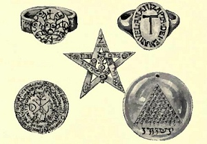

  
[Intangible Textual Heritage](../../index)  [Symbolism](../index) 
[Astrology](../../astro/index) 

------------------------------------------------------------------------

[Buy this Book at
Amazon.com](https://www.amazon.com/exec/obidos/ASIN/1564594610/internetsacredte)

------------------------------------------------------------------------

[Buy this Book on
Kindle](https://www.amazon.com/exec/obidos/ASIN/B0030IM7KK/internetsacredte)

------------------------------------------------------------------------

<table width="75%">
<colgroup>
<col style="width: 50%" />
<col style="width: 50%" />
</colgroup>
<tbody>
<tr class="odd">
<td width="50%" data-valign="TOP"></td>
<td width="50%" data-valign="CENTER"><h1 id="the-book-of-talismans-amulets-and-zodiacal-gems" data-align="CENTER">The Book of Talismans, Amulets and Zodiacal Gems</h1>
<h2 id="by-william-thomas-and-kate-pavitt" data-align="CENTER">by William Thomas and Kate Pavitt</h2>
<h4 id="section" data-align="CENTER">[1922]</h4></td>
</tr>
</tbody>
</table>

------------------------------------------------------------------------

[Contents](#contents)    [Start Reading](bot00)    [Page
Index](pageidx)    [Text \[Zipped\]](bot.txt.gz)

------------------------------------------------------------------------

|                                                                                                                           |
|---------------------------------------------------------------------------------------------------------------------------|
|  |

This is a study of the symbolism of precious stones, and how they have
been used as magical objects through the ages, both intrinsically, and
as a vehicle for symbolic engravings. The Pavitts cover Hindu, Jewish,
Chinese, Egyptian, Roman, Gnostic, and Christian lore of gems. The final
section discusses the astrological connections of key gems, sign by
sign. This work also includes quite a bit of history of important (and
often 'cursed') stones such as the Hope diamond, and practical advice
about purchasing gems. Anyone interested in the symbolism of gemstones
will find this a great reference and a fascinating read.--J.B. Hare, September 11, 2008.

------------------------------------------------------------------------

 [Title Page](bot00)  
[Preface](bot01)  
[Contents](bot02)  
[List of Plates](bot03)  

### Part I. Amulets and Talismans

[Chapter I](bot04)  
[Chapter II](bot05)  
[Chapter III](bot06)  
[Chapter IV](bot07)  
[Chapter V](bot08)  
[Chapter VI](bot09)  
[Chapter VII](bot10)  
[Chapter VIII](bot11)  
[Chapter IX](bot12)  
[Chapter X](bot13)  
[Chapter XI](bot14)  
[Chapter XII](bot15)  

### Pat II. The Gems of the Zodiac

[Chapter I. Aries—The Ram](bot16)  
[Chapter II. Taurus—The Bull](bot17)  
[Chapter III. Gemini—The Twins](bot18)  
[Chapter IV. Cancer—The Crab](bot19)  
[Chapter V. Leo—The Lion](bot20)  
[Chapter VI. Virgo—The Virgin](bot21)  
[Chapter VII. Libra—The Balance](bot22)  
[Chapter VIII. Scorpio—The Scorpion](bot23)  
[Chapter IX. Sagittarius—The Archer](bot24)  
[Chapter X. Capricorn—The Goat](bot25)  
[Chapter XI. Aquarius—The Water-Bearer](bot26)  
[Chapter XII. Pisces—The Fishes](bot27)  

 

[Real and Artificial Gems and How to Test and Select Them](bot28)  
[Bibliography](bot29)  
[Index](bot30)  
