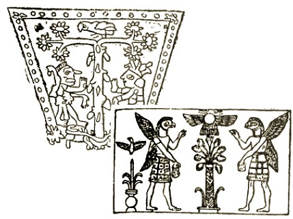

  
[Intangible Textual Heritage](../../index)  [Symbolism](../index.md) 

------------------------------------------------------------------------

[Buy this Book at
Amazon.com](https://www.amazon.com/exec/obidos/ASIN/048641437X/internetsacredte.md)

------------------------------------------------------------------------

<table width="75%">
<colgroup>
<col style="width: 50%" />
<col style="width: 50%" />
</colgroup>
<tbody>
<tr class="odd">
<td width="50%" data-valign="TOP"></td>
<td width="50%" data-valign="CENTER"><h1 id="the-migration-of-symbols" data-align="CENTER">The Migration of Symbols</h1>
<h2 id="by-goblet-dalviella" data-align="CENTER">by Goblet d'Alviella</h2>
<h4 id="section" data-align="CENTER">[1894]</h4></td>
</tr>
</tbody>
</table>

------------------------------------------------------------------------

[Contents](#contents)    [Start Reading](mosy00.md)    [Page
Index](pageidx)    [Text \[Zipped\]](mosy.txt.gz.md)

------------------------------------------------------------------------

|                                                                                                                           |
|---------------------------------------------------------------------------------------------------------------------------|
|  |

This is a study of the migration and mutation of symbols by a late 19th
century Belgian lawyer and [Masonic](../../mas/index.md) scholar, Count
Goblet d'Alviella (*b*. 1846, *d*. 1925). Originally published in 1891
in French, this book covers a huge web of interchangeable symbols, which
are found over a wide range of cultures through the Near East, India,
Europe, and further abroad, notably in Mesoamerica. He attempts to
explain the widespread use of symbols such as the Swastika, the Tree of
Life, the Winged Globe, the Trident and the Caduceus. Despite the title,
d'Alviella does not adhere to one theory; instead he has a whole
toolkit, including diffusion, mutation, independent origins and
appropriation, as well as psychological, historical and sociological
explanations.

He demonstrates that the same symbol can have different interpretations
in different cultures and at different times. Such is the case with the
swastika, which today is obviously associated with absolute evil, but
which has been used historically as a symbol of the Sun's yearly path,
and regarded as a good-luck symbol, even to this day, in the far East.
With over 150 line illustrations, this book is an invaluable source book
for symbologists, and makes fascinating reading for readers interested
in the development of religion.

------------------------------------------------------------------------

 [Title Page](mosy00.md)  
[Introduction](mosy01.md)  
[Postscriptum](mosy02.md)  
[Contents](mosy03.md)  
[The Author's Preface](mosy04.md)  
[Chapter I. On Symbols Common to Different Races](mosy05.md)  

### Chapter II. On the Gammadion or Swastika

[I. Geographical Distribution of the Gammadion](mosy06.md)  
[II. Different Interpretations of the Gammadion](mosy07.md)  
[III. Probable Meaning of the Gammadion](mosy08.md)  
[IV. The Birth-Place of the Gammadion](mosy09.md)  

 

[Chapter III. On the Causes of Alteration in the Meaning and Form of
Symbols](mosy10.md)  

### Chapter IV. Symbolism and Mythology of the Tree

[I. The Sacred Tree and its Acolytes](mosy11.md)  
[II. Signification of the Sacred Tree Amongst the Semites](mosy12.md)  
[III. The Paradisaic Trees of the Aryans](mosy13.md)  

 

[Chapter V. On the Transmutation of Symbols](mosy14.md)  

### Chapter VI. The Winged Globe, the Caduceus, and the Trisula

[I. The Winged Globe Outside Egypt](mosy15.md)  
[II. The Origins of the Caduceus](mosy16.md)  
[III. The Transformations of the Trisula](mosy17.md)  
[Conclusion](mosy18.md)  

 

[Addenda](mosy19.md)  
[Index](mosy20.md)  
[Opinions of the Press on the French Edition](mosy21.md)  
