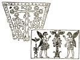
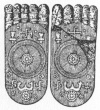

  
[Intangible Textual Heritage](../../index)  [Symbolism](../index.md) 
[Index](index)  [Next](mosy01.md) 

------------------------------------------------------------------------

[Buy this Book at
Amazon.com](https://www.amazon.com/exec/obidos/ASIN/048641437X/internetsacredte.md)

------------------------------------------------------------------------

  
*The Migration of Symbols*, by Goblet d'Alviella, \[1894\], at
Intangible Textual Heritage

------------------------------------------------------------------------

# THE MIGRATION OF SYMBOLS.

###### BY

## THE COUNT GOBLET D’ALVIELLA,

###### SENATOR AND MEMBER OF THE ROYAL ACADEMY OF BELGIUM.

### WITH AN INTRODUCTION BY

### SIR GEORGE BIRDWOOD, M.D., K.C.I.E.

  [  
Click to enlarge](img/feet.jpg.md)

#### London: A. Constable and Co.,

#### \[1894\]

Scanned, proofed and formatted at Intangible Textual Heritage by John
Bruno Hare, September 2008. This text is in the public domain in the US
because it was published prior to 1923.

  [  
Click to enlarge](img/pl01.jpg.md)  
Frontispiece: Apollo and the Gammadion.  
(From a vase in the Kunsthistoriches Museum of Vienna.)  

------------------------------------------------------------------------

[Next: Introduction](mosy01.md)
