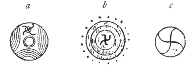
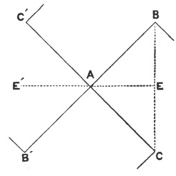

  
[Intangible Textual Heritage](../../index)  [Symbolism](../index) 
[Index](index)  [Previous](mosy07)  [Next](mosy09) 

------------------------------------------------------------------------

[Buy this Book at
Amazon.com](https://www.amazon.com/exec/obidos/ASIN/048641437X/internetsacredte)

------------------------------------------------------------------------

  
*The Migration of Symbols*, by Goblet d'Alviella, \[1894\], at
Intangible Textual Heritage

------------------------------------------------------------------------

#### III. Probable Meaning of the Gammadion.

We have seen that most nations represented the sun by a circle. Some,
also, have depicted it by a cruciform sign, more particularly the
Assyrians, the Hindus, the Greeks, the Celts, etc. (see [fig.
2](mosy05.htm#img_fig002)).

This symbolism doubtlessly renders the idea of the solar radiation in
the four directions of space. But the sun does not restrict itself to
darting its rays in all directions, it seems, further, animated by a
circular movement from east to west. The latter action may have been
symbolized, sometimes by changing the Disk into a Wheel, sometimes by
adding to the four extremities of the solar Cross feet, or broken lines,
usually turned in the same direction.

Sometimes the curve of the rays was rounded off, perhaps either to
accentuate still further the idea of a rotary motion by a figure
borrowed from the elementary laws of mechanics, or else by an effect of
that tendency, which, in primitive writings, has everywhere substituted
the cursive for the angular. Thus was obtained the *tétrascèle* (*cf*.
[fig. 15d](mosy06.htm#img_fig015)), which, as I have said above, is
simply a variety of the *gammadion*.

M. Gaidoz has defined the *gammadion* as a graphic doublet of the
Wheel. [1](#fn_121) The expression is exact,
and is even a very happy one, provided it means, not that the
*gammadion* is derived from the Wheel by the suppression of a part of
the felloe, but that it is, like the Wheel, a symbolical representation
of the solar movement.

For the very reason that the *gammadion* represents the sun in its
apparent course it has readily

p. 52

become a symbol of prosperity, of fecundity, of blessing, and—with the
help of superstition—it has everywhere received the meaning of a charm,
as in India the very name *swastika* implies.

Moreover, after having figured the sun in motion, it may have become a
symbol of the astronomical movement in general, applied to certain
celestial bodies, the moon, for example—or even to everything which
seems to move of itself, the air, water, lightning, fire—in as far as it
really served as a sign of these different phenomena, which fact has
still to be made good. [1](#fn_122)—This, in
brief, is the whole theory of the *gammadion*.

This theory is not the outcome of any *à priori* reasoning; it is
founded on the following considerations:

A. The form of the *gammadion*.

B. The connection between the *tétrascèle* and *triscèle*.

C. The association of the *gammadion* with the images, symbols, and
divinities of the sun.

D. The part it plays in certain symbolical combinations, where it
sometimes accompanies and sometimes replaces the representation of the
solar Disk.

A. *The branches of the gammadion are rays in motion*.

To be convinced of this, it is only necessary to cast one's eyes on the
manner in which, at all times, the idea of solar movement has been
graphically expressed ([fig. 22](#img_fig022)).

The first of these figures (*a*) is an ancient *fibula* found in Italy.
At the top is seen a Disk from which radiate small rays, bent at right
angles; these rays seem to have been modelled on the

p. 53

branches of the *gammadions* sketched immediately beneath.

The second (*b*) is taken from the "whorls" of Troy. Crooked rays,
turned towards the right, alternate with straight and undulating rays,
all of which proceed from the same Disk.

The third (*c*) comes from a reliquary of the

 

Fig. 22. [1](#fn_123)

thirteenth century, on which it forms a pendant to the lunar crescent,
with an image of Christ between them. That this is a representation of
the solar Disk results not only from its parallelism with the Crescent,
but also from the fact that on a number of mediæval Christian monuments
Christ is thus represented between the sun and moon. [2](#fn_124)

The same image—a Disk with five inflected rays—is met with on coins of
Macedon (*d*), where it alternates sometimes with the *tétrascèle*
(*e*).

Mr. Samuel Beal, who distinguishes two parts in the *gammadion*,—an
equilateral cross and four hooks,—thinks that the purpose of the former
is to symbolize the earth; as for the hooks, they might serve to
indicate the direction of the solar movement round our planet. [3](#fn_125) But the figures which

p. 54

we have reproduced here give more than sufficient proof that the arms of
the *gammadion*, if they are solar rays, are so in their whole length;
besides, the Disk which sometimes forms their point of intersection is
certainly an image of the sun; lastly, there is no indication that,
either in classic antiquity, or in India, the earth was ever symbolized
by an equilateral cross.

B. *The triscèle, formed by the same process as the tétraskèle, was an
undeniable representation of the solar movement*.

This assertion is especially obvious in the case of *triskèles* formed
of three legs bent, as in the

 

Fig. 23. Varieties of the
Triscèle. [1](#fn_126)

act of running, so frequently seen on coins of Asia Minor.

On Celtiberian coins the face of the sun appears between the legs. The
same combination is found, above the image of a bull, on a votive
*stele* of Carthage, reproduced by Gesenius. [2](#fn_127)

Is it possible to better interpret the idea of motion, and of its
application to the image of the sun?

I will further instance the coins of Aspendus, in Pamphylia, where the
three legs, ranged round a

p. 55

central disk, are literally combined with animal representations of the
sun, the eagle, the wild boar, and the lion. [1](#fn_128) Lastly, on certain coins of Syracuse the
*triscèle* permutes with the solar Disk above the *quadriga* and the
winged horse. [2](#fn_129)

Moreover, the connection between the *triscèle* and the *tétrascèle* is
manifest from their very shape. The transition from one to the other is
visible on the "whorls" of Troy as well as on coins of Macedon and
Lycia.

 

Fig. 24. Symbols On Lycian
Coins.  
(Ludvig Müller, figs. 48 and 49.)

C. *The images oftenest associated with the gammadion are
representations of the sun and the solar divinities*.

Greek coins often show, side by side with the *gammadion*, the head of
Apollo, or the reproduction of his attributes. On a piece from
Damastion, in Epirus, the *gammadion* is engraved between the supports
of the Delphic tripod; [3](#fn_130) on painted
vases from Rhodes and Athens it figures beside the *omphalos*. [4](#fn_131) A crater in the Museum of Ancient Art in
Vienna shows an image of Apollo bearing it on his breast (see our Plate
I.); on a vase from Melos it precedes the chariot of the god. [5](#fn_132) Even amongst the Gauls it accompanies,
on coins, the laurelled and *nimbus*-encompassed head of

p. 56

\[paragraph continues\] Apollo
Belenus. [1](#fn_133) To be sure, it is also
found on Greek medals associated with the images of Dionysos, Hercules,
Hermes, and of several goddesses. But, in addition to the explanations
of this peculiarity which I have given, it must be borne in mind how
readily polytheistic nations and cities assign to their principal god
the emblems as well as the attributes of other divinities—witness, in
classic antiquity, the use of the Caduceus, the Thunderbolt, the
Cornucopia, and so forth.

Amongst the symbols accompanying the *gammadion* there is none nearly so
frequent as the solar Disk. The two signs are, in a manner,
counterparts, not only amongst the Greeks, the Romans, and the Celts,
but also with the Hindus, the Japanese, and the Chinese. I have already
given some examples (figs. [17](mosy06.htm#img_fig017),
[18](mosy06.htm#img_fig018), [20](mosy06.htm#img_fig020)). On a "whorl"

 

Fig. 25. Whorl from
Hissarlik.  
(Schliemann. *Ilios*, No. 1990.)

from Hissarlik this parallel order is repeated three times.

 

Fig. 26. [2](#fn_134)

Sometimes, as if to accentuate this juxtaposition, the *gammadion* is
inscribed in the disk itself.

p. 57

Sometimes, on the contrary, it is the solar Disk which is inscribed in
the centre of the *gammadion*, as may be verified particularly on a
Tibetan symbol reproduced by Hodgson, [1](#fn_135) and also on a coin from Gnossus, in
Crete, where, perhaps, it depicts the Labyrinth.

 

Fig. 27. Cretan
Coin.  
(*Numismatic Chronicle*, vol. xx. (new series), pl. iii., No. 6.

On a Gallic coin, of which numerous specimens have been found in the
Belgian province of Limburg and in the Namur country, a *tétrascèle* is
visible, formed by four horses' heads ranged in a circle round a Disk.

 

Fig. 28. Gallo-Belgian
Coin.  
(Hucher. *L’art gaulois*, p. 169.)

It is impossible not to recognize here an application of solar
symbolism, as M. Eug. Hucher has so frankly admitted, in language whose
terms exclude all preconceived ideas upon the solar nature of the
*tétrascèle*, or even on the affinity existing between the Gallic symbol
and the *gammadion:* "These four busts of horses," he writes,

p. 58

\[paragraph continues\] "are evidently the
rudiments of the four fiery steeds which draw the chariot of Helios in
Etruscan and Greek antiquity. But the fact cannot be ignored that the
gyratory arrangement, *not in use amongst the Greeks*, is a product of
the Celtic imagination." [1](#fn_136)

What, perhaps, is the product of the Celtic imagination, is the
ingenious transformation of the arms of the *gammadion* into horses’
busts. Would it not be possible to find in Greek symbolism precedents,
and even models for this metamorphosis?—witness the cocks’ heads and
lions’ busts which take the place of the rays of the *triscèle* on
Lycian coins. [2](#fn_137)

We may observe, by the way, that the horse, and the cock, as well as the
eagle, and the lion, are essentially solar animals.

It is interesting to verify the fact that the same combination has been
produced, doubtlessly through the spontaneous agency of similar factors,
in Northern America. There have been found,

 

Fig. 29. Engraved Shell from
the Mississippi Mounds.  
(Holmes. *Bureau of Ethnology*, vol. ii.,
p. 282.)

amongst the engraved shells of the mounds or tumuli of the Mississippi,
several specimens of solar Crosses inscribed in circles, or squares,
each side forming a support to a bird's head turned in.

p. 59

the same direction—which, as a whole, forms a veritable *gammadion*.

D. *In certain symbolical combinations the gammadion alternates with the
representation of the sun*.

Edward Thomas has pointed out the fact that, amongst the Jains of modern
India, the sun, although held in great honour, does not appear amongst
the respective signs of the twenty-four *Tirthankaras*, the saints or
mythological founders of the sect. But, whilst the eighth of these
personages has the half-moon as an emblem, the seventh has the
*swastika* for a distinctive sign. [1](#fn_138)
Moreover, as the same writer remarks, the *swastika* and the Disk
replace constantly each other on the ancient coins of Ujain and Andhra.

Another proof of the equivalence between the *gammadion* and the image,
or, at least, the light of the sun, is found amongst the coins of
Mesembria in Thrace. The very name of this town, Μεσημβρία, may be
translated as "mid-day," that is, the "town of noon," as Mr. Percy
Gardner calls it. [2](#fn_139) Now, on some
coins, this name is figured by a legend which speaks for itself:  

It is impossible to show more clearly the identity of the *gammadion*
with the idea of light or of the day.—"But," objects Mr. Greg, "the day
is not necessarily the \`sun."—In addition to this distinction being
rather subtle, how can one continue to doubt, in face of the facility
with which in Greece, as in India and elsewhere, the *gammadion*
interchanges with the Solar Disk and vice versa? [3](#fn_140)

I will take the liberty of calling attention to the

p. 60

adjoining plate ([II.](#img_pl02)), where I have brought together
several peculiar examples of those transpositions. They are arranged in
two classes of combinations, which, by their regularity no less than by
their frequency, seem to imply a symbolical intention. In the first is
visible a grouping together of three signs *gammadions*, or Disks, round
the one central Disk; in the second it is these same signs, to the
number of four, which are arranged in a square or lozenge, either round
a fifth analogous sign, or else, between the branches of an equilateral
cross. I should here like to attempt, in connection with the general
meaning of the *gammadion*, an explanation of these symbolical
arrangements—in so far, of course, as on certain Disks these signs are
not merely ornaments, intended to fill up the empty spaces.

The three first numbers of the first combination (*litt.* A) are taken
from the "whorls" of Hissarlik; [1](#fn_141)
the fourth from a sepulchral vase from Denmark; [2](#fn_142) the fifth from Silesian pottery; [3](#fn_143) the sixth, which represents a foot-print
of Buddha, from the bas-reliefs of Amaravati; [4](#fn_144) the seventh, a curious example of the
*trisula*, from the Græco-Buddhist sculptures of Yusufzaï, in
North-western India. [5](#fn_145) To these must
be added, on the following page, the image taken from Hindu symbols and
reproduced by Guignaut, after Nicolas Müller.

It is this latter figure which will assist us in explaining the others,
or, at least, in formulating a conjecture as to their signification.

The subject is a tree, standing apparently for the Cosmic Tree of Hindu
mythology, which sprang

  [  
Click to enlarge](img/pl02.jpg)  
  

Plate II

p. 61

from the primordial egg in the bosom of the chaotic ocean. It spreads
out into three branches, each of which supports a sun, whilst a fourth
and

 

Fig. 30. Hindu
Symbol.  
(Guignaut, vol. iv., 2nd part, pl. ii.,
fig. 16.)

larger sun is placed at the bifurcation of the branches.

Guignaut informs us, in his translation of Creuzer, that this image was
a symbol of the *trimurti*, the Hindu Trinity. We need not here
investigate this very questionable proposition. I think, however, that
the learned Frenchman was right when he added, in a foot-note:—"There
are here three suns, and yet it is always the same sun." [1](#fn_146)

In reality might not the object of this combination be to represent the
sun in the three points or positions which circumscribe its apparent
daily course, its rising, its zenith, and its setting; which the
figurative language of Vedic mythology has rendered by the Three Steps
of Vishnu?

We know that at all times popular imagery, in order to represent
movements, or changes of position, has resorted to the artifice of
multiplying the image of the same personage, or object, whilst assigning
to it a different attitude each time. It is the process of juxtaposition
applied to the idea of succession, or, as M. Clermont Ganneau has
expressed it: "The reappearance of the actors to mark the succession of
the acts." [2](#fn_147) Do we ourselves

p. 62

represent otherwise, in our astronomical diagrams, the phases of the
moon, or the different positions of the sun in the ecliptic?

The same meaning seems to me to be applicable to the three *swastikas*
incised round a Disk on a Foot-print of Buddha ([litt. A, No.
6](#img_pl02)). In fact, Buddha's Feet were originally the Feet of
Vishnu; Buddhism was content to attribute to the footsteps of its
founder the marks already worshipped by Hindu tradition. [1](#fn_148) The other signs which adorn this mark
seem to singularly complicate its symbolism. But it must not be
forgotten that the Buddhists have accumulated, on the sacred Foot of
their Master, almost all the symbols they have been able either to
invent or borrow. Tradition counts as many as sixty-five! Moreover, most
of these signs are also solar symbols, at least the Rosettes, the
Trident, and the *trisula*, the latter representing, as I shall
hereafter show, the effulgence, or the radiation of the solar fire.

Edward Thomas has fully admitted that there must be some connection
between the three diurnal positions of the sun and the incised symbols
on the foot-print at Amaravati. But if, in the central Disk, he discerns
the noon-day sun, it is the *trisula*, on the heel, which seems to him
to represent the rising sun, whilst the *swastikas* depicted on the toes
might typify the last rays of sunset. As for the other *swastikas*, the
two signs on the heel might symbolize the Asvins, the third, the god
Pûshan.—For my part, I see nothing which can justify these latter
comparisons. Mr. Thomas was more fortunate when he connected an image,
taken by Sir Henry Rawlinson from an obelisk at Koyunjik, with the Hindu
symbolism relating to the three positions of the sun. [2](#fn_149) Three solar Disks

p. 63

are there represented side by side; the middle one sends forth straight
rays, and a hand holding a bow (see above, [fig.
11](mosy05.htm#img_fig011)); the two others, of rather smaller
dimensions, emit rays which are bent at the extremities, as if by an
effect of centrifugal force. [1](#fn_150)

This interpretation may be further applied to the three Wheels placed on
the points of the *trisula* in a Græco-Buddhist bas-relief of Yusufzaï
(*litt.* A, No. 7). If, as I believe I shall prove, [2](#fn_151) the central Disk of the *trisulas* was
an image of the sun before it became, with the Buddhists, the Wheel of
the Law, as much may be said of the three Wheels which here crown the
points of the ancient symbol.

In Greece, I am not aware that the mythology alludes to the "three
strides" of the sun. But symbolical images sometimes take the place of
figures of speech. Does not, for example, the *triscèle*, formed of
three legs radiating round a disc, admit of the same interpretation as
the Hindu tree with its four suns? There is, moreover, presumptive
evidence that the Greeks distinguished three positions of the sun, and
even that they selected distinct personages to represent those principal
*moments* of its daily life. Near Lycosura, in

p. 64

\[paragraph continues\] Arcadia, stood the
sanctuary of Zeus Lycæus, where, according to Pausanias, *bodies cast no
shadow*. It was situated on a mountain between two temples, one, *to the
east*, was sacred to the Pythian Apollo, the other, *towards the west*,
was dedicated to Pan Nomios. [1](#fn_152)
Apollo, the slayer of the Python, well represents the morning sun
dispelling the darkness in the east. As for the Lycæan Jupiter of
Arcadia, it is the sun in all its mid-day glory, at the hour when bodies
cast the least shadow. [2](#fn_153) Lastly,
Pan, the lover of Selene, has incontestably a solar character, or at
least is connected with the sun when setting. M. Ch. Lenormant has
brought into prominence the light-giving character of this divinity,
whom Herodotus compares, without hesitation, to Chem or Min, an Egyptian
personification of the nocturnal or subterranean sun. [3](#fn_154)

Our own popular traditions seem also to have preserved the remembrance
of the three solar steps, at least in those parts of Germany and England
where, till lately, the villagers climbed a hill on Easter-eve, in order
to perform three bounds of joy at sun-rise. "And yet," adds Sir Thomas
Browne, "the sun does not dance on that day." [4](#fn_155) It must be remarked that popular
language still speaks of the "legs of the sun," referring to those rays
which sometimes seem to move about on the ground when their focus is
hidden behind a cloud.

 

Let us now pass to the second group ([pl. ii., litt. B](#img_pl02)),
which represents combinations of four

p. 65

secondary figures ranged round a central one. [1](#fn_156) I will here venture—always by way of
hypothesis—an explanation similar to the preceding ones. Equilateral
crosses representing the sky, or the horizon, have been found on
Assyrian monuments. Their extremities are sometimes ended by little
disks,   [2](#fn_157) It may be questioned, not only whether
these disks do not represent so many suns, as is the case in the
preceding combinations, but also whether they do not relate to four
different positions of the luminary, which would, perhaps, suggest no
longer its daily course, but its annual revolution, marked by the
solstices and equinoxes.

However this may be, the symbol of four Disks united by a Cross, spread,
as a subject of decoration, through Asia Minor, Greece, Italy, and
India, being sometimes simplified by the substitution of a central Disk
for the Cross ([pl. ii.](#img_pl02), *litt.* B, Nos. 9 to 13), sometimes
complicated by the introduction of the *gammadion* (Nos. 8, 16, and 18
to 23), without counting the variations produced by

p. 66

the partial or general transpositions of the Disks and *gammadions*. No.
17 represents a Cross whose gamma character results precisely from the
addition of a Disk to the right of each arm. Nos. 14 to 18 may be
considered as forming a transition to the symbols 19, 20, 21, 22, and
23, where it is no longer the *gammadion* which is inscribed in or
alongside the Disks, but where the Disks themselves are placed between
the branches of the *gammadion*. Perhaps also the combinations
reproduced at the bottom of the plate may come directly from the
equilateral cross, with disks placed between the branches  . The latter, after having
ornamented Hissarlik pottery and the most ancient coins of Lydia, was
preserved even on the coins and coats of arms of the Christian Middle
Ages, its intermediate stages being the pottery of the "palafittes" in
Savoy, and, later, the numerous Gallic coins on which the disks between
the arms are sometimes changed into Wheels and Crescents. [1](#fn_158)

In these four disks or points, Mr. Greg discerns stars or small
fires. [2](#fn_159) I wonder what *fires* would
be here for. We might as well accept the four nails of Emile Burnouf. I
much prefer to believe that, in conformity with the usual interpretation
of the Disk, they were originally representations of the sun; and do not
these suns, perhaps, represent, to use Guignaut's expression, "always
the same sun" at a different point of the celestial horizon?

The theory that the *gammadion* symbolizes the sun's motion, has met
with the objection that the ancients were not acquainted with the
rotation of the sun on its own axis. But, properly speaking, there is
here no question of a rotatory motion.

p. 67

\[paragraph continues\] What they wished
to denote in bending the rays of the disk, was the circular translation
in space which the sun seems to undergo during the day, or the year. The
proof of this is found in the symbolism of the Wheel, which likewise
served to represent the progress of the sun, without, for that reason,
implying a knowledge of the solar rotation.

An ancient rite, occurring in different branches of the Indo-European
family, consisted in making the circuit of the object intended to be
honoured, or sanctified, keeping, meanwhile, the right side turned
towards it, that is to say, following the apparent direction of the sun.
Known in India by the name of *pradakshina*, and still practised by the
Buddhists of Tibet round their sacred stones, this custom has survived
to our own times in different parts of Europe. Dr. MacLeod relates that
the Highlanders of Scotland, when they came to wish his father a happy
New Year, made in this manner the circuit of the house, in order to
ensure its prosperity during the year. At St. Fillans, by Comrie, in
Perthshire, this circumambulation, called *deasil* (deisul), was
performed round a miraculous well, to which people came in search of
health. A similar custom seems to have existed in the Jura
Mountains. [1](#fn_160)

Another objection is, that a certain number of *gammadions* have their
branches turned towards the left, that is to say, in the opposite
direction to the apparent course of the solar revolution. [2](#fn_161) Prof. Max Müller has remarked that,
perhaps, in this case, it was intended to represent the retrograde
motion of the autumnal sun, in opposition to its progressive movement in
the spring. [3](#fn_162) Unfortunately,

p. 68

the eminent Indian scholar produces no evidence in support of this
hypothesis. [1](#fn_163) Would it not be
simpler to admit that the direction of the branches is of secondary
importance in the symbolism of the *gammadion*? When it was desired to
symbolize the progress of the sun, namely, its faculty of translation
through space, rather than the direction in which it turns, little
attention will have been paid to the direction given to the rays.
Although, in general, the form of the *swastika* predominates, the
branches are turned towards the left in a great number of *gammadions*
or *tétrascèles* which are undeniably connected with the
personifications or the symbols of the sun. [2](#fn_164) The same peculiarity may, moreover, be
remarked on *triscèles* whose solar character is not disputed, [3](#fn_165) and even on direct images of the sun,
such as Disks whose rays, bent in order to render the idea of motion,
are turned towards the left as well as towards the right. [4](#fn_166) Lastly, it sometimes happens that the
same monument includes several *gammadions* whose branches are turned
respectively

p. 69

in the opposite direction. [1](#fn_167)
Tradition, as we have seen, counts the two forms among the signs of good
omen which adorn the feet of Buddha. The Musée Guimet possesses two
statues of Buddha decorated with the *gammadion*, one, of Japanese
manufacture, bears the *swastika*; the other, of Chinese origin, the
*sauwastika*.

I must here call attention to an ingenious theory brought forward, in
1891, by M. E. Harroy, director of the Ecole moyenne de Verviers, at the
Archæological and Historical Congress of Brussels, to account for the
origin of the *gammadion*, and its connection with the equilateral
cross. [2](#fn_168) He believes he has
discovered, in the arrangement of certain cromlechs, indications which
would point to their having formed a sort of astronomical dial, as exact
as it was primitive. For its construction

   
FIG. 31.

Fig. 31

he only requires three stones. At twenty paces from a point of
observation, A, let us place, he says, a
stone, B, in the direction in which the
sun rises on the 21st of June; then at the same distance

p. 70

from A place a second stone, C, in the direction in which the sun rises on
the 21st of December.

The line B C will point north and south;
A E east, and A E´ west. A B,
A E, A C,
and A E, will give the directions in
which the sun rises on the 21st of June, the 21st of September, the 21st
of December, and the 21st of March respectively; A C´, A E´,
A B´, and A E´, the directions in which it will set on
the same dates. This cross, illustrating the course of the sun, will
naturally become the symbol of the luminary, and four strokes might have
been added to the extremities of the lines in order to give "the notion
of impulsion of the rotatory movement of the regulating orb."

I will draw attention to the fact that, as the points B and C approach
or go further apart, according to the latitude, this figure can only
depict a cross in a fairly narrow zone of the terrestrial globe, and
that, consequently, the explanation of M. Harroy is solely applicable to
our latitudes. Even here, moreover, however simple the reasoning
processes are which might have led to the construction of this natural
observatory, there remains to be proved satisfactorily that such an idea
was ever entertained and put into practice by our prehistoric ancestors.

I have admitted above that the *gammadion*, in so far as it was a symbol
of the astronomical movement, may have been applied to the revolutions
or even to the phases of the moon. The fact is all the more plausible
since the equilateral cross seems itself to have been employed to
symbolize lunar as well as solar radiation; if we may judge from a
Mithraic image, where the points of the Crescent supporting the bust of
the lunar goddess are each surmounted by an equilateral cross. [1](#fn_169) In this manner the frequent attribution

p. 71

of the *gammadion* to lunar goddesses, such as the different forms of
the Asiatic Artemis, might also be accounted for.

On coins of Gnossus, in Crete, the lunar Crescent

 

Fig. 32. Cretan
Coin.  
(*Numismatic Chronicle*, vol. xx., new series, pl. ii., fig. 7.)

takes the place of the solar Disk in the centre of the *gammadion*.

A coin, which is believed to belong to Apollonius

 

Fig. 33. Lunar
Tétrascèle.  
(Barclay V. Head. *Numismatic Chronicle*,
vol. vii. (3rd series), pl. xi., fig. 48.)

ad Rhyndacum, shows a *gammadion* flanked by four Crescents.

On the sepulchral *stelai* of Numidia the two *gammadions* surmounting
the image of the dead (see our [fig. 17](mosy06.htm#img_fig017), where
one of them is, so to speak, underlined by a Wheel) may be seen to give
place, sometimes to two radiated Disks, sometimes to a Wheel and a
Crescent, sometimes to an equilateral Cross and a Crescent, and, lastly,
sometimes to two Crescents. [1](#fn_170) From
which it might be concluded that the *gammadion* serves equally to
replace the image of the sun and that of the moon.

M. Schliemann found at Hissarlik, in the strata

p. 72

lying above the "burnt city," a terra-cotta sphere divided into parallel
zones by horizontal lines. In the middle zone are thirteen *gammadions*
drawn up in line side by side. The celebrated explorer of Ilium believed
he discovered therein a terrestrial sphere, on which the *gammadions*,
symbols of fire, seemed to indicate the torrid zone. Mr. R. P. Greg,
faithful to his theory, prefers to discern therein a representation of
the universe, where the *swastikas* would seem to symbolize the supreme
power of Zeus. [1](mosy09.htm#fn_171) May I be
allowed to ask, in my turn, if there may not be seen herein a celestial
sphere, on which the thirteen *gammadions* represent thirteen moons,
that is to say, the lunar year?

  [  
Click to enlarge](img/fig034.jpg)  
  

Fig. 34. Fusaïole Or Whorl
From Ilios.  
(Schliemann. *Ilios*, figs. 245 and
246.)

------------------------------------------------------------------------

### Footnotes

[51:1](mosy08.htm#fr_121) H. Gaidoz. *Op. cit.*, p. 113.

[52:1](mosy08.htm#fr_122) "On a terra-cotta
from Salamine, representing a *tethrippos* or four-wheeled chariot, a
*gammadion* is painted on each quarter of the wheel."—Cesnola, *Salamina*, London, 1832, fig. 226.

[53:1](mosy08.htm#fr_123) *a*. *Congrès
international d’anthropologie et d’archéologie préhistoriques*. Reports
of the Copenhagen Session, 1875, p. 486. *b*. Schliemann. *Ilios*, No. 1993. *c*. On a
reliquary from Maestricht in the Museum of Antiquities in Brussels, No.
24 in catalogue. *d* and *e*. On coins from Macedon. *Numism.
Chronicle*, vol. xx. (N. S.), pl. iv., Nos. 6 and 9.

[53:2](mosy08.htm#fr_124) The same figure,
separated from the lunar crescent by the cross, is met with on a
sculpture at Kelloe in Durham. (*On a sculptured cross of Kelloe*, in
*Archæologia*, vol. lii., part i., p. 74.)

[53:3](mosy08.htm#fr_125) *Indian Antiquary*,
1880, p. 67 *et seq.*

[54:1](mosy08.htm#fr_126) a. On a coin from
Megara (Percy Gardner, *Numismatic
Chronicle*, vol. xx. (N. S.), p. 60). b. On a Lycian coin (Fellows, *Coins of Ancient Lycia*. London,
1855, pl. x.). *c*. On a Lycian coin (*Numism. Chron.*, vol. viii. (3rd
series), pl. v., No. 1). *d*. On a Celtiberian coin (Lud. Müller, fig. 46).

[54:2](mosy08.htm#fr_127) Gesenius. *Scripturæ linguæque Phœnicæ
monumenta*. Leipsic, tab. 23.

[55:1](mosy08.htm#fr_128) Barclay V. Head. Hist. num., p. 581.

[55:2](mosy08.htm#fr_129) *Numismatic
Chronicle*, vol. xx. (new series), pl. iii., figs. 1 and 3.

[55:3](mosy08.htm#fr_130) *Numismata cimelii
regii Austriaci*. Vienna, 1755, part i., tab. viii., No. 3.

[55:4](mosy08.htm#fr_131) J. B. Waring. *Ceramic Art in remote Ages*.
London, 1875, pl. xxvii., f. 9.

[55:5](mosy08.htm#fr_132) J. Overbeck. *Atlas der griechischen
Mythologie*, *Apollon*, pl. xix., fig. 7.

[56:1](mosy08.htm#fr_133) Lud. Müller. *Op. Cit.*, fig. 27.

[56:2](mosy08.htm#fr_134) *a*. On a "fusaïole"
from Hissarlik. Schliemann. *Ilios*,
p. 57 No. 1987. *b*. On a Celtic stone of
Scotland. R.-P. Greg, *Archæologia*,
1885, pl. xix., fig. 27. *c*. On an *ex voto* of clay in the sanctuary
at Barhut. *Numism. Chron.*, vol. xx. (new series), pl. ii., fig. 24.
See also below, pl. ii., *litt.* B, No. 16.

[57:1](mosy08.htm#fr_135) See below, No. 18,
*litt.* B of pl. ii.

[58:1](mosy08.htm#fr_136) Eug. Hucher. *L’art gaulois*. Paris, 1868, vol.
ii., p. 169.

[58:2](mosy08.htm#fr_137) See below, chap. v.,
figs. [89](mosy14.htm#img_fig089), [90](mosy14.htm#img_fig090),
[91](mosy14.htm#img_fig091).

[59:1](mosy08.htm#fr_138) *Indian Antiquary*,
1881, pp. 67, 68.

[59:2](mosy08.htm#fr_139) Percy Gardner. *Solar Symbols on the Coins of
Macedon and Thrace*, in the *Numismatic Chronicle*, vol. xx. (N. S.), p.
59.

[59:3](mosy08.htm#fr_140) *Ibid*. *Loc. cit.*, pp. 55–58.—On coins from
Segesta the *gammadion*, which surmounts the image of a dog, alternates
with a four-spoked wheel. (Hunter, pl. xlviii., 4, and lvii., 5.)

[60:1](mosy08.htm#fr_141) Schliemann. *Ilios*, Nos. 1951, 1947, and 1861.

[60:2](mosy08.htm#fr_142) Lud. Müller. *Op. cit.*, fig. 31.

[60:3](mosy08.htm#fr_143) *Ibid*. *Op. cit.*, fig. 30.

[60:4](mosy08.htm#fr_144) James Fergusson. *Eastern and Indian
Architecture*. London, p. 184.

[60:5](mosy08.htm#fr_145) *Græco-Buddhist
sculptures of Yusufzaï*, in the publication *Preservation of National
Monuments of India*, pl. xxi.

[61:1](mosy08.htm#fr_146) Guignaut. *Les religions de l’antiquité*.
Paris, 184r, vol. iv., first part, p. 4.

[61:2](mosy08.htm#fr_147) See Clermont-Ganneau. *L’imagerie phénicienne*, p.
10.

[62:1](mosy08.htm#fr_148) Senart. *La légende du Bouddha* in the *Journal
asiatique*. Paris, 1873, vol. ii., p. 278, and 1875, vol. ii., pp. 120,
121.

[62:2](mosy08.htm#fr_149) *Numismatic
Chronicle*, vol. xx. (N. S.), pp. 31, 32.

[63:1](mosy08.htm#fr_150) Foot-prints have been
used more than once as a vestige of presence, a testimonial of passage,
a symbol of walking. One finds them on stones dedicated to Isis and to
Venus, in the latter days of the Roman empire, where, according to
Letronne's interpretation, they are equivalent to the well-known
inscription, ἦλθα ἐνταῦθα, "I have been here." When the soles of both
feet point each in an opposite direction, they may imply the idea of
going and returning, a symbol of gratitude to the gods for a safe
journey, "*Pro itu ac reditu felice*."—On Christian tombstones of the
same epoch they sometimes are accompanied by the words *In Deo*,
meaning, perhaps, "Walked into God." (See Raoul
Rochette, *Sur les peintures des Catacombes dans les Mémoires
publiés par l’Académie des Inscriptions et Belles-Lettres*, t. xiii., p.
235.)

[63:2](mosy08.htm#fr_151) See further, chap.
vi.

[64:1](mosy08.htm#fr_152) Pausanias, VIII., 38.

[64:2](mosy08.htm#fr_153) A. Maury. *Religions de la Gréce antique*.
Paris, 1857, vol. i., p. 59.

[64:3](mosy08.htm#fr_154) Ch. Lenormant. *Galerie mythologique* in the
*Trésor de numismatique*. Paris, 1850, p. 25.

[64:4](mosy08.htm#fr_155) E. B. Tylor. Civilisation primitive, vol. ii.,
p. 385.

[65:1](mosy08.htm#fr_156) Nos. 8, 9, 12, and 19
are taken from Hissarlik pottery (Schliemann. *Ilios*, No. 1218, 1873, 1958, and
1822); No. 10, from a cup from Nola (Lud.
Müller, fig. 18); No. 11, from an archaic Athenian vase (Id., fig. 7); No. 13 from a cylinder of
Villanova (De Mortillet. *La croix avant
le christianisme*. Paris, 1866, fig. 39); No. 14, from a coin of Belgian
Gaul (*Revue numismatique*. Paris, 1885, pl. vi., No. 4); Nos. 15 and
16, from ancient Indian coins (A.
Cunningham. *Bhilsa Topes*. London, 1854, pl. xxxi., figs. 3 and
4); No. 17, also from an ancient Hindu coin (Greg. *Archæologia*, 1885, pl. xix., fig. 29);
No. 18, from Buddhist symbols of Tibet (Hodgson. *Buddhist Symbols* in the *Journal of
the Royal Asiatic Society*, vol. xviii., 1st series, pl. i., fig. 20);
No. 20, from an earthenware vessel of Santorin (Waring. *Ceramic Art in Remote Ages*, pl.
xliii., fig. 2); No. 21, from a coin of Macedon (*Numismatic Chronicle*,
vol. xx., new series, pl. iv., No. 7); No. 22, from the bas-reliefs of
Amaranati (*cf*. above, *litt.* A, No. 6); lastly, No. 23, from a girdle
of bronzed leaves found in a tumulus of Alsace (De Mortillet. *Musée préhistorique*, pl. c.,
No. 1235).

[65:2](mosy08.htm#fr_157) Victor Duruy. *Symboles païens de la croix*, in
the *Revue politique et littéraire*, 14th January, 1882, p. 51, fig. 8.

[66:1](mosy08.htm#fr_158) L. Maxe Werly. *Monnaies à la croix*, in the
*Revue belge de Numismatique*. Brussels, 1879, pl. xii. and xiii.

[66:2](mosy08.htm#fr_159) Greg. *Loc. cit.*, p. 296.

[67:1](mosy08.htm#fr_160) Sir John Lubbock. *Origin of Civilisation*. London,
1870, pp. 214 and 226.

[67:2](mosy08.htm#fr_161) F. Pincott, in the *Journal of the Roy. Asiat.
Soc.*, vol. xix. (new series), p. 245.

[67:3](mosy08.htm#fr_162) Letter to M. Schliemann. *Ilios*, p. 520.

[68:1](mosy08.htm#fr_163) However, in the last
edition, recently published, of the *Report on the Old Records of the
India Office* (London, 1891, pp. x–xi), Sir George Birdwood makes
mention of, the fact that the "right-handed" *swastika* is, with the
Hindus, the emblem of the god Ganesh; that it represents the male
principle; that it typifies the sun in its daily course from east to
west, and that, lastly, it symbolizes light, life, and glory. The
"left-handed" *swastika*, or *sauwastika*, on the contrary, is the
emblem of the goddess Kali; it represents the female principle, typifies
the course of the sun in the subterranean world from west to east, and
symbolizes darkness, death, and destruction.

[68:2](mosy08.htm#fr_164) Such, for example,
are the *gammadions* inscribed between the supports of the tripod of
Apollo on a coin of Damastion mentioned above, and the *gammadion* on
the breast of an Apollo reproduced in our [plate
i](mosy00.htm#img_pl01).

[68:3](mosy08.htm#fr_165) P. Six, in the *Revue de Numismatique*. Paris,
1886, P. 147.

[68:4](mosy08.htm#fr_166) Percy Gardner. *Numism. Chron.*, vol. xx., pl.
iv. No. 20.

[69:1](mosy08.htm#fr_167) Th. Roller. *Les catacombes de Rome*, vol. i.,
pl. vi., 1.—*Cf*. certain disks on the Hissarlik whorls. (Schliemann. *Ilios*, No. 1951.)

[69:2](mosy08.htm#fr_168) Proceedings of the
*Congrès archéologique et historique* of Brussels, vol. i. Brussels,
1892, pp. 248–250.

[70:1](mosy08.htm#fr_169) Lajard. *Atlas*, pl. lxxviii.

[71:1](mosy08.htm#fr_170) *Stèles du Koudiat el
Batoum*, in the *Comptes rendus de la Société française de numismatique
et d’archéologie*, vol. ii., pl. iii, figs. 1 to 6.

------------------------------------------------------------------------

[Next: IV. The Birth-Place of the Gammadion](mosy09)
