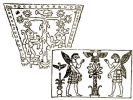
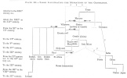

  
[Intangible Textual Heritage](../../index)  [Symbolism](../index.md) 
[Index](index)  [Previous](mosy08)  [Next](mosy10.md) 

------------------------------------------------------------------------

[Buy this Book at
Amazon.com](https://www.amazon.com/exec/obidos/ASIN/048641437X/internetsacredte.md)

------------------------------------------------------------------------

  
*The Migration of Symbols*, by Goblet d'Alviella, \[1894\], at
Intangible Textual Heritage

------------------------------------------------------------------------

#### IV. The Birth-Place of the Gammadion.

Can we determine the cradle of the *gammadion*, or, at least, the region
whence it sprang, to be transported to the four corners of the Old
World? To be sure, it may have been formed spontaneously here and there,
in the manner of the equilateral crosses, the circles, the triangles,
the

p. 73

flower-mark, and the other geometric ornaments so common in primitive
decoration.

But the specimens which we have been examining are too identical, in
their meaning as in their use, for us not to admit the original unity of
the sign, or, at the very least, of its symbolical meaning.

A first observation, made long ago, is that the *gammadion* is almost
the exclusive property of the Aryan race. It is found, in fact, among
all the peoples of the Indo-European branch, whilst it is completely
absent among the Egyptians, the Chaldæans, the Assyrians, and even the
Phœnicians, although these latter were not very scrupulous in borrowing
the ornaments and symbols of their neighbours. As for the Tibetans, the
Chinese, and the Japanese, amongst whom it is neither less frequent nor
less venerated, it is not difficult to prove that it must have come to
them, with Buddhism, from India.

There was only a step from this to the conclusion that the *gammadion*
is a survival of the symbolism created, or adopted, by the common
ancestors of the Aryans, and this step has been easily got over. Had we
not the precedents of philology, which cannot come upon the same radical
in the principal dialects of the Indo-European nations without tracing
its existence to the period when these people spoke the same language?
We did not even stop there. Desirous of investing the *gammadion* with
an importance proportioned to the high destiny imputed to it, one has
endeavoured to make it the symbol of the supreme God whom the Aryans are
said to have adored before their dispersion. Thus we have seen Mr. Greg
exhibit the *gammadion* as the emblem of the god of the sky, or air,
who, in the course of the Indo-European migrations, was converted into
Indra, Zeus, Jupiter, Thor, and so forth. M. Ludwig Müller, on his side,
after having by his

p. 74

very complete and conscientious work on the *gammadion* contributed so
much to proving it to be a solar symbol, takes care to add that before
receiving this signification it might well have been, with the primitive
Aryans, "the emblem of the divinity who comprehended all the gods, or,
again, of the omnipotent God of the universe."

To this end he draws attention to the fact that the *gammadion* is
associated with divinities of different nature, and that, therefore, it
might well have the value of a generic sign for divinity, in the manner
of the Star which figures before the divine names in the cuneiform
inscriptions of Mesopotamia: "The sign," he concludes, "expressed then
figuratively the word θεός, which corresponded with *deva*, from which
it is derived; it is thus the primitive Aryans called the divinity whose
symbol this sign probably was." Who knows if it did not imply and retain
a still higher signification; if, for example, the Greeks, "following
the Pelasgians," did not employ it to symbolize a god elevated above the
Olympians, or even the One and Supreme Being of philosophy arid
religious tradition, "the unknown God, to whom, according to Saint Paul,
an altar was dedicated at Athens"? [1](#fn_172.md)

This is doing great honour to the *gammadion*. To reduce these theories
to their real value it is only necessary to show that they are
conjectures with no foundation in history. When the latter begins to
raise the veil which conceals the origins of the Greeks, the Romans, the
ancient Germans, the Celts, the Slays, the Hindus, and

p. 75

the Persians, we find these nations adoring the vague *numina* of which
they caught a glimpse behind the principal phenomena of nature,
worshipping the multitude of spirits, and indulging in all the practices
of inferior religions, with here and there outbursts of poetry and
spirituality which were as the promise and the dawn of their future
religious development.

It is probable that before historic times they had already *fetiches*,
perhaps even idols, in the manner of those uncouth *xoana* which are met
with in the beginnings of Greek art. But it is unlikely that at the far
more distant epoch of their first separation they had already possessed
symbols, that is to say, ideographic signs, figures representing the
divinity without aspiring to be its image or receptacle. In any case we
may here apply the adage *affirmantis onus probandi;* upon those who
wish to make the *gammadion* a legacy of the "primitive" Aryans, it is
incumbent to prove that these Aryans practised symbolism; that amongst
their symbols the *gammadion* had a place, and that this *gammadion*
typified the old *Diu pater*, the Heavenly Father of subsequent
mythologies.

Should the same criticism be extended to the theories which make the
*gammadion* a Pelasgic symbol,—whether by Pelasgians be understood the
Western Aryans in general, or merely the ancestors of the Greeks, of the
ancient Italians, and of the Aryan populations who, primitively, fixed
their residence in the basin of the Danube?

We can here no longer be so affirmative in our negations. It is, indeed,
an undeniable fact that the *gammadion* figures amongst the geometric
ornaments on certain pottery styled *Pelasgic*, because, in the bronze
period, or the first iron age, it is found amongst all the Aryan
peoples, from Asia Minor to the shores of the Atlantic. [1](#fn_173.md) But, to

p. 76

begin with, the very term Pelasgian does not seem to me a happy one, and
it may be noted that there is now a tendency amongst archæologists to
drop it. This term either refers to the pre-Hellenic, and the
pre-Etruscan phase of civilization in the South of Europe, when it is
only a word designed to hide our ignorance, or else it claims to apply
to a determinate people, and then it confounds under the same
denomination very different populations, of whom nothing authorizes us
to make an ethnic group. Moreover, in so far as the first appearances of
the *gammadion* are concerned, it is possible, and even necessary, to
limit still further our geographical field of research.

Without going into the question whether geometric decoration may not
have originated in an independent manner amongst different nations, it
must be observed that this style of ornamentation embraces two periods,
that of painted and that of incised decoration. Now, in this latter
period, which is everywhere the most ancient, the *gammadion* is only
found on the "whorls" of Hissarlik and the pottery of the terramares. We
have here, therefore, two early homes of our symbol, one on the shores
of the Hellespont, the other in the north of Italy.

Was it propagated from one country to another by the usual medium of
commerce? It must be admitted that at this period the relations between
the Troad and the basin of the Po were very doubtful. Etruria certainly
underwent Asiatic influences; but whether the legendary migration of
Tyrrhenius and of his Lydians be admitted or not, this influence was
only felt at a period subsequent to the "palafittes" of Emilia, if not
to the necropolis of Villanova.

There remains, therefore, the supposition that the *gammadion* might
have been introduced into the two countries by the same nation.

p. 77

We know that the Trojans came originally from Thrace. There is, again, a
very plausible tradition to the effect that the ancestors, or
predecessors, of the Etruscans, and, in general, the earliest known
inhabitants of northern Italy, entered the peninsula from the north or
north-east, after leaving the valley of the Danube. It is, therefore, in
this latter region that we must look for the first home of the
*gammadion*. It must be remarked that when, later on, the coinage
reproduces the types and symbols of the local religions, the countries
nearest the Danube, such as Macedon and Thrace, are amongst those whose
coins frequently exhibit the *gammadion*, the *tétrascèle*, and the
*triscèle*. [1](#fn_174.md) Besides, it is
especially at Athens that it is found on the pottery of Greece proper,
and we know that Attica is supposed to have been primitively colonized
by the Thracians.

In any case, to judge from the discoveries of M. Schliemann, it was
especially amongst the Trojans that the *gammadion* played an important
part from a symbolical and religious point of view; which may be
attributed to the belief that it was there closer to its cradle and even
nearer to its original signification. "The nations who had invaded the
Balkan peninsula and colonized Thrace," writes M. Maspero, "crossed, at
a very early period, the two arms of the sea which separated them from
Asia, and transported there most of the names which they had already
introduced into their European home. There were Dardanians in Macedon,
on the borders of the Axios, as in the Troad, on the borders of the Ida,
Kebrenes at the foot of the Balkans, and a town, Kebrene, near
Ilium." [2](#fn_175.md) Who will be astonished
that these, emigrants

p. 78

had taken with them, to the opposite shore of the Hellespont, the
symbols as well as the rites and traditions which formed the basis of
their creed in the basin of the Danube? Doubtlessly they borrowed a
great deal from the creeds of the nations amongst whom they settled. But
where has the *gammadion* been discovered amongst the vestiges of the
far more ancient civilization whose religious and artistic influence
they were not long before feeling?

Mr. Sayce, it is true, having met with it in Lycaonia, on the bas-relief
of Ibriz, maintains the impossibility of deciding if it is a symbol
imported from the Trojans amongst the Hittites, or if, on the contrary,
it is to be attributed to the latter. [1](#fn_176.md) Yet, whilst the oldest "whorls" of
Hissarlik go back *at least* to the fourteenth or fifteenth century
B.C., the bas-relief of Ibriz reveals an influence of Phrygian, and even
Assyrian art, which is, perhaps, contemporaneous with King Midas, and
which, in any case, cannot have risen long before the accession of the
Sargonidæ; that is to say, in order to determine the age of the monument
we must come down to the ninth or eighth century before our era. [2](#fn_177.md)

It is therefore not difficult, here, as everywhere else, to connect the
origins of the *gammadion* with the early centres which we have assigned
to it. Even when it occurs in the north and west of Europe, with objects
of the bronze period, it is generally on pottery recalling the vases
with geometric decorations of Greece and Etruria, and later, on coins
reproducing, more or less roughly,

p. 79

the monetary types of Greece. It seems to have been introduced into
Germany, Denmark, Sweden, Norway, and Iceland, in the same manner as
that in which the runic writing was brought from the Danube valley to
the shores of the Baltic and the ocean. It may have penetrated into
Gaul, and from there into England and Ireland, either through Savoy,
from the time of the "palafittes," or with the pottery and jewelry
imported by sea and by land from the East, or, lastly, with the
Macedonian coins which represent the origin of Gallic coinage.

We have already seen how it was brought among the islands of the
Mediterranean, and into Greece proper, then from Greece to Sicily and
Southern Italy. It must be observed that even at Rome it seems to have
always been connected with the traditions of the East. The only
tombstone in the open air on which it has, so far, been noticed in the
vicinity of the Eternal City is that of a Syrian. [1](#fn_178.md) We must not forget that the Christianity
of the Catacombs was likewise a religion of Oriental origin.

In the extreme East, the origins of the *gammadion* can be traced
without difficulty to the *swastika* of India. It remains to be
investigated if the latter, in its turn, may be connected with the
*gammadion* of the West. M. Ludwig Müller, desirous of proving that this
symbol was prior to the dispersion of the Indo-Europeans, maintains that
the *swastika* cannot have passed from the Hindus to the Greeks, or
*vice versâ*, because the religions of these two races differed too much
for an exchange of symbols to be possible. My whole book tends to prove
that this is no obstacle. I will have occasion, in particular, to show
how India borrowed several of its principal symbols

p. 80

from Mesopotamia, from Persia, and even from Greece. Why should the
*swastika* form an exception?

Here, however, occurs a difficulty, which we must not conceal. The
*swastika* does not appear on the coins struck in Bactriana, or in
India, by Alexander and his Indo-Greek successors. Even amongst the
Indo-Scythians, whose coinage copies the Greek types, it is only visible
on barbarous imitations of the coins of Basu Deva. [1](#fn_179.md) On the other hand, as we have shown, it
adorns the coins of Krananda, and the most ancient monetary ingots of
India. Moreover, Panini, who already makes mention of the *swastika*, is
sometimes considered to have lived in the middle of the fourth century
B.C. [2](#fn_180.md) It might therefore be
possible that the Hindus had known the *swastika* before feeling in
their arts, and even in their symbolism, the influence of the Greek
invasion. Yet, for the best of reasons, it is neither the Chaldæans, the
Assyrians, the Phœnicians, nor even the Egyptians, who can have imparted
the *gammadion* to Hindustan. There only remain, then, the Persians,
whose influence on the nascent arts of India was certainly felt before
Alexander. But in Persia itself the *gammadion* only appears as an
exception, on a few rare coins approaching our era. [3](#fn_181.md)—Perhaps we would do well to look towards
the Caucasus, where the antique ornaments with *gammadions*, collected
by M. Chantre, lead us

  [  
Click to enlarge](img/pl03.jpg.md)

Plate III.—Table
Illustrating the Migrations of the Gammadion

p. 81

back to a civilization closely enough allied, by its industrial and
decorative types, to that of Mycenæ.

Until new discoveries permit us to decide the question, this gap in the
genealogy of the *swastika* will be equally embarrassing for those who
would like to make the *gammadion* the common property of the Aryan
race, for it remains to be explained why it is wanting amongst the
ancient Persians.—It is right, too, to call attention to its absence on
the most ancient pottery of Greece and the Archipelago, where it only
appears with geometric decoration.—In reality, the problem is less a
question of ethnography than of archæology, or rather of comparative
art. [1](#fn_182.md)

If the *gammadion* is found amongst none of the nations composing the
Egypto-Semitic group, if, amongst the Aryans of Persia, it never played
but a secondary and obliterated part, might it not be because the art
and symbolism of these different nations possess other figures which
discharge a similar function, whether as a phylactery, or else as an
astronomical, or a divine symbol? The real talismanic cross of the
countries stretching from Persia to Libya is the *crux ansata*, the Key
of Life

p. 82

of the Egyptian monuments. As for their principal symbol of the sun in
motion, is it not the Winged Circle, whose migrations I trace in another
chapter? There would seem to be between these figures and the
*gammadion*, I will not say a natural antipathy, but a repetition of the
same idea. Where the *gammadion* predominates—that is to say, in the
whole Aryan world, except Persia—the Winged Circle and the *crux ansata*
have never succeeded in establishing themselves in good earnest. Even in
India, granting that these two last figures really crossed the Indus
with the Greek, or the Iranian symbolism, they are only met with in an
altered form, and with a new meaning. [1](#fn_183.md)

In brief, the ancient world might be divided into two zones,
characterized, one by the presence of the *gammadion*, the other by that
of the Winged Globe as well as of the *crux ansata*; and these two
provinces barely penetrate one another at a few points of their
frontier, in Cyprus, at Rhodes, in Asia Minor, and in Libya. The former
belongs to Greek civilization, the latter to Egypto-Babylonian culture.

As for India, everything, so far, tends to show that the *swastika* was
introduced into that country from Greece, the Caucasus, or Asia Minor,
by ways which we do not yet know. However that may be, it is owing to
its adoption by the Bhuddhists of India that the *gammadion* still
prevails amongst a great part of the Mongolian races, whilst, with the
exception of a few isolated and insignificant cases which still survive
amongst the actual populations of Hindustan, and, perhaps, of Iceland,
it has completely disappeared from Aryan symbolism and even
folk-lore. [2](#fn_184.md)

p. 83

------------------------------------------------------------------------

### Footnotes

[72:1](mosy08.htm#fr_171.md) Greg. *Archæologia*, 1885, p. 304.

[74:1](mosy09.htm#fr_172.md) Lud. Müller. *Op. cit.*, p. 107.—M. Alexandre
Bertrand, for whose long-promised study on the *gammadion* we are
waiting with justifiable impatience, makes it, with the Gauls at least,
the symbol of a nameless divinity. (*La Gaule avant les Gaulois*. Paris,
1884, p. 12.)—If, by this expression, the eminent archæologist means a
divinity whose name we are ignorant of, no one will gainsay the fact.
But if he alludes to a divinity who had no name, this is quite another
matter.

[75:1](mosy09.htm#fr_173.md) Max Collignon. *Archéologie grecque*, p. 276.

[77:1](mosy09.htm#fr_174.md) Percy Gardner. *Solar Symbols on the Coins of
Macedon and Thrace*, in the *Numismatic Chronicle*, vol. xx. (N. S.), p.
49 *et seq.*

[77:2](mosy09.htm#fr_175.md) G. Maspero. *Histoire ancienne des peuples de
l’Orient*. Paris, 1886, p. 241.

[78:1](mosy09.htm#fr_176.md) A. H. Sayce. *The Hittites, the Story of a
forgotten Empire*. London, 1888, p. 142.

[78:2](mosy09.htm#fr_177.md) Perrot et Chipiez. *Histoire de l’art dans l’antiquitié*,
vol. iv., pp. 728 and 794, note 1.—With the exception of the bas-relief
of Ibriz, the *gammadion* has only been remarked on a single Hittite
monument; it is a cylinder, probably of uncertain date. (Schliemann. *Troja*, p. 125.)

[79:1](mosy09.htm#fr_178.md) Lud. Müller. Op. Cit., p. 62.

[80:1](mosy09.htm#fr_179.md) Percy Gardner. *Coins of Greek and Scythic
Kings of India and Bactria*. London, 1886, p. 160.

[80:2](mosy09.htm#fr_180.md) Monier Williams. *Indian Wisdom*. London, 1876,
p. 173.

[80:3](mosy09.htm#fr_181.md) M. Ludw. Müller draws attention to a coin of
the Achæmenidæ in the *British Museum*, which would seem to bear the
*gammadion;* but it is there a countermark which must belong to a much
later period.—In the coinage prior to Alexander, the western *gammadion*
does not seem to have advanced towards the east further than Asia Minor.

[81:1](mosy09.htm#fr_182.md) See the table on
[plate iii.](#img_pl03.md), where I have endeavoured to trace, in a manner,
the genealogy of the *gammadion* in the Ancient World. Supposing it be
necessary to change certain approximate dates, those, for example, of
the centuries in which the civilizations of Mycenæ and Villanova
flourished, the succession of the terms is none the less the same in
each series, as is also the connection between the series themselves. It
will be seen by this table that there has been, over the whole of
Europe, two successive importations of the *gammadion*; one,
prehistorical, almost everywhere following the diffusion of pottery and
of ornaments with geometric decorations; and the other contemporary with
the imitation of Greek coins. Perhaps we must attribute to the existence
of these two successive currents the cause of the variations which M.
Lud. Müller points out, amongst the Germanic nations, between the forms
of the *gammadion* in the bronze period and in the iron age.

[82:1](mosy09.htm#fr_183.md) See chap. vi.

[82:2](mosy09.htm#fr_184.md) Some mention might be
made of the *gammadions* which have been discovered in other parts of
the world. In what mysterious way did this combination of lines come to
be p. 83 stranded amongst the Ashantees? There
is, however, nothing against its having been conceived there, and
spontaneously executed, like so many other geometric designs which are
found even in the centre of the dark continent.—The same phenomena may
have occurred in the two Americas. Yet, when we see it specially
employed as a religious symbol amongst the Pueblo Indians, we are led to
inquire if we have not here some vestige of a communication with the Old
World. There can be no question of an influence subsequent to the advent
of the Spaniards, for if these latter had brought the Pueblos the emblem
of the Cross, it certainly would not have been under the form of the
*gammadion*. There remain two ways by which the transmission of the
symbol might have been effected; to the east, by the expeditions of the
still pagan inhabitants of Iceland; to the west, by an influence coming
from China or Japan. I would incline rather to the second theory. Mr. R.
P. Greg has proved that another sign, similar to the *swastika*, the
ornament known as the fret or *meander*, is frequently met with on the
ancient pottery of the New World; this, too, in conditions recalling its
employment amongst the nations of our extreme East. (R.-P. Greg. *The Fret or Key ornamentation in
Mexico*, in *Archæologia*, vol. xlvii., pp. 157–160.)

------------------------------------------------------------------------

[Next: Chapter III. On the Causes of Alteration in the Meaning and Form
of Symbols](mosy10.md)
