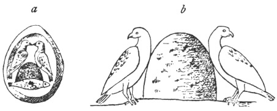

  
[Intangible Textual Heritage](../../index)  [Symbolism](../index) 
[Index](index)  [Previous](mosy09)  [Next](mosy11) 

------------------------------------------------------------------------

[Buy this Book at
Amazon.com](https://www.amazon.com/exec/obidos/ASIN/048641437X/internetsacredte)

------------------------------------------------------------------------

  
*The Migration of Symbols*, by Goblet d'Alviella, \[1894\], at
Intangible Textual Heritage

------------------------------------------------------------------------

p. 84

### CHAPTER III.

#### ON THE CAUSES OF ALTERATION IN THE MEANING AND FORM OF SYMBOLS.

Causes which may alter the primary interpretation of
symbolical types.—Loss of the primitive signification.—New meanings
attached to uncomprehended symbols.—Harpocrates, the god of
silence.—Identical symbols applied to different traditions.—Saint George
and Horus.—Daniel and the Chaldæan Hercules.—The two doves facing each
other.—Chaldæan origin of the religious symbolism of the
Persians.—Sources of the Christian symbolism of the Catacombs.—Causes
which may alter the form of symbols.—Tendency to simplify the
figures.—Tendency to beautify them.—Origins and transformations of the
Thunderbolt.—The antecedents of Sagittarius.—Mistakes due to ignorance
and maladroitness.—Reconstruction of a new intelligible type from
degenerate elements.—Gradual transformation of linear symbols into human
figures, and of human figures into linear symbols.—Substitution of one
element for another in a symbolical combination.—Lily and
Lotus.—Addition of new elements to a former figure.—The *perron* of
Liege.

For two symbolical figures to have a
common origin it is not always necessary that they should have the same
meaning. It frequently happens that a symbol changes its meaning in
passing from one country to another.

In this manner a symbol can very well become a mere ornament when, on
account of its æsthetic value, or simply by reason of its originality,
it is reproduced by artists who are unacquainted with its primitive
acceptation. Such, for example, are those clasps in the shape of
*gammadions* which are frequently offered for sale to visitors at
Homburg, and which, according to M. Gaidoz, are

p. 85

reproductions of antique *fibulæ* found, some years ago, on the site of
a Roman encampment not far from that place. [1](#fn_185)

A symbol, again, may retain merely a talismanic value, like those
crucifixes, converted into *fetiches*, which are the only vestiges of
Christianity left, among certain tribes of the Lower Congo, by the
Portuguese domination of last century.

Sometimes, in similar cases, the new owners of the image will endeavour
to explain it by a more or less ingenious interpretation, and in this
manner they will restore to it a symbolical import, though applied to a
new conception.

The rising sun has often been compared to a new-born child. Amongst the
Egyptians, this comparison led to Horus being represented as an infant
sucking its finger. The Greeks imagined that he placed his finger on his
lips to enjoin secrecy on the initiated, and they made him the image of
Harpocrates, the god of silence. [2](#fn_186)

This is what M. Clermont-Ganneau has very happily termed *iconological
mythology;* it is here no longer the myth which gives rise to the image,
but the image which gives rise to the myth.

We may further quote, as an interpretation of the same kind, the legend
related by Hygin, which made the Caduceus originate in Hermes throwing
his wand between two serpents fighting. It is evident that, here also,
this hypothesis, soon to be transformed into a myth by the popular
imagination, was due to a desire, unconscious perhaps, to explain the
Caduceus.

Most frequently it is a conception pre-existent in the local traditions
which we think we find amongst the products of foreign imagery. The
Egyptians of the later period sometimes represented

p. 86

\[paragraph continues\] Horus under the
form of a horseman piercing a crocodile with his spear. M.
Clermont-Ganneau has shown how this symbolical image of the sun
dispersing the clouds served as a model to the early representations of
St. George and the Dragon. [1](#fn_187) The
same subject had already been employed by Greek mythology to depict
Bellerophon slaying the Chimæra. [2](#fn_188)

M. Gaidoz attributes a similar origin, not only to the image, but also
to the worship of the Virgin of *the Seven Sorrows*, or rather of *the
Seven Swords*. He thinks that he discovers its prototype in certain
Chaldæan cylinders in which a goddess is depicted in the middle of seven
arrows or swords, which radiate doubtlessly from a quiver placed behind
her back. The resemblance between the two images is remarkable. This is
how the author explains this transmission: "An Assyrian cylinder, or
some other engraved stone, reached Italy in the Middle Ages. … The image
of a woman could be taken for nothing else than that of the Virgin Mary.
But what could be the meaning of those weapons which were seen in the
figure, and seemed to transpierce her breast? Without a doubt they were
swords; and what might they signify? Some ingenious ecclesiastic was not
wanting who assumed that they were the symbol of sorrows.… The swords
numbered seven; it was then only necessary to ascertain, and this was no
difficult task, the seven principal sorrows in the life of the Virgin
Mary." [3](#fn_189)

But here is a still better example: the image, so common on Chaldæan
cylinders, of the mythical

p. 87

hero, Idzhubar or Gilgames, [1](#fn_190) seen
from the front and flanked by two lions, which he holds at arm's length,
was not only diffused amongst the Greeks

 

Fig. 35. Assyrian
Cylinder.  
(Lajard. *Mithra*, pl. xliv., fig.
10.)

and Hindus to symbolize their respective solar hero in the course of his
exploits, it seems also, in our Middle Ages, to have suggested certain
pictorial representations of Daniel in the lion's den.

 

Fig. 36. On an old Christian
Staff.  
(Martin et Cahier. *Mélanges d’archéologie*, vol. ii., pl.
xviii.)

\[paragraph continues\] In these the
prophet is drawn full-face, standing with arms outstretched, in the
classic attitude of prayer, between two rampant lions, which he seems to
keep in awe as much by his gesture as by the effect of his prayer. In
this manner might be explained the peculiar fact, pointed out by the
Abbe Martigny, that Daniel is often represented

p. 88

between two lions, "whilst the den contains seven." [1](#fn_191)

On a lintel of St. Gertrude's Church at Nivelles, in Belgium, there is a
bas-relief representing Samson slaying the lion, which belongs to the
oldest piece of carved stone still in situ in Belgium. The Biblical hero
is there represented

 

Fig. 37. Samson Killing the
Lion.  
(Cathedral of Nivelles.)

dressed in the Roman costume, astride of the lion, whose jaws he seizes
with his hands ([fig. 37](#img_fig037)). A mere glance will permit one
to find in this image a reminiscence of the scene, so often reproduced

 

Fig. 38. Mithra Slaying the
Bull.  
(From a bas-relief in the Louvre.)

on Mithraic bas-reliefs, where Mithras offers the bull in sacrifice
([fig. 38](#img_fig038)).

The worship of Mithras was certainly practised

p. 89

in Belgium at the time of the Roman domination, for inscriptions, "*Deo
Invicio Mithræ*," have been found in the Gallo-Roman cemetery at
Juslenville. The Nivelles bas-relief, to be sure, is not prior to the
eleventh century; but then it must be observed that at Nivelles, and in
its vicinity, traces of Roman occupation have been discovered. The
sculptor of St. Gertrude may very probably have been acquainted with a
local Mithraic bas-relief, in which he saw an episode of Samson's
history. It may, however, be equally admitted that the model came from
without.

Mediæval pictorial art, moreover, borrows frequently enough from
Mithraic representations, wherein the sun and moon are depicted under
the forms and with the respective attributes of the solar god and of the
lunar goddess in the scene of the sacrifice. [1](#fn_192)

A remarkable example is seen in the bas-reliefs of the baptistery of
Parma. [2](#fn_193)

The group of Mithras and the bull has received other adaptations again
in the hands of Christian artists. M. Th. Roller has pointed out a
singular instance in a Christian bas-relief of the third or fourth
century. Christ is there represented in the form of Orpheus, playing on
the lyre, with a Phrygian cap on the head, and the right leg reposing on
the body of a lamb, which turns its head towards the musician. [3](#fn_194)

p. 90

These alterations in meaning may sometimes be perfectly compatible with
a knowledge of the primitive signification, for one is always prone to
discover in everything one's favourite image or idea. It was in perfect
good faith that the Neoplatonists believed they recognized the
representations of their own doctrines in the symbols and in the myths
of all contemporary religions. Did not the early Christians see the
Cross in all figures exhibiting an intersection of lines, as an anchor,
a mast and its yard, a standard, a plough, a man swimming, a bird
flying, a person praying with outstretched arms, the Paschal Lamb on the
spit, and even the human face, in which the line of the nose crosses
that of the eyes? When the Serapeum at Alexandria was destroyed, the
Christian writers of the time relate that a certain number of *cruces
ansatæ* were found in it. They themselves observe that in these figures
was recognized the old Egyptian symbol of life; which avowal, however,
does not prevent them from seeing in this emblem a prophetic allusion to
the sign of the Redemption. Sozomen adds that this fact brought about
many conversions amongst the pagans. [1](#fn_195)

A legend, widely diffused throughout the ancient world, related that
Zeus, wishing to know the centre of the earth, let fly at the same
moment from the ends of the world, in the east and west, two eagles
(other versions say two crows), which came and settled at the same time
on the *omphalos* of Apollo in the temple at Delphi. [2](#fn_196) It may be questioned if this tradition
was not perhaps suggested by the desire to account for a representation
of the *omphalos*, similar to the image of a temple found amongst the
jewels collected by Dr. Schliemann at Mycenæ. It is a sort of shrine,

p. 91

which stands between two doves facing one another.

The origins of this representation must, in their

  [  
Click to enlarge](img/fig039.jpg)  
  

Fig. 39. Jewel From
Mycenæ.  
(Schliemann. *Mycènes*. Paris, 1879, fig.
423.)

turn, be sought for in the symbolism of the worship paid, in Asia Minor,
to the Great Goddess of Nature, venerated by the Phœnician populations
under the name of Astarte. The doves played a part in this worship,
either as personifications of the goddess, or as sacred birds reared in
the temples. [1](#fn_197) Two doves appear on
some *stelai* in

 

Fig. 40. Punic
Stela.  
(*Corpus inscript. semit.*, i., part iii., No. 183.)

\[paragraph continues\] Libya, and, later,
on imperial coins of Cyprus; in the former they are facing one another
on the opposite sides of one of those conical *bethels*

p. 92

which represented the goddess ([fig. 40](#img_fig040)); in the latter
they are back to back on the roof of a temple containing a Sacred Stone
([fig. 41](#img_fig041)).

 

FIG. 41. Coin of
Paphos.  
(Guignaut, vol. iv., pl. liv., fig.
206.)

This combination of figures might all the more easily relate to the
*omphalos*, since the latter was a white stone, a real *bethel*, round
at the top. I am not aware that it has ever been found represented
between two crows or eagles, but Strabo informs us that near the Sacred
Stone (ἐπ᾽ αὐτῷ), in the sanctuary at Delphi, there was an image of the
two birds mentioned in the fable. [1](#fn_198)

Let us now pass over a dozen centuries, and, from the shores of the
Ægean Sea, direct our steps towards the valley of the Sambre. Coins of

 

Fig. 42

p. 93

the Principality of Liege, struck at Thuin under Bishop Otbert
(1092–1119), offer to our view the well-known type of the Temple,—which
Charlemagne borrowed from ancient Italy,—with this

 

Fig. 43. Coin of
Thuin.  
(De Chestret. Numismatique de la province
de Liege, pl. iii., No. 52.)

difference, that here the gable stands between two doves *affrontée*.

M. le baron de Chestret has drawn a parallel between this image and a
legend relating to the siege of the monastery of Lobbes, in 955, by the
Huns, who had invaded the territory of Thuin. The Lobbes chronicle
relates that two pigeons, having escaped from the church, had flown
three times round the barbarians’ encampment, and that forthwith a
violent shower of rain, by swelling their bows, had put the besiegers to
rout. [1](#fn_199) As Folcuin, the writer of
the chronicle, became abbot of Lobbes in 965, it cannot be maintained
that this narrative was prompted by Otbert's coin; but the legend will
probably have contributed towards establishing in the coinage of Thuin a
type whose antecedents, perhaps, date back, across classic antiquity, to
the sacred dove-cots of Phœnicia. [2](#fn_200)

It may also happen that the signification of a

p. 94

foreign symbol is intentionally modified in order to adapt it to an idea
or a belief, till then devoid of all material expression, or confined to
a few rudimentary figurations. When the Persians had taken possession of
Mesopotamia, they converted to their own use almost the whole imagery of
the conquered people, in order to give a concrete form to their own
religious conceptions, which the absence of a national art left without
well-defined plastic representations. The Assyrian *genii*, with a
double pair of wings, provided a body for the seven superior spirits of
Mazdeism, the Amshaspands. The Chaldæan demons, with their hideous and
bestial forms, were employed to represent the *devas*, those Iranian
personifications of all that is false, dark, and impure. Lastly, as we
shall see in another chapter, Ahura Mazda appropriated the symbol of
Ashur, the great god of the Assyrian pantheon, and the Iranian Holy
Tree, whose sap averts death, borrowed its shape from the conventional
Trees of Mesopotamian pictorial art.

In the same manner, when the Christians began to reproduce on the walls
of the Catacombs the scenes of the Old Testament and the parables of the
New, it was from classic, and even mythological art that
[they](errata.htm#2) took their first models. Hermes’ Criophoros
furnished the type of the Good Shepherd. [1](#fn_201) Orpheus taming the wild beasts became a
symbol of Christ and of his preaching. The Christian clinging to the
Cross, in order to overcome temptations, was represented by Ulysses
bound to the mast of his ship, so as to resist the song of the Sirens.
By an ingenious application of a myth, which paganism had already
spiritualized,

p. 95

\[paragraph continues\] Psyche offered the
image of the human soul united to Love, replaced by an angel. [1](#fn_202) The religions of Gaul and of India have
offered instances of similar assimilations from the day they came into
contact with the symbolism of more advanced nations.

In general, there must be an analogy between the old and the new
interpretation sufficient to justify the transition from the one to the
other. On the monuments of Egypt and of Mesopotamia divinities or
*genii* are frequently met with possessing a double pair of wings, one
raised, the other lowered; the Phœnicians easily made therefrom a
symbolical image of perpetual motion. [2](#fn_203) Amongst the Egyptians, the Phoenix
rising from its ashes represented the sun resuscitating every morning in
the glow of dawn. Depicted on a pyre, and encircled by a halo of glory,
this solar Bird became, amongst the Romans, the emblem of the imperial
apotheoses, and then passed to the *sarcophagi* of the Christians, as a
symbol of the Resurrection.

The connection, however, is not always so easy to trace, whether in the
form or in the idea, especially when it is a question of metaphysical
conceptions embodied, at a later date, in a symbol of naturalistic
origin. So long as symbols remain the image of some object or
perceptible phenomenon, the mental operation which produced them can
always be reconstituted. But in the domain of abstract ideas the field
of analogy is as vast as that of individual fancy, and the same image
may be used to render the most dissimilar ideas. How could we ascertain
the origin of so abstract a symbol as the representation of the world
under the form of a serpent biting its tail, if the texts did not inform
us that in the cosmogony of Egypt, of Chaldæa, of Greece, and of India,
the

p. 96

earth was believed to be circumscribed by an ocean or celestial river,
whose circular course is compared to a serpent?

We must observe that even in naturalistic religions one image may be
applied to very different objects. The serpent, for instance, has also
served to symbolize the lightning, solar rays, clouds, rivers, and even
the course of the stars in the sky.

 

Symbols may even differ in appearance and yet be genealogically
connected with one another. This leads us to examine the causes which
may alter the form of symbolical representations.

There is a tendency, in the first place, to reduce or abbreviate the
figure in order either to enclose it in a smaller space, or else to
lessen the work of the artist, especially when it is a complicated image
in frequent use. In all systems of writing where the characters first
appeared under the form of hieroglyphs, the letter need only be glanced
over in order to find the symbol. It is known that our vowel A was
originally a bull's head, a bucrane, and that the latter, in its turn,
represented the whole animal, in conformity with the popular rule that
the part is equal to the whole in the matter of symbols, as well as of
sacrifices. It is thus, again, that in the signs of the Zodiac the Lion
is merely represented by its tail.

At other times, on the contrary, we have additions and embellishments
suggested by æsthetic considerations. Such, in particular, was the fate
of nearly all the symbols adopted by Greece, whose art, so powerfully
original, never accepted foreign types without stamping them with
profound and happy modifications. We will see an important example of
this in the transformations of the Caduceus.

p. 97

The Thunderbolt is another symbol which lent itself to all the
refinements of classic art; here, however, the germs of those
improvements, like the origins of the symbol itself, must be sought for
further towards the East. On bas-reliefs at Nimrud the Thunderbolt is
represented in the left hand of a god holding an axe in his right; at
Malthaï it is brandished in each hand by the god Merodach struggling
with the monster Tiamat, the mythical assailant of the moon. We may add
that in these Mesopotamian sculptures its antecedents are recognized
without difficulty; it appears there, indeed, as a double trident, or
rather as a trident doubled in the manner of the blade in the two-edged

 

Fig. 44. Assyrian
Thunderbolt.  
(Layard. *Monuments of Nineveh*, 2nd
series, pl. v.)

axe, or of the hammer in the Two-headed Mallet.

Almost all nations have represented the lightning by a weapon. Among the
Chaldæans it was depicted by a trident as well as by a pitch-fork and an
axe. The Trident, with branches which zigzag like lightning, is
frequently exhibited in the hands of the Assyro-Chaldæan gods. On a
cylinder dating back to the oldest times of Chaldæan art the handle of a
Trident held by the god of the storm lets fall a jet of water into the
mouth of a deer.

The Assyrian artist who—with the intention, perhaps, of accentuating the
power of the god—first doubled the Trident, or rather produced from

p. 98

it the trifid sheaf, of which Greek art was to make such good use,
secured thereby for the old Mesopotamian symbol an advantage over all
the

 

FIG. 45.  
(Rawlinson. *The Five Great Monarchies*,
vol. ii., p. 251.)

other representations of lightning with which it was to compete.

The Greeks, like all the Indo-European nations, seem to have figured to
themselves the light of the storm under the form of a bird of prey. When
they had received the image of the Thunderbolt from Asia Minor, they
placed it in the talons of the eagle, and made it the sceptre, and even
the symbol, of Zeus; explaining, in return, according to their custom,
this symbolical combination by a myth: it was, said they, the eagle that
brought the Thunderbolt to Zeus, when the latter was preparing to fight
the Titans. [1](#fn_204)

Roman Italy transmitted the Thunderbolt to Gaul, where, in the latter
centuries of paganism, it alternated with the Two-headed Hammer on
Gallo-Roman monuments; it is even found on amulets of ancient Germany,
Scandinavia, and Brittany.

In the East it penetrated into India in the track of Alexander. It had
there to compete with other symbols having the same signification: "the
sparrow-hawk with golden wings," and "the stone with four points," of
which the Vedas speak,—the

p. 99

\[paragraph continues\] St. Andrew's Cross
(itself perhaps a double fork) which forms the *vajra*, the redoubtable
weapon of Indra, god of the stormy sky; [1](#fn_205) the Drum and the Axe which figure in the
hands of Siva; lastly, its own antecedent, the Trident, which the Hindus
had already borrowed from the West, or else imagined themselves
spontaneously.

Siva, who succeeded Zeus on the coins of the Indo-Scythic kings when the
last glimmering of Greek civilization in north-west India had died out,
holds in his hand sometimes the Thunderbolt, sometimes the
Trident, [2](#fn_206) and if the latter remains
the essential weapon of the god in the later imagery of the Hindu sects,
the Thunderbolt made none the less its way amongst the Buddhists, who
transported it with their symbolism as far as China and Japan. Even at
the present time it can

 

Fig. 46. Dordj.  
(From a specimen belonging to the author.

be recognized there under the form of the *dordj*, a small bronze
instrument shaped like a double sheaf, with six or eight branches,
which, held between the thumb and forefinger, is used by the lamas and
bonzes to bless the faithful, and to exorcise demons. [3](#fn_207)

A legend which M. Gustave Le Bon found in Nepaul claims to justify the
presence of the

p. 100

\[paragraph continues\] Thunderbolt in the
temples of the country by stating that Buddha had wrested it from the
god Indra. [1](#fn_208) The assertion is true
in this sense, that Buddhism, after having precipitated from his supreme
rank the Master of the Brahminical Olympus, made of his terrible and
capricious instrument an ally of man in the struggle against the powers
of evil. It is interesting to note the fact that with us, too, the
antique and redoubtable attribute of the Master of the Thunder has
become the emblem of lightning removed from the blind direction of
natural forces and placed by science at the service of human industry.
Are there many other symbols which can boast of such a long and fruitful
career?

This happy disposition of Greek genius reacted even on symbols of
strange religions wherever their form was not invariably regulated by
the canons of a perennial tradition. M. Menant has pointed out the hand
of Greece in the transformation of the winged bulls which kept watch of
old at the entrances to the Assyrian palaces. Their function as
gate-keepers or guardians, in condemning them to remain immovable,
imposed upon them, in spite of their wings, rigid contours and massive
forms, calculated to give at once an impression of repose and force.
With the advent of the Persian religion, in which the bull was a
mythical character invested with a wholly active function, as
representing Gayomert, the first-born of creation, it was no longer
deemed necessary to fasten his images to the ground; the bull moved its
wings, started at a gallop into space, brandished a bow, and ended,
under the Greek rule of the Seleucidæ, by assuming, on cylinders, the
well-known physiognomy of Sagittarius. [2](#fn_209)

p. 101

Beside the improvements due to the artistic taste of their authors we
must place the disfigurations brought about by the maladroitness or
ignorance of the copyist, as may be remarked on so many Gallic coins,
where Greek symbols have assumed the most singular forms.

Sometimes those corruptions tend to produce a new type, which, in
passing through a whole series of intermediate forms, takes the place of
the old. It is like those dissolving views where the outlines of the two
succeeding pictures are blended in an image which is no longer the one,
and is not as yet the other, but exhibits features borrowed from both.

Nothing is more curious than to follow the gradual stages of the
degeneration which, on Gallic coins, has finally transformed into the
letter E the bust of Apollo, [1](#fn_210) and
into the letter H, on coins of Valenciennes, the type of the
Carlovingian temple formed of four columns placed on a basement and
surmounted by a pediment. [2](#fn_211)

 

FIG. 47. Degeneration of
the *Temple* Type.

A metamorphosis of the same kind may be noticed in the carved work on
paddles from New Ireland, which were exhibited in 1872 by General Pitt
Rivers at the annual session of the British Association for the
Advancement of Science. We see here a whole series of deformations,
which at last

p. 102

change a human form into a crescent placed on the point of an arrow. Had
the intermediate figures not been found, the connection between the two
extremes would never have been admitted, nor even suspected.

 

Fig. 48. Polynesian
Carvings.  
(Flammarion. *Etoiles et curiosités du
ciel*, p. 445.)

As a counterpart of the metamorphoses which thus convert a face into a
sign or instrument we will see further on examples of symbols which,
purely linear in the beginning, have gradually assumed a human
physiognomy. [1](#fn_212) These transformations
may, in certain cases, be systematic and premeditated; but generally
they originate in a desire to give an intelligible character to a
shapeless symbol by approximating it to the image which it seems most to
resemble.

When a foreign or antiquated symbol is formed of several images
combined, it sometimes happens that one or more of its constituent parts
are modified in order to better agree with the religious traditions, the
æsthetic preferences, the national predilections, or even with the
geographical peculiarities of its new environment. It is thus that, in
the symbolism of Europe, the Lily has generally taken the place which
the Orient assigned to the Lotus.

There are also symbolical combinations in which several superposed
elements, dating back to different periods, can in some measure be
distinguished. The most curious monuments to be studied in this

p. 103

connection are the *perrons* or *pérons* which, in the Middle Ages,
constituted the symbol of communal liberties in several cities of
eastern Belgium. The

 

Fig. 49. The Perron of
Liege. (*Revue de Liège*, vol. vi. (1846), p. 86.)

most celebrated of those *perrons* is still standing, above a fountain,
on the market-place at Liege;

 

Fig. 50. Heraldic
Perron.  
(Loyens. *Recueil héraldique*,
*passim*

it consists of a white marble column placed on a square base with five
steps, guarded by four lions. The capital is surmounted by the three
Graces, who support a Crown encircling a Fir-cone with a small Cross on
its point.

p. 104

In other towns of the same country, at Namur, for instance, the *perron*
only comprised a column on a pedestal with three steps. [1](#fn_213)

The *perron* of Liege has had a very chequered existence, which makes it
all the dearer to its fellow-townsmen. Transported to Bruges by Charles
the Bold in 1467, after the defeat of the citizens of Liege, and
solemnly restored to the old episcopal city ten years later, twice blown
down in a storm, in 1448 and in 1693, it figured as early as 1303 on the
banner of the trades leagued together in defence of their privileges, as
also on the gemel blazon of the two annual burgomasters, or temporary
masters, of the city. [2](#fn_214)

In still earlier times it is seen on coins of the bishop-princes from
the end of the twelfth century. On one of them, dating back to Rodolphe
de Zæringen (1167–1191), it only appears in the form of a column
surmounted by a ball, above which is

 

FIG. 51. Coin of Rod. de
Zæringen

 

FIG. 52. Coin of Jean
d’Aps

(De Chestret.
*Numismatique de la principauté de Liège*, pl. vi., No. 119, and x., No.
192.)

a cross, and the inscription PERU VOC(OR) ([fig. 51](#img_fig051)). On a
coin of Jean d’Aps (1229–1238), however, the Fir-cone is plainly visible
at the top of the column ([fig. 52](#img_fig052)).

The meaning and origin of the *perrons* have been much discussed. [3](#fn_215) M. Ch. Piot, general

p. 105

archivist of Belgium, has proved in a conclusive manner that they were,
in the Middle Ages, "stones of justice," marking the place where the
holders of municipal jurisdiction sat in the open air; and thus it is
easily explained how they everywhere became the symbol of municipal
life, as also of popular privileges. [1](#fn_216) But this explanation leaves the question
of their origin untouched. Moreover, why were these stones surmounted by
a column, and why did this column itself support a Fir-cone and a Cross?

According to some, the *perron* might simply be a sort of Calvary, or
even an elevated Cross, like that which figures on the farthings of
Charlemagne, and on some coins of the bishop-princes; [2](#fn_217) according to others, it might date from
the Eburons, and represent an ancient druidical stone; [3](#fn_218) there are those, again, who attribute
it, together with the Fir-cone, to one or other of the Germanic races
who successively occupied the basin of the Meuse; [4](#fn_219) whilst some, lastly, would wish to make
it a legacy of the Roman domination in Belgium. [5](#fn_220)

For my own part I consider that the *perron* of Liege may be resolved
into five elements belonging

p. 106

to as many different periods. Putting aside the lions and the Crown,
which date from the Middle Ages, and the group of the Graces, which, in
1693, replaced three copper figures representing, it would appear,
scoundrels embracing rods, there remain:

1\. The *column*, which represents the common element of monuments of
this kind, and which may date back, as M. Rahlenbeek thinks, to the
Germanic tribes settled in western Belgium.—Tacitus bears witness to the
presence of sacred columns amongst the Frisians who occupied the valley
of the Lower Rhine, nor far, consequently, from the Meuse; he even calls
them Pillars of Hercules; however, he hastens to recall to mind that
many things are fathered upon Hercules which do not belong to him. [1](#fn_221) The Saxons, that is to say the
inhabitants of the right bank of the Rhine, venerated, on their side,
wooden or stone pillars dedicated

 

Fig. 53. Column of
Hildesheim.  
(Kratz. *Der Dom zu Hildesheim*, 2nd
part, pl. vii., fig. 2.)

to the god Irmin; such was the famous Irminsul demolished by the order
of Charlemagne. A stone column dug up at Eresburg or Stadtbergen

p. 107

in Westphalia, under Louis the Débonnaire, and placed in the cathedral
of Hildesheim, where it still serves as a candelabrum, exhibits a
striking resemblance to the ancient representations of the *perron* of
Liege.

M. Piot, again, has proved that people were sworn on the *perron*. Now
we learn from the Saga of Gudrun that amongst the Scandinavians they
swore "by the holy white stone." [1](#fn_222)
Moreover, there have been preserved until our own times, on the *tumuli*
or *haugs* of the Scandinavian Peninsula, pillars of white stone to
which the lower classes accord a certain veneration. One of these
stones, now in the Bergen Museum, presents the similitude of a small
pillar with an enlarged top three feet high and sixteen inches in
diameter. [2](#fn_223)

Were the pillars of the Germanic nations dedicated to the divinities of
the sky, or of war? Did they exhibit a *simulacrum* of Thor, of Odin, or
of a god Irmin? Had they a phallic acceptation, as M. Holmboe thinks
with respect to the Scandinavian *cippi*, or did they provide a
cosmogonical symbol, as might be inferred from a passage in Adam of
Bremen to the effect that, the Saxons venerated in their Irminsul the
image of "the universal pillar which supports all things"? [3](#fn_224) All that can be said for the moment is
that these pillars had a religious character, and that they had to play
a part in the social life, so intimately connected, amongst all
barbarians, with the religious life of the people.

2\. *The Fir-cone*.—This is, according to M. Henaux, "the symbol of an
existence united but distinct," and represents the union of the tribes

p. 108

leagued together against the dominion of Rome. [1](#fn_225) We do not find, however, that the
Fir-cone admitted of this interpretation in the symbolism of the ancient
Germans, or even of the Gauls. To tell the truth, we possess very little
information on the particulars of Germanic symbols and even forms of
worship. To make up for this, however, we know that, in the Græco-Roman
paganism, the fruit of the pine discharged prophylactic, sepulchral, and
phallic functions.—Amongst the Etruscans the Fir-cone occurs frequently
in tombs and on urns, sometimes alone, sometimes on the top of a
pillar. [2](#fn_226) Does it there figure a
representation of the flames on an altar, and does it consequently
symbolize the persistency of life in death? The pillar, whole or broken,
and often adorned with bas-reliefs, was a fairly common monument on
Belgo-Roman tombs. [3](#fn_227) But we nowhere
find that it supported a Fir-cone, and nothing permits us to suppose
that the *perrons* ever had a sepulchral acceptation.—Moreover, the
Thyrsus of Bacchus, composed of a stalk crowned by the fruit of the
pine, was a familiar emblem in classic paganism. [4](#fn_228) An emblem of the same kind was borne by
Sylvanus Dendrophorus, that old god of the Latin forests, assimilated at
a later date, on so many Gallic monuments, to one of the principal
divinities

p. 109

of the Celtic pantheon, if not its supreme god—the god with the Mallet:

*Et teneram ab radice ferens, Sylvane,
cupressum*. [1](#fn_229)

It may therefore be asked if the addition of the fir-cone to the
*perron* of Liege is not due to the syncretic influence of Gallo-Roman
art, which would thus have brought the Germanic column within the limits
of classic paganism, as, at a later period, the Church introduced it
into Christian society by surmounting it with a Cross. Perhaps also it
was thus desired to keep alive in the monument a phallic signification,
whilst correcting whatever too great coarseness this symbol might have
had in its primitive form.

It is probable that the *pyr* of Augsburg, that gigantic Fir-cone,
depicted, from time immemorial,

 

Fig. 54. The Pyr of
Augsburg.

on the arms, the coins, and the seals of that town, dates from the time
of the Roman occupation. It has been found, indeed, at Augsburg itself,
on a Roman monument, now in the museum of that town, and known as the
altar of the *duumviri*. The pine-fruit is there sculptured at the top
of a pillar ornamented with flower-work, which separates the statues of
the two municipal magistrates, exactly as, at Liege, the *perron*
figures between the coats of arms of the two annual burgomasters. [2](#fn_230)

p. 110

It must be observed that the *pyr* rests on a capital; now, every
capital supposes a column, that is to say, that we have here the remains
of a veritable *perron*, which was never baptized by the apposition of a
Cross, but was merely shortened by the suppression of the shaft, in
order to be more easily introduced into armorial bearings and coins.

I have been assured, but have not been able to verify the fact, that in
Rome itself, in front of the church of SS. Nereo et Achilleo, built on
the ruins of a temple of Isis, there was still to be seen, some years
ago, an antique column surmounted by a Fir-cone with a Cross on the top.

We have likewise the proof that the Fir-cone,

 

Fig. 55. Buckle from
Envermeu.  
(Cochet. *La Normandie souterraine*, pl.
xii., No. 4.)

 

Fig. 56. Buckle From
Eprave.  
(A. Bequet. *Soc. arch. de Namur*, vol.
xv., p. 315.)

placed at the end of a stalk or pillar, figured amongst the objects held
in veneration by the Franks, who occupied, in the fifth century, the
East of Belgium and the North-east of France.

p. 111

\[paragraph continues\] The Abbe Cochet
and M. Alfred Bequet have separately found, the former in the
Merovingian cemetery of Envermeu, near Dieppe, the latter in the
cemetery of Eprave, not far from Namur, silver belt-buckles adorned with
an identical figure, in which I have no hesitation in recognizing a
prototype of the *perrons*. We have there, in the middle of a support or
pedestal, which is placed between two peacocks facing one another, a
long stalk, capped by a conical object, whose resemblance to the
Fir-cone at once struck the Abbe Cochet, though at that moment he was
little thinking of the *perrons* of Belgium (figs. [55](#img_fig055),
[56](#img_fig056)). [1](#fn_231)

It is to be remarked that the two birds facing one another are also met
with on the sides of the

 

Fig. 57. Seal of
Liege ad legata.  
(Loyens. *Recueil héraldique des
bourgmestres*, p. 2.)

*perron* on the earliest coin of Liege, on which an attempt is made to
represent this monument with the Fir-cone ([fig. 52](#img_fig052)), and
also on a seal which Loyens attributes to the year 1348 ([fig.
57](#img_fig057)).

If the fact be insisted upon, that the stalk engraved in the Frankish
image seems to be of wood, I will remark that the symbolical pillars of

p. 112

the ancient Germans were made of wood as well as of stone. This was
particularly the case with the Irminsul, which the oldest chronicles
define as the trunk of a tree erected in the open air. [1](#fn_232)The Hessians of the eighth century, who
lived on the Lower Rhine, still venerated, at the time when they were
evangelized by St. Boniface, the trunk of a tree, which was to them the
*simulacrum* of the god Thor. [2](#fn_233)

Do not our May-Poles, often a mere stalk surrounded with ribbons, take
us back to the time when Lucan sang of our forefathers:

              simulacraque mœsta deorum  
Arte carent, cæsisque extant informia truncis [3](#fn_234)?

Lastly, old chroniclers relate that in the thirteenth century the
destruction of the Irminsul by Charlemagne was still commemorated at
Hildesheim on the Saturday following the Sunday of the *Lætare*, by
planting in the ground, on the cathedral square, two poles six feet
high, each surmounted by a wooden object one foot in height, and shaped
*like a pyramid or cone*. The young people then endeavoured with sticks
and stones to overthrow this object. Does not this tradition directly
connect the Irminsul, or rather the Irminsuls, with the stake which,
surmounted by a Cone, is presented to our view in the Frankish buckle,
just as the stone column of the Hildesheim cathedral links them with the
*perrons* of Belgium? The same custom, or rather the same popular sport,
existed elsewhere too in Germany, at Halberstadt in particular; here,
however, it was the canons

p. 113

who indulged in it on the Sunday of the *Lætare* itself. [1](#fn_235)

We have, moreover, a more direct proof that the representation of the
stalk, surmounted by a Fir-cone, and placed between animals facing one
another, figured in Christian imagery from the eighth century of our
era. The sculptures in question are taken, one from the parapet of the
cathedral of Torcello, near Venice ([fig. 58](#img_fig058)), and

 

Fig. 58. From the Cathedral
of Torcello.

 

Fig. 59. From the Athens
Cathedral.

the other from a bas-relief on the Athens cathedral ([fig.
59](#img_fig059)). Both of them are reproduced in the remarkable work of
M. R. Cattaneo, *L’architecture en Italie*. [2](#fn_236)

3\. *The Cross*.—Tradition relates that the Christian missionaries
everywhere overthrew, amongst the Belgians, the altars of Thor and of
Wodan. But the fate of the column of Hildesheim shows us how monuments
of this kind managed to escape destruction by placing themselves, so to
speak, under the protection of the new faith. At Hildesheim, they placed
a Virgin on the column, transformed into a candelabrum. At Liege, a
Cross

p. 114

was placed on the *perron*, and the oaths which were taken on the
"sacred whitestone" continued to be taken on the Cross which sanctified
the ancient *simulacrum*. In Sweden also *cippi* are found, similar to
the one I have mentioned above, on the top of which the Cross has been
incised. [1](#fn_237)

The Abbe Cochet thinks that the figures engraved on the Envermeu plate
denote a Christian symbol, because we find in the Catacombs, and even in
Roman architecture, the symbol of a bunch of grapes between two peacocks
facing one another, depicting the soul quenching its thirst at the
eternal fountain of life. Nothing, however, entitles us to distinguish a
bunch of grapes in the object placed at the end of the stalk; moreover,
its resemblance to the ordinary representation of the *thyrsus* is
incontestable. Lastly, we have already seen in the present chapter that
the custom of figuring sacred objects between two winged animals facing
one another was spread throughout the whole Mediterranean basin long
before the birth of Christian art. It is especially on the side of
sacred stones and trees that they are met with, as I shall have an
opportunity of pointing out in the following chapter. Now, in so far as
it was a cosmogonical column, related to the Scandinavian Yggdrasill,
the Irminsul is just as much connected with the tradition of the
Universal Pillar as with that of the Tree of the World, both of which
seem to have received their first plastic expression amongst the
Assyro-Chaldæans.

Curiously enough, the Tree of Life between two peacocks facing one
another is even found in the symbolism of modern India (fig. 60).

p. 115

It will be observed that here each of the two peacocks holds a serpent
in its beak. Now the peacock was held amongst the ancients to kill
serpents, and this also may be one of the reasons

  [  
Click to enlarge](img/fig060.jpg)  
  

Fig. 60. Cloth from
Masulipatam.  
(Sir G. Birdwood. *The Industrial Arts of
India*. 1880.

which brought about its introduction into Christian symbolism. [1](#fn_238)

It is evident that, at least in its outlines, all this iconography takes
us backwards, far beyond Christianity, into the very midst of antique
symbolism.

Lastly, it is proper to remark that traces of Christianity are entirely
wanting in the cemeteries

p. 116

of Envermeu and Eprave, as well as in nearly all the Frankish cemeteries
of that period.

Thus, to sum up, the *perron* of Liege includes in harmonious order the
legacies and, so to speak, the witnesses, of all the civilizations which
have succeeded one another in this part of Belgium. In this respect it
is more than a symbol of municipal liberty; it is the embodiment of the
very history of the nation. [1](#fn_239)

p. 117

------------------------------------------------------------------------

### Footnotes

[85:1](mosy10.htm#fr_185) H. Gaidoz. *Le symbolisme de la roue*, p. 113.

[85:2](mosy10.htm#fr_186) G. Lafaye. *Histoire des divinités d’Alexandrie
hors de l’Egypte*. Paris, 1884, p. 259.

[86:1](mosy10.htm#fr_187) Clermont-Ganneau. *Horus et saint George*, in
the *Revue archéologique* of 1873, fig. 13.

[86:2](mosy10.htm#fr_188) P. Decharme. *Mythologie de la Grèce antique*.
Paris, 1886, fig. 161.

[86:3](mosy10.htm#fr_189) *Mélusine*. The
number for November-December, 1892.

[87:1](mosy10.htm#fr_190) According to a recent
communication from Mr. Th. J. Pinches (*Babylonian and Oriental Record*
of October, 1890), *Gilgames* would seem to be the definite
pronunciation of this name, which has been read in such different ways
in the cuneiform texts.

[88:1](mosy10.htm#fr_191) Martigny. *Dictionnaire des antiquités
chrétiennes*. Paris, 1865, p. 201.—See also De
Gaumont. *Mélanges d’archéologie religieuse*. Paris, 5th edition,
p. 68.

[89:1](mosy10.htm#fr_192) *Cf*. especially the
bas-reliefs on the baptistery at Parma. (*Revue archéologique*. Paris,
1853, vol. x., pl. 216.)

[89:2](mosy10.htm#fr_193) In the Strasburg
Cathedral there is a statue representing an individual clothed in the
skin of a lion and holding in his hand a club. It was long thought to be
an ancient statue to which the Christian edifice had extended its
hospitality. M. Albert Dumont has shown that it was a Mediæval work,
suggested probably by images of the Gallo-Roman Hercules, like those
bronze ones which have been found in the neighbourhood of Strasburg.
(*Revue archéologique*, 1870–71, vol. xxii., p. 246.)

[89:3](mosy10.htm#fr_194) Th. Roller. Catacombes, vol. ii., pl. iv., No.
1.

[90:1](mosy10.htm#fr_195) Sozomen. *Hist. ecclés.*, vii., 15, p. 725 B.

[90:2](mosy10.htm#fr_196) Strabo. *Liv*. ix., ch. iii.

[91:1](mosy10.htm#fr_197) François Lenormant, in the *Gazette
archéologique* of 1878, p. 75 *et seq.*

[92:1](mosy10.htm#fr_198) Since the publication
of the French edition of this work Sir George Birdwood has pointed out
to me two representations of the *omphalos* where the Sacred Stone is
found with two doves on its sides; one ([fig. 42a](#img_fig042)) is
taken from a coin of Cyzicus (*Numismatic Review*, vol. vii. (3rd
series), pl. i., No. 23), the other from a marble bas-relief found at
Sparta (*Mittheilungen des Deutschen Archäologischen Instituts in
Athen*, 1889, vol. xii., pl. 12).

[93:1](mosy10.htm#fr_199) De Chestret. *Numismatique de la province de
Liege*. Brussels, 1888, p. 54.

[93:2](mosy10.htm#fr_200) The same subject
seems to have passed into India, if we are to judge from the doves and
other birds found facing one another on the roofs of the palaces
represented in the Buddhist bas-reliefs of Boro-Budur. (Leemans. *Boro Boedoer op het eiland Java*.
Leyden, 1893. Atlas, pl. lxvi., fig. 102; cxliv., fig. 22, etc.)

[94:1](mosy10.htm#fr_201) The origin of this
type is found, perhaps, among the Phœnician people, where it was merely
meant to represent the believer, or the sacrificer, bringing the sheep
or the ram destined for the sacrifice. (*Cf*. Perrot et Chipiez, vol. iii., figs. 307, 308, and 402.)

[95:1](mosy10.htm#fr_202) Th. Roller. *Les catacombes de Rome*. Paris,
vol. ii., pp. 370–372.

[95:2](mosy10.htm#fr_203) *Sanchoniathonis
Fragmenta*, ed. Orelli, p. 38.

[98:1](mosy10.htm#fr_204) Gubernatis. *Zoological Mythology*. London,
1872, vol. ii., p. 196.

[99:1](mosy10.htm#fr_205) In the Vedas Indra's
weapon is defined as "the stone with four points which brings the rain"
(Rig. Veda, 4, 22, 1–2). Now the *vajra* of Indra had so exactly the
form of a St. Andrew's cross that the term *vajrarupa*, "vajra-shaped,"
is the equivalent of our expression "in the form of the letter X."
(*Cf*. *Dictionnaire de Saint-Pétersbourg*, 6, 630.)

[99:2](mosy10.htm#fr_206) Barclay V. Head. *Catalogue of Indian Coins in
the British Museum*. London, 1886, p. 147 *et seq.*

[99:3](mosy10.htm#fr_207) The *dordj* appears
already on the bas-reliefs of Sanchi.

[100:1](mosy10.htm#fr_208) Gustave Le Bon. *Voyage au Népaul* in the *Tour
du Monde*, 1886, li., p. 266.

[100:2](mosy10.htm#fr_209) J. Menant. *Pierres gravies de la Haute-Asie*,
vol. ii., p.191.

[101:1](mosy10.htm#fr_210) C. A. Serrure. La numismatique et l’archéologie
gauloise, in the *Annales de la Société d’archéologie de Bruxelles*,
vol. iv., p. 58.

[101:2](mosy10.htm#fr_211) Ch. Robert. *Lettre à M. R. Chalon*, in the
*Revue belge de numismatique* of 1859, p. 133 *et seq.* It must be
observed that the letter H is the first in Hannonia (Hainault).

[102:1](mosy10.htm#fr_212) See chaps. v. and
vi.

[104:1](mosy10.htm#fr_213) Jules Borgnet. *L’Hôtel de ville et le Perron
de Namur*, in the *Messager des sciences historiques*. Ghent, 1846, p.
235.

[104:2](mosy10.htm#fr_214) Loyens. *Recueil héraldique des bourgmestres de
la noble cité de Liège*. Liège, 1720.

[104:3](mosy10.htm#fr_215) The name itself
means simply "stone" (from *petronem*). It p.
105 is generally used in the sense of a stone with steps, a stone
staircase. Yet, in the vicinity of Verdes, in France, there are several
artificial mounds, composed of heaps of stones, which are named
*perrons* or *perroux*, and which have given rise to many legends. (*Une
visite à Verdes*, by M. Ludovic Guignard (from the *Bulletin de la
Societé Dunoise*. Chateaudun, 1891.)

[105:1](mosy10.htm#fr_216) Ch. Piot. *Observations sur le perron de
Liège*, in the *Revue belge de numismatique*, vol. iii., p. 369 *et
seq.*

[105:2](mosy10.htm#fr_217) Baron de Chestret. *Le perron liégeois*, in the
Reports of the *Institut archéologique liégeois*, vol. xviii. (1885), p.
175 *et seq.*

[105:3](mosy10.htm#fr_218) Hénaux. *Le Péron de Liège*, in the *Revue de
Liège*, vol. vi. (1846), p. 86 *et seq.*

[105:4](mosy10.htm#fr_219) Ch. Rahlenbeek. *Le Perron de Liège*, in the
*Revue de Belgique*, vol. lxv. (1890), p. 31 *et seq.*

[105:5](mosy10.htm#fr_220) Eug. Dognée. *Liège*, in the *Collection
nationale*, Brussels, 1 vol. ill., pp. 24–27.

[106:1](mosy10.htm#fr_221) *De mor. German.*,
xxiv.

[107:1](mosy10.htm#fr_222) "At enom hvita helga
Steini" (*Godrunar-Harmr*, str. 47). (In *Edda Saemundar Hinns Fróda*,
Stockholm, 1818, p. 237.)

[107:2](mosy10.htm#fr_223) Holmboe. *Traces de Bouddhisme en Norvège*,
fig. 10.

[107:3](mosy10.htm#fr_224) *Gesta
Hammenburgensis Ecclesiæ pontificum*, Hamburg, 1706, lib. i., ch. vi.

[108:1](mosy10.htm#fr_225) Henaux. *Loc. cit.*, p. 91.

[108:2](mosy10.htm#fr_226) G. Dennis. *The Cities and Cemeteries of
Etruria*. London, 1848, vol. ii., pp. 157, 193, and 492.—*Cf*. Jos. Micali. *Monuments antiques*. Paris, 1824,
tab. xxxvi.

[108:3](mosy10.htm#fr_227) L. Van der Kindere. *Introduction à l’histoire
des institutions de la Belgique au moyen âge*. Brussels, 1890, p. 86.

[108:4](mosy10.htm#fr_228) It must be also
taken into consideration that the burning altar often represented, as is
seen at Mycenæ (see below, [fig. 74](mosy11.htm#img_fig074)), by a
cylindrical pyre surmounted by a triangular-shaped flame, was accounted
the centre and palladium of the city in the most ancient republics of
antiquity. (*Cf*. Fustel de Coulanges.
*La cité antique*.)—But this tradition does not seem to have spread
beyond Greece and Italy.

[109:1](mosy10.htm#fr_229) *Georg*., i., 20.

[109:2](mosy10.htm#fr_230) Von Raiser. *Die romischen Alterthümer zu
Augsburg*. Augsburg, 1820, pl. xxi.

[111:1](mosy10.htm#fr_231) Abbé Cochet. *La Normandie souterraine*. Paris,
1855, p. 344—A. Bequet. *Nos fouilles en*
1880, in the *Annales de la Société archéologique de Namur*, vol. xv.,
p. 315.

[112:1](mosy10.htm#fr_232) "Truncum quoque
ligni non parvæ magnitudinis in altum erectum sub divo colebant patria
eum linguâ Irminsul appelantes, quod Latine dicitur universalis columna
quasi sustinens omnia." (*Op. cit.*, liv. i., ch. vi.)

[112:2](mosy10.htm#fr_233) "Robur Jovis sive
Thori deastri." (Eckart. *Commentarii de
rebus Franciæ orientalis*. Wurzburg, 1729, p. 344.)

[112:3](mosy10.htm#fr_234) *Pharsalia*, iii,
412.

[113:1](mosy10.htm#fr_235) Eckart. *Op. cit.*, p. 221.—Meibom. De Irminsula
Saxonica, p. 20.

[113:2](mosy10.htm#fr_236) Translated into
French by M. Lemonnier. Venice, 1891, figs. 19 and 165.

[114:1](mosy10.htm#fr_237) Liliegren. *Nord Fomlemningar*, ii., No.
xci.—*Cf*. Cartailhac. *La France
préhistorique*. Paris, 1889, p. 317: "Many unhewn pillars in the
departments of the Yonne, Côtes du Nord, Finisterre, Morbihan, Indre,
Creuse, Puy-de-Dôme, Saône-et-Loire, etc., bear Crosses and even
Madonnas."

[115:1](mosy10.htm#fr_238) Maccarius. *Hagioglypta*. Paris, 1856, p. 205.

[116:1](mosy10.htm#fr_239) My dissertation upon
the origins of the *perron* has had the privilege of reviving, in
Belgium, the controversies which this subject seems never to exhaust. We
must instance, in particular, the recent works of MM. Léon Van der
Kindere, Léon Naveau, and Eugène Monseur.

M. Naveau has no hesitation in adopting the theory of M. the Abbé Louis,
that the *perron* of Liege was, from the beginning, a real Calvary, with
a purely religious signification. Liege, which, as he points out, was at
one time a mere village, only became an important city from the time of
St. Lambert, its first bishop and veritable founder. Now, he asks, is it
credible that a bishop would have chosen a pagan symbol as an emblem of
his city? (*Le Perron Liègeois*, from the *Bulletin de l’Institut
archéologique Liègeois*. Liege, 1892.)

M. L. Van der Kindere admits, on his side, that the *perron* was in all
times an elevated Cross, but he adds that this Cross had essentially a
secular and administrative import. It was the symbol of the
*Weichbildrecht*, that is to say, of the right granted to the towns to
establish a market under the protection of the imperial authority, and
it was thus it came to symbolize the whole of the municipal liberties.
In reference to this, he recalls to mind the Rolandsäulen, those columns
serving as a support to the image of a warrior, bearing the name of
Roland, which, from the thirteenth century onwards, are noticed in many
towns in northern Germany. He considers that these statues might have
replaced the Cross as a symbolical representation of the imperial power.
(*Notes sur les Perrons*, in *le Bulletin de l’Académie royale de
Belgique*. Brussels, 1892, vol. xxi. (3rd series), p. 497.)

According to M. Monseur, whose opinion I am rather inclined to accept,
*perrons*, Rolandsäulen and Irminsäulen, would be forms, differing
according to time and place, of the post, sometimes adorned with a
shield, which the ancient Germans used to erect in their public
meetings, and which were consecrated to the patron god of those
assemblies, probably Tíews, whose name, the Germanic equivalent of Zeus,
is p. 117 met with in the word Tuesday. This
god bears the epithet of "god of the assembly" (*thingsaz*, *i.e.*,
*Zeus agoraios*), a surname which has been pointed out in an inscription
in England. This post was probably erected on a stone; whence the
expression, met with in old Alsatian texts, to have "post and stone in a
village," meaning, to have jurisdiction there. At a later date these
posts had the Cross placed on them in Belgium, as in Germany they were
surmounted by the statue of the hero whom the "chansons de geste"
represented as the paladin above all others, and whose name, besides,
probably offered a certain consonance with Hrodo, like Irmin, one of the
names of the god Tíews. (*Supplément littéraire de l’Indépendance belge*
of the 3rd of May, 1891.)

------------------------------------------------------------------------

[Next: I. The Sacred Tree and its Acolytes](mosy11)
