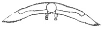

  
[Intangible Textual Heritage](../../index)  [Symbolism](../index.md) 
[Index](index)  [Previous](mosy14)  [Next](mosy16.md) 

------------------------------------------------------------------------

[Buy this Book at
Amazon.com](https://www.amazon.com/exec/obidos/ASIN/048641437X/internetsacredte.md)

------------------------------------------------------------------------

  
*The Migration of Symbols*, by Goblet d'Alviella, \[1894\], at
Intangible Textual Heritage

------------------------------------------------------------------------

p. 204

### CHAPTER VI.

#### THE WINGED GLOBE, THE CADUCEUS, AND THE TRISULA.

I. *The Winged Globe outside Egypt*.—The Winged Globe of the Egyptians;
a combination of the Disk, the sparrow-hawk, the goat, and the
serpent.—Meaning of this symbol.—Its migration into Phœnicia, Syria,
Mesopotamia, and Persia.—Modification of its forms.—Its later
combinations with the human image, the Sacred Bird, the Sacred Tree, and
the conical *bethel*.—Its influence upon some symbolic figures of Greece
and of India, the Aureole, the Thunderbolt, the *chakra*, etc.—Winged
Globes of the New World.

II\. *The antecedents of the Caduceus*.—Homeric description of the
Caduceus.—Transformations of the Greek Caduceus.—The Caduceus of the
Phœnicians and the Hittites.—Assyrian ensigns, prototypes of the
*labarum*.—The Caduceus in its relations with the Winged Globe and the
*ashêrah*.—Hindu Caducei.

III\. *The transformations of the trisula*.—Definition, antiquity, and
different interpretations of the *trisula*.—Its connection with the
Trident and the Wheel.—Its blending with the Caduceus.—Its interchanges
with the Winged Globe, the Scarab, the Lotus, the *lingam*, the idol of
Jaganath, and the Tree of Buddha.—The *trisula* in the bas-reliefs of
Boro-Budur.—The *trisula* in Europe.—Summing up.

#### I. The Winged Globe Outside Egypt.

There are certainly not many features
common to the different representations which the ancient Egyptians made
of the sun when they depicted it, according to the locality, in the form
of a radiating disk, of a goat, of a ram, of a sparrow-hawk, or of a
scarab. Notwithstanding, they hit upon a means of contracting all these
figures into one.

p. 205

Round the Disk, now a Globe, they twisted symmetrically two *uræus*
snakes, with heads erect and sometimes wearing the crown. Behind the
*uræi* this Globe received the outstretched wings of the sparrow-hawk,
on its top the undulating

 

Fig. 111. Winged Globe of
Egypt.  
(Lepsius. *Denkmäler*, vol. iii., pl. 3
b.)

horns of the goat spread out; and from this fantastic mixture came those
Winged Globes, which, while attaining their highest perfection under the
eighteenth dynasty, formed, during the whole period of Egyptian art, so
original and graceful a subject of ornamentation upon the pylons and the
lintels of the temples."

It has been said, with good reason, that the Winged Globe is the
Egyptian symbol *par excellence*. [1](#fn_395.md)
According to an inscription at Edfu it was Toth himself who caused it to
be placed above the entrances to all the temples in order to commemorate
the victory won by Horus over Set, *i.e.*, by the principle of light and
good over that of darkness and evil. [2](#fn_396.md)

Did the Egyptians imagine that the sun—or the soul of the sun—really
assumed the form of a globe flanked by serpents, furnished with wings
and surmounted by horns? Or, after having depicted the orb under its
natural form, did they add *uræi* to symbolize its sovereignty, horns to

p. 206

recall its strength, and wings to indicate its faculty of translation
through space?

Perhaps it is here unnecessary to choose between the two systems which
divide the opinions of Egyptologists. A third interpretation, which to
me seems to better account for the formation of the Winged Globe, makes
it the result of a conscious and intentional combination of various
personifications of the sun. M. Maspero, who is one of the most
competent and persuasive defenders of the theory that the Egyptians
began by believing the beast-like or fantastic creatures depicted upon
their monuments to be real, admits himself that the priests may have
invented composite figures with the fixed intention of expressing the
union of distinct symbols and ideas. [1](#fn_397.md)

When the founding of a national monarchy in Egypt brought about the
establishment of a common Pantheon, the gods, whose attributes or
signification offered the greatest similarity, were related to each
other, either as members of the same family, or as different forms of
the same being. Is it unreasonable to assume that this movement of
unification between local personifications of the same divinity found
its expression in the blending of the images by which they were
represented?

 

It is only necessary to turn over the leaves of the handsome volumes
published by MM. Perrot and Chipiez on the *Histoire de l’art clans
l’antiquité*, or to cast a glance upon the first few of the plates
appended by Lajard to his *Introduction d l’étude du culte de Mithra*,
to be convinced that the Winged Globe was also one of the most widely
spread and most venerated symbols in the whole of Western Asia.

Phœnicia exhibits it frequently on *stelai*, bas-reliefs,

p. 207

cylinders, gems, *pateræ*, and bowls. Frequently too, in that country,
as in Egypt, the Winged Globe adorns the lintels of the temples. One of
the most curious instances, quoted by M. Renan in his *Mission de
Phénicie*, is furnished by the lintel of a Christian church built at
Edde, near Gebal, from the materials of an ancient temple. The Globe and
the *uræi* have been cut into for the reception of a red cross; below
are inscriptions which the learned Academician attributes to the worship
of Adonis. [1](#fn_398.md)

The Winged Globe of the Phœnicians is found wherever their art was
introduced, in Carthage, Cyprus, Sardinia, Sicily, and among different
peoples of Palestine. It has even been pointed out on Israelitish seals
of the oldest epoch, [2](#fn_399.md) and nothing
prevents us from supposing that—like the serpent, the golden bull or
calf, and the idolatrous images denounced by the prophets—it served,
perhaps, to furnish a figured representation of *Yahveh*.

M. Renan, in his *Histoire du peuple d’Israël*, goes still further when
he thinks he discovers the two *uræus* masses of the Egyptian symbol in
the *urim-tummin*, or the two *urim*, described in Exodus, rather
obscurely, as a mechanical means of consulting the divine will. "Perhaps
the *uræi* of the Winged Globes," he suggests, "one meaning *yes* and
the other *no*, were moved by a spring hidden behind the Disk." [3](#fn_400.md) Of course I leave to the eminent writer
the whole responsibility of this theory, which is difficult to verify
unless one be both an Egyptologist and a Hebraist. At all events nothing
proves that the Israelites brought

p. 208

directly from Egypt the type of their Winged Globe; the latter rather
reproduces the forms of Phœnician art, as is admitted, moreover, by M.
Renan.

To be sure, the Winged Globes of Phœnicia often strive to reproduce the
classic type of Egypt, always, however, with variations which enable us
to easily distinguish them. Sometimes the *uræi* seem to come out from
the lower part of the Globe, so that the superior appendages may as

 

Fig. 112. Winged Globe of
Phoenicia.  
(Renan. *Mission de Phénicie*, pl.
xxxii.)

well depict serpents’ tails as goats’ horns, like those of Egypt.

Sometimes these appendages are replaced by a tuft of feathers which,
perhaps, represents a sheaf

 

Fig. 113. Wingless
Phoenician Globe with Uræi.  
(Renan. Mission de Phénicie, pl.
lv.)

of rays, particularly when it occurs again below the Globe in the shape
of a tail.

Sometimes, again, the wings are bent downwards as in some archaic types
of the Egyptian symbol. [1](#fn_401.md) Lastly, in
some instances, the Winged Globe assumes rather the forms which we shall
meet with in Asia Minor and in Mesopotamia. [2](#fn_402.md)

p. 209

It is somewhat difficult, in the absence of positive documents, to
determine the precise meaning which the Phœnicians ascribed to this
symbol. It may be that we should see therein a solar representation.
Yet, from what we know of the Phœnicians, their religion referred less
to the direct worship of the orb than to the worship of the mythic
personages who incarnated the principal aspects of the solar
power. [1](#fn_403.md)

The Phœnicians often combined the Winged

  [  
Click to enlarge](img/fig114.jpg.md)  
  

Fig. 114. Vase of
Citium.  
(*Perrot et Chipiez*, vol. iii., fig. 518.)

\[paragraph continues\] Globe with other
equivalent symbols. It is one of these combinations which I think I
detect in a somewhat singular figure painted on a vase found at Citium,
in the island of Cyprus, by General Cesnola ([fig. 114](#img_fig114).md).

With regard to this image, the learned authors of *l’Art dans
l’antiquité* ask: "Should it be

p. 210

called a pillar, *stele*, or palmette? [1](#fn_404.md) To judge from its most striking
features—the medial leaves, the terminal *fleuron*, the two pairs of
volutes cutting the figure in opposite directions, lastly and especially
its position between two animals facing one another which, standing on
their hind legs, appear to be striving to reach with their mouths the
extremities of the *fleuron*,—all these details seem to manifest

 

Fig. 115. Sacred Tree of
Phoenicia.  
(Lajard. *Mithra*, pl. liv. A, fig.
3.)

the intention of depicting the Sacred Tree of Phœnicia in its
conventional form and with its characteristic accessories ([fig.
115](#img_fig115).md).

On the other hand, the lower half of the image terminates in a regular
pennated tail which one would think was copied from a Winged Globe of
Western Asia; the medial leaves may be held to be wings; the lower
volutes suggest the oblique appendages of the Assyrian Disk which
terminates in a loop; finally, the upper volutes reproduce the scroll
which surmounts some specimens of the Mesopotamian Globe. [2](#fn_405.md)

In fine, two things only are wanting in order to make it a Winged Globe:
these are the globe and the wings. Yet—even should it be said that this
is Hamlet with Hamlet left out—I cannot

p. 211

help asserting that the ubiquitous influence of the Winged Globe was
never revealed in a clearer manner by the brush or the chisel of an
Oriental artist.

 

We may further instance, as an example of the same ever-present
influence, the incised stone of Damascus on which I have above pointed
out the amalgamation of the Winged Globe with the Sacred Cone of the
Semites. [1](#fn_406.md) If this Cone represents
the Great Goddess of Nature, herself considered to be the spouse of the
solar Baal whom the Winged Globe symbolizes, it may be asked how far the
aim of the fusion of the two symbols is not to accentuate still further
the figurative representation of this mythic combination.

With greater reason the same explanation applies to the figure of
Citium, if we agree to recognize therein a mutual filiation of the
Winged Globe and the Sacred Tree, which we have so often seen placed one
above another on the symbolic monuments of Western Asia.

North of Phœnicia, in the very middle of Asia Minor—amongst those Khetas
or Hittites whose monuments disclose a complete civilization hardly
dreamt of thirty years ago—the Winged Globe, once more a Disk, is
noticed on seals, *stelai*, sculptured slabs and bas-reliefs, in company
with

 

Fig. 116. Winged Disk of
Asia Minor.  
(Lajard. *Mithra*, pl. i., fig.
22.)

religious subjects. Here, however, it is reproduced in a somewhat clumsy
and inexact fashion, some-

p. 212

times even perverted in its essential characteristics. The Globe becomes
more independent of wings; the latter, in some cases, serve rather as
its support than as its appendages; [1](#fn_407.md) it changes also into a Star inscribed in
a circle.

I will not dwell on these variations, the meaning of which is far from
evident. Perhaps they originate in attempts to adapt the foreign symbol
to local forms of worship; perhaps they are merely to be ascribed to a
whim, or an oversight, of the native artist when dealing with foreign
models. It is indeed generally admitted that Hittite art, like the art
of Phœnicia, derived its inspirations from Egypt and Assyria.

On approaching Mesopotamia we find the Winged Circle amongst the
principal symbols brought into view on the bas-reliefs and cylinders

 

Fig. 117. Winged Circle of
Assyria.  
(Layard. *Monuments of Nineveh*, 1st
series, pl. vi.)

of Assyria and Chaldæa. Sometimes it hovers above kings and priests, and
again it presides at scenes of adoration and of sacrifice. The forms it
assumes exhibit manifold variations, but these may be nearly all traced
to two types.

One of these presents to our view a Disk surmounted by a scroll whose
extremities curl upwards and thus produce the effect of two horns, not
straightened out as in the Egyptian symbol,

p. 213

but curved in the manner of an inverted Ionic column. Below the Disk,
which sometimes takes the form of a Rosette, or a Wheel, a pennated tail
opens out like a fan between two wavy or slightly bent appendages which
fall obliquely from the upper part of the circle.

The other type is distinguished by the presence of an anthropoid genius
inscribed in the Disk between the wings in such a manner that the horns
seem to spring from his cap and the pennated tail forms a skirt with
plaited flounces. [1](#fn_408.md) According to the
nature of the scenes where this personage appears his right hand is
sometimes uplifted in an attitude of protection or of benediction, at
other times he holds a crown or a bow; or again, assuming the warlike
attitude especially suited to the

 

Fig. 118. Anthropoid Winged
Circle.  
(Layard. *Monuments of Nineveh*, 1st
series, pl. xiii.)

divinities of Assyria, he lets fly a three-headed arrow. [2](#fn_409.md)

Cuneiform texts elicit the fact that these Winged Globes are no longer
exclusively a solar emblem, but that we are here in the presence of a
divinity at once more abstract and more anthropomorphic than the sun:
Assur at Nineveh, Bel or Ilu at Babylon.

p. 214

\[paragraph continues\] Perhaps this image
even served to express the general idea of divinity, if we are to judge
from its importance in the religious art of Mesopotamia; sometimes,
indeed, it there replaces the simple Disk, the Crescent, the Rouelle,
the Cross, the Star, and the other symbols which in the field of the
oldest cylinders are exhibited above divine personages, altars, pyres,
the Sacred Tree, and so forth.

Yet the Winged Circles of the basin of the Euphrates, like those of
Phœnicia and of Asia Minor, certainly originated in the valley of the
Nile. It is there alone that they can be traced back to their simple and
intelligible elements: the Disk, the sparrow-hawk, the goat, and the
*uræus* serpents. Moreover—whilst in Egypt the Winged Globe is met with
on monuments dating from the sixth dynasty onwards [1](#fn_410.md)—it would be vainly sought for in
Mesopotamia under the first Chaldæan Empire, and even under the first
Assyrian Empire. [2](#fn_411.md)

It is only from the time of the Sargonidæ that it appears on seals and
bas-reliefs. The founding of Khorsabad, moreover, according to Mr.
Layard, marks the epoch of the first appearance, in Assyrian art, of the
Scarab, the Key of Life, the Lotus-flower, and the other symbols
borrowed from Egypt. [3](#fn_412.md)

Even the discovery of the Winged Globe on older monuments of Mesopotamia
would not be an argument against the Egyptian origin of the symbol. The
researches of Assyriology have shown the commencement of intercourse
between Egypt and Chaldæa to belong to an extremely

p. 215

remote period. These relations seem to date, at least, from the time of
Naram-Sin, the son of Sargon, who, according to a tablet of Nabonidos,
confirmed by various chronological calculations, reigned in the land of
Accad in the thirty-eighth century before our era. [1](#fn_413.md) Some students even make them date from
the *patesi* of Telloh, whose monuments, discovered by M. de Sarzec, are
perhaps contemporary with the fourth Egyptian dynasty. [2](#fn_414.md)

If anything is surprising, it is that the principal symbols of Egypt did
not sooner make their way into Chaldæan imagery. They must, in fact,
have been spread abroad—long before the formation of the Assyrian
Empire—with the ivories, seals, and gems brought from Egypt by the
armies and caravans—witness the numerous Scarabs on the cartouches of
Thothmes III. and of Amenophis III. discovered by modern explorers in
the basin of the Tigris. [3](#fn_415.md)

 

Several experts in these matters, amongst others MM. G. Rawlinson and J.
Menant, have wondered if the Winged Circle of Mesopotamia had not its
prototype in the Sacred Bird with outstretched wings, which was led
about in religious processions, and which already surmounts the
standards sculptured at Telloh. [4](#fn_416.md) It
is very certain that the Mesopotamian Disk, thanks to the presence of a
pennated tail, exhibits an ornithomorphic character far more accentuated
than that of the Winged Globe of Egypt. This similarity, however,
provided there be any grounds for maintaining

p. 216

that equivalent symbols tend to merge into one another, is merely a
result of the importance attributed at an earlier date to the
representation of the Sacred Bird in Mesopotamia. In other places, [1](#fn_417.md) does not M. Menant record a faint
analogy between the combination of lines which cross in the sketch of
the Winged Disk, and the group of cuneiform characters which gives the
ideogram of the supreme Divinity as an eight-rayed star? Here again the
general resemblance proves, not that the cuneiform sign gave rise to the
symbol of the Winged Circle, but that the latter was, so to speak,
sometimes cast in the mould of the sign used to render the conception of
the divinity; just as in Egypt it borrowed the outlines of another solar
emblem, the flying Scarab. [2](#fn_418.md)

However this may be, the very principle of the ornithomorphic image is
undeniably of Egyptian origin. It is Egypt alone that can have given the
Assyrians the idea of introducing the Globe, *uræi*, and horns, into the
representation of the Sacred Bird. If any doubt remained in this
respect, it would be dismissed by the examination of the intermediate
forms which serve as a gradual transition between the Winged Globes of
the two countries.

In the rectilinear strokes terminating in a ball, or hook, which form
the lower appendages of certain Winged Circles of Assyria, some people
have thought they recognized an equivalent of the claws which hold a
ring in the representation of the Egyptian vulture or
sparrow-hawk. [3](#fn_419.md) There

p. 217

would be nothing singular in the fact that the ornithomorphic Globe,
having borrowed the wings of the Sacred Bird, had also appropriated its
claws. Yet in by far the greater number of Asiatic Disks these wavy or
curved lines undeniably originate in the Egyptian *uræi*, as may be
proved by comparing the two figures below.

 

Fig. 119. Egyptian
Globe.  
(Lepsius. *Denkmäler*, vol. ii., fig.
136.)

 

Fig. 120. Mesopotamian
Globe.  
(Lajard. *Mithra*, pl. xxxvi., fig.
13.)

It remains to be explained how the Egyptian symbol of the sun became, in
Mesopotamia, the figured representation of the supreme God. Mr. G.
Rawlinson conjectures that the Assyrians drew a circle to designate
eternity, then added wings to express omnipresence, and introduced the
human figure to symbolize supreme wisdom. [1](#fn_420.md) It is possible, although indications are
wanting in this respect, that a similar interpretation was applied to
the Winged Globe in the sacerdotal schools of Babylon and of Tyre,
during the period of metaphysical speculation, when Sanchoniathon
defined, as a symbol of perpetual motion, the double pair of

p. 218

wings belonging to certain divine figures derived by Phœnicia from the
art of Mesopotamia, or of Egypt. But such subtle intentions would be
sought for in vain among the early Assyrian artists, who made the
ornithomorphic or anthropoid Disks. It is far more likely that, under
the encroaching influence of Egyptian symbolism and art, they restricted
themselves to copying, in order to represent their supreme god, the
symbol which they knew to express the equivalent idea in the imagery of
their neighbours.

In Egypt itself the sun appeared from remote ages as the essential
manifestation, the visible face, the "Eye" of the One and only God. The
whole mythology of Egypt, at the period of its complete development, had
ended by becoming, to borrow an expression of M. Paul Pierret, a solar
drama. [1](#fn_421.md) Consequently, it is easy to
understand that the Winged Globe—*i.e.*, the combination of the
principal images employed to represent the sun in the valley of the
Nile—was adopted by the nations subject to the influence of Egypt in
order to symbolize their own conceptions of God in His highest
manifestations.

 

The career of the Winged Globe was not to cease here.

We see in its reception by the Persians how symbols pass from one nation
to another, and even from one cult to a rival form of worship. Till
Cyrus overcame the second Babylonian Empire in 538 B.C., Ahura Mazda,
the omniscient lord, had been perhaps exclusively represented in worship
by the flame of the pyres, as was proper for a god "similar to light in
body and to truth in spirit." Henceforth he assumes the symbol of Bel

p. 219

and of Assur: the Winged Circle under one of the two forms given it by
Assyria, but with modifications which were generally improvements. In
the anthropoid type, the Disk with its lower appendages becomes more and
more of a waist-band with loose ends. All trace of horns disappears. The
genius, inscribed in the circle, exchanges the close-fitting tunic and
the low cap of the Assyrians for the wide-sleeved dress and tiara of the
Medes. Yet his attitude remains that of Assur. Sometimes, soaring above
the royal chariot, the god shoots an arrow at wild beasts, or against
the enemies of the sovereign; at other times his left

 

Fig. 121. Ahura
Mazda.  
(Lajard. *Mithra*, pl. ii., fig.
32.)

hand is uplifted, and in his right he holds a Lotus-flower.

The other type also exhibits more graceful and freer forms, which may
bear comparing with the best specimens of Phœnicia or of Egypt. M.
Dieulafoy, moreover, has shown that the architecture and ornamentation
of the Persians were frequently influenced by Egyptian art, taken at its
very source and not in its Assyrian imitations. [1](#fn_422.md)

 

In Europe I am not aware that the Winged Globe has as yet been met with,
except in the islands of the Mediterranean, whither it was directly
introduced by the Phœnicians. Greece

p. 220

does not seem to have accorded it rights of naturalization, although it
adopted Asiatic symbols of smaller importance, or less widely spread,
such as the *gammadion*, the *triscèle*, the Thunderbolt and the Lotus.
It is met with at Carthage, to be sure, on coins whose execution reveals
the plastic influence of Greek art. [1](#fn_423.md) But these coins are too closely
connected with the religions of Asia in their subject, their legend, and
their symbol, to allow of our ascribing them to Hellenic civilization.

The latter was doubtlessly acquainted with the symbol of the Disk, or of
the solar Wheel. But Greek art was too anthropomorphic to give unnatural
forms to the embodiments of its divine ideal. It therefore reserved
monstrous bodies for monsters, and if it added wings to the shoulders of
some of its *genii*, or gods, these were mere accessories which
perverted neither the forms nor the proportions of the human figure.
When it took from Asia symbolic combinations in which the Winged Globe
was originally represented, it replaced it by the Thunderbolt, at once
the weapon and the symbol of its own supreme god,—as in those capitals
of the temple of Athene at Priene, where the Thunderbolt is suspended
over the Sacred Tree and its two acolytes (see above, [pl. iv., figs. c
and e](mosy11.htm#img_pl04)). [2](#fn_424.md)

On seeing some representations of the Thunderbolt

p. 221

which recall in a remarkable manner the outlines of the Winged Globe, it
may be even asked if it was not owing to this latter symbol that the
Greeks transformed into a Winged Spindle ([fig. 122 d and
e](#img_fig122).md) the Double Trident derived from Assyria ([fig. 122
a](#img_fig122).md). At any rate the transition, or, if it be preferred,
the combination of the two symbols is met with in those coins of
northern Africa where Greek art was so greatly impregnated with
Phœnician types. Thus, on coins of Bocchus II., King of Mauritania,
figures are found which M. Lajard connected with the Winged Globe, and
M. L. Müller calls Thunderbolts, but which are really the result of a
crossing between these two emblems ([fig. 122 b and c](#img_fig122).md).

 

Fig. 122. Combination of the
Winged Globe and the Thunderbolt. [1](#fn_425.md)

There is a type of *Jupiter fulmens*, which a tardy syncretism attempted
to combine, in plastic art as in the worship, with the solar Baal of
Tarsus, himself represented by the Winged Globe, or rather by the winged
god of Persian symbolism ([fig. 123](#img_fig123).md).

It must not be forgotten, however, that here again we are in the very
middle of Asia Minor,

p. 222

and that this homage paid by local art to the great god of Hellenic
culture did not react on the types of Europe.

Even the Winged Wheel, of which the symbolism

 

Fig. 123. Coin of
Tarsus.

of our industrial arts makes so frequent use, only appears by way of
exception on Greek and Roman monuments, if we leave out the sort of
velocipede on which Triptolemus rides; and even in these rare instances
it appears merely as the abbreviation of a chariot, or as a symbol of
motion, and in no case can it be connected with the Winged Circle which,
on certain Asiatic monuments, originates in the Egyptian Globe. [1](#fn_426.md)

On the other hand, the plastic influence of the Winged Globe seems to
have spread far further than the figures in which we find it literally
reproduced. M. Gaidoz has pointed out certain representations of Ixion
on the Wheel which might well have been taken from the type of the
Assyrian god inscribed in the Disk. [2](#fn_427.md) Perhaps we should attribute to the same
origin the halo of glory which the Christians borrowed from classic art,
to surround therewith the head, or body, of their superhuman beings.

To be sure, the earliest idea of the "glory" may

p. 223

have been directly furnished by certain aspects of the sun. Velleius
Paterculus relates, that "at the moment when Augustus entered Rome the
arc of the sun, symmetrically curved round his head, was seen to form a
crown of the colour of the rainbow." But it is none the less the case
that the manner in which the Aureole encircles the bust of Assyrian
divinities refers us directly to the ring which serves Ahura Mazda or
Assur as a girdle, and which represents, as I have shown above, the
circumference of the Winged Globe, [1](#fn_428.md)—save that the disk has here discarded
its wings and bristles with rays instead.

 

Fig. 124. Mesopotamian
Aureola.  
(Menant. *Pierres gravées*, vol. ii.,
fig. 45.)

It should be remarked that in the Assyrian Aureoles, the rays, instead
of widening in diverging from the centre, grow narrower as they get
further from it. It is this peculiarity, equally observable in classic
and in Christian art, [2](#fn_429.md) that
permitted of tracing their Aureoles to the analogous symbol represented
in Assyria from the fourth century before our era. [3](#fn_430.md)

In India, although its symbolism does not seem to have adopted the
Winged Globe, we likewise

p. 224

meet with certain traditional types which may perhaps have been
subjected to the influence of the old Egyptian symbol.

Thus, in a representation of Vishnu, in his *avatar* of the tortoise, I
have noticed, at the Musée Guimet, a sort of wrapper, fashioned after
the girdle with loose ends which characterizes the winged genius of
Persia. The lower part of the body is formed of a carapace which recalls
at once the tail of the Winged Disk and that of the Scarab. The wings
are wanting, but their place

 

Fig. 125. Avatar of
Vishnu.  
(Guigniaut, pl. ix., fig. 47.)

is taken by two supplementary arms, in conformity with the usual
conventions of Hindu pictorial art.

Elsewhere it is the *chakra* or solar Disk whose

 

Fig. 126. Chakra of
Vishnu.  
(Moor. *Hindu Pantheon*, pl. ix., fig.
1.)

lateral appendages, representing leaves, or flames, assume the
appearance, or at least take the place, of the wings in the Winged
Globe. These representations

p. 225

are, in truth, comparatively modern, but it is probable that their type
is extremely old..

It is, however, above all in the *trisula*—that Caduceus of India as it
has sometimes been termed—that we will have occasion to note an evident
intervention of the Winged Globe amongst the original creations of Hindu
symbolism.

 

In the New World I hardly know of more than one figure which bears an
unquestionable resemblance to the Winged Globe; this is a human face,
furnished with small pennated wings and a formidable pair of moustaches,
which two English travellers, Messrs. Pim and Seeman, observed cut in a
rock at New Segovia in Central America.

 

Fig. 127.  
(*Journal of the Roy. As. Soc.*, London, vol. xviii., (new series), p.
397.)

Mr. Robert Sewell considers that these moustaches are imitations of
Assyrian scrolls, or Egyptian *uræi*. [1](#fn_431.md) But here the resemblance may well be
accidental, and the choice of a globe or face, provided with wings or
feathers with a view to typify the sun, is too simple a combination for
it not to have been possible to occur independently in the symbolism of
nations unknown to one another.

On the other hand, M. d’Eichthal thought he discovered in the ruins of a
sanctuary at Ocosingo,

p. 226

near Palenque, a fragment of the wing of a globe sculptured above a
doorway. [1](mosy16.htm#fn_432.md) But the globe
is far from being depicted with such distinctness as to permit of our
accepting this conclusion.

Finally, we find amongst the bas-reliefs of Uxmal, in Yucatan, a
geometric design whose lower appendage suggests in a striking manner the
pennated tail of certain Assyrian, Phœnician, and Persian Globes. [2](mosy16.htm#fn_433.md) These, however, are isolated
details, and it is the whole of the combination represented by the
Winged Globe which must be found in all desirable conditions of
authenticity ere we can deduce a case of real transmission.

 

Fig. 128. Solar Symbol at
Uxmal.  
(*Publications of the Bureau of Ethnography*, vol. ii., pl. 57, No.
5.)

------------------------------------------------------------------------

### Footnotes

[205:1](mosy15.htm#fr_395.md) Perrot et Chipiez. *Histoire de l’art dans l’antiquité*,
vol. i., p. 604.

[205:2](mosy15.htm#fr_396.md) H. Brugsch. *Die Sage von der geflügelten
Sonnenscheibe*, in the *Abhandlungen der königlichen Gesellschaft der
Wissenschaften zu Göttingen*, 14th year (1868–1869), p. 209.

[206:1](mosy15.htm#fr_397.md) G. Maspero, in the *Revue de l’histoire des
religions*, vol. v., p. 97.

[207:1](mosy15.htm#fr_398.md) Ernest Renan. *Mission de Phénicie*, Paris,
1864, 1 vol., with atlas, pp. 227, 241, 857.

[207:2](mosy15.htm#fr_399.md) Clermont-Ganneau. *Sceaux et Cachets*, in the
*Journal Asiatique*, 1883, vol. i.

[207:3](mosy15.htm#fr_400.md) *Histoire du peuple
d’Israël*. Paris, 1887, vol. i., p. 276.

[208:1](mosy15.htm#fr_401.md) Perrot et Chipiez. Vol. iii., figs. 23, 305, 546.

[208:2](mosy15.htm#fr_402.md) J. Menant. *Les pierres gravées de la
Haute-Asie*. Paris, 1886, vol. ii., p. 223.

[209:1](mosy15.htm#fr_403.md) C. P. Tiele. *Histoire des anciennes religions
des peuples semitique*s. Paris, 1882, chap. iii.

[210:1](mosy15.htm#fr_404.md) Vol. iii.
(*Phénicie*), p. 706.

[210:2](mosy15.htm#fr_405.md) Mr. G. Rawlinson,
describing the most widely spread type of the Sacred Tree among the
Assyrians, likens the sort of inverted Ionic capital which supports the
terminal palmette to "the scroll commonly surmounting the winged
circle." (*The five great Monarchies of the Ancient Eastern World*.
London, 1862–67, vol. ii., p. 236).

[211:1](mosy15.htm#fr_406.md) See above, [fig.
94](mosy14.htm#img_fig094), [p. 185](mosy14.htm#page_185.md).

[212:1](mosy15.htm#fr_407.md) 1 Perrot et Chipiez, Vol. iv., fig. 356.

[213:1](mosy15.htm#fr_408.md) According to M. Léon
Heuzey (*Revue archéologique*, 1887, p. 256), these so-called plaited
and goffered skirts of the Assyrian costume, are nothing but a fringed
stuff with long locks of wool hung round the body like a shawl.

[213:2](mosy15.htm#fr_409.md) G. Rawlinson. *The Five Great Monarchies*, vol.
ii., p. 235.

[214:1](mosy15.htm#fr_410.md) Lepsius. *Denkmäler aus Ægypten and Æthiopien*,
vol. ii., Bl. 12, figs. 116, 123, 135, 136.

[214:2](mosy15.htm#fr_411.md) See the
classification instituted by M. J. Menant in his valuable work on *Les
pierres gravées de la Haute-Asie*.

[214:3](mosy15.htm#fr_412.md) Layard. Nineveh and its remains. London,
1848–49, vol. ii., pp. 213–14.

[215:1](mosy15.htm#fr_413.md) A. H. Sayce. *Religion of the ancient
Babylonians*. London, 1887, pp. 21 and 137.

[215:2](mosy15.htm#fr_414.md) Terrien de la Couperie. *An unknown King of
Lagash*, in the *Babylonian and Oriental Record* for August, 1890, p.
193 *et seq.*

[215:3](mosy15.htm#fr_415.md) Layard. *Nineveh and Babylon*. London, 1853,
chap. xii.

[215:4](mosy15.htm#fr_416.md) J. Menant. *Pierres gravées*, vol. ii., p. 17.

[216:1](mosy15.htm#fr_417.md) J. Menant. *Pierres gravées*, vol. ii., p. 18.

[216:2](mosy15.htm#fr_418.md) M. Gaidoz thinks
even that the Scarab may well have been the prototype of the Winged
Globe (*Le dieu gaulois du soleil et le symbolisme de la roue*. Paris,
1886, p. 53.) To me it seems that the resemblance of the two symbols is
better accounted for by the hypothesis of an independent origin and a
subsequent approximation.

[216:3](mosy15.htm#fr_419.md) It is interesting to
come across similar appendages, undeniable p.
217 survivals of the Egyptian *uræi*, around Disks, Christianized
by the inscription of the Cross, or Chrism, which adorn the lintel of
the door in Christian tombs of Syria (Lethaby. *Architecture, Mysticism and Myth*, p.
268.)

[217:1](mosy15.htm#fr_420.md) G. Rawlinson. *The Five Great Monarchies*, vol.
ii., p. 231.

[218:1](mosy15.htm#fr_421.md) P. Pierret. *Essai sur la mythologie
égyptienne*. Paris, 1876, p. 15.

[219:1](mosy15.htm#fr_422.md) Dieulafoy. *L’art antique de la Perse*, 3rd
part, § iv., p. 33 *et seq.*

[220:1](mosy15.htm#fr_423.md) Duc de Luynes. *Numismatique des Satrapies*.
Paris, 1846, pl. i., figs. 1, 2, 3; pl, ii., figs. 3, 4, 5.—Barclay V. Head. *Guide to the Coins of the
Ancients. London*, 1881, pl. xi., No. 40, and pl. lix., No. 33.—A coin
of Iaetia, in Sicily, exhibits on the reverse a human face with two
wings and three legs; but this is a mere embellishment of the Asiatic
*triscèle* which, as we have seen, became the emblem of the island with
three capes.

[220:2](mosy15.htm#fr_424.md) In the same plate we
may follow the subsequent transformation of this symbolic detail which,
on the tympanum of the church at Marigny ([pl. iv., fig.
j](mosy11.htm#img_pl04).md) becomes a double branch on the top of the
sacred tree.

[221:1](mosy15.htm#fr_425.md) *a*, On a coin of
Faleri (Hunter, pl. 27, No. 16).

*b* and *c*, On Mauritanian coins (L.
Müller. *Numismatique de l’ancienne Afrique*. Copenhagen, vol.
iii., p. 95, Nos. 5 and 7).

*d*, On a coin of Ptolemy Soter (L.
Müller, op. cit., vol. i., p. 141, No. 371).

*e*, On a coin of Syracuse (Barclay V.
Head. *Coins in the British Museum*, pl. 35, fig. 30).

[222:1](mosy15.htm#fr_426.md) See, in the
*Monuments inédits*, by Raoul Rochette (Paris, 1833) the scene of the
judgment of Orestes (pl. xl., fig. 1), where Minerva leans on a winged
wheel, which, in the author's opinion, denotes the chariot of the
goddess; see also (same work, pl. xliii., fig. 2) the personage who
seems to advance with the help of winged wheels placed under his feet.

[222:2](mosy15.htm#fr_427.md) *Symbolisme de la
roue*, p. 44.

[223:1](mosy15.htm#fr_428.md) *Cf*. the image of
Assur in the cylinder reproduced above, [fig. 119](#img_fig119.md).

[223:2](mosy15.htm#fr_429.md) Didron. *Iconographie chrétienne*. Paris, 1843,
p. 13.

[223:3](mosy15.htm#fr_430.md) J. Menant. *Pierres gravées*, vol. ii., pp. 55,
56.

[225:1](mosy15.htm#fr_431.md) *Early Buddhist
Symbolism*, in the *Journal of the Roy. Asiat. Soc.*, vol. xviii., (new
series), p. 397.

------------------------------------------------------------------------

[Next: II. The Origins of the Caduceus](mosy16.md)
