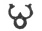
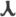
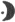
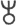
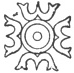
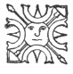

  
[Intangible Textual Heritage](../../index)  [Symbolism](../index) 
[Index](index)  [Previous](mosy16)  [Next](mosy18) 

------------------------------------------------------------------------

[Buy this Book at
Amazon.com](https://www.amazon.com/exec/obidos/ASIN/048641437X/internetsacredte)

------------------------------------------------------------------------

  
*The Migration of Symbols*, by Goblet d'Alviella, \[1894\], at
Intangible Textual Heritage

------------------------------------------------------------------------

#### III. The Transformations of the Trisula.

I have already referred to the importance of the Trident in the
symbolism of Hinduism where, under the name *trisula* (*tri* three, and
*sula* point, spear, or pale) it occurs amongst the most important
attributes of Siva. This emblem exhibits no peculiarity of form here; it
might as well figure in the hands of Hades, or of Poseidon. This is not
the case, however, with respect to the Buddhist *trisula* or, at least,
the symbol which bears this name amongst the Buddhists.

The *trisula* of the Buddhists, termed also *vardhamana*, "a crescent,"
may be described, in its

 

Fig. 142. The
Trisula.

simplest form, as an omicron surmounted by an *omega*.

It is, however, rarely met with under such a simple form. The upper arc
of the *omicron*, or rather of the disk, is nearly always flanked by two
small circles, or by two horizontal strokes which often assume the
appearance of two leaves or small wings (fig. 143 *et seq.*). The points
of the *omega* change into *fleurons;* the disk itself rests on a staff
or pedestal, and from its lower arc fall two spires similar to serpents’
tails, the ends of which are sometimes curved upwards ([fig.
143](#img_fig143)), and sometimes downwards ([fig. 154](#img_fig154)).

p. 238

At times the *trisula* appears to have only an ornamentive significance.
Thus we see it crowning balustrades and porticoes, adorning
sword-scabbards,

 

Fig. 143. Trisula of
Amaravati.  
*Journal of the Royal Asiatic Society*, vol. xviii. (new series), fig.
1.)

and forming necklace-pendants and ear-rings. [1](#fn_452) But in most cases it unquestionably
discharges the function of a symbol, and even of a religious symbol.
Engraved on numerous coins by the side of religious emblems and images,
it stands at the beginning and end of votive inscriptions in the caves
of Western India. [2](#fn_453) The sculptures

 

Fig. 144. Trisula on Blazing
Pillar.  
(Fergusson. *Tree and Serpent Worship*,
pl. lxxi.)

of the bas-reliefs exhibit it, in turn, on the staff of banners, on the
back of an elephant, on an altar where homage is paid to it, and,
lastly, on a pillar from which flames emerge (fig. 144). At

p. 239

\[paragraph continues\] Bharhut it occurs
above the throne of Buddha. At Amaravati it is one of the signs cut on
the sole of the Master's feet. [1](#fn_454)

The oldest representations of the *trisula* are found—in conjunction
with the principal symbols of Buddhism, the *swastika*, the *stupa*, the
Sacred Tree, and so forth—on the coins of Krananda, [2](#fn_455) a native sovereign contemporary with
Alexander or the earliest Seleucid kings.

 

Fig. 145. Coin of
Krananda.

Nevertheless the *trisula* was far from being solely used by the
Buddhists. In caves it is sometimes placed near symbols of the solar
worship, and on the coins of the Indo-Scythic princes it is not only
struck beside images of the Hindu god Siva but, what at first surprises
us, beside those of Greek divinities, such as Zeus; [3](#fn_456) it is, moreover, possible that it became
a mere monetary sign, as often happens with religious symbols used in
coinage.

Among the Jains, who have so many affinities

p. 240

with Buddhism, the twenty-fourth and last of the *Tirthankaras* or
legendary saints of the sect has the *vardhamana* as a symbol; this
personage even bears, according to Colebrook, the surname of
*Trisula*. [1](#fn_457)

It may be wondered, at first sight, that the innumerable texts left by
Buddhism give us no positive information with regard to the meaning and
origin of the *trisula*. Few symbols have given rise, in our own times,
to more varied explanations.

Some have seen therein the monogram of Buddha; [2](#fn_458) others the symbol of the dharma, the
Law, which sums up the doctrine of Buddhism; [3](#fn_459) others again a representation of the
*tri-ratna*, the threefold jewel formed by Buddha, his Law, and his
Church. [4](#fn_460) There are those who have
discovered in the *trisula* the juxtaposition of the dharma *chakra*,
the "Wheel of the Law" to the ancient letter  , *y*, which itself is said to
stand for the mystic formula *ye dharma*. [5](#fn_461) Some scholars think they recognize in it
the combination of five letters symbolizing respectively intelligence
(*ma*) and the four component elements of matter, air (*ya*), fire
(*ra*), water (*va*), and earth (*la*). [6](#fn_462)

Eugene Burnouf thought he found therein the *vardhamana kaya*, "the
Propitious One," one of the sixty-five signs which, according to
Buddhist

p. 241

tradition, adorn the impression of Buddha's foot. [1](#fn_463)

Finally, according to some writers, we must seek its origins amongst the
less abstract images of the naturalistic forms of worship which preceded
Buddhism.—M. Kern, laying stress on the actual meaning of *vardhamana*,
the present participle of a verb signifying "to grow or increase," makes
it the image of the "horned moon," and sees in the central protuberance
of the *trisula* the nose with which we ourselves sometimes adorn the
representation of the lunar crescent 
. [2](#fn_464) Edward Thomas
seeks therein "an ideal combination of the sun and moon;" the alteration
of the primitive form would, according to him, be due to a modification
in the forms of worship, or to the overthrowing of the sovereigns termed
Lunar by a Solar dynasty. [3](#fn_465)

Mr. Burgess recognizes therein an image of the Thunderbolt; [4](#fn_466) Sir George Birdwood, a phallic emblem,
or else the Tree of Life; [5](#fn_467) Mr.
Monier Williams, "the Two Feet of Vishnu, with a star or embossment in
the middle." [6](#fn_468)

Lastly, M. Beal takes it for the superposition of the Flame on the
Lotus-flower, and M. Senart, of the Trident on the Wheel. [7](#fn_469)

p. 242

Among all these more or less contradictory opinions the interpretation
of M. Senart is not only the simplest and most rational, but it is also
strictly confirmed by the evidence of the monuments. There are many
*trisulas* in which the upper part of the figure is separated from the
Disk, some again in which it assumes distinctly angular forms  , instead of the rounded shape
of the *omega*, ω; there are others, finally, in which it becomes beyond
doubt a Trident, as amongst the sculptures of Buddha Gaya and of
Boro-Budur. [1](#fn_470)

The Trident superposed upon the Disk is also met with upon the coins of
the anonymous prince

 

Fig. 146. Sculpture of
Buddha Gayâ.  
(*Numismatic Chronicle*, vol. xx. (new series), pl. ii., No. 37.)

known by his title of *Basileus Sôter Megas*, and on those of several
native kings. [2](#fn_471)

The only point on which I have some doubt is when M. Senart puts forward
the Trident as the original feature, and, so to speak, the primitive
nucleus of the Hindu *trisula*,—which would make it, at least in its
origin, an essentially Sivait symbol, destined to represent the flash of
the lightning.—As for myself, I should be more inclined to seek this
nucleus in the Disk, and, consequently, to connect the *trisula* with
the solar symbols.

p. 243

From the most remote times the worship of the sun was widely spread
throughout India, and, as nearly everywhere else, the sun was first of
all represented there by a Disk, as may be seen from the sculptures of
the ancient caves, and the ingots used for bartering before the
introduction of coins properly so-called. [1](#fn_472) At a later date the Disk became a Wheel,
and the Buddhists, who applied so many solar images and symbols to their
form of worship, made it the *Wheel of the Law*, "formed of a thousand
spokes darting out a thousand rays."

The secondary character of the *omega* (or Trident) in the *trisula*
plainly follows from certain figures brought into view by Edward Thomas
in

<table data-border="0">
<colgroup>
<col style="width: 50%" />
<col style="width: 50%" />
</colgroup>
<tbody>
<tr class="odd">
<td data-valign="top" width="327">
 

Fig. 147. Ancient Coin.
</td>
<td data-valign="top" width="327">
 

Fig. 148. Cave of Baja.
</td>
</tr>
<tr class="even">
<td colspan="2" data-valign="top" width="655">
 
</td>
</tr>
<tr class="odd">
<td colspan="2" data-valign="top" width="655">
(<em>Numismatic Chronicle</em>, vol. xx. (new series), pl. ii., figs. 39 and 40.)
</td>
</tr>
</tbody>
</table>

his valuable work on the solar symbols of India. These are circles drawn
between four *omegas*. One of these circles exhibits four arrows
radiating from the circle between the crescents.

These figures indicate clearly the function of the Trident in the
*trisula*. Doubtlessly, in the hands of Siva—as formerly in the hands of
Neptune, and, at a still earlier period, in those of the Assyrian god of
the air and the storm—the Trident must symbolize the flash of the
lightning. But may it not be questioned whether, considered apart, it
should

p. 244

not be held to be, in a wider sense, the image of a Three-tongued Flame,
and, consequently, when coupled with the Disk, an emblem of fire, or of
solar radiation?

Among the sculptures of Boro-Budur, in the island of Java, the Trident,
which in some religious scenes is exhibited above the Disk, or Rosette,
is replaced at times by a Three-pointed Flame. [1](#fn_473) Eug. Burnouf had already noticed, in the
coloured representations of the Buddhas of Nepaul, that the headdress of
the Master exhibits a ball terminating above in a kind of flame, and
that on many Singhalese statues this flame takes the shape of "a kind of
lyre or trident." [2](#fn_474) Finally,
according to Mr. Beal, the *trisula* personifies, amongst the Buddhists
of the north, the heaven of pure flame superposed upon the heaven of the
sun. [3](#fn_475)

The *trisula* is then certainly a Hindu symbol. It seems, however, to
have felt, at an early date, the influence of the Caduceus. Perhaps even
it was in order to approach the latter in appearance that the primitive
Trident of the Hindu symbol assumed the rounded forms of the *omega* and
placed itself in direct contact with the Disk.

Those who have some hesitation in admitting the possibility of
discovering in a complex symbol the traces of a double antecedent—as we
find in a child the characteristic features of both its parents—need
only cast a glance over the following picture whose contents I have
taken from the coinage and figured monuments of India.

I wish to call especial attention to the figures d and e. They resemble
one another so closely that writers commonly rank the former as a
*trisula* 

p. 245

when they find it on the coins of certain Indo-Scythic princes. Yet
there is no doubt but that it is directly connected with the Caduceus.
Moreover,

 

Fig. 149. Caducei and
Trisulas. [1](#fn_476)

Fergusson himself has written with respect to the *trisula:*—"It bears a
singular resemblance to the sign of the planet Mercury, or to the
Caduceus of the god who bears this name." [2](#fn_477)

It is also representations of serpents intertwined, closely allied to
the Caduceus, which supply us with the earliest type of the lower
appendages, in the shape of spires, observed in the *trisulas* of Sanchi
and Amaravati ([fig. 143](#img_fig143) and [154](#img_fig154)).

On the other hand, the most complex forms of the *trisula* exhibit an
unquestionable likeness to

p. 246

some types of the Winged Globe which have been observed in Asia Minor,
Mesopotamia and Persia.

In both figures the centre is occupied by a Disk which is sometimes
converted into the Wheel, or the Lotus-flower. Does not the upper part
of the *trisula*, which I have termed the *omega*, recall the horns of
the Mesopotamian emblem, if we only take into consideration the knob
between the horns caused by the upper arc of the disk ([fig.
150](#img_fig150));

 

Fig. 150. Cylinder of
Chalcedon.  
(Lajard. *Culte de Mithra*, pl. lii.,
fig. 2.)

or else the projection caused by the tuft of plumes which surmounts the
disk of certain Winged Globes ([fig. 151](#img_fig151))?

 

Fig. 151. Coin of the
Satraps of Tarsus.  
(Lajard. *Culte de Mithra*, pl.
lxiv.)

The shaft, frequently conical, on which some *trisulas* rest, takes the
place of the fan-shaped tail, and the spires traced on both sides of
this support correspond with the lines, ending in a loop, which descend
on either side of the tail in the ornithomorphic Disks of Western Asia.

In order to account for this likeness, I will venture on the hypothesis
that these forms of the *trisula* must have been subjected, during their
development, to the plastic influence of the ancient Egyptian symbol
which had come to India by way of Assyria and Persia.

p. 247

The time is past when, dazzled by the sudden discovery of Vedic
literature, and fascinated also by the verification of our relationship
to the Aryan races of Asia, we turned towards India to seek them the
universal source of symbols and dogmas, myths and gods. Since we caught
a glimpse of the great antiquity of the civilizations which had reached
their prime on the borders of the Euphrates and the Nile at a period
when the ancestors of the Aryans were still wandering over the
table-lands of Central Asia, we are far more inclined to locate in
Mesopotamia, or even in Egypt, the earliest artistic centres which shed
their light over the ancient world, from the Mediterranean to the Indian
Ocean.

On the other hand, India, up to the Mahometan conquest, did not live in
the isolated condition to which historians were long pleased to relegate
it. Sir George Birdwood goes, perhaps, a little too far when he asserts,
in a general manner, that nearly all the symbols of India are of
Mesopotamian origin. [1](#fn_478) But it is
none the less an established fact now, that the products of western art
and symbolism must have made their way to the valley of the Indus before
the appearance of the oldest stone monuments on which ancient India has
left us a vestige of its beliefs. [2](#fn_479)

Without taking into consideration the intercourse which is supposed to
have existed between the dwellers on the banks of the Indus and the most
ancient empires of the Euphrates and the Nile, and without laying stress
either on the factories which the Phœnicians are said to have
established in southern India, I will recall to mind that Darius I

p. 248

had annexed the valley of the Indus, and the actual province of the
Punjab, about the end of the seventh century B.C. [1](#fn_480) Such competent authorities as James
Fergusson and General Cunningham have shown that India borrowed its
earliest style of architecture from the Persians, [2](#fn_481) and in the north-east of the peninsula
there have been repeatedly found products of Persian art which date back
to Darius and his successors—especially cylinders and coins bearing the
Winged Circle. [3](#fn_482) It was in one of
these finds that one of the coins of Tarsus containing a Winged Circle
so nearly allied to the *trisula* was found ([fig. 151](#img_fig151)).

It seems to be now generally admitted that the Indian alphabets are of
Semitic origin. [4](#fn_483) Why then should
religious symbols not have followed the same paths as the symbols of
language and the creations of art?

In the centuries following the expedition of Alexander, it was Greek, or
rather Græco-Asiatic art which influenced the development of Indian
architecture and sculpture. Coins show us first of all sovereigns of
Greek origin, who Hellenize Bactria, the Cabul country, and the valley
of the Indus as far as the Ganges basin; then Scythic and Parthian
princes who maintain, until the second century of our era, the language
and traditions of this civilization imported from the West.

p. 249

\[paragraph continues\] For more than two
centuries the Greek Pantheon alone supplies images for the coins of
western India. At most a few Buddhist emblems occur here and there; the
*Bô* tree and the *stupa* under Agathocles, and the Wheel under
Menander. From the time of Gondophares the representation of Siva
alternates with that of Poseidon; yet the type of the two divinities
remains so similar that on some coins it is difficult to decide if it is
the Greek or the Hindu god. [1](#fn_484)

At the same time, however, there occurs in India a veritable invasion of
Iranian divinities. Mr. Percy Gardner and M. James Darmesteter, the
former through investigating the coins of the British Museum, and the
latter through the study of Persian traditions in the Hindu epic poem,
came simultaneously to the somewhat startling conclusion that western
India, after being Hellenised under the Indo-Bactrians, had been largely
Iranised under the Indo-Scythians. [2](#fn_485)
On the coins of the latter not only do Zeus, Pallas, Helios, Selene,
Poseidon, Herakles, and Serapis alternate with Mithras, Mao, and Atar,
as well as with Siva, Lukshmi, and even Buddha, but also the classic
forms of the Thunderbolt, the Caduceus and the Cornucopia occur side by
side with the Buddhist *trisula* and Wheel as well as with the Sivait
Trident and bull.

India has always been the favourite home of religious syncretism; but at
no period of its history did it open its portals to so many different
forms of worship—even under Akbar, that great Mogul who was willing to
combine in a single religion the beliefs of the Mahometans, the Hindus,
the Parsees, the Jews and the Christians.

p. 250

How could symbols have escaped an impulse which carried away the gods
themselves? At any rate Buddhism would have been unfaithful to the
spirit of its whole symbolism if, when acquainted with the emblems by
which neighbouring religions represented their great solar divinity, or
even their supreme god, it had not sought to appropriate them, either by
adopting them as they stood with a new signification, or oftener by
assimilating them, through slight linear alterations, with one or other
of its favourite symbols.

It is, as we have seen, among the sculptures of Amaravati that the
*trisula* assumes the form most closely allied to the ornithomorphic
Disk. Now, nowhere else has the general influence of Græco-Asiatic art
over native architecture and sculpture been verified in a more obvious
manner. Already in the year 645 of our era the Chinese pilgrim Hiuen
Thsang likened the sanctuary of Amaravati to the palaces of the Tahia,
*i.e.*, the inhabitants of Bactria. [1](#fn_486) The same fact has been recorded in our
own times by James Fergusson: "There is," he writes, "so much of what is
Greek, or rather Bactrian, in the architectural details of Amaravati
that this monument must belong to a period nearer to the Christian era
than the character of the inscriptions would lead one to suppose." And
the eminent archæologist adds that the study of these sculptures seems
to him destined to elucidate especially the interesting question of the
intercourse, and even of the exchange of thought, between east and
west. [2](#fn_487)

The Winged Circle and the Caduceus are not,

p. 251

moreover, the only factors which have reacted upon the genesis, or at
least the development, of the *trisula*.

In an interesting paper, read in 1886 before the *Royal Asiatic
Society*, Mr. Robert Sewell was perhaps the first to seek to the west of
the Indus, and even in Egypt, the origins of the *trisula*, which he
connects with the Scarab. The birthplace of a symbol is one thing; the
origin of the figures which may have influenced its development is
something very different. With this reservation, however, I must admit
that there is nothing farfetched in this parallel, especially if,
following

 

Fig. 152.  
(*Journal of the Royal Asiatic Society*, vol. xviii. (new series), fig.
13.)

\[paragraph continues\] Mr. Sewell's
example, we interpose between the two figures the type of the Scarab
with raised wings and bent legs which surmounts certain Assyrian
columns.

But in Egypt itself, as M. Perrot shows, the flying Scarab borrowed the
outlines of the Winged Globe, [1](#fn_488) by
which fact, according to our theory, its resemblance to the *trisula* is
sufficiently explained. It must be observed, moreover, that several of

p. 252

these Assyrian Scarabs hold between their fore-legs the Disk adorned
with the *uræi*. [1](#fn_489)

It may be noticed, by the way, that among the Egyptians the Trident
already occurs in conjunction with the Winged Globe, at least in the
texts. The inscription of Edfu, which relates how Horus was transformed
into a Winged Globe in order to fight the armies of Set, gives him as a
weapon a three-pointed spear. [2](#fn_490)

On a number of monuments the Disk of the *trisula* changes into a
Rosette, imitating an expanded lotus-blossom, as on the gate of Sanchi.
The same monument further exhibits Lotuses at the ends of two stalks
which spring from the basis of the central *fleuron;* finally, the two
extreme points of the *omega* take a shape which suggests the calyx of a
flower. We have already shown the solar character of the Lotus in the
symbolism of the Hindus. [3](#fn_491) In the
*trisula* the transformation of the Disk into a Lotus is therefore the
equivalent, the plastic rendering of the transformation which, among the
Buddhists, substituted the *padma mani*, or "Jewel of the Lotus," for
the *sûra mani*, or "Jewel of the Sun"; whence the well-known
formula:—*Om! mani padme*, "Oh! the Jewel in the Lotus!" [4](#fn_492)

Elsewhere the *trisula* seems to reproduce the Sivait emblem of the
*lingam* between two serpents standing erect. This figure, which when
superposed upon the Disk has perhaps a doubly phallic

p. 253

import, certainly seems quite foreign to the original doctrine of
Buddhism. Yet here again the Buddhists have shown themselves to be
masters in the art of adapting the symbols of other religions. M.
Gustave Lebon, in his *Voyage au Népaul*, quotes a characteristic
instance of the fanciful interpretations with the help of which Buddhism
brings about or justifies these adaptations. "The *linga*," he writes,
"is likewise adopted by the Buddhists of Nepaul as an emblem of the
Lotus in which Adi-Buddha manifested himself, in the shape of a flame,
at the beginning of the world." [1](#fn_493)

It ought to be mentioned that, in the opinion of some writers, such as
Ch. Lenormant and Baron de Witte, the Caduceus among the Greeks
symbolized the combination of the two sexes in the

 

Fig. 153. Caduceus on an
Amphora. [2](#fn_494)  
(From the *Elite des monuments céramographiques*, vol. iii., pl.
xci.)

same individual, hermaphrodism in fact, [3](#fn_495)—and in the valuable publication of those
two archæologists upon the *Elite des monuments céramographiques de la
Grèce* we find a variety of the Caduceus where a vertical projection,
similar to the representation of the phallus, springs from the centre of
the Crescent, which in this case is somewhat separated from the Disk.

p. 254

On the coins of the Sunga dynasty the *lingam* placed between the
serpents becomes the headdress of Buddha; the Disk stands for the
Master's head, and the lateral appendages of the *trisula* are
represented by two projections which stretch out horizontally on either
side of this head. [1](#fn_496)

The *trisula* is thus seen to be converted into an anthropoid figure. A
transformation of the same kind, but still more accentuated, is
observable in the three famous idols of Puri which General Cunningham
long ago proved to be three ancient *trisulas* (figs. [154](#img_fig154)
and [155](#img_fig155)). [2](#fn_497)

 

Fig. 154. Trisula of
Sanchi.  
(*Musée des moulages*, Brussels.)

These emblems were doubtlessly a great object of popular veneration at
the period when Puri was a Buddhist sanctuary. When Brahminism came to
establish itself there it contented itself with changing them, by means
of a few slight alterations, into the image of Vishnu, or rather
Jaganath, and his brother and sister. In thus appropriating the old
solar symbol, still discernible in

p. 255

spite of its successive alterations, Vishnu, moreover, did nothing but
recover what belonged to him, since he is, in Hinduism, pre-eminently
the solar divinity.

Finally, the *trisula*, whose plasticity is only equalled by its power
of absorption, borrows forms from the vegetable kingdom with the same
freedom as from the human physiognomy. M. Rousselet points out the
resemblance of the mystic symbol of the Buddhists to the *kalpavriksh*
or Tree of Knowledge which the Jainas represented

   
FIG. 155. IDOL OF JAGANNATH. (ROUSSELET. L’Inde des Rajahs, p. 517.)

Fig. 155. Idol Of
Jagannath.  
(Rousselet. L’Inde des Rajahs, p.
517.)

by a stem with three branches on the mitre of the *Tîrthankaras*
sculptured on the caves of Gwalior. [1](#fn_498) A similar combination is observable on
coins of the Sunga dynasty, where the upper part of the *trisula*,
forming the head-dress of Buddha, is transformed into a regular crown of
branches. [2](#fn_499) On other monuments the
stem on which the *trisula* rests becomes the trunk of a tree whose
branches are laden with conventional fruits and interlaced with
necklaces of jewels. [3](#fn_500)

This vegetalization of the *trisula*, or, properly

p. 256

speaking, of the Trident which surmounts it, is nowhere more evident
than among the sculptures of Boro-Budur, where it literally merges into
the *Bô* tree through a series of gradual transformations. "The shape of
the points of the *trisula*," M. Ch. Leemans writes in his able
commentary upon the *Atlas* published under the patronage of the Dutch
government, "may sometimes

 

Fig. 156. Trident of
Siva.  
(Moor. *Hindu Pantheon*, pl.
xlii.)

have been derived from that of a flame, or else from the calyx of a
flower, or again from a symbolic tree." [1](#fn_501) The same observation applies

 

Fig. 157. Egyptian
Lotus.

moreover to the Trident of Siva, which at times exhibits the forms of a
lotus calyx depicted in the Egyptian manner ([fig. 157](#img_fig157)).

Perhaps other transformations of the *trisula* might still be found at
Boro-Budur. I will restrict myself to pointing out a detail which is not
without interest: the same Disk which, when transformed into a most
complicated ornament, is.

p. 257

sometimes crowned by a Trident, is also met with between two
serpents—which brings us back to the origin of the Winged Circle—the
Globe of Egypt with the *uræi*.

 

Fig. 158. Bas-Reliefs of
Boro-Budur. [1](#fn_502)  
(*Boro-Boedoer*, Atlas, pl. cccxvi. and ccclxx.)

Moreover this ornament, between which and certain forms of the *trisula*
the transition is easily traced, commonly surmounts the entrance to the
pagodas depicted in the bas-reliefs—in exactly the same manner as the
Winged Globe adorns the lintel of the temples in Egypt and Phœnicia.

 

Fig. 159. Bas-Reliefs of
Boro-Budur.  
(*Boro-Boedoer*, Atlas, pl. cclxxxiii., No. 105.)

It is proper to point out that in the West there are some figures which
exhibit an odd resemblance to the *trisula*. Such is, in the first
place, the Cyprian image to which I have drawn attention ([fig.
114](mosy15.htm#img_fig114)), as presenting to our view a combination

p. 258

of the Sacred Tree and the Winged Globe. The upper volutes with the
flowered projection bisecting the centre of the arc recall the three
points of the *trisula* with their central *fleuron*. The pair of
volutes whose lower parts are bent downward on both sides of the base,
suggest the ophidian appendages which, in the Buddhist symbol, descend
on either side of the pedestal. Lastly in both cases, the middle part of
the figures shows two leaves which by their position, as well as by
their shape, suggest two small wings.

Mr. William Simpson, an English artist, well known on account of his
archæological work in connection with the monuments of India, has

 

Fig. 160. Thunderbolt of
Elis.

pointed out the resemblance of the *trisula* to some representations of
the Thunderbolt graven on coins of Elis which date from the fifth
century B.C. [1](#fn_503)

 

Fig. 161. Sculpture of
Boro-Budur.

This Thunderbolt especially resembles a somewhat enigmatical figure
sculptured among the bas-reliefs of Boro-Budur, where, to all
appearance, it plays the part of a *trisula*. [2](#fn_504)

On the whole, there would be nothing remarkable

p. 259

in these similarities, since the Thunderbolt and the *trisula*, as we
have just seen, are both a development of the Trident.

What is more singular is to find a kind of *trisula* engraved on the
flank of a lamb which adorns the serpent-shaped scroll on a pastoral
staff dating from the Middle Ages. [1](#fn_505)

Have we here an exchange or a mere coincidence? This is a question which
I will not venture to decide, although nothing is wanting in the
Christian symbol to make of it a real *trisula*, neither the Disk, nor
the central point imitating a *fleur-de-lis*, nor the rounded projection
of the two lateral points.

 

After all, if we have been able to find the antecedents, and, so to
speak, the factors of the *trisula*, and even its probable signification
in the creeds which preceded Buddhism, we have not learned much as to
the meaning of this symbol in the religion which made most use of it.
The fact is, that here the plastic figures cannot make up for the
silence of the written monuments. So long as symbols remain images and
are applicable to concrete objects, or physical phenomena, it is not
impossible to discover the meaning which they in all probability bore.
But when, having entered upon what may be called their derived or
secondary phase, they become signs and express abstract ideas—which is
nearly always the case in Buddhism—the field of interpretation becomes,
so to speak, unlimited for critics, as sometimes also for the faithful.

The proper signification of the *trisula* remains then in the
suppositive stage, although the purpose of its transformations does not
always escape us. The issue of some hitherto unpublished text

p. 260

can alone reveal to us the general and authentic meaning of this symbol,
before which millions of our fellow-creatures have bowed down, but whose
name we do not even know with any degree of certainty.

My purpose, moreover, was less to solve a problem whose solution has so
far escaped the most competent minds, than to trace the transformations
of the *trisula* in the course of its plastic development, and to show
once again with what ease symbols of most dissimilar origin merge into
one another as soon as, in their form, or in their meaning, there occur
points of contact which are sufficient to facilitate this transition.

------------------------------------------------------------------------

### Footnotes

[238:1](mosy17.htm#fr_452) A. Cunningham. *The Stupa of Barhut*. London,
1879, pl. xlix., fig. 10; pl. 1., figs. 5 and 6.

[238:2](mosy17.htm#fr_453) Eug. Burnouf. *Le Lotus de la Bonne Loi*, p.
626.

[239:1](mosy17.htm#fr_454) A. Cunningham. *The Stupa of Bharhut*, and
J. Fergusson. *Tree and Serpent Worship*,
1st vol., with plates. London, 1868, *passim.*—*Cf*. engraving of our
[frontispiece](mosy00.htm#img_pl01).

[239:2](mosy17.htm#fr_455) Edward Thomas has
maintained that Krananda was identical with the Xandrames of Diodorus
(*Journal of the Royal Asiatic Society*. London, vol. i., new series, p.
477, *On the identity of Xandrames and Krananda*), which would make this
coin earlier than the year 317 B.C.—Wilson, on his side, makes Xandrames
to be Chandragupta, the ancestor of Asoka (Introduction to the
translation of the Mûdrarakshasa. *The Theatre of the Hindus*, vol. ii.,
131, 132).

[239:3](mosy17.htm#fr_456) Percy Gardner. *Coins in the British Museum*.
*Greek and Scythic Kings of India and Bactria*, pp. 106 and 107.

[240:1](mosy17.htm#fr_457) Colebrook. *Observations on the Jainas*, in the
*Asiatic Researches*. London, 1809, vol. vii., p. 306.

[240:2](mosy17.htm#fr_458) J. Fergusson. *Description of the Amaravati
Tope*, in the *Journal of the Royal Asiatic Society*. London (vol. iii.
of new series, p. 162).

[240:3](mosy17.htm#fr_459) Edw. Thomas, in vol. iv. (new series) of the
*Numismatic Chronicle*, p. 282, foot-note.

[240:4](mosy17.htm#fr_460) A. Cunningham. *The Stupa of Barhut*, p. III.

[240:5](mosy17.htm#fr_461) F. Pincott. *The Tri-Ratna*, in the *Journal of
the Royal Asiatic Society*. London, vol. xix. (new series), p. 242.

[240:6](mosy17.htm#fr_462) A. Cunningham. *The Topes of Central India*, in
the *Journal of the Royal Asiatic Society*. London (vol. xiii., 1st
series), p. 114.

[241:1](mosy17.htm#fr_463) Eug. Burnouf. *Le Lotus de la Bonne Loi*.
Paris, 1852, p. 627.

[241:2](mosy17.htm#fr_464) Kern. *Der Buddhismus*, German translation by
Jacobi. Leipzig, 1884, vol. ii., pp. 241–242.

[241:3](mosy17.htm#fr_465) Edw. Thomas. *On the identity of Xandrames and
Krananda*, in the *Journal of the Royal Asiatic Society*. London, vol.
i. (new series), pp. 483–484.

[241:4](mosy17.htm#fr_466) Burgess. *Archæological Report on Elura*.

[241:5](mosy17.htm#fr_467) Sir George Birdwood, in the *Journal of the
Royal Asiatic Society*. London, vol. xviii. (new series), p. 407.

[241:6](mosy17.htm#fr_468) Quoted by Mr. Greg.
*Archæologia*. London, 1885, vol. xlviii., p. 320.

[241:7](mosy17.htm#fr_469) S. Beal. *A Catena of Buddhist Scriptures from
the East*. London, 1871, p. 11.—E.
Senart, *Essai sur la légende du Bouddha* in vol. vi. of the
*Journal Asiatique*. Paris, 1875, p. 184.

[242:1](mosy17.htm#fr_470) *Boro-Boedoer op het
eiland Java*. Leyden, 1873, Atlas, pl. cccxvi.

[242:2](mosy17.htm#fr_471) Percy Gardner. *Op. cit.*, pl. xxiv., figs.
1–6. See also Senart. *Journal
Asiatique*. Paris, 1875, vol. vi., p. 185.

[243:1](mosy17.htm#fr_472) Edward Thomas. *The earliest Indian Coinage*,
in vol. iv. (new series) of the *Numismatic Chronicle*, p. 271. See also
his article in vol. xx. of same series, *The Indian Swastika*.

[244:1](mosy17.htm#fr_473) *Boro-Boudour op het
eiland Java*. Atlas, pl. cclxxx., fig. 100.

[244:2](mosy17.htm#fr_474) E. Burnouf. *Le Lotus de la Bonne Loi*, p. 539

[244:3](mosy17.htm#fr_475) S. Beal. *A Catena of Buddhist Scriptures from
the Chinese*, p. 11.

[245:1](mosy17.htm#fr_476) *a*, Coin of
Sophytes (Percy Gardner, pl. i., fig. 3).

*b*, Ancient ingot (*Numismatic Chronicle*, vol. iv., new series, pl.
xi., fig. 28).

*c*, Old coin (*Numismatic Chronicle*, vol. iv., new series, pl. xi.,
fig. 16).

*d*, Coin of Azes (Percy Gardner, pl.
XX., fig. 2).

*e*, Coin of Krananda (*Journal of the Royal Asiatic Society*, vol. i.,
new series, p. 475).

*f*, On a sculptured altar at Sanchi (Fergusson. *Tree and Serpent Worship*, Atlas,
pl. xxv., fig. 3).

*g*, On the pole of a standard at Sanchi (Cunningham. *The Bhilsa Topes*, pl. xxxii.,
fig. 8).

*h*, On the pole of a standard of Sanchi (Fergusson. *Tree and Serpent Worship*, pl.
xxxviii., fig. 1).

*i*, On the handle of an ivory instrument (Cunningham. *Archæological Survey of India*,
vol. x., pl. ii., fig. 5).

[245:2](mosy17.htm#fr_477) *Tree and Serpent
Worship*, p. 116.

[247:1](mosy17.htm#fr_478) *Journal of the
Royal Asiatic Society*. London, 1886, vol. xviii. (new series), p. 407.

[247:2](mosy17.htm#fr_479) G. Rawlinson. *The Five Great Monarchies* of
the East. London, 1862, vol. i., p. 101.—A. H.
Sayce. *Religion of the ancient Babylonians*. London, 1887, pp.
137–138.

[248:1](mosy17.htm#fr_480) G. Maspero. *Histoire ancienne des peuples de
l’Orient*. Paris, 1886, p. 618.

[248:2](mosy17.htm#fr_481) J. Fergusson. *Tree and Serpent Worship*, p.
94.—A. Cunningham. *Archæological Survey
of India*, vol. v., Append. A.

[248:3](mosy17.htm#fr_482) *Relics of ancient
Persia*, in the *Proceedings of the Asiatic Society of Bengal*.
Calcutta, 1881, 1st part, p. 151; 1883, 1st part, pp. 64 and 261.

[248:4](mosy17.htm#fr_483) See upon this
question the summing up of Mr. Cust in the *Journal of the Royal Asiatic
Society*. London, 1884, vol. xvi. (new series), p. 325; also an article
by M. Halévy in the *Journal Asiatique*. Paris, 1885, vol. ii.

[249:1](mosy17.htm#fr_484) Percy Gardner. *Coins of Greek and Scythic
Kings in India*, p. lviii.

[249:2](mosy17.htm#fr_485) Percy Gardner. *Id*., § iv.—J. Darmesteter, in the *Journal Asiatique*.
Paris, July-August, 1887.

[250:1](mosy17.htm#fr_486) For the
identification of the Tahia with the Bactrians, see Percy Gardner. *Op. cit.*, p. xxxi.

[250:2](mosy17.htm#fr_487) *Description of the
Amaravati Tope*, in vol. iii. (new series) of the *Journal of the Royal
Asiatic Society*. London.—The gates of Sanchi seem to date from the
first years of our era although the tope itself is older by several
centuries (Rousselet, *L’Inde des
Rajahs*, p. 513).

[251:1](mosy17.htm#fr_488) See Perrot et Chipiez. *Histoire de l’Art dans l’antiquité*,
vol. i., p. 811.

[252:1](mosy17.htm#fr_489) See Perrot et Chipiez. *Histoire de l’Art dans l’antiquité*,
vol. ii., p. 399.

[252:2](mosy17.htm#fr_490) H. BRUGSCH. *Die
Sage von der geflügelten Sonnenscheibe, in the Abhandlungen der
königlichen Gesellschaft der Wissenschaften zu Göttingen*, vol. xiv.
(1868–1869), p. 201.

[252:3](mosy17.htm#fr_491) S. BEAL. *A Catena
of Buddhist Scriptures*, p. 11.

[252:4](mosy17.htm#fr_492) It must be observed,
however, that the Disk is already found closely associated with the
Lotus-flower in the symbolism of Asia Minor. (See the Histoire de *l’Art
dans l’antiquité*, by MM. Perrot and Chipiez, vol. iii., fig. 509.)

[253:1](mosy17.htm#fr_493) In the Tour du Monde
for 1886 (vol. li., p. 266)—At Bôrô-Boudour the Sivait *linga* has
become a representation of the dâgoba (C.
Leemans, *Boro-Boedoer*, p. 452).

[253:2](mosy17.htm#fr_494) *Cf*. the form of
the *trisula* on the pillar of the sun at Buddha Gaya (our illustration,
[fig. 146](#img_fig146)).

[253:3](mosy17.htm#fr_495) *Elite des monuments
céramographiques de la Grèce*. Paris, 1868, vol. iii., p. 197.

[254:1](mosy17.htm#fr_496) A. Rivett Carnac. Coins of the Sunga or Mitra
dynasty, in the Proceedings of the Asiatic Society of Bengal, vol.
xliv., 1st part, pl. vii. and viii.

[254:2](mosy17.htm#fr_497) The Topes of Central
India, in the *Journal of the Royal Asiatic Society*. London (vol. iii.
of 1st series). General Cunningham adds that these rude figures are
likewise used in native calendars to represent Vishnu in his *avatar* of
Buddha.

[255:1](mosy17.htm#fr_498) Rousselet. *L’Inde des Rajahs*, p. 370.

[255:2](mosy17.htm#fr_499) Rivett Carnac. *Loc. cit.*

[255:3](mosy17.htm#fr_500) F. Pincott. *The Tri-Ratna*, vol. xix. (new
series) of the *Journal of the Royal Asiatic Society*. London, p. 243.

[256:1](mosy17.htm#fr_501) *Boro-Boedoer*, p.
455 of commentary.

[257:1](mosy17.htm#fr_502) See also same Atlas,
pl. ccxxxvi., 11; cclxxxviii., 114; and especially ccxlviii., 36, where
this subject rests on the apex of a triangle which corresponds with the
pennated tail of the Mesopotamian globes.

[258:1](mosy17.htm#fr_503) *The Trisula Symbol*
in the *Journal of the Roy. As. Soc.* for 1890, vol. xxii. (new series),
p. 306.

[258:2](mosy17.htm#fr_504) *Boro-Boedoer*, vol.
iii., pl. ccxlvi., fig. 35.

[259:1](mosy17.htm#fr_505) *Cf*. CAHIER et
MARTIN. *Mélanges d’archéologie*, vol. iv. fig. 58.

------------------------------------------------------------------------

[Next: Conclusion](mosy18)
