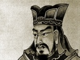

  
[Intangible Textual Heritage](../../index)  [Taoism](../index.md) 
[Confucianism](../../cfu/index)  [Index](index)  [Previous](aow05.md) 
[Next](aow07.md) 

------------------------------------------------------------------------

[Buy this Book at
Amazon.com](https://www.amazon.com/exec/obidos/ASIN/1934255122/internetsacredte.md)

------------------------------------------------------------------------

  
*The Art of War*, by Lionel Giles, \[1910\], at Intangible Textual
Heritage

------------------------------------------------------------------------

#### Appreciations of Sun Tzŭ.

Sun Tzŭ has exercised a potent fascination over the minds of some of
China s greatest men. Among the famous generals who are known to have
studied his pages with enthusiasm may be mentioned \# Han Hsin (*d*.
B.C. 196), [2](#fn_115.md) \# Fêng I (*d*. A.D.
34), [3](#fn_116) \# Lü Mêng (*d*. 219.md), [4](#fn_117) and \# Yo Fei (1103–1141.md). [5](#fn_118.md) The opinion of Ts‘ao Kung, who disputes
with Han Hsin the highest place in Chinese military annals, has already
been recorded. [6](#fn_119.md) Still more
remarkable, in one way, is the testimony of purely literary men, such as
\# Su Hsün (the father of Su Tung-p‘o), who wrote several essays on
military topics, all of which owe their chief inspiration to Sun Tzŭ.
The following short passage by him is preserved in the *Yü Hai:* [7](#fn_120.md)—

p. xliii

Sun Wu's saying, that in war one cannot make certain of
conquering, [1](#fn_121.md) is very different
indeed from what other books tell us. [2](#fn_122.md) Wu Ch‘i was a man of the same stamp as
Sun Wu: they both wrote books on war, and they are linked together in
popular speech as "Sun and Wu." But Wu Ch‘i's remarks on war are less
weighty, his rules are rougher and more crudely stated, and there is not
the same unity of plan as in Sun Tzŭ's work, where the style is terse,
but the meaning fully brought out. [3](#fn_123.md)

The \#, ch. 17, contains the following extract from the \# "Impartial
Judgments in the Garden of Literature" by \# Chêng Hou:—

Sun Tzŭ's 13 chapters are not only the staple and base of all military
men's training, but also compel the most careful attention of scholars
and men of letters. His sayings are terse yet elegant, simple yet
profound, perspicuous and eminently practical. Such works as the *Lun
Yü*, the *I Ching* and the great Commentary, [4](#fn_124.md) as well as the writings of Mencius, Hsün
K‘uang and Yang Chu, all fall below the level of Sun Tzŭ. [5](#fn_125.md)

Chu Hsi, commenting on this, fully admits the first part of the
criticism, although he dislikes the audacious comparison with the
venerated classical works. Language of this sort, he says, "encourages a
ruler's bent towards unrelenting warfare and reckless militarism." [6](#fn_126.md)

------------------------------------------------------------------------

### Footnotes

[xlii:2](aow06.htm#fr_115.md) *See* [p.
144](aow19.htm#page_144.md).

[xlii:3](aow06.htm#fr_116.md) *Hou Han Shu*, ch.
17 *ad init*.

[xlii:4](aow06.htm#fr_117.md) *San Kuo Chih*, ch.
54, f. 10 *v*° (commentary).

[xlii:5](aow06.htm#fr_118.md) *Sung Shih*, ch. 365
*ad init*.

[xlii:6](aow06.htm#fr_119.md) The few Europeans
who have yet had an opportunity of acquainting themselves with Sun Tzŭ
are not behindhand in their praise. In this connection, I may perhaps be
excused for quoting from a letter from Lord Roberts, to whom the sheets
of the present work were submitted previous to publication: "Many of Sun
Wu's maxims are perfectly applicable to the present day, and no. 11 on
page 77 is one that the people of this country would do well to take to
heart."

[xlii:7](aow06.htm#fr_120.md) Ch. 540, f. 13 *r*°.

[xliii:1](aow06.htm#fr_121.md) *See* IV. § 3.

[xliii:2](aow06.htm#fr_122.md) The allusion may be
to Mencius VI. 2. ix. 2: \#.

[xliii:3](aow06.htm#fr_123.md) \#.

[xliii:4](aow06.htm#fr_124.md) The *Tso Chuan*.

[xliii:5](aow06.htm#fr_125.md) \#.

[xliii:6](aow06.htm#fr_126.md) \#.

------------------------------------------------------------------------

[Next: Apologies for War](aow07.md)
