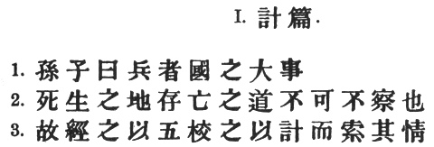
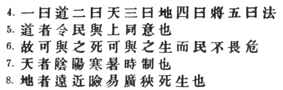
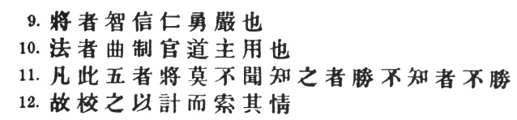
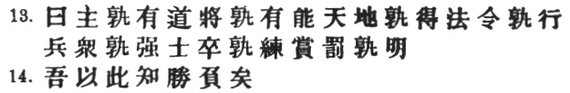
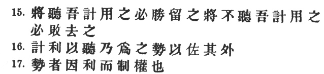
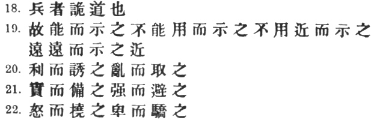
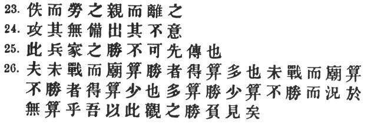

  
[Intangible Textual Heritage](../../index)  [Taoism](../index.md) 
[Confucianism](../../cfu/index)  [Index](index)  [Previous](aow08.md) 
[Next](aow10.md) 

------------------------------------------------------------------------

[Buy this Book at
Amazon.com](https://www.amazon.com/exec/obidos/ASIN/1934255122/internetsacredte.md)

------------------------------------------------------------------------

  
*The Art of War*, by Lionel Giles, \[1910\], at Intangible Textual
Heritage

------------------------------------------------------------------------

p. 1

 

### I. LAYING PLANS [1](#fn_167.md).

1\. Sun Tzŭ said: The art of war is of vital importance to the State.

2\. It is a matter of life and death, a road either to safety or to
ruin. Hence it is a subject of inquiry which can on no account be
neglected.

3\. The art of war, then, is governed by five constant factors, to be
taken into account in one's deliberations, when seeking to determine the
conditions obtaining in the field. [2](#fn_168.md)

p. 2

 

4\. These are: (1) The Moral Law; (2) Heaven; (3) Earth; (4) The
Commander; (5) Method and discipline. [1](#fn_169.md)

5, 6. *The Moral Law* causes the people to be in complete accord with
their ruler, so that they will follow him regardless of their lives,
undismayed by any danger. [2](#fn_170.md)

7\. *Heaven* signifies night and day, cold and heat, times and
seasons. [3](#fn_171.md)

8\. *Earth* comprises distances, great and small; danger and security;
open ground and narrow passes; the chances of life and death. [4](#fn_172.md)

p. 3

 

9\. *The Commander* stands for the virtues of wisdom, sincerity,
benevolence, courage and strictness. [1](#fn_173.md)

10\. By *Method and discipline* are to be understood the marshalling of
the army in its proper subdivisions, the gradations of rank among the
officers, the maintenance of roads by which supplies may reach the army,
and the control of military expenditure. [2](#fn_174.md)

11\. These five heads should be familiar to every general: he who knows
them will be victorious; he who knows them not will fail.

12\. Therefore, in your deliberations, when seeking to determine the
military conditions, let them be made the basis of a comparison, in this
wise:— [3](#fn_175.md)

p. 4

 

13\. (1) Which of the two sovereigns is imbued with the Moral law? [1](#fn_176.md)

\(2\) Which of the two generals has most ability?

\(3\) With whom lie the advantages derived from Heaven and Earth? [2](#fn_177.md)

\(4\) On which side is discipline most rigorously enforced? [3](#fn_178.md)

\(5\) Which army is the stronger? [4](#fn_179.md)

\(6\) On which side are officers and men more highly trained? [5](#fn_180.md)

\(7\) In which army is there the greater constancy both in reward and
punishment? [6](#fn_181.md)

14\. By means of these seven considerations I can forecast victory or
defeat.

p. 5

 

15\. The general that hearkens to my counsel and acts upon it, will
conquer:—let such a one be retained in command! The general that
hearkens not to my counsel nor acts upon it, will suffer defeat:—let
such a one be dismissed! [1](#fn_182.md)

16\. While heeding the profit of my counsel, avail yourself also of any
helpful circumstances over and beyond the ordinary rules. [2](#fn_183.md)

17\. According as circumstances are favourable, one should modify one's
plans. [3](#fn_184.md)

p. 6

 

18\. All warfare is based on deception. [1](#fn_186.md)

19\. Hence, when able to attack, we must seem unable; when using our
forces, we must seem inactive; when we are near, we must make the enemy
believe we are far away; when far away, we must make him believe we are
near.

20\. Hold out baits to entice the enemy. Feign disorder, and crush
him. [2](#fn_187.md)

21\. If he is secure at all points, be prepared for him. If he is in
superior strength, evade him. [3](#fn_188.md)

22\. If your opponent is of choleric temper, seek to irritate him.
Pretend to be weak, that he may grow arrogant. [4](#fn_189.md)

p. 7

 

23\. If he is taking his ease, give him no rest. [1](#fn_190.md)

If his forces are united, separate them. [2](#fn_191.md)

24\. Attack him where he is unprepared, appear where you are not
expected.

25\. These military devices, leading to victory, must not be divulged
beforehand. [3](#fn_192.md)

26\. Now the general who wins a battle makes many calculations in his
temple ere the battle is fought. [4](#fn_193.md)

p. 8

\[paragraph continues\] The general who
loses a battle makes but few calculations beforehand. Thus do many
calculations lead to victory, and few calculations to defeat: how much
more no calculation at all! It is by attention to this point that I can
foresee who is likely to win or lose.

------------------------------------------------------------------------

### Footnotes

[1:1](aow09.htm#fr_168.md) This is the only
possible meaning of \#, which M. Amiot and Capt. Calthrop wrongly
translate "Fondements de l’art militaire" and "First principles"
respectively. Ts‘ao Kung says it refers to the deliberations in the
temple selected by the general for his temporary use, or as we should
say, in his tent. See § 26.

[1:2](aow09.htm#fr_169.md) The old text of the
*T‘ung Tien* has \#, etc. Later editors have inserted \# after \#, and
\# before \#. The former correction is perhaps superfluous, but the
latter seems necessary in order to make sense, and is supported by the
accepted reading in § 12, where the same words recur. I am inclined to
think, however, that the whole sentence from \# to \# is an
interpolation and has no business here at all. If it be retained, Wang
Hsi must be right in saying that \# denotes the "seven considerations"
in § 13. \# are the circumstances or conditions likely to bring about
victory or defeat. The antecedent of the first \# is \#; of the second,
\#. \# p. 3 contains the idea of "comparison
with the enemy," which cannot well be brought out here, but will appear
in § 12. Altogether, difficult though it is, the passage is not so
hopelessly corrupt as to justify Capt. Calthrop in burking it entirely.

[2:1](aow09.htm#fr_170.md) It appears from what
follows that Sun Tzŭ means by \# a principle of harmony. not unlike the
Tao of Lao Tzŭ in its moral aspect. One might be tempted to render it by
"morale," were it not considered as an attribute of the ruler in § 13.

[2:2](aow09.htm#fr_171.md) The original text omits
\#, inserts an \# after each \#, and omits \# after \#. Capt. Calthrop
translates: "If the ruling authority be upright, the people are
united"—a very pretty sentiment, but wholly out of place in what
purports to be a translation of Sun Tzŭ.

[2:3](aow09.htm#fr_172.md) The commentators, I
think, make an unnecessary mystery of \#. Thus Mêng Shih defines the
words as \# "the hard and the soft, waxing and waning," which does not
help us much. Wang Hsi, however, may be right in saying that what is
meant is \# "the general economy of Heaven," including the five
elements, the four seasons, wind and clouds, and other phenomena.

[2:4](aow09.htm#fr_173.md) \#. (omitted by Capt.
Calthrop) may have been included here because the safety of an army
depends largely on its quickness to turn these geographical features to
account.

[3:1](aow09.htm#fr_174.md) The five cardinal
virtues of the Chinese are (1) \# humanity or benevolence; (2) \#
uprightness of mind; (3) \# self-respect, self-control, or "proper
feeling;" (4) \# wisdom; (5) \# sincerity or good faith. Here \# and \#
are put before \#, and the two military virtues of "courage" and
"strictness" substituted for \# and \#.

[3:2](aow09.htm#fr_175.md) The Chinese of this
sentence is so concise as to be practically unintelligible without
commentary. I have followed the interpretation of Ts‘ao Kung, who joins
\# and again \#. Others take each of the six predicates separately. \#
has the somewhat uncommon sense of "cohort" or division of an army.
Capt. Calthrop translates: "Partition and ordering of troops," which
only covers \#.

[3:3](aow09.htm#fr_176.md) The *Yü Lan* has an
interpolated \# before \#. It is obvious, however, that the \# just
enumerated cannot be described as \#. Capt. Calthrop, forced to give
some rendering of the words which he had omitted in § 3, shows himself
decidedly hazy: "Further, with regard to these and the following seven
matters, the condition of the enemy must be compared with our own." He
does not appear to see that the seven queries or considerations which
follow arise directly out of the Five heads, instead of being
supplementary to them.

[4:1](aow09.htm#fr_177.md) *I.e.*, "is in harmony
with his subjects." Cf. § 5.

[4:2](aow09.htm#fr_178.md) See §§ 7, 8.

[4:3](aow09.htm#fr_179.md) Tu Mu alludes to the
remarkable story of Ts‘ao Ts‘ao (A.D. 155–220), who was such a strict
disciplinarian that once, in accordance with his own severe regulations
against injury to standing crops, he condemned himself to death for
having allowed his horse to shy into a field of corn! However, in lieu
of losing his head, he was persuaded to satisfy his sense of justice by
cutting off his hair. Ts‘ao Ts‘ao's own comment on the present passage
is characteristically curt: \# "when you lay down a law, see that it is
not disobeyed; if it is disobeyed, the offender must be put to death."

[4:4](aow09.htm#fr_180.md) Morally as well as
physically. As Mei Yao-ch‘ên puts it, \#, which might be freely rendered
"*esprit de corps* and 'big battalions.'"

[4:5](aow09.htm#fr_181.md) Tu Yu quotes \# as
saying: "Without constant practice, the officers will be nervous and
undecided when mustering for battle; without constant practice, the
general will be wavering and irresolute when the crisis is at hand."

[4:6](aow09.htm#fr_182.md) \# literally "clear;"
that is, on which side is there the most absolute certainty that merit
will be properly rewarded and misdeeds summarily punished?

[5:1](aow09.htm#fr_183.md) The form of this
paragraph reminds us that Sun Tzŭ's treatise was composed expressly for
the benefit of his patron \# Ho Lü, king of the Wu State. It is not
necessary, however, to understand \# before \# (as some commentators
do), or to take \# as "generals under my command."

[5:2](aow09.htm#fr_184.md) Capt. Calthrop blunders
amazingly over this sentence: "Wherefore, with regard to the foregoing,
considering that with us lies the advantage, and the generals agreeing,
we create a situation which promises victory." Mere logic should have
kept him from penning such frothy balderdash.

[5:3](aow09.htm#fr_185.md) Sun Tzŭ, as a practical
soldier, will have none of the "bookish theoric." He cautions us here
not to pin our faith to abstract principles; "for," as Chang Yü puts it,
"while the main laws of strategy can be stated clearly enough for the
benefit of all and sundry, you must be guided by the actions of the
enemy in attempting to secure a favourable position in actual warfare."
On the eve of the battle of Waterloo, Lord Uxbridge, commanding the
cavalry, went to the Duke of Wellington in order to learn what his plans
and calculations were for the morrow, because, as he explained, he might
suddenly find himself Commander-in-chief and would be unable to frame
new plans in a critical moment. The Duke listened quietly and then said:
"Who will attack the first to-morrow—I or Bonaparte?" "Bonaparte,"
replied Lord Uxbridge. "Well," continued the Duke, "Bonaparte has not
given me any idea of his projects; and as my plans will depend upon his,
how can you expect me to tell you what mine are?" [\*](#fn_185.md)

[5:\*](aow09.htm#fr_186.md) "Words on Wellington,"
by Sir W. Fraser.

[6:1](aow09.htm#fr_187.md) The truth of this pithy
and profound saying will be admitted by every soldier. Col. Henderson
tells us that Wellington, great in so many military qualities, was
especially distinguished by "the extraordinary skill with which he
concealed his movements and deceived both friend and foe."

[6:2](aow09.htm#fr_188.md) \#, as often in Sun
Tzŭ, is used in the sense of \#. It is rather remarkable that all the
commentators, with the exception of Chang Yü, refer \# to the enemy:
"when he is in disorder, crush him." It is more natural to suppose that
Sun Tzŭ is still illustrating the uses of deception in war.

[6:3](aow09.htm#fr_189.md) The meaning of \# is
made clear from chap. VI, where it is opposed to \# "weak or vulnerable
spots." \#, according to Tu Yu and other commentators, has reference to
the keenness of the men as well as to numerical superiority. Capt.
Calthrop evolves an extraordinarily far-fetched translation: "If there
are defects, give an appearance of perfection, and awe the enemy.
Pretend to be strong, and so cause the enemy to avoid you"!

[6:4](aow09.htm#fr_190.md) I follow Chang Yü in my
interpretation of \#. \# is expanded by Mei Yao-ch‘ên into \#. Wang Tzŭ,
quoted by Tu Yu, p. 7 says that the good
tactician plays with his adversary as a cat plays with a mouse, first
feigning weakness and immobility, and then suddenly pouncing upon him.

[7:1](aow09.htm#fr_191.md) This is probably the
meaning, though Mei Yao-ch‘ên has the note: \# we are taking our ease,
wait for the enemy to tire himself out." The *Yü Lan* has \# "Lure him
on and tire him out". This would seem also to have been Ts‘ao Kung's
text, judging by his comment \#.

[7:2](aow09.htm#fr_192.md) Less plausible is the
interpretation favoured by most of the commentators: "If sovereign and
subject are in accord, put division between them."

[7:3](aow09.htm#fr_193.md) This seems to be the
way in which Ts‘ao Kung understood the passage, and is perhaps the best
sense to be got out of the text as it stands. Most of the commentators
give the following explanation: "It is impossible to lay down rules for
warfare before you come into touch with the enemy." This would be very
plausible if it did not ignore \#, which unmistakably refers to the
maxims which Sun Tzŭ has been laying down. It is possible, of course,
that \# may be a later interpolation, in which case the sentence would
practically mean: "Success in warfare cannot be taught." As an
alternative, however, I would venture to suggest that a second \# may
have fallen out after \#, so that we get: "These maxims for succeeding
in war are the first that ought to be imparted."

[7:4](aow09.htm#fr_194.md) p.
8 Chang Yü tells us that in ancient times it was customary for a
temple to be set apart for the use of a general who was about to take
the field, in order that he might there elaborate his plan of campaign.
Capt. Calthrop misunderstands it as "the shrine of the ancestors," and
gives a loose and inaccurate rendering of the whole passage.

------------------------------------------------------------------------

[Next: II. Waging War](aow10.md)
