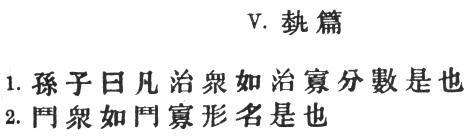
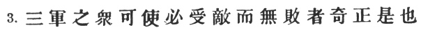
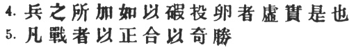
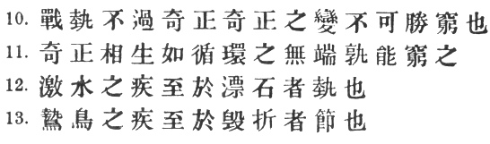
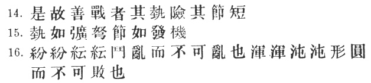
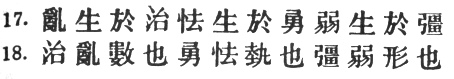
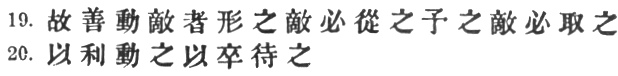
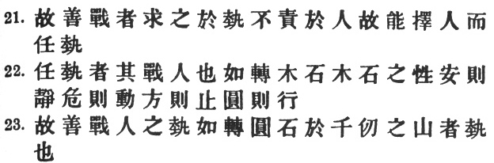

  
[Intangible Textual Heritage](../../index)  [Taoism](../index.md) 
[Confucianism](../../cfu/index)  [Index](index)  [Previous](aow12.md) 
[Next](aow14.md) 

------------------------------------------------------------------------

[Buy this Book at
Amazon.com](https://www.amazon.com/exec/obidos/ASIN/1934255122/internetsacredte.md)

------------------------------------------------------------------------

  
*The Art of War*, by Lionel Giles, \[1910\], at Intangible Textual
Heritage

------------------------------------------------------------------------

p. 33

 

### V. ENERGY [1](#fn_272.md).

1\. Sun Tzŭ said: The control of a large force is the same in principle
as the control of a few men: it is merely a question of dividing up
their numbers. [2](#fn_273.md)

2\. Fighting with a large army under your command is nowise different
from fighting with a small one: it is merely a question of instituting
signs and signals. [3](#fn_274.md)

p. 34

 

3\. To ensure that your whole host may withstand the brunt of the
enemy's attack and remain unshaken—this is effected by manœuvres direct
and indirect. [1](#fn_275.md)

p. 35

 

4\. That the impact of your army may be like a grindstone dashed against
an egg—this is effected by the science of weak points and strong. [1](#fn_276.md)

5\. In all fighting, the direct method may be used for joining battle,
but indirect methods will he needed in order to secure victory. [2](#fn_277.md)

p. 36

 

6\. Indirect tactics, efficiently applied, are inexhaustible as Heaven
and Earth, unending as the flow of rivers and streams; [1](#fn_279.md) like the sun and moon, they end but to
begin anew; like the four seasons, they pass away but to return once
more. [2](#fn_280.md)

7\. There are not more than five musical notes, [3](#fn_281.md) yet the combinations of these five give
rise to more melodies than can ever be heard.

8\. There are not more than five primary colours, [4](#fn_282.md) yet in combination they produce more
hues than can ever be seen.

9\. There are not more than five cardinal tastes, [5](#fn_283.md) yet combinations of them yield more
flavours than can ever be tasted.

p. 37

 

10\. In battle, there are not more than two methods of attack—the direct
and the indirect; yet these two in combination give rise to an endless
series of manœuvres.

11\. The direct and the indirect lead on to each other in turn. It is
like moving in a circle—you never come to an end. Who can exhaust the
possibilities of their combination? [1](#fn_284.md)

12\. The onset of troops is like the rush of a torrent which will even
roll stones along in its course.

13\. The quality of decision is like the well-timed swoop of a falcon
which enables it to strike and destroy its victim. [2](#fn_285.md)

p. 38

 

14\. Therefore the good fighter will be terrible in his onset, and
prompt in his decision. [1](#fn_286.md)

15\. Energy may be likened to the bending of a crossbow; decision, to
the releasing of the trigger. [2](#fn_287.md)

16\. Amid the turmoil and tumult of battle, there may be seeming
disorder and yet no real disorder at all; amid confusion and chaos, your
array may be without head or tail, yet it will be proof against
defeat [3](#fn_288.md)

p. 39

 

17\. Simulated disorder postulates perfect discipline; simulated fear
postulates courage; simulated weakness postulates strength. [1](#fn_289.md)

18\. Hiding order beneath the cloak of disorder is simply a question of
subdivision; [2](#fn_290.md) concealing courage
under a show of timidity presupposes a fund of latent energy; [3](#fn_291.md) masking strength with weakness is to be
effected by tactical dispositions. [4](#fn_292.md)

p. 40

 

19\. Thus one who is skilful at keeping the enemy on the move maintains
deceitful appearances, according to which the enemy will act. [1](#fn_293.md) He sacrifices something, that the enemy
may snatch at it. [2](#fn_294.md)

20\. By holding out baits, he keeps him on the march; then with a body
of picked men he lies in wait for him. [3](#fn_295.md)

p. 41

 

21\. The clever combatant looks to the effect of combined energy, and
does not require too much from individuals. [1](#fn_296.md) Hence his ability to pick out the right
men and to utilise combined energy. [2](#fn_297.md)

22\. When he utilises combined energy, his fighting men become as it
were like unto rolling logs or stones. For it is the nature of a log or
stone to remain motionless on level ground, and to move when on a slope;
if four-cornered, to come to a standstill, but if round-shaped, to go
rolling down. [3](#fn_298.md)

23\. Thus the energy developed by good fighting men is as the momentum
of a round stone rolled down a mountain thousands of feet in height. So
much on the subject of energy. [4](#fn_299.md)

------------------------------------------------------------------------

### Footnotes

[33:1](aow13.htm#fr_273.md) \# here is said to be
an older form of \#; Sun Tzŭ, however, would seem to have used the
former in the sense of "power," and the latter only in the sense of
"circumstances." The fuller title \# is found in the *T‘u Shu* and the
modern text. Wang Hsi expands it into \# "the application, in various
ways, of accumulated power;" and Chang Yü says: \# "When the soldiers’
energy has reached its height, it may be used to secure victory."

[33:2](aow13.htm#fr_274.md) That is, cutting up
the army into regiments, companies, etc., with subordinate officers in
command of each. Tu Mu reminds us of Han Hsin's famous reply to the
first Han Emperor, who once said to him: "How large an army do you think
I could lead?" "Not more than 100,000 men, your Majesty." "And you?"
asked the Emperor. "Oh!" he answered, "the more the better" \#). Chang
Yü gives the following curious table of the subdivisions of an army:—5
men make a \#; 2 \# make a \#; 5 \# make a \#; 2 \# make a \#, 2 \# make
a \#; 2 \# in make a \#; 2 \# make a \#; 2 \# make a \#; 2 \# make a \#.
A \# or army corps thus works out at 3200 men. But cf. III. § 1, note.
For \#, see I. § 10. It is possible that \# in that paragraph may also
be used in the above technical sense.

[33:3](aow13.htm#fr_275.md) p.
34 One must he careful to avoid translating \# "fighting against
a large number," no reference to the enemy being intended. \# is
explained by Ts‘ao Kung as denoting flags and banners, by means of which
every soldier may recognise his own particular regiment or company, and
thus confusion may be prevented. \# he explains as drums and gongs,
which from the earliest times were used to sound the advance and the
retreat respectively. Tu Mu defines \# as \# "marshalling the troops in
order," and takes \# as the flags and banners. Wang Hsi also dissents
from Ts‘ao Kung, referring \# to the ordering of the troops by means of
banners, drums and gongs, and \# to the various names by which the
regiments might be distinguished. There is much to be said for this
view.

[34:1](aow13.htm#fr_276.md) For \#, there is
another reading \#, "all together," adopted by Wang Hsi and Chang Yü. We
now come to one of the most interesting parts of Sun Tzŭ's treatise, the
discussion of the \# and the \#. As it is by no means easy to grasp the
full significance of these two terms, or to render them at all
consistently by good English equivalents, it may be as well to tabulate
some of the commentators' remarks on the subject before proceeding
further. Li Ch‘üan: \# "Facing the enemy is *chêng*, making lateral
diversions is *ch‘i*." Chia Lin: \# "In presence of the enemy, your
troops should be arrayed in normal fashion, but in order to secure
victory abnormal manœuvres must be employed." Mei Yao-ch‘ên: \# "*Ch‘i*
is active, *chêng* is passive; passivity means waiting for an
opportunity, activity brings the victory itself." Ho Shih: \# "We must
cause the enemy to regard our straightforward attack as one that is
secretly designed; and *vice versâ;* thus *chêng* may also be *ch‘i*,
and *ch‘i* may also be *chêng*." He instances the famous exploit of Han
Hsin, who when marching ostensibly against \# Lin-chin (now \# Chao-i in
Shensi), suddenly threw a large force across the Yellow River in wooden
tubs, utterly disconcerting his opponent. \[*Ch‘ien Han Shu*, ch. 34.\]
Here, we are told, the march on Lin-chin was \#, and the surprise
manœuvre was \#. Chang Yü gives the following summary of opinions on the
words: "Military writers p. 35 do not all
agree with regard to the meaning of *ch‘i* and *chêng*. \# Wei Liao Tzŭ
\[4th cent. B.C.\] says: \# 'Direct warfare favours frontal
attacks, indirect warfare attacks from the rear.' Ts‘ao Kung says:
'Going straight out to join battle is a direct operation; appearing on
the enemy's rear is an indirect manœuvre.' \#. Li Wei-kung
\[6th and 7th cent. A.D.\] says: 'In war, to march
straight ahead is *chêng*; turning movements, on the other hand, are
*ch‘i*.' These writers simply regard *chêng* as *chêng*, and *ch‘i* as
*ch‘i;* they do not note that the two are mutually interchangeable and
run into each other like the two sides of a circle \[see *infra*, §
11\]. A comment of the Tang Emperor T‘ai Tsung goes to the root of the
matter: 'A *ch‘i* manœuvre may be *chêng*, if we make the enemy look
upon it as *chêng*; then our real attack will be *ch‘i*, and *vice
versâ*. The whole secret lies in confusing the enemy, so that he cannot
fathom our real intent.'" To put it perhaps a little more clearly: any
attack or other operation is \#, on which the enemy has had his
attention fixed; whereas that is \#, which takes him by surprise or
comes from an unexpected quarter. If the enemy perceives a movement
which is meant to be \#, it immediately becomes \#.

[35:1](aow13.htm#fr_277.md) \#, literally "the
hollow and the solid," is the title of chap. VI. \# *tuan* is the *T‘u
Shu* reading, \# *hsia* that of the standard text. It appears from K‘ang
Hsi that there has been much confusion between the two characters, and
indeed, it is probable that one of them has really crept into the
language as a mistake for the other.

[35:2](aow13.htm#fr_278.md) Chang Yü says: \#
"Steadily develop indirect tactics, either by pounding the enemy's
flanks or falling on his rear." A brilliant example of "indirect
tactics" which decided the fortunes of a campaign was Lord Roberts’
night march round the Peiwar Kotal in the second Afghan war.  [\*](#fn_278.md)

[35:\*](aow13.htm#fr_279.md) "Forty-one Years in
India," chap. 46.

[36:1](aow13.htm#fr_280.md) \# is the universally
accepted emendation for \#, the reading of the \#.

[36:2](aow13.htm#fr_281.md) Tu Yu and Chang Yü
understand this of the permutations of \# and \#. But at present Sun Tzŭ
is not speaking of \# at all, unless, indeed, we suppose with \# Chêng
Yu-hsien that a clause relating to it has fallen out of the text. Of
course, as has already been pointed out, the two are so inextricably
interwoven in all military operations, that they cannot really be
considered apart. Here we simply have an expression, in figurative
language, of the almost infinite resource of a great leader.

[36:3](aow13.htm#fr_282.md) \#.

[36:4](aow13.htm#fr_283.md) \# blue, yellow, red,
white and black.

[36:5](aow13.htm#fr_284.md) \# sour, acrid, salt,
sweet, bitter.

[37:1](aow13.htm#fr_285.md) The *T‘u Shu* adds \#.
The final \# may refer either to the circle or, more probably, to the \#
understood. Capt. Calthrop is wrong with: "They are a mystery that none
can penetrate."

[37:2](aow13.htm#fr_286.md) For \# the *Yü Lan*
reads \#, which is also supported by a quotation in the \#
\[3rd cent. B.C.\]. \# in this context is a word which really
defies the best efforts of the translator. Tu Mu says that it is
equivalent to \# "the measurement or estimation of distance." But this
meaning does not quite fit the illustrative simile in §15. As applied to
the falcon, it seems to me to denote that instinct of *self-restraint*
which keeps the bird from swooping on its quarry until the right moment,
together with the power of judging when the right moment has arrived.
The analogous quality in soldiers is the highly important one of being
able to reserve their fire until the very instant at which it will be
most effective. When the "Victory" went into action at Trafalgar at
hardly more than drifting pace, she was for several minutes exposed to a
storm of shot and shell before replying with a single gun. Nelson coolly
waited until he was within close range, when the broadside he brought to
bear worked fearful havoc on the enemy's nearest ships. That was a case
of \#.

[38:1](aow13.htm#fr_287.md) Tu Yu defines \# here
by the word \#, which is very like "decision" in English. \# is
certainly used in a very unusual sense, even if, as the commentators
say, it = \#. This would have reference to the measurement of distance
mentioned above, letting the enemy get near before striking. But I
cannot help thinking that Sun Tzŭ meant to use the word in a figurative
sense comparable to our own idiom "short and sharp." Cf. Wang Hsi's
note, which after describing the falcon's mode of attack, proceeds: \#
"This is just how the 'psychological moment' should be seized in war." I
do not care for Capt. Calthrop's rendering: "The spirit of the good
fighter is terrifying, his occasions sudden."

[38:2](aow13.htm#fr_288.md) "Energy" seems to be
the best equivalent here for \#, because the comparison implies that the
force is potential, being stored up in the bent cross-bow until released
by the finger on the trigger. None of the commentators seem to grasp the
real point of the simile.

[38:3](aow13.htm#fr_289.md) \#, literally
"formation circular", is explained by Li Ch‘üan as \# "without back or
front." Mei Yao-ch‘ên says: "The subdivisions of the army having been
previously fixed, and the various signals agreed upon, the separating
and joining, the dispersing and collecting which will take place in the
course of a battle, may give the appearance of disorder when no real
disorder is possible. Your formation may be without head or tail, your
dispositions all topsy-turvy, and yet a rout of your forces quite out of
the question." It is a little difficult to decide whether \# and \#
should not be taken as imperatives: "fight in disorder (for the purpose
of deceiving the enemy), and you will be secure against real disorder."
Cf. I. § 20: \#.

[39:1](aow13.htm#fr_290.md) In order to make the
translation intelligible, it is necessary to tone down the sharply
paradoxical form of the original. Ts‘ao Kung throws out a hint of the
meaning in his brief note: \# "These things all serve to destroy
formation and conceal one's condition." But Tu Mu is the first to put it
quite plainly: "If you wish to feign confusion in order to lure the
enemy on, you must first have perfect discipline; if you wish to display
timidity in order to entrap the enemy, you must have extreme courage; if
you wish to parade your weakness in order to make the enemy
over-confident, you must have exceeding strength."

[39:2](aow13.htm#fr_291.md) See *supra*, § 1.

[39:3](aow13.htm#fr_292.md) It is passing strange
that the commentators should understand \# here as "circumstances"—a
totally different sense from that which it has previously borne in this
chapter. Thus Tu Mu says: \# "seeing that we are favourably
circumstanced and yet make no move, the enemy will believe that we are
really afraid."

[39:4](aow13.htm#fr_293.md) Chang Yü relates the
following anecdote of Kao Tsu, the first Han Emperor: "Wishing to crush
the Hsiung-nu, he sent out spies to report on their condition. But the
Hsiung-nu, forewarned, carefully concealed all their able-bodied men and
well-fed horses, and only allowed infirm soldiers and emaciated cattle
to be seen. The result was that the spies one and all recommended the
Emperor to deliver his attack. \# Lou Ching alone opposed them, saying:
"When two countries go to war, they are naturally inclined to make an
ostentatious display of their strength. Yet our spies have seen nothing
but old age and infirmity. This is surely some *ruse* on the part of the
enemy, and it would be unwise for us to attack." The Emperor, however,
disregarding this advice, fell into the trap and found himself
surrounded at \# Po-têng."

[40:1](aow13.htm#fr_294.md) Ts‘ao Kung's note is
\# "Make a display of weakness and want," but Tu Mu rightly points out
that \# does not refer only to weakness: "If our force happens to be
superior to the enemy's, weakness may be simulated in order to lure him
on; but if inferior, he must be led to believe that we are strong, in
order that he may keep off. In fact, all the enemy's movements should be
determined by the signs that we choose to give him." The following
anecdote of \# Sun Pin, a descendant of Sun Wu, is related at length in
the \#, chap. 65: In 341 B.C., the \# Ch‘i State being at war with \#
Wei, sent \# T‘ien Chi and Sun Pin against the general \# P‘ang Chüan,
who happened to be a deadly personal enemy of the latter. Sun Pin said:
"The Ch‘i State has a reputation for cowardice, and therefore our
adversary despises us. Let us turn this circumstance to account."
Accordingly, when the army had crossed the border into Wei territory, he
gave orders to show 100,000 fires on the first night, 50,000 on the
next, and the night after only 20,000. P‘ang Chüan pursued them hotly,
saying to himself: "I knew these men of Ch‘i were cowards: their numbers
have already fallen away by more than half." In his retreat, Sun Pin
came to a narrow defile, which he calculated that his pursuers would
reach after dark. Here he had a tree stripped of its bark, and inscribed
upon it the words: "Under this tree shall P‘ang Chüan die." Then, as
night began to fall, he placed a strong body of archers in ambush near
by, with orders to shoot directly they saw a light. Later on, P‘ang
Chüan arrived at the spot, and noticing the tree, struck a light in
order to read what was written on it. His body was immediately riddled
by a volley of arrows, and his whole army thrown into confusion. \[The
above is Tu Mu's version of the story; the *Shih Chi*, less dramatically
but probably with more historical truth, makes P‘ang Chüan cut his own
throat with an exclamation of despair, after the rout of his army.\]

[40:2](aow13.htm#fr_295.md) \# here = \#.

[40:3](aow13.htm#fr_296.md) This would appear to
be the meaning if we retain \#, which Mei Yao-ch‘ên explains as \#, "men
of spirit." The *T‘u Shu* reads \#, p. 41 an
emendation suggested by \# Li Ching. The meaning then would be, "He lies
in wait with the main body of his troops."

[41:1](aow13.htm#fr_297.md) Tu Mu says: "He first
of all considers the power of his army in the bulk; afterwards he takes
individual talent into account, and uses each man according to his
capabilities. He does not demand perfection from the untalented."

[41:2](aow13.htm#fr_298.md) Another reading has \#
instead of \#. It would be interesting if Capt. Calthrop could tell us
where the following occurs in the Chinese: "yet, when an opening or
advantage shows, he pushes it to its limits."

[41:3](aow13.htm#fr_299.md) Ts‘ao Kung calls this
\# "the use of natural or inherent power." Capt. Calthrop ignores the
last part of the sentence entirely. In its stead he has: "So await the
opportunity, and so act when the opportunity arrives"—another absolutely
gratuitous interpolation. The *T‘ung Tien* omits \#.

[41:4](aow13.htm#fr_300.md) The *T‘ung Tien* omits
\#. The chief lesson of this chapter, in Tu Mu's opinion, is the
paramount importance in war of rapid evolutions and sudden rushes.
"Great results," he adds, "can thus be achieved with small forces."

------------------------------------------------------------------------

[Next: VI. Weak Points and Strong](aow14.md)
