  
[Intangible Textual Heritage](../../index)  [Taoism](../index.md) 
[Confucianism](../../cfu/index)  [Index](index)  [Previous](aow13.md) 
[Next](aow15.md) 

------------------------------------------------------------------------

[Buy this Book at
Amazon.com](https://www.amazon.com/exec/obidos/ASIN/1934255122/internetsacredte.md)

------------------------------------------------------------------------

  
*The Art of War*, by Lionel Giles, \[1910\], at Intangible Textual
Heritage

------------------------------------------------------------------------

p. 42

 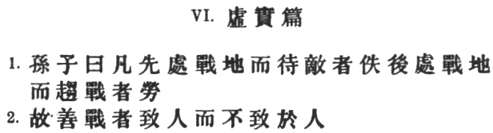

### VI. WEAK POINTS AND STRONG.

Chang Yü attempts to explain the sequence of chapters as follows:
"Chapter IV, on Tactical Dispositions, treated of the offensive and the
defensive; chapter V, on Energy, dealt with direct and indirect methods.
The good general acquaints himself first with the theory of attack and
defence, and then turns his attention to direct and indirect methods. He
studies the art of varying and combining these two methods before
proceeding to the subject of weak and strong points. For the use of
direct or indirect methods arises out of attack and defence, and the
perception of weak and strong points depends again on the above methods.
Hence the present chapter comes immediately after the chapter on
Energy."

1\. Sun Tzŭ said: Whoever is first in the field and awaits the coming of
the enemy, will be fresh for the fight; whoever is second in the field
and has to hasten to battle, will arrive exhausted. [1](#fn_300.md)

2\. Therefore the clever combatant imposes his will on the enemy, but
does not allow the enemy's will to be imposed on him. [2](#fn_301.md)

p. 43

 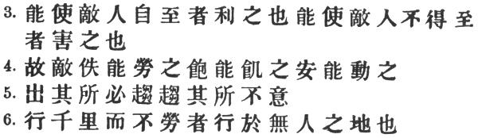

3\. By holding out advantages to him, he can cause the enemy to approach
of his own accord; or, by inflicting damage, he can make it impossible
for the enemy to draw near. [1](#fn_303.md)

4\. If the enemy is taking his ease, he can harass him; [2](#fn_304.md) if well supplied with food, he can
starve him out; [3](#fn_305.md) if quietly
encamped, he can force him to move. [4](#fn_306.md)

5\. Appear at points which the enemy must hasten to defend; march
swiftly to places where you are not expected. [5](#fn_307.md)

6\. An army may march great distances without distress, if it marches
through country where the enemy is not. [6](#fn_308.md)

p. 44

 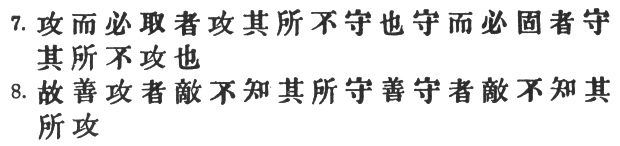

7\. You can be sure of [succeeding](errata.htm#3.md) in your attacks if you
only attack places which are undefended. [1](#fn_309.md) You can ensure the safety of your
defence if you only hold positions that cannot be attacked. [2](#fn_310.md)

8\. Hence that general is skilful in attack whose opponent does not know
what to defend; and he is skilful in defence whose opponent does not
know what to attack. [3](#fn_311.md)

p. 45

 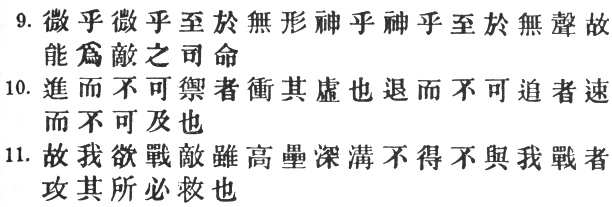

9\. O divine art of [subtlety](errata.htm#4.md) and secrecy! Through you we
learn to be invisible, through you inaudible, [1](#fn_312.md) and hence we can hold the enemy's fate
in our hands. [2](#fn_313.md)

10\. You may advance and be absolutely irresistible, if you make for the
enemy's weak points; you may retire and be safe from pursuit if your
movements are more rapid than those of the enemy. [3](#fn_314.md)

11\. If we wish to fight, the enemy can be forced to an engagement even
though he be sheltered behind a high rampart and a deep ditch. All we
need do is to attack some other place that he will be obliged to
relieve. [4](#fn_315.md)

p. 46

 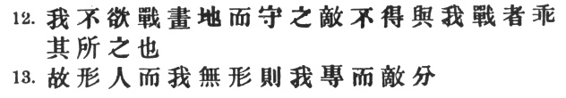

12\. If we do not wish to fight, we can prevent the enemy from engaging
us even though the lines of our encampment be merely traced out on the
ground. All we need do is to throw something odd and unaccountable in
his way. [1](#fn_316.md)

13\. By discovering the enemy's dispositions and remaining invisible
ourselves, we can keep our forces concentrated, while the enemy's must
be divided. [2](#fn_317.md)

p. 47

 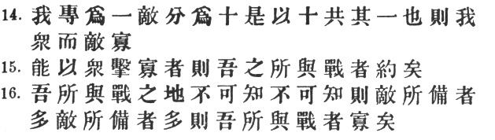

14\. We can form a single united body, while the enemy must split up
into fractions. Hence there will be a whole pitted against separate
parts of a whole, [1](#fn_318.md) which means that
we shall be many to the enemy's few.

15\. And if we are able thus to attack an inferior force with a superior
one, our opponents will be in dire straits. [2](#fn_319.md)

16\. The spot where we intend to fight must not be made known; for then
the enemy will have to prepare against a possible attack at several
different points; [3](#fn_320.md) and his forces
being thus distributed in many directions, the numbers we shall have to
face at any given point will be proportionately few.

p. 48

 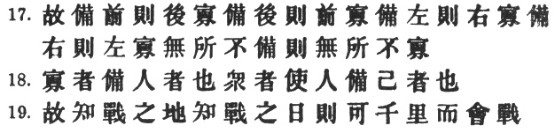

17\. For should the enemy strengthen his van, he will weaken his rear;
should he strengthen his rear, he will weaken his van; should he
strengthen his left, he will weaken his right; should he strengthen his
right, he will weaken his left. If he sends reinforcements everywhere,
he will everywhere be weak. [1](#fn_321.md)

18\. Numerical weakness comes from having to prepare against possible
attacks; numerical strength, from compelling our adversary to make these
preparations against us. [2](#fn_322.md)

19\. Knowing the place and the time of the coming battle, we may
concentrate from the greatest distances in order to fight. [3](#fn_323.md)

p. 49

 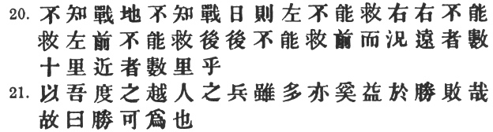

20\. But if neither time nor place be known, then the left wing will be
impotent to succour the right, the right equally impotent to succour the
left, the van unable to relieve the rear, or the rear to support the
van. How much more so if the furthest portions of the army are anything
under a hundred *li* apart and even the nearest are separated by several
*li*! [1](#fn_324.md)

21\. Though according to my estimate the soldiers of Yüeh exceed our own
in number, that shall advantage them nothing in the matter of
victory. [2](#fn_325.md)

p. 50

 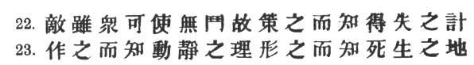

\[paragraph continues\] I say then that
victory can be achieved. [1](#fn_326.md)

22\. Though the enemy be stronger in numbers, we may prevent him from
fighting. [2](#fn_327.md) Scheme so as to discover
his plans and the likelihood of their success. [3](#fn_328.md)

23\. Rouse him, and learn the principle of his activity or
inactivity. [4](#fn_329.md)

p. 51

 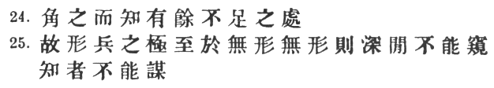

\[paragraph continues\] Force him to
reveal himself, so as to find out his vulnerable spots. [1](#fn_330.md)

24\. Carefully compare the opposing army with your own, [2](#fn_331.md) so that you may know where strength is
superabundant and where it is deficient. [3](#fn_332.md)

25\. In making tactical dispositions, the highest pitch you can attain
is to conceal them; [4](#fn_333.md)

p. 52

 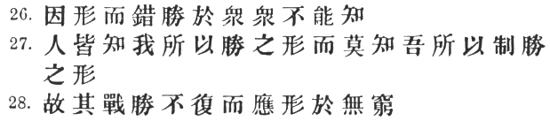

conceal your dispositions, and you will be safe from the prying of the
subtlest spies, from the machinations of the wisest brains. [1](#fn_334.md)

26\. How victory may be produced for them out of the enemy's own
tactics—that is what the multitude cannot comprehend. [2](#fn_335.md)

27\. All men can see the tactics whereby I conquer, but what none can
see is the strategy out of which victory is evolved. [3](#fn_336.md)

28\. Do not repeat the tactics which have gained you one victory, but
let your methods be regulated by the infinite variety of
circumstances. [4](#fn_337.md)

p. 53

 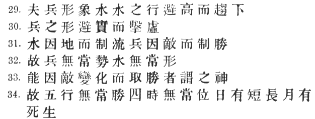

29\. Military tactics are like unto water; for water in its natural
course runs away from high places and hastens downwards. [1](#fn_338.md)

30\. So in war, the way is to avoid what is strong and to strike at what
is weak. [2](#fn_339.md)

31\. Water shapes its course according to the nature of the ground over
which it flows: [3](#fn_340.md) the soldier works
out his victory in relation to the foe whom he is facing.

32\. Therefore, just as water retains no constant shape, so in warfare
there are no constant conditions.

33\. He who can modify his tactics in relation to his opponent and
thereby succeed in winning, may be called a heaven-born captain.

34\. The five elements [4](#fn_341.md) are not
always equally predominant; [5](#fn_342.md)

p. 54

the four seasons make way for each other in turn. [1](#fn_343.md)

There are short days and long; the moon has its periods of waning and
waxing. [2](#fn_344.md)

------------------------------------------------------------------------

### Footnotes

[42:1](aow14.htm#fr_301.md) Instead of \#, the *Yü
Lan* has in both clauses the stronger word \#. For the antithesis
between \# and \#, cf. I. §23, where \# however is used as a verb.

[42:2](aow14.htm#fr_302.md) The next paragraph
makes it clear that \# does not merely mean, as Tu Mu says, \# "to make
the enemy approach me," but rather to make him go in any direction I
please. It is thus practically synonymous with \#. Cf. Tu Mu's own note
on V. § 19. One mark of a great soldier is that he fights on his own
terms or fights not at all. [\*](#fn_302.md)

[42:\*](aow14.htm#fr_303.md) See Col. Henderson's
biography of Stonewall Jackson, 1902 ed., vol. II, p. 490.

[43:1](aow14.htm#fr_304.md) In the first case, he
will entice him with a bait; in the second, he will strike at some
important point which the enemy will have to defend.

[43:2](aow14.htm#fr_305.md) This passage may be
cited as evidence against Mei Yao-Ch‘ên's interpretation of I. § 23.

[43:3](aow14.htm#fr_306.md) \# is probably an
older form than \#, the reading of the original text. Both are given in
the \#.

[43:4](aow14.htm#fr_307.md) The subject to \# is
still a \#; but these clauses would read better as direct admonitions,
and in the next sentence we find Sun Tzŭ dropping insensibly into the
imperative.

[43:5](aow14.htm#fr_308.md) The original text,
adopted by the *T‘u Shu*, has \#; it has been altered to suit the
context and the commentaries of Ts‘ao Kung and Ho Shih, who evidently
read \#. The other [reading](errata.htm#2.md) would mean: "Appear at points
to which the enemy cannot hasten;" but in this case there is something
awkward in the use of \#. Capt. Calthrop is wrong of course with
"appearing where the enemy is not."

[43:6](aow14.htm#fr_309.md) We must beware of
understanding \# it as "uninhabited country." Sun Tzŭ habitually uses \#
in the sense of \#. p. 44 Ts‘ao Kung sums up
very well: \# "Emerge from the void \[*q.d.* like "a bolt from the
blue"\], strike at vulnerable points, shun places that are defended,
attack in unexpected quarters. The difference of meaning between \# and
\# is worth noting.

[44:1](aow14.htm#fr_310.md) \# is of course
hyperbolical; Wang Hsi rightly explains it as "weak points; that is to
say, where the general is lacking in capacity, or the soldiers in
spirit; where the walls are not strong enough, or the precautions not
strict enough; where relief comes too late, or provisions are too
scanty, or the defenders are variance amongst themselves."

[44:2](aow14.htm#fr_311.md) *I.e.*; where there
are none of the weak points mentioned above. There is rather a nice
point involved in the interpretation of this latter clause. Tu Mu, Ch‘ên
Hao, and Mei Yao-ch‘ên assume the meaning to be: "In order to make your
defence quite safe, you must defend *even* those places that are not
likely to be attacked;" and Tu Mu adds: "How much more, then, those that
will be attacked." Taken thus, however, the clause balances less well
with the preceding—always a consideration in the highly antithetical
style which is natural to the Chinese. Chang Yü, therefore, seems to
come nearer the mark in saying: "He who is skilled in attack flashes
forth from the topmost heights of heaven \[see IV. § 7\], making it
impossible for the enemy to guard against him. This being so, the places
that I shall attack are precisely those that the enemy cannot defend …
He who is skilled in defence hides in the most secret recesses of the
earth, making it impossible for the enemy to estimate his whereabouts.
This being so, the places that I shall hold are precisely those that the
enemy cannot attack."

[44:3](aow14.htm#fr_312.md) An aphorism which puts
the whole art of war into a nutshell.

[45:1](aow14.htm#fr_313.md) Literally, "without
form or sound," but it is said of course with reference to the enemy.
Chang Yü, whom I follow, draws no sharp distinction between \# and \#,
but Tu Mu and others think that \# indicates the secrecy to be observed
on the defensive, and \# the rapidity to be displayed in attack. The *Yü
Lan* text differs considerably from ours, reading: \#.

[45:2](aow14.htm#fr_314.md) The *T‘ung Tien* has
\#. Capt. Calthrop's version of this paragraph is so remarkable that I
cannot refrain from quoting it in full: "Now the secrets of the art of
offence are not to be easily apprehended, as a certain shape or noise
can be understood, of the senses; but when these secrets are once
learnt, the enemy is mastered."

[45:3](aow14.htm#fr_315.md) The second member of
the sentence is weak, because \# is nearly tautologous with \#. The *Yü
Lan* reads \# for \#.

[45:4](aow14.htm#fr_316.md) Tu Mu says: "If the
enemy is the invading party, we can cut his line of communications and
occupy the roads by which he will have to return; if we are the
invaders, we may direct our attack against the sovereign himself." It is
clear that Sun Tzŭ, unlike certain generals in the late Boer war, was no
believer in frontal attacks.

[46:1](aow14.htm#fr_317.md) In order to preserve
the parallelism with §11, I should prefer to follow the *T‘u Shu* text,
which inserts \# before \#. This extremely concise expression is
intelligibly paraphrased by Chia Lin: \# "even though we have
constructed neither wall nor ditch." The real crux of the passage lies
in \#. \# of course = \#. Ts‘ao Kung defines by the word, which is
perhaps a case of *obscurum per obscurius*. Li Ch‘üan, however, says: \#
"we puzzle him by strange and unusual dispositions;" and Tu Mu finally
clinches the meaning by three illustrative anecdotes—one of \# Chu-ko
Liang, who when occupying \# Yang-p‘ing and about to be attacked by \#
Ssŭ-ma I, suddenly struck his colours, stopped the beating of the drums,
and flung open the city gates, showing only a few men engaged in
sweeping and sprinkling the ground. This unexpected proceeding had the
intended effect; for Ssŭ-ma I, suspecting a ambush, actually drew off
his army and retreated. What Sun Tzŭ is advocating here, therefore, is
nothing more nor less than the timely use of "bluff." Capt. Calthrop
translates: "and prevent the enemy from attacking by keeping him in
suspense," which shows that he has not fully grasped the meaning of \#.

[46:2](aow14.htm#fr_318.md) The conclusion is
perhaps not very obvious, but Chang Yü (after Mei Yao-ch‘ên) rightly
explains it thus: "If the enemy's dispositions are visible, we can make
for him in one body; whereas, our own dispositions being kept secret,
the enemy will be obliged to divide his forces in order to guard against
attack from every quarter." \# is here used as an active verb: "to make
to appear." See IV, note on heading. Capt. Calthrop's "making feints" is
quite wrong.

[47:1](aow14.htm#fr_319.md) The original text has
\#, which in accordance with the *T‘ung Tien* and *Yü Lan* has been
altered as above. I adopt the more plausible reading of the *T‘u Shu*:
\# in spite of having to refer \# to ourselves and not to the enemy.
Thus Tu Yu and Mei Yao-ch‘ên both regard \# as the undivided force,
consisting of so many parts, and \# as each of the isolated fractions of
the enemy. The alteration of \# into \# can hardly be right, though the
true text might conceivably have been \#.

[47:2](aow14.htm#fr_320.md) For \#, the *T‘ung
Tien* and *Yü Lan* have \#. Tu Yu, followed by the other commentators,
arbitrarily defines \# a \# "few and easy to conquer," but only succeeds
thereby in making the sentence absolutely pointless. As for Capt.
Calthrop's translation: "In superiority of numbers there is economy of
strength," its meaning is probably known to himself alone. In
justification of my own rendering of \#, I would refer to *Lun Yü* IV. 2
and VII. 25 (3).

[47:3](aow14.htm#fr_321.md) Sheridan once
explained the reason of General Grant's victories by saying that "while
his opponents were kept fully employed wondering what he was going to
do, *he* was thinking most of what he was going to do himself."

[48:1](aow14.htm#fr_322.md) In Frederick the
Great's *Instructions to his Generals* we read: "A defensive war is apt
to betray us into too frequent detachment. Those generals who have had
but little experience attempt to protect every point, while those who
are better acquainted with their profession, having only the capital
object in view, guard against a decisive blow, and acquiesce in smaller
misfortunes to avoid greater."

[48:2](aow14.htm#fr_323.md) The highest
generalship, in Col. Henderson's words, is "to compel the enemy to
disperse his army, and then to concentrate superior force against each
fraction in turn."

[48:3](aow14.htm#fr_324.md) There is nothing about
"defeating" anybody in this sentence, as Capt. Calthrop translates. What
Sun Tzŭ evidently has in mind is that nice calculation of distances and
that masterly employment of strategy which enable a general to divide
his army for the purpose of a long and rapid march, and afterwards to
effect a junction at precisely the right spot and the right hour in
order to confront the enemy in overwhelming strength. Among many such
successful junctions which military history records, one of the most
dramatic and decisive was the appearance of Blücher just at the critical
moment on the field of Waterloo.

[49:1](aow14.htm#fr_325.md) The Chinese of this
last sentence is a little lacking in precision, but the mental picture
we are required to draw is probably that of an army advancing towards a
given rendez-vous in separate columns, each of which has orders to be
there on a fixed date. If the general allows the various detachments to
proceed at haphazard, without precise instructions as to the time and
place of meeting, the enemy will be able to annihilate the army in
detail. Chang Yü's note may be worth quoting here: "If we do not know
the place where our opponents mean to concentrate or the day on which
they will join battle, our unity will be forfeited through our
preparations for defence, and the positions we hold will be insecure.
Suddenly happening upon a powerful foe, we shall be brought to battle in
a flurried condition, and no mutual support will be possible between
wings, vanguard or rear, especially if there is any great distance
between the foremost and hindmost divisions of the army."

[49:2](aow14.htm#fr_326.md) Capt. Calthrop omits
\#, and his translation of the remainder is flabby and inaccurate. As
Sun Tzŭ was in the service of the \# Wu State, it has been proposed to
read \# instead of \#—a wholly unnecessary tampering with the text. Yüeh
coincided roughly with the present province of Chehkiang. Li Ch‘üan very
strangely takes \# not as the proper name, but in the sense of \# "to
surpass." No other commentator follows him. \# belongs to the class of
expressions like \# "distance," \# "magnitude," etc., to which the
Chinese have to resort p. 50 in order to
express abstract ideas of degree. The *T‘u Shu*, however, omits \#.

[50:1](aow14.htm#fr_327.md) Alas for these brave
words! The long feud between the two states ended in 473 B.C. with the
total defeat of Wu by \# Kou Chien and its incorporation in Yüeh, This
was doubtless long after Sun Tzŭ's death. With his present assertion
compare IV. § 4: \# (which is the obviously mistaken reading of the *Yü
Lan* here). Chang Yü is the only one to point out the seeming
discrepancy, which he thus goes on to explain: "In the chapter on
Tactical Dispositions it is said, 'One may know how to conquer without
being able to *do* it.' whereas here we have the statement that 'victory
can be achieved.' The explanation is, that in the former chapter, where
the offensive and defensive are under discussion, it is said that if the
enemy is fully prepared, one cannot make certain of beating him. But the
present passage refers particularly to the soldiers of Yüeh who,
according to Sun Tzŭ's calculations, will be kept in ignorance of the
time and place of the impending struggle. That is why he says here that
victory can be achieved."

[50:2](aow14.htm#fr_328.md) Capt. Calthrop quite
unwarrantably translates: "*If* the enemy be many in number, prevent
him," etc.

[50:3](aow14.htm#fr_329.md) This is the first of
four similarly constructed sentences, all of which present decided
difficulties. Chang Yü explains \# as \#. This is perhaps the best way
of taking the words, though Chia Lin, referring \# to ourselves and not
the enemy, offers the alternative of a \# "Know beforehand all plans
conducive to our success and to the enemy's failure,"

[50:4](aow14.htm#fr_330.md) Instead of \#, the
*T‘ung Tien*, *Yü Lan*, and also Li Ch‘üan's text have \#, which the
latter explains as "the observation of omens;" and Chia Lin simply as
"watching and waiting." \# is defined by Tu Mu p.
51 as \#, and Chang Yü tells us that by noting the joy or anger
shown by the enemy on being thus disturbed, we shall be able to conclude
whether his policy is to lie low or the reverse. He instances the action
of Chu-ko Liang, who sent the scornful present of a woman's head-dress
to Ssŭ-ma I, in order to goad him out of his Fabian tactics.

[51:1](aow14.htm#fr_331.md) Two commentators, Li
Ch'üan and Chang Yü, take \# in the sense of \# "put on specious
appearances." The former says: "You may either deceive the enemy by a
show of weakness—striking your colours and silencing your drums; or by a
show of strength—making a hollow display of camp-fires and regimental
banners." And the latter quotes V. 19, where \# certainly seems to bear
this sense. On the other hand, I would point to §13 of this chapter,
where \# must with equal certainty be active. It is hard to choose
between the two interpretations, but the context here agrees better, I
think, with the one that I have adopted. Another difficulty arises over
\#, which most of the commentators, thinking no doubt of the \# in XI. §
1, refer to the actual *ground* on which the enemy is encamped. The
notes of Chia Lin and Mei Yao-ch‘ên, however, seem to favour my view.
The same phrase has a somewhat different meaning in I. § 2.

[51:2](aow14.htm#fr_332.md) Tu Yu is right, I
think, in attributing this force to \#, Ts‘ao Kung defines it simply as
\#. Capt. Calthrop surpasses himself with the staggering translation
"Flap the wings"! Can the Latin *cornu* (in its figurative sense) have
been at the back of his mind?

[51:3](aow14.htm#fr_333.md) Cf. IV. § 6.

[51:4](aow14.htm#fr_334.md) The piquancy of the
paradox evaporates in translation. \# is perhaps not so much actual
invisibility (see *supra*, § 9) as "showing no sign" of what you mean to
do, of the plans that are formed in your brain.

[52:1](aow14.htm#fr_335.md) \# is expanded by Tu
Mu into \# \[For \#, see XIII, note on heading.\] He explains \# in like
fashion: \# "though the enemy may have clever and capable officers, they
will not be able to lay any plans against us."

[52:2](aow14.htm#fr_336.md) All the commentators
except Li Ch‘üan make \# refer to the enemy. So Ts‘ao Kung: \# is
defined as \#. The *T‘u Shu* has \#, with the same meaning. See IV. §
13. The *Yü Lan* reads \#, evidently a gloss.

[52:3](aow14.htm#fr_337.md) *I.e.*, everybody can
see superficially how a battle is won; what they cannot see is the long
series of plans and combinations which has preceded the battle. It seems
justifiable, then, to render the first \# by "tactics" and the second by
"strategy."

[52:4](aow14.htm#fr_338.md) As Wang Hsi sagely
remarks: "There is but one root-principle (\#) underlying victory, but
the tactics (\#) which lead up to it are infinite in number." With this
compare Col. Henderson; "The rules of strategy are few and simple. They
may be learned in a week. They may be taught by familiar illustrations
or a dozen diagrams. But such knowledge will no more teach a man to lead
an army like Napoleon than a knowledge of grammar will teach him to
write like Gibbon."

[53:1](aow14.htm#fr_339.md) \# is \# Liu
Chou-tzŭ's reading for \# in the original text.

[53:2](aow14.htm#fr_340.md) Like water, taking the
line of least resistance.

[53:3](aow14.htm#fr_341.md) The *T‘ung Tien* and
*Yü Lan* read \#,—the latter also \#. The present text is derived from
Chêng Yu-hsien.

[53:4](aow14.htm#fr_342.md) Water, fire, wood,
metal, earth.

[53:5](aow14.htm#fr_343.md) That is, as Wang Hsi
says: \# "they predominate alternately."

[54:1](aow14.htm#fr_344.md) Literally, "have no
invariable seat."

[54:2](aow14.htm#fr_345.md) Cf. V. § 6. The
purport of the passage is simply to illustrate the want of fixity in war
by the changes constantly taking place in Nature. The comparison is not
very happy, however, because the regularity of the phenomena which Sun
Tzŭ mentions is by no means paralleled in war.

------------------------------------------------------------------------

[Next: VII. Manœuvring](aow15.md)
