  
[Intangible Textual Heritage](../../index)  [Taoism](../index.md) 
[Confucianism](../../cfu/index)  [Index](index)  [Previous](aow16.md) 
[Next](aow18.md) 

------------------------------------------------------------------------

[Buy this Book at
Amazon.com](https://www.amazon.com/exec/obidos/ASIN/1934255122/internetsacredte.md)

------------------------------------------------------------------------

  
*The Art of War*, by Lionel Giles, \[1910\], at Intangible Textual
Heritage

------------------------------------------------------------------------

p. 80

 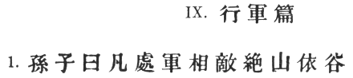

### IX. THE ARMY ON THE MARCH [1](#fn_433.md).

1\. Sun Tzŭ said: We come now to the question of encamping the army, and
observing signs of the enemy. [2](#fn_434.md) Pass
quickly over mountains, [3](#fn_435.md) and keep
in the neighbourhood of valleys. [4](#fn_436.md)

p. 81

 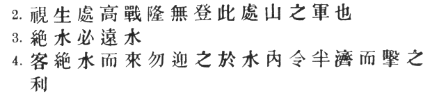

2\. Camp in high places, [1](#fn_437.md) facing
the sun. [2](#fn_438.md) Do not climb heights in
order to fight. [3](#fn_439.md) So much for
mountain warfare. [4](#fn_440.md)

3\. After crossing a river, you should get far away from it. [5](#fn_441.md)

4\. When an invading force crosses a river in its onward march, do not
advance to meet it in mid-stream. It will be best to let half the army
get across, and then deliver your attack. [6](#fn_442.md)

p. 82

 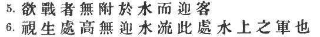

5\. If you are anxious to fight, you should not go to meet the invader
near a river which he has to cross. [1](#fn_443.md)

6\. Moor your craft higher up than the enemy, and facing the sun. [2](#fn_444.md) Do not move up-stream to meet the
enemy. [3](#fn_445.md)

p. 83

 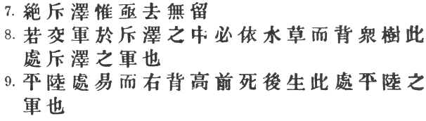

\[paragraph continues\] So much for river
warfare.

7\. In crossing salt-marshes, your sole concern should be to get over
them quickly, without any delay. [1](#fn_446.md)

8\. If forced to fight in a salt-marsh, you should have water and grass
near you, and get your back to a clump of trees. [2](#fn_447.md) So much for operations in salt-marshes.

9\. In dry, level country, take up an easily accessible position [3](#fn_448.md) with rising ground to your right and on
your rear,

p. 84

 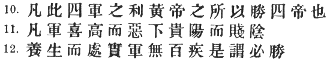

so that the danger may be in front, and safety lie behind. [1](#fn_449.md) So much for campaigning in flat country.

10\. These are the four useful branches of military knowledge [2](#fn_450.md) which enabled the Yellow Emperor to
vanquish four several sovereigns. [3](#fn_451.md)

11\. All armies prefer high ground to low, [4](#fn_452.md) and sunny places to dark.

12\. If you are careful of your men, [5](#fn_453.md)

p. 85

 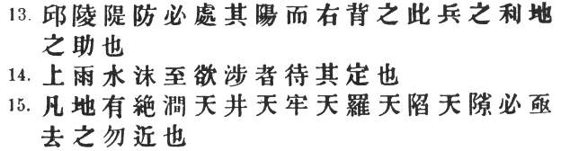

and camp on hard ground, [1](#fn_454.md) the army
will be free from disease of every kind, [2](#fn_455.md) and this will spell victory.

13\. When you come to a hill or a bank, occupy the sunny side, with the
slope on your right rear. Thus you will at once act for the benefit of
your soldiers and utilise the natural advantages of the ground.

14\. When, in consequence of heavy rains up-country, a river which you
wish to ford is swollen and flecked with foam, you must wait until it
subsides. [3](#fn_456.md)

15\. Country in which there are precipitous cliffs with torrents running
between, [4](#fn_457.md) deep natural
hollows, [5](#fn_458.md) confined places, [6](#fn_459.md)

p. 86

 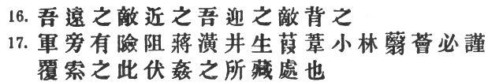

tangled thickets, [1](#fn_460.md) quagmires [2](#fn_461.md) and crevasses, [3](#fn_462.md) should be left with all possible speed
and not approached.

16\. While we keep away from such places, we should get the enemy to
approach them; while we face them, we should let the enemy have them on
his rear.

17 If in the neighbourhood of your camp [4](#fn_463.md)

p. 87

 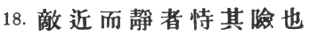

there should be any hilly country, [1](#fn_464.md)
ponds surrounded by aquatic grass, hollow basins filled with
reeds, [2](#fn_465.md) or woods with thick
undergrowth, [3](#fn_466.md) they must be
carefully routed out and searched; for these are places where men in
ambush or insidious spies are likely to be lurking. [4](#fn_467.md)

18\. When the enemy is close at hand and remains quiet, he is relying on
the natural strength of his position. [5](#fn_468.md)

p. 88

 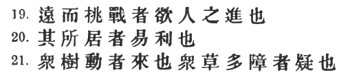

19\. When he keeps aloof and tries to provoke a battle, he is anxious
for the other side to advance. [1](#fn_469.md)

20\. If his place of encampment is easy of access, he is tendering a
bait. [2](#fn_470.md)

21\. Movement amongst the trees of a forest shows that the enemy is
advancing. [3](#fn_471.md) The appearance of a
number of screens in the midst of thick grass means that the enemy wants
to make us suspicious. [4](#fn_472.md)

p. 89

 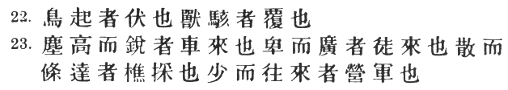

22\. The rising of birds in their flight is the sign of an
ambuscade. [1](#fn_473.md) Startled beasts
indicate that a sudden attack is coming. [2](#fn_474.md)

23\. When there is dust rising in a high column, it is the sign of
chariots advancing; when the dust is low, but spread over a wide area,
it betokens the approach of infantry. [3](#fn_475.md) When it branches out in different
directions, it shows that parties have been sent to collect
firewood. [4](#fn_476.md)

p. 90

 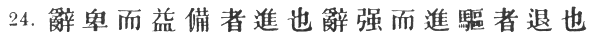

\[paragraph continues\] A few clouds of
dust moving to and fro signify that the army is encamping. [1](#fn_478.md)

24\. Humble words and increased preparations are signs that the enemy is
about to advance. [2](#fn_479.md)

p. 91

 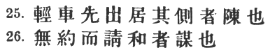

\[paragraph continues\] Violent language
and driving forward as if to the attack are signs that he will
retreat. [1](#fn_480.md) When the light
chariots [2](#fn_481.md) come out first and take
up a position on the wings, it is a sign that the enemy is forming for
battle. [3](#fn_482.md)

26\. Peace proposals unaccompanied by a sworn covenant indicate a
plot. [4](#fn_483.md)

p. 92

 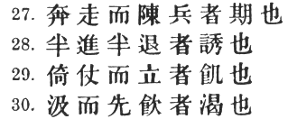

27\. When there is much running about [1](#fn_484.md) and the soldiers fall into rank, [2](#fn_485.md) it means that the critical moment has
come. [3](#fn_486.md)

28\. When some are seen advancing and some retreating, it is a
lure. [4](#fn_487.md)

29\. When the soldiers stand leaning on their spears, they are faint
from want of food. [5](#fn_488.md)

30\. If those who are sent to draw water begin by drinking themselves,
the army is suffering from thirst. [6](#fn_489.md)

p. 93

 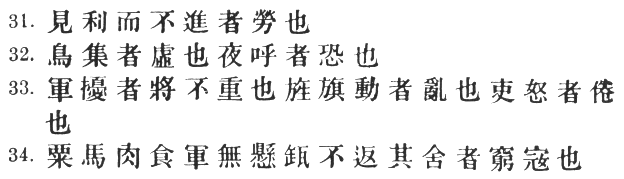

31\. If the enemy sees an advantage to be gained [1](#fn_490.md) and makes no effort to secure it, the
soldiers are exhausted.

32\. If birds gather on any spot, it is unoccupied. [2](#fn_491.md) Clamour by night betokens
nervousness. [3](#fn_492.md)

33\. If there is disturbance in the camp, the general's authority is
weak. If the banners and flags are shifted about, sedition is
afoot. [4](#fn_493.md) If the officers are angry,
it means that the men are weary. [5](#fn_494.md)

34\. When an army feeds its horses with grain and kills its cattle for
food, [6](#fn_495.md) and when the men do not hang
their cooking-pots [7](#fn_496.md)

p. 94

 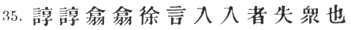

over the camp-fires, showing that they will not return to their
tents, [1](#fn_497.md) you may know that they are
determined to fight to the death. [2](#fn_498.md)

35\. The sight of men whispering together [3](#fn_499.md) in small knots [4](#fn_500.md)

p. 95

 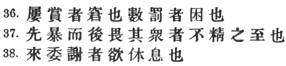

or speaking in subdued tones [1](#fn_501.md)
points to disaffection amongst the rank and file. [2](#fn_502.md)

36\. Too frequent rewards signify that the enemy is at the end of his
resources; [3](#fn_503.md) too many punishments
betray a condition of dire distress. [4](#fn_504.md)

37\. To begin by bluster, but afterwards to take fright at the enemy's
numbers, shows a supreme lack of intelligence. [5](#fn_505.md)

38\. When envoys are sent with compliments in their mouths, it is a sign
that the enemy wishes for a truce. [6](#fn_506.md)

p. 96

 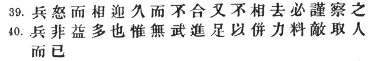

39\. If the enemy's troops march up angrily and remain facing ours for a
long time without either joining battle or taking themselves off again,
the situation is one that demands great vigilance and
circumspection. [1](#fn_507.md)

40\. If our troops are no more in number than the enemy, that is amply
sufficient; [2](#fn_508.md) it only means that no
direct attack can be made. [3](#fn_509.md) What we
can do is simply to concentrate all our available strength, keep a close
watch on the enemy, and obtain reinforcements. [4](#fn_510.md)

p. 97

 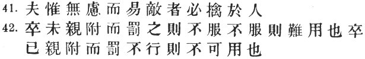

41\. He who exercises no forethought but makes light of his opponents is
sure to be captured by them. [1](#fn_511.md)

42\. If soldiers are punished before they have grown

p. 98

 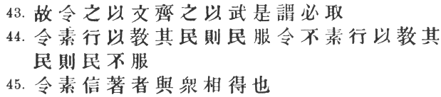

attached to you, they will not prove submissive; and, unless submissive,
they will be practically useless. If, when the soldiers have become
attached to you, punishments are not enforced, they will still be
useless. [1](#fn_512.md)

43\. Therefore soldiers must be treated in the first instance with
humanity, but kept under control by means of iron discipline. [2](#fn_513.md) This is a certain road to victory.

44\. If in training soldiers commands are habitually enforced, the army
will be well-disciplined; if not, its discipline will be bad. [3](#fn_514.md)

45\. If a general shows confidence in his men but always insists on his
orders being obeyed, [4](#fn_515.md)

p. 99

the gain will be mutual. [1](#fn_516.md)

------------------------------------------------------------------------

### Footnotes

[80:1](aow17.htm#fr_434.md) The contents of this
interesting chapter are better indicated in § 1 than by this heading.

[80:2](aow17.htm#fr_435.md) The discussion of \#,
as Chang Yü points out, extends from here down to \# (§§ 1–17), and \#
from that point down to \# (§§ 18–39). The rest of the chapter consists
of a few desultory remarks, chiefly on the subject of discipline.

[80:3](aow17.htm#fr_436.md) For this use of \#,
cf. *infra*, § 3. See also \#, ch. 1. fol. 2 (standard edition of 1876):
\#; *Shih Chi*, ch. 27 *ad init*.: \#.

[80:4](aow17.htm#fr_437.md) Tu Mu says that \#
here = \#. The idea is, not to linger among barren uplands, but to keep
close to supplies of water and grass. Capt. Calthrop translates "camp in
valleys," heedless of the very next sentence. Cf. Wu Tzŭ, ch. 3: \#
"Abide not in natural ovens," *i.e.* \# "the openings of large valleys."
Chang Yü tells the following anecdote: "\# Wu-tu Ch‘iang was a robber
captain in the time of the Later Han, and \# Ma Yüan was sent to
exterminate his gang. Ch‘iang having found a refuge in the hills, Ma
Yüan made no attempt to force a battle, but seized all the favourable
positions commanding supplies of water and forage. Ch‘iang was soon in
such a desperate plight for want of provisions that he was forced to
make a total surrender. He did not know the advantage of keeping in the
neighbourhood of valleys."

[81:1](aow17.htm#fr_438.md) Not on high hills, but
on knolls or hillocks elevated above the surrounding country.

[81:2](aow17.htm#fr_439.md) \#. Tu Mu takes this
to mean "facing south," and Ch‘ên Hao "facing east." Cf. *infra*, §§ 11,
53.

[81:3](aow17.htm#fr_440.md) \# here simply
equivalent to \#. The *T‘ung Tien* and *Yü Lan* read \#.

[81:4](aow17.htm#fr_441.md) After \#, the *T‘ung
Tien* and *Yü Lan* insert \#.

[81:5](aow17.htm#fr_442.md) "In order to tempt the
enemy to cross after you," according to Ts‘ao Kung, and also, says Chang
Yü, "in order not to be impeded in your evolutions." The *T‘ung Tien*
reads \# If *the enemy* crosses a river," etc. But in view of the next
sentence, this is almost certainly an interpolation.

[81:6](aow17.htm#fr_443.md) The *T‘ung Tien* and
*Yü Lan* read \# for \#, without change of meaning. Wu Tzŭ plagiarises
this passage twice over:—ch. II *ad fin*., \#; ch. V, \#. Li Ch‘üan
alludes to the great victory won by Han Hsin over \# Lung Chü at the \#
Wei River. Turning to the *Ch‘ien Han Shu*, ch. 34, fol. 6 *verso*, we
find the battle described as follows: "The two armies were drawn up on
opposite sides of the river. In the night, Han Hsin ordered his men to
take some ten thousand sacks filled with sand and construct a dam a
little higher up. Then, leading half his army across, he attacked p. 82 Lung Chü; but after a time, pretending to have
failed in his attempt, he hastily withdrew to the other bank. Lung Chü
was much elated by this unlooked-for success, and exclaiming: "I felt
sure that Han Hsin was really a coward!" he pursued him and began
crossing the river in his turn. Han Hsin now sent a party to cut open
the sandbags, thus releasing a great volume of water, which swept down
and prevented the greater portion of Lung Chü's army from getting
across. He then turned upon the force which had been cut off, and
annihilated it, Lung Chü himself being amongst the slain. The rest of
the army, on the further bank, also scattered and fled in all
directions."

[82:1](aow17.htm#fr_444.md) For fear of preventing
his crossing. Capt. Calthrop makes the injunction ridiculous by omitting
a \#.

[82:2](aow17.htm#fr_445.md) See *supra*, § 2. The
repetition of these words in connection with water is very awkward.
Chang Yü has the note: \# "Said either of troops marshalled on the
river-bank, or of boats anchored in the stream itself; in either case it
is essential to be higher than the enemy and facing the sun." The other
commentators are not at all explicit. One is much tempted to reject
their explanation of \# altogether, and understand it simply as "seeking
safety." \[Cf. \# in VIII. § 12, and *infra*, § 9.\] It is true that
this involves taking \# in an unusual, though not, I think, an
impossible tense. Of course the earlier passage would then have to be
translated in like manner.

[82:3](aow17.htm#fr_446.md) Tu Mu says: "As water
flows downwards, we must not pitch our camp on the lower reaches of a
river, for fear the enemy should open the sluices and sweep us away in a
flood. This is implied above in the words \#. Chu-ko Wu-hou has remarked
that 'in river warfare we must not advance against the stream,' which is
as much as to say that our fleet must not be anchored below that of the
enemy, for then they would be able to take advantage of the current and
make short work of us." There is also the danger, noted by other
commentators, p. 83 that the enemy now throw
poison on the water to be carried down to us. Capt. Calthrop's first
version was: "Do not cross rivers in the face of the stream"—a sapient
piece of advice, which made one curious to know what the correct way of
crossing rivers might be. He has now improved this into: "Do not fight
when the enemy is between the army and the source of the river."

[83:1](aow17.htm#fr_447.md) Because of the lack of
fresh water, the poor quality of the herbage, and last but not least,
because they are low, flat, and exposed to attack.

[83:2](aow17.htm#fr_448.md) Li Ch‘üan remarks that
the ground is less likely to be treacherous where there are trees, while
Tu Yu says that they will serve to protect the rear. Capt. Calthrop,
with a perfect genius for going wrong, says "in the neighbourhood of a
marsh." For \# the *T‘ung Tien* and *Yü Lan* wrongly read \#, and the
latter also has \# instead of \#.

[83:3](aow17.htm#fr_449.md) This is doubtless the
force of \#, its opposite being \#. Thus, Tu Mu explains it as \#
"ground that is smooth and firm," and therefore adapted for cavalry;
Chang Yü as \# "level ground, free from depressions and hollows." He
adds later on that although Sun Tzŭ is discussing flat country, there
will nevertheless be slight elevations and hillocks. p. 84

The *Yü Lan* again reads \# for \#. Tu Mu quotes T‘ai Kung as saying:
"An army should have a stream or a marsh on its left, and a hill or
tumulus on its right."

[84:1](aow17.htm#fr_450.md) Wang Hsi thinks that
\# contradicts the saying \# in § 2, and therefore suspects a mistake in
the text.

[84:2](aow17.htm#fr_451.md) Those, namely,
concerned with (1) mountains, (2) rivers, (3) marshes, and (4) plains.
Compare Napoleon's "Military Maxims," no. 1.

[84:3](aow17.htm#fr_452.md) Mei Yao-ch‘ên asks,
with some plausibility, whether \# is not a mistake for \# "armies," as
nothing is known of Huang Ti having conquered four other Emperors. The
*Shih Chi*, (ch. I *ad init*.) speaks only of his victories over \# Yen
Ti and \# Ch‘ih Yu. In the \# it is mentioned that he "fought seventy
battles and pacified the Empire." Ts‘ao Kung's explanation is, that the
Yellow Emperor was the first to institute the feudal system of vassal
princes, each of whom (to the number of four) originally bore the title
of Emperor. Li Ch‘üan tells us that the art of war originated under
Huang Ti, who received it from his Minister \# Fêng Hou.

[84:4](aow17.htm#fr_453.md) "High ground," says
Mei Yao-ch‘ên, "is not only more agreeable and salubrious, but more
convenient from a military point of view; low ground is not only damp
and unhealthy, but also disadvantageous for fighting." The original text
and the *T‘u Shu* have \# instead of \#.

[84:5](aow17.htm#fr_454.md) Ts‘ao Kung says: \#
"Make for fresh water and pasture, where you can turn out your animals
to graze." And p. 85 the other commentators
follow him, apparently taking \# as = \#. Cf. Mencius, V. 1. ix. 1,
where \# means a cattle-keeper. But here \# surely has reference to the
health of the troops. It is the title of Chuang Tzŭ's third chapter,
where it denotes moral rather than physical well-being.

[85:1](aow17.htm#fr_455.md) \# must mean dry and
solid, as opposed to damp and marshy, ground. This is to be found as a
rule in high places, so the commentators explain \# as practically
equivalent to \#.

[85:2](aow17.htm#fr_456.md) Chang Yü says: "The
dryness of the climate will prevent the outbreak of illness."

[85:3](aow17.htm#fr_457.md) The *T‘ung Tien* and
*Yü Lan* have a superfluous \# before \#.

[85:4](aow17.htm#fr_458.md) \#, explained by Mei
Yao-ch‘ên as \#.

[85:5](aow17.htm#fr_459.md) \#, explained as \#
"places enclosed on every side by steep banks, with pools of water at
the bottom."

[85:6](aow17.htm#fr_460.md) p.
86 \# "natural pens or prisons," explained as \# "places
surrounded by precipices on three sides—easy to get into, but hard to
get out of."

[86:1](aow17.htm#fr_461.md) \#, explained as \#
"places covered with such dense undergrowth that spears cannot be used."

[86:2](aow17.htm#fr_462.md) \#, explained as \#
"low-lying places, so heavy with mud as to be impassible for chariots
and horsemen."

[86:3](aow17.htm#fr_463.md) is explained by Mei
Yao-ch‘ên as \# "a narrow difficult way between beetling cliffs," but
Ts‘ao Kung says \#, which seems to denote something on a much smaller
scale. Tu Mu's note is \# "ground covered with trees and rocks, and
intersected by numerous ravines and pitfalls." This is very vague, but
Chia Lin explains it clearly enough as a defile or narrow pass: \#, and
Chang Yü takes much the same view. On the whole, the weight of the
commentators certainly inclines to the rendering "defile". But the
ordinary meaning of \# (a crack or fissure) and the fact that \# above
must be something in the nature of a defile, make me think that Sun Tzŭ
is here speaking of crevasses. The *T‘ung Tien* and *Yü Lan* read \# for
\#, with the same meaning; the latter also has \# after \#—a palpable
gloss.

[86:4](aow17.htm#fr_464.md) The original text has
\#, but \# has been generally adopted as yielding much better sense.

[87:1](aow17.htm#fr_465.md) \# is \#, according to
Chang Yü.

[87:2](aow17.htm#fr_466.md) The original text
omits \# and \#, so that \# and \# join to make a pair: "ponds and
basins." This is plausible enough at first sight, but there are several
objections to the : (1) \# is unlikely to have got into the text as a
gloss on \#; (2) it is easy to suppose, on the other hand, that \# and
afterwards \# (to restore the balance of the sentence) were omitted by a
copyist who jumped to the conclusion that \# and \# must go together;
(3) the sense, when one comes to consider it, actually requires \#, for
it is absurd to talk of pools and ponds as in themselves suitable places
for an ambush; (4) Li Ching (571–649 A.D.) in his \# "Art of War" has
the words: \#. This is evidently a reminiscence of Sun Tzŭ, so there can
be little doubt that \# stood in the text at this early date. It may be
added that the *T‘ung Tien* and *Yü Lan* both have \#, and the latter
also reads \# for \#.

[87:3](aow17.htm#fr_467.md) I read \# with the *Yü
Lan* in preference to \#, given in the original text, which is accepted
by the commentators without question. The text of the *T‘u Shu* up to
this point runs as follows: \#.

[87:4](aow17.htm#fr_468.md) The original text
omits \#, which has been restored from the *T‘ung Tien* and *Yü Lan*.
The *T‘u Shu* omits \# as well, making \# a substantive. On \# Chang Yü
has the note: \# "We must also be on our guard against traitors who may
lie in close covert, secretly spying out our weaknesses and overhearing
our instructions. *Fu* and *chien* are to be taken separately."

[87:5](aow17.htm#fr_469.md) p.
88 Here begin Sun Tzŭ's remarks on the reading of signs, much of
which is so good that it could almost be included in a modern manual
like Gen. Baden-Powell's "Aids to Scouting."

[88:1](aow17.htm#fr_470.md) Probably because we
are in a strong position from which he wishes to dislodge us. "If he
came close up to us," says Tu Mu, "and tried to force a battle, he would
seem to despise us, and there would be less probability of our
responding to the challenge."

[88:2](aow17.htm#fr_471.md) \# is here the
opposite of \# in § 18. The reading of the *T‘ung Tien* and *Yü Lan*,
\#, is pretty obviously corrupt. The original text, which transposes \#
and \#, may very possibly be right. Tu Mu tells us that there is yet
another reading: \#.

[88:3](aow17.htm#fr_472.md) Ts‘ao Kung explains
this as "felling trees to clear a passage," and Chang Yü says: "Every
army sends out scouts to climb high places and observe the enemy. If a
scout sees that the trees of a forest are moving and shaking, he may
know that they are being cut down to clear a passage for the enemy's
march."

[88:4](aow17.htm#fr_473.md) Whenever the meaning
of a passage happens to be somewhat elusive, Capt. Calthrop seems to
consider himself justified in giving free rein to the imagination. Thus,
though his text is here identical with ours, he renders the above:
"Broken branches and trodden grass, as of the passing of a large host,
must be regarded with suspicion." Tu Yu's explanation, borrowed from
Ts‘ao Kung, is as follows: "The presence of a number of screens or sheds
in the midst of thick vegetation is a sure sign that the enemy has fled
and, fearing pursuit, has constructed these hiding-places p. 89 in order to make us suspect an ambush." It
appears that these "screens" were hastily knotted together out of any
long grass which the retreating enemy happened to come across.

[89:1](aow17.htm#fr_474.md) Chang Yü's explanation
is doubtless right: "When birds that are flying along in a straight line
suddenly shoot upwards, it means that soldiers are in ambush at the spot
beneath."

[89:2](aow17.htm#fr_475.md) An example of \#
*fou*4 in the meaning of "ambuscade" may be found in the *Tso
Chuan*, \# 9th year: \#. In the present passage, however, it
is to be distinguished from \# just above, in that it implies onward
motion on the part of the attacking force. Thus, Li Ch‘üan defines it as
\#, and Tu Mu as \#.

[89:3](aow17.htm#fr_476.md) \# "high and sharp,"
or rising to a peak, is of course somewhat exaggerated as applied to
dust. The commentators explain the phenomenon by saying that horses and
chariots, being heavier than men, raise more dust, and also follow one
another in the same wheel-track, whereas foot-soldiers would be marching
in ranks, many abreast. According to Chang Yü, "every army on the march
must have scouts (\#) some way in advance, who on sighting dust raised
by the enemy, will gallop back and report it to the commander-in-chief."
Cf. Gen. Baden-Powell: "As you move along, say, in a hostile country,
your eyes should be looking afar for the enemy or any signs of him:
figures, .dust rising, birds getting up, glitter of arms, etc." [\*](#fn_477.md)

[89:4](aow17.htm#fr_477.md) There is some doubt
about the reading \#. The *T‘ung Tien* and *Yü Lan* have \#, and Li
Ch‘üan proposes \#.

[89:\*](aow17.htm#fr_478.md) "Aids to Scouting,"
p. 26.

[90:1](aow17.htm#fr_479.md) Chang Yü says: "In
apportioning the defences for a cantonment, light horse will be sent out
to survey the position and ascertain the weak and strong points all
along its circumference. Hence the small quantity of dust and its
motion."

[90:2](aow17.htm#fr_480.md) "As though they stood
in great fear of us," says Tu Mu. "Their object is to make us
contemptuous and careless, after which they will attack us." Chang Yü
alludes to the story of \# T‘ien Tan of the Ch‘i State, who in 279 B.C.
was hard-pressed in his defence of \# Chi-mo against the Yen forces, led
by \# Ch‘i Chieh. In ch. 82 of the *Shih Chi* we read: "T‘ien Tan openly
said: 'My only fear is that the Yen army may cut off the noses of their
Ch‘i prisoners and place them in the front rank to fight against us;
that would be the undoing of our city.' The other side being informed of
this speech, at once acted on the suggestion; but those within the city
were enraged at seeing their fellow-countrymen thus mutilated, and
fearing only lest they should fall into the enemy's hands, were nerved
to defend themselves more obstinately than ever. Once again T‘ien Tan
sent back converted spies who reported these words to the enemy: 'What I
dread most is that the men of Yen may dig up the ancestral tombs outside
the town, and by inflicting. this indignity on our forefathers cause us
to become faint-hearted.' Forthwith the besiegers dug up all the graves
and burned the corpses lying in them. And the inhabitants of Chi-mo,
witnessing the outrage from the city-walls, wept passionately and were
all impatient to go out and fight, their fury being increased tenfold.
T‘ien Tan knew then that his soldiers were ready for any enterprise. But
instead of a sword, he himself took a mattock in his hands, and ordered
others to be distributed amongst his best warriors, while the ranks were
filled up with their wives and concubines. He then served out all the
remaining rations and bade his men eat their fill. The regular soldiers
were told to keep out of sight, and the walls were manned with the old
and weaker men and with women. This done, envoys were despatched to the
enemy's camp to arrange terms of surrender, whereupon the Yen army began
shouting for joy. T‘ien Tan also collected 20,000 ounces of silver from
the people, and got the wealthy citizens of Chi-mo to send it to the Yen
general with the prayer that, when the town capitulated, he would not
allow their homes to be plundered or their women to be maltreated. Ch‘i
Chieh, in high good humour, granted their prayer; but his army now
became increasingly slack and p. 91 careless.
Meanwhile, T‘ien Tan got together a thousand oxen, decked them with
pieces of red silk, painted their bodies, dragon-like, with coloured
stripes, and fastened sharp blades on their horns and well-greased
rushes on their tails. When night came on, he lighted the ends of the
rushes, and drove the oxen through a number of holes which he had
pierced in the walls, backing them up with a force of 5000 picked
warriors. The animals, maddened with pain, dashed furiously into the
enemy's camp where they caused the utmost confusion and dismay; for
their tails acted as torches, showing up the hideous pattern on their
bodies, and the weapons on their horns killed or wounded any with whom
they came into contact In the meantime, the band of 5000 had crept up
with gags in their mouths, and now threw themselves on the enemy. At the
same moment a frightful din arose in the city itself, all those that
remained behind making as much noise as possible by banging drums and
hammering on bronze vessels, until heaven and earth were convulsed by
the uproar. Terror-stricken, the Yen army fled in disorder, hotly
pursued by the men of Ch‘i, who succeeded in slaying their general Ch‘i
Chieh … The result of the battle was the ultimate recovery of some
seventy cities which had belonged to the Ch‘i State."

[91:1](aow17.htm#fr_481.md) I follow the original
text here, also adopted by the *T‘u Shu*. The standard text reads \# on
the strength of Ts‘ao Kung's commentary \#, which shows that his text
included the word \#. Strong as this ground is, I do not think it can
counterbalance the obvious superiority of the other reading in point of
sense. \# not only provides no antithesis to \#, but makes the whole
passage absurd; for if the language of the enemy is calculated to
deceive, it cannot be known as deceitful at the time, and can therefore
afford no "sign." Moreover, the extra word in \# (an awkward locution,
by the way) spoils the parallelism with \#.

[91:2](aow17.htm#fr_482.md) The same, according to
Tu Yu, as the \# of II. § 1.

[91:3](aow17.htm#fr_483.md) The *T‘ung Tien* omits
\#.

[91:4](aow17.htm#fr_484.md) p.
92Tu Yu defines \# as \#, and Li Ch‘üan as \# "a treaty confirmed
by oaths and hostages." Wang Hsi and Chang Yü, on the other hand, simply
say \# "without reason," "on a frivolous pretext," as though \# bore the
rather unusual sense of "important." Capt. Calthrop has "without
consultation," which is too loose.

[92:1](aow17.htm#fr_485.md) Every man hastening to
his proper place under his own regimental banner.

[92:2](aow17.htm#fr_486.md) I follow the *T‘u Shu*
in omitting \# after \#. Tu Mu quotes the *Chou Li*, ch. xxix. fol. 31:
\#.

[92:3](aow17.htm#fr_487.md) What Chia Lin calls
\#, as opposed to \#.

[92:4](aow17.htm#fr_488.md) Capt. Calthrop is
hardly right in translating: "An advance, followed by sudden
retirement." It is rather a case of feigned confusion. As Tu Mu says:
\#.

[92:5](aow17.htm#fr_489.md) \# is here probably
not a synonym for \#, but = \# "a weapon." The original text has \#,
which has been corrected from the *T‘ung Tien* and *Yü Lan*.

[92:6](aow17.htm#fr_490.md) As Tu Mu remarks: \#
"One may know the condition of a whole army from the behaviour of a
single man." The \# may mean either that they drink before drawing water
for the army, or before they return to camp. Chang Yü takes the latter
view. The *T‘ung Tien* has the faulty reading \#, and the *Yü Lan*,
worse still, \#.

[93:1](aow17.htm#fr_491.md) Not necessarily
"booty," as Capt. Calthrop translates it. The *T‘ung Tien* and *Yü Lan*
read \#, etc.

[93:2](aow17.htm#fr_492.md) A useful fact to bear
in mind when, for instance, as Ch‘ên Hao says, the enemy has secretly
abandoned his camp.

[93:3](aow17.htm#fr_493.md) Owing to false alarms;
or, as Tu Mu explains it: \# "Fear makes men restless; so they fall to
shouting at night in order to keep up their courage." The *T‘ung Tien*
inserts \# before \#.

[93:4](aow17.htm#fr_494.md) The *T‘ung Tien* and
*Yü Lan* omit \#.

[93:5](aow17.htm#fr_495.md) And therefore, as
Capt. Calthrop says, slow to obey. Tu Yu understands the sentence
differently: "If all the officers of an army are angry with their
general, it means that they are broken with fatigue" \[owing to the
exertions which he has demanded from them\].

[93:6](aow17.htm#fr_496.md) \# is expanded by Mei
Yao-ch‘ên (following Tu Mu) into \#, which is the sense I have given
above. In the ordinary course of things, the men would be fed on grain
and the horses chiefly on grass.

[93:7](aow17.htm#fr_497.md) p.
94 The *T‘ung Tien* reads \#, which is much the same as \#, and
the *Yü Lan* \#, which is manifestly wrong.

[94:1](aow17.htm#fr_498.md) For \#, the *T‘ung
Tien* and *Yü Lan* both read \#.

[94:2](aow17.htm#fr_499.md) For \# see VII. § 36.
I may quote here the illustrative passage from the *Hou Han Shu*, ch.
71, given in abbreviated form by the *P‘ei Wên Yün Fu:* "The rebel. \#
Wang Kuo of \# Liang was besieging the town of \# Ch‘ên-ts‘ang, and \#
Huang-fu Sung, who was in supreme command, and \# Tung Cho were sent out
against him. The latter pressed for hasty measures, but Sung turned a
deaf ear to his counsel. At last the rebels were utterly worn out, and
began to throw down their weapons of their own accord. Sung was now for
advancing to the attack, but Cho said: 'It is a principle of war not to
pursue desperate men and not to press a retreating host.' Sung answered:
'That does not apply here. What I am about to attack is a jaded army,
not a retreating host; with disciplined troops I am falling on a
disorganised multitude, not a band of desperate men.' Thereupon he
advanced to the attack unsupported by his colleague, and routed the
enemy, Wang Kuo being slain." The inferior reading of the *T‘u Shu* for
§ 34 is as follows: \#. The first clause strikes me as rather shallow
for Sun Tzŭ and it is hard to make anything of \# in the second without
the negative. Capt. Calthrop, nothing daunted, set down in his first
edition: "When they *cast away* their cooking-pots." He now has: "When
the cooking-pots are hung up on the wall."

[94:3](aow17.htm#fr_500.md) \# is well explained
by Tu Mu as \# "speaking with bated breath."

[94:4](aow17.htm#fr_501.md) The *Shuo Wên* rather
strangely defines \# by the word \#, but the *Êrh Ya* says \# "to join"
or "contract," which is undoubtedly its primary meaning. Chang Yü is
right, then, in explaining it here by the word \#. The other
commentators are very much at sea: Ts‘ao Kung says \#, Tu Yu \#,  Tu Mu
\#, Chia Lin \#, Mei Yao-ch‘ên \#, Wang Hsi \#.

[95:1](aow17.htm#fr_502.md) \# is said to be the
same as \#.

[95:2](aow17.htm#fr_503.md) \# is equivalent to
\#, the subject of course being "the general," understood. In the
original text, which seems to be followed by several commentators, the
whole passage stands thus: \#. Here it would be the general who is
talking to his men, not the men amongst themselves. For \#, which is the
chief stumbling-block in the way of this reading, the *T‘u Shu* gives
the very plausible emendation \# (also read *hsi*, and defined by K‘ang
Hsi as \# "to speak fast"). But this is unnecessary if we keep to the
standard text.

[95:3](aow17.htm#fr_504.md) Because, when an army
is hard pressed, as Tu Mu says, there is always a fear of mutiny, and
lavish rewards are given to keep the men in good temper.

[95:4](aow17.htm#fr_505.md) Because in such case
discipline becomes relaxed, and unwonted severity is necessary to keep
the men to their duty.

[95:5](aow17.htm#fr_506.md) I follow the
interpretation of Ts‘ao Kung: \#, also adopted by Li Ch‘üan, Tu Mu and
Chang Yü. Another possible meaning, set forth by Tu Yu, Chia Lin, Mei
Yao-ch‘ên and Wang Hsi, is: "The general who is first tyrannical towards
his men, and then in terror lest they should mutiny, etc." This would
connect the sentence with what went before about rewards and
punishments. The *T‘ung Tien* and *Yü Lan* read \# "affection" instead
of \#.

[95:6](aow17.htm#fr_507.md) p.
96 Tu Mu says: \# "If the enemy open friendly relations by
sending hostages, it is a sign that they are anxious for an armistice,
either because their strength is exhausted or for some other reason."
But it hardly needs a Sun Tzŭ to draw such an obvious inference; and
although Tu Mu is supported by Mei Yao-ch‘ên and Chang Yü, I cannot
think that hostages are indicated by the word \#.

[96:1](aow17.htm#fr_508.md) Capt. Calthrop falls
into a trap which often lurks in the word \#. He translates: "When both
sides, eager for a fight, face each other for a considerable time,
neither advancing nor retiring," etc. Had he reflected a little, he
would have seen that this is meaningless as addressed to a commander who
has control over the movements of his own troops. \#, then, does not
mean that the two armies go to meet each other, but simply that the
other side comes up to us. Likewise with \#. If this were not perfectly
clear of itself, Mei Yao-ch‘ên's paraphrase would make it so: \#, etc.
As Ts‘ao Kung points out, a manœuvre of this sort may be only a *ruse*
to gain time for an unexpected flank attack or the laying of an ambush.

[96:2](aow17.htm#fr_509.md) Wang Hsi's paraphrase,
partly borrowed from Ts‘ao Kung, is \#. Another reading, adopted by Chia
Liu and the *T‘u Shu*, is \# which Capt. Calthrop renders, much too
loosely: "Numbers are no certain mark of strength."

[96:3](aow17.htm#fr_510.md) Literally, "no martial
advance." That is to say, \# "*chêng*" tactics and frontal attacks must
be eschewed, and stratagem resorted to instead.

[96:4](aow17.htm#fr_511.md) p.
97 This is an obscure sentence, and none of the commentators
succeed in squeezing very good sense out of it. The difficulty lies
chiefly in the words \#, which have been taken in every possible way. I
follow Li Ch‘üan, who appears to offer the simplest explanation: \#
"Only the side that gets more men will win." Ts‘ao Kung's note, concise
as usual to the verge of incomprehensibility, is \#. Fortunately we have
Chang Yü to expound its meaning to us in language which is lucidity
itself: \# "When the numbers are even, and no favourable opening
presents itself, although we may not be strong enough to deliver a
sustained attack, we can find additional recruits amongst our sutlers
and camp-followers, and then, concentrating our forces and keeping a
close watch on the enemy, contrive to snatch the victory. But we must
avoid borrowing foreign soldiers to help us." He then quotes from Wei
Liao Tzŭ, ch. 3: \# "The nominal strength of mercenary troops may be
100,000, but their real value will be not more than half that figure."
According to this interpretation, \# means "to get recruits," not from
outside, but from the tag-rag and bobtail which follows in the wake of a
large army. This does not sound a very soldierly suggestion, and I feel
convinced that it is not what Sun Tzŭ meant. Chia Lin, on the other
hand, takes the words in a different sense altogether, namely "to
conquer the enemy" \[cf. I § 20\]. But in that case they could hardly be
followed by \#. Better than this would be the rendering "to make
isolated captures," as opposed to \# "a general attack."

[97:1](aow17.htm#fr_512.md) The force of \# is not
easy to appreciate. Ch‘ên Hao says \#, thus referring \# to the second
verb. He continues, quoting from the *Tso Chuan*: \# "If bees and
scorpions carry poison, how much more will a hostile state! \[\#, XXII.
3.\] Even a puny opponent, then, should not be treated with contempt."

[98:1](aow17.htm#fr_513.md) This is wrongly
translated by Capt. Calthrop: "If the troops know the general, but are
not affected by his punishments, they are useless."

[98:2](aow17.htm#fr_514.md) \# and \#, according
to Ts‘ao Kung, are here equivalent to \# and \# respectively. Compare
our two uses of the word "civil." Yen Tzŭ \[† B.C. 493\] said of \# Ssŭ
ma Jang-chü: \# "His civil virtues endeared him to the people; his
martial prowess kept his enemies in awe." Cf. Wu Tzŭ, ch. 4 *init*.: \#
"The ideal commander unites culture with a warlike temper; the
profession of arms requires a combination of hardness and tenderness."
Again I must find fault with Capt. Calthrop's translation: "By humane
treatment we obtain obedience; authority brings uniformity."

[98:3](aow17.htm#fr_515.md) The *T‘ung Tien* and
*Yü Lan* read: \#.

[98:4](aow17.htm#fr_516.md) The original text has
\#. \# is certainly awkward without \#, but on the other hand it is
clear that Tu Mu accepted the *T‘ung Tien* text, which is identical with
ours. He says: "A general ought p. 99 in time
of peace to show kindly confidence in his men and also make his
authority respected, so that when they come to face the enemy, orders
may be executed and discipline maintained, because they all trust and
look up to him." What Sun Tzŭ has said in § 44, however, would lead one
rather to expect something like this: "If a general is always confident
that his orders will be carried out," etc. Hence I am tempted to think
that he may have written \#. But this is perhaps too conjectural.

[99:1](aow17.htm#fr_517.md) Chang Yü says: \# "The
general has confidence in the men under his command, and the men are
docile having confidence in him. Thus the gain is mutual." He quotes a
pregnant sentence from Wei Liao Tzŭ, ch. 4: \# "The art of giving orders
is not to try to rectify minor blunders and not to be swayed by petty
doubts" Vacillation and fussiness are the surest means of sapping the
confidence of an army. Capt. Calthrop winds up the chapter with a final
mistranslation of a more than usually heinous description: "Orders are
always obeyed, if general and soldiers are in sympathy." Besides
inventing the latter half of the sentence, he has managed to invert
protasis and apodosis.

------------------------------------------------------------------------

[Next: X. Terrain](aow18.md)
