  
[Intangible Textual Heritage](../../index)  [Taoism](../index) 
[Confucianism](../../cfu/index)  [Index](index)  [Previous](aow18) 
[Next](aow20) 

------------------------------------------------------------------------

[Buy this Book at
Amazon.com](https://www.amazon.com/exec/obidos/ASIN/1934255122/internetsacredte)

------------------------------------------------------------------------

  
*The Art of War*, by Lionel Giles, \[1910\], at Intangible Textual
Heritage

------------------------------------------------------------------------

p. 114

 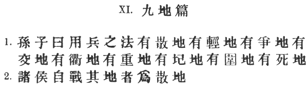

### XI. THE NINE SITUATIONS [1](#fn_576).

1\. Sun Tzŭ said: The art of war recognises nine varieties of ground:
(1) Dispersive ground; (2) facile ground; (3) contentious ground; (4)
open ground; (5) ground of intersecting highways; (6) serious ground;
(7) difficult ground; (8) hemmed-in ground; (9) desperate ground.

2\. When a chieftain is fighting in his own territory, it is dispersive
ground. [2](#fn_577)

p. 115

 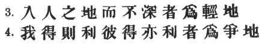

3\. When he has penetrated into hostile territory, but to no great
distance, it is facile ground. [1](#fn_578)

4\. Ground the possession of which imports great advantage to either
side, is contentious ground. [2](#fn_579)

p. 116

 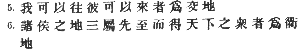

5\. Ground on which each side has liberty of movement is open
ground. [1](#fn_580)

6\. Ground which forms the key to three contiguous states, [2](#fn_581) so that he who occupies it first has
most of the Empire at his command, [3](#fn_582)
is ground of intersecting highways. [4](#fn_583)

p. 117

 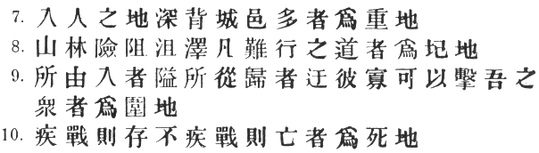

7\. When an army has penetrated into the heart of a hostile country,
leaving a number of fortified cities in its rear, [1](#fn_584) it is serious ground. [2](#fn_585)

8\. Mountain forests, [3](#fn_586) rugged
steeps, marshes and fens—all country that is hard to traverse: this is
difficult ground. [4](#fn_587)

9\. Ground which is reached through narrow gorges, and from which we can
only retire by tortuous paths, so that a small number of the enemy would
suffice to crush a large body of our men: this is hemmed-in ground.

10\. Ground on which we can only be saved from destruction by fighting
without delay, is desperate ground. [5](#fn_588)

p. 118

 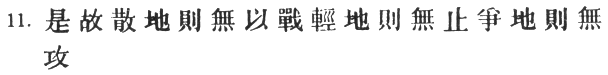

11\. On dispersive ground, therefore, fight not. On facile ground, halt
not. On contentious ground, attack not. [1](#fn_589)

p. 119

 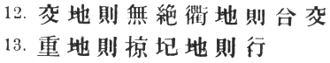

12\. On open ground, do not try to block the enemy's way. [1](#fn_590) On ground of intersecting highways, join
hands with your allies. [2](#fn_591)

13\. On serious ground, gather in plunder. [3](#fn_592)

p. 120

 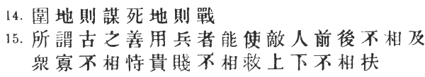

\[paragraph continues\] In difficult
ground, keep steadily on the march. [1](#fn_593)

14\. On hemmed-in ground, resort to stratagem. [2](#fn_594) On desperate ground, fight. [3](#fn_595)

15\. Those who were called skilful leaders of old [4](#fn_596) knew how to drive a wedge between the
enemy's front and rear; [5](#fn_597)

p. 121

 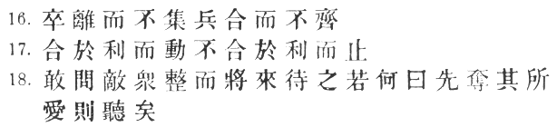

to prevent co-operation between his large and small divisions; to hinder
the good troops from rescuing the bad, [1](#fn_598) the officers from rallying their
men. [2](#fn_599)

16\. When the enemy's men were scattered, they prevented them from
concentrating; [3](#fn_600) even when their
forces were united, they managed to keep them in disorder. [4](#fn_601)

17\. When it was to their advantage, they made a forward move; when
otherwise, they stopped still. [5](#fn_602)

18\. If asked how to cope with a great host of the enemy in orderly
array and on the point of marching to the attack, [6](#fn_603) I should say: "Begin by seizing
something which your opponent holds dear; then he will be amenable to
your will." [7](#fn_604)

p. 122

 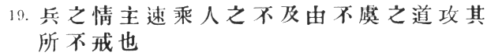

19\. Rapidity is the essence of war: [1](#fn_605)

p. 123

 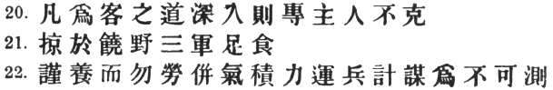

take advantage of the enemy's unreadiness, make your way by unexpected
routes, and attack unguarded spots.

20\. The following are the principles to be observed by an invading
force: The further you penetrate into a country, the greater will be the
solidarity of your troops, and thus the defenders will not prevail
against you.

21\. Make forays in fertile country in order to supply your army with
food. [1](#fn_606)

22\. Carefully study the well-being of your men, [2](#fn_607)

p. 124

and do not overtax them. Concentrate your energy and hoard your
strength. [1](#fn_608) Keep your army
continually on the move, [2](#fn_609) and
devise unfathomable plans. [3](#fn_610)

p. 125

 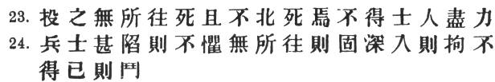

23\. Throw your soldiers into positions whence there is no escape, and
they will prefer death to flight. [1](#fn_611)
If they will face death, there is nothing they may not achieve. [2](#fn_612) Officers and men alike will put forth
their uttermost strength [3](#fn_613)

24\. Soldiers when in desperate straits lose the sense of fear. If there
is no place of refuge, they will stand firm. If they are in the heart of
a hostile country, they will show a stubborn front. [4](#fn_614) If there is no help for it, they will
fight hard.

p. 126

 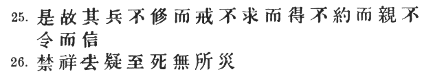

25\. Thus, without waiting to be marshalled, the soldiers will be
constantly on the *qui vive;* [1](#fn_615)
without waiting to be asked, they will do your will; [2](#fn_616) without restrictions, they will be
faithful; [3](#fn_617) without giving orders,
they can be trusted. [4](#fn_618)

26\. Prohibit the taking of omens, and do away with superstitious
doubts. [5](#fn_619) Then, until death itself
comes, no calamity need be feared. [6](#fn_620)

p. 127

 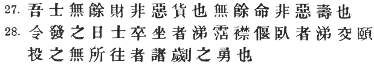

27\. If our soldiers are not overburdened with money, it is not because
they have a distaste for riches; if their lives are not unduly long, it
is not because they are disinclined to longevity. [1](#fn_621)

28\. On the day they are ordered out to battle, your soldiers may
weep, [2](#fn_622) those sitting up bedewing
their garments, and those lying down letting the tears run down their
cheeks. [3](#fn_623)

p. 128

 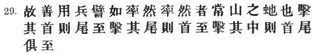

\[paragraph continues\] But let them once
be brought to bay, and they will display the courage of a Chu or a
Kuei. [1](#fn_625)

29\. The skilful tactician may be likened to the *shuai-jan*. Now the
*shuai-jan* is a snake that is found in the Ch‘ang mountains. [2](#fn_626)

p. 129

 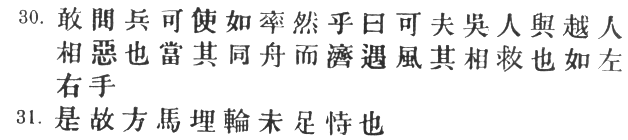

\[paragraph continues\] Strike at its
head, and you will be attacked by its tail; strike at its tail, and you
will be attacked by its head; strike at its middle. [1](#fn_627) and you will be attacked by head and
tail both.

30\. Asked if an army can be made to imitate the *shuai-jan*, [2](#fn_628) I should answer, Yes. For the men of Wu
and the men of Yüeh are enemies; [3](#fn_629)
yet if they are crossing a river in the same boat and are caught by a
storm, they will come to each other's assistance just as the left hand
helps the right. [4](#fn_630)

31\. Hence it is not enough to put one's trust in the tethering of
horses, [5](#fn_631) and the burying of chariot
wheels in the ground. [6](#fn_632)

p. 130

 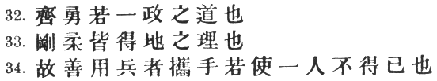

32\. The principle on which to manage an army is to set up one standard
of courage which all must reach. [1](#fn_633)

33\. How to make the best of both strong and weak—that is a question
involving the proper use of ground. [2](#fn_634)

34\. Thus the skilful general conducts his army just as though he were
leading a single man, willy-nilly, by the hand. [3](#fn_635)

p. 131

 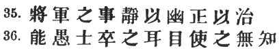

35\. It is the business of a general to be quiet and thus ensure
secrecy; upright and just, and thus maintain order. [1](#fn_637)

36\. He must be able to mystify his officers and men by false reports
and appearances, [2](#fn_638) and thus keep
them in total ignorance. [3](#fn_639)

p. 132

 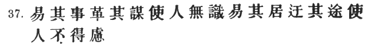

37\. By altering his arrangements and changing his plans, [1](#fn_641) he keeps the enemy without definite
knowledge. [2](#fn_642)

p. 133

 

\[paragraph continues\] By shifting his
camp and taking circuitous routes, he prevents the enemy from
anticipating his purpose. [1](#fn_643)

38\. At the critical moment, the leader of an army acts like one who has
climbed up a height and then kicks away the ladder behind him. [2](#fn_644) He carries his men deep into hostile
territory before he shows his hand. [3](#fn_645)

39\. He burns his boats and breaks his cooking-pots; [4](#fn_646) like a shepherd driving a flock of
sheep, he drives his men this way and that, and none knows whither he is
going. [5](#fn_647)

p. 134

 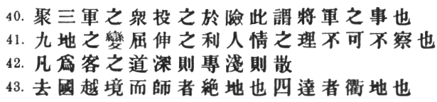

40\. To muster his host and bring it into danger:—this may be termed the
business of the general. [1](#fn_648)

41\. The different measures suited to the nine varieties of
ground; [2](#fn_649) the expediency of
aggressive or defensive tactics; [3](#fn_650)
and the fundamental laws of human nature: these are things that must
most certainly be studied.

42\. When invading hostile territory, the general principle is, that
penetrating deeply brings cohesion; penetrating but a short way means
dispersion. [4](#fn_651)

43\. When you leave your own country behind, and take your army across
neighbouring territory, [5](#fn_652) you find
yourself on critical ground. [6](#fn_654)

p. 135

 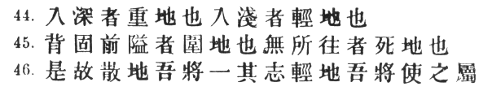

\[paragraph continues\] When there are
means of communication [1](#fn_655) on all four
sides, the ground is one of intersecting highways. [2](#fn_656)

44\. When you penetrate deeply into a country, it is serious ground.
When you penetrate but a little way, it is facile ground.

45\. When you have the enemy's strongholds on your rear, [3](#fn_657) and narrow passes in front, it is
hemmed-in ground. When there is no place of refuge at all, it is
desperate ground.

46\. Therefore, on dispersive ground, I would inspire my men with unity
of purpose. [4](#fn_658)

p. 136

 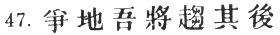

\[paragraph continues\] On facile ground,
I would see that there is close connection between all parts of my
army. [1](#fn_659)

47\. On contentious ground, I would hurry up my rear. [2](#fn_660)

p. 137

 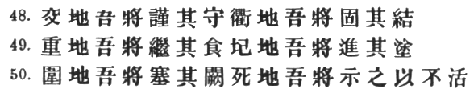

48\. On open ground, I would keep a vigilant eye on my defences. [1](#fn_661) On ground of intersecting highways, I
would consolidate my alliances. [2](#fn_662)

49\. On serious ground, I would try to ensure a continuous stream of
supplies. [3](#fn_663) On difficult ground, I
would keep pushing on along the road [4](#fn_664)

50\. On hemmed-in ground, I would block any way of retreat. [5](#fn_665)

p. 138

\[paragraph continues\] On desperate
ground, I would proclaim to my soldiers the hopelessness of saving their
lives. [1](#fn_666)

p. 139

 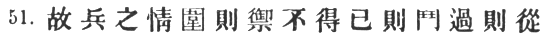

51\. For it is the soldier's disposition to offer an obstinate
resistance when surrounded, to fight hard when he cannot help himself,
and to obey promptly when he has fallen into danger. [1](#fn_667)

p. 140

 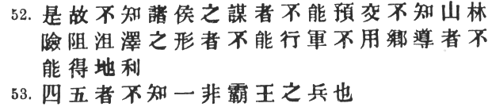

52\. We cannot enter into alliance with neighbouring princes until we
are acquainted with their designs. We are not fit to lead an army on the
march unless we are familiar with the face of the country—its mountains
and forests, its pitfalls and precipices, its marshes and swamps. We
shall be unable to turn natural advantages to account unless we make use
of local guides. [1](#fn_668)

53\. To be ignorant of any one of the following four or five
principles [2](#fn_669) does not befit a
warlike prince. [3](#fn_670)

p. 141

 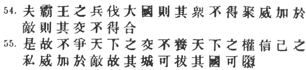

54\. When a warlike prince attacks a powerful state, his generalship
shows itself in preventing the concentration of the enemy's forces. He
overawes his opponents, [1](#fn_671) and their
allies are prevented from joining against him. [2](#fn_672)

55\. Hence he does not strive [3](#fn_673)

p. 142

 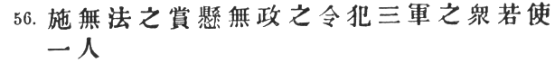

to ally himself with all and sundry, [1](#fn_674) nor does he foster the power of other
states. He carries out his own secret designs, [2](#fn_675) keeping his antagonists in awe. [3](#fn_676) Thus he is able to capture their cities
and overthrow their kingdoms. [4](#fn_677)

56\. Bestow rewards without regard to rule, [5](#fn_678) issue orders [6](#fn_679) without regard to previous
arrangements [7](#fn_680)

p. 143

 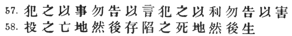

and you will be able to handle a whole army [1](#fn_681) as though you had to do with but a
single man. [2](#fn_682)

57\. Confront your soldiers with the deed itself; never let them know
your design. [3](#fn_683) When the outlook is
bright, bring it before their eyes; but tell them nothing when the
situation is gloomy.

58\. Place your army in deadly peril, and it will survive; plunge it
into desperate straits, and it will come off in safety. [4](#fn_684)

p. 144

p. 145

 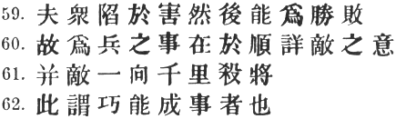

59\. For it is precisely when a force has fallen into harm's way that it
is capable of striking a blow for victory. [1](#fn_685)

60\. Success in warfare is gained by carefully accommodating ourselves
to the enemy's purpose. [2](#fn_686)

61\. By persistently hanging on the enemy's flank, [3](#fn_687) we shall succeed in the long run [4](#fn_688) in killing the commander-in-chief. [5](#fn_689)

62\. This is called ability to accomplish a thing by sheer
cunning. [6](#fn_690)

p. 146

 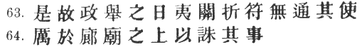

63\. On the day that you take up your command, [1](#fn_691) block the frontier passes, [2](#fn_692) destroy the official tallies, [3](#fn_693) and stop the passage of all emissaries.
Either to or from the enemy's country.

64\. Be stern in the council-chamber, [4](#fn_694) so that you may control the situation.

p. 147

 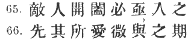

65\. If the enemy leaves a door open, you must rush in. [1](#fn_695)

66\. Forestall your opponent by seizing what he holds dear, [2](#fn_696) and subtly contrive to time his arrival
on the ground. [3](#fn_697)

p. 148

 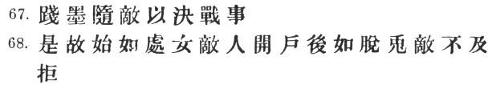

67\. Walk in the path defined by rule [1](#fn_698) and accommodate yourself to the enemy
until you can fight a decisive battle. [2](#fn_699)

68\. At first, then, exhibit the coyness of a maiden, until the enemy
gives you an opening; afterwards emulate the rapidity of a running hare,
and it will be too late for the enemy to oppose you. [3](#fn_700)

p. 149

------------------------------------------------------------------------

### Footnotes

[114:1](aow19.htm#fr_577) Li Ch‘üan is not
quite right in calling these \#. As we shall see, some of them are
highly disadvantageous from the military point of view. Wang Hsi more
correctly says: \# "There are nine military situations, good and bad."
One would like to distinguish the \# from the six \# of chap. X by
saying that the latter refer to the natural formation or geographical
features of the country, while the \# have more to do with the condition
of the army, being \# "situations" as opposed to "grounds." But it is
soon found impossible to carry out the distinction. Both are
cross-divisions, for among the \# we have "temporising ground" side by
side with "narrow passes," while in the present chapter there is even
greater confusion.

[114:2](aow19.htm#fr_578) So called because the
soldiers, being near to their homes and [anxious](errata.htm#7) to see
their wives and children, are likely to seize the opportunity afforded
by a battle and scatter in every direction. "In their advance," observes
Tu Mu, "they will lack the valour of desperation, and when they retreat,
they will find harbours of refuge." The \#, which appears in the *T‘u
Shu*, seems to have been accidentally omitted in my edition of the
standard text.

[115:1](aow19.htm#fr_579) Li Ch‘üan and Ho Shih
say \#: "because of the facility for retreating," and the other
commentators give similar explanations. Tu Mu remarks: \# "When your
army has crossed the border, you should burn your boats and bridges, in
order to make it clear to everybody that you have no hankering after
home." I do not think that "disturbing ground," Capt. Calthrop's
rendering of \#, has anything to justify it. If an idiomatic translation
is out of the question, one should at least attempt to be literal.

[115:2](aow19.htm#fr_580) I must apologise for
using this word in a sense not known to the dictionary, *i.e.* "to be
contended for"—Tu Mu's \#. Ts‘ao Kung says: \# "ground on which the few
and the weak can defeat the many and the strong," such as \# "the neck
of a pass," instanced by Li Ch‘üan. Thus, Thermopylae was a \#, because
the possession of it, even for a few days only, meant holding the entire
invading army in check and thus gaining invaluable time. Cf. Wu Tzŭ, ch.
V. *ad init*.: \# "For those who have to fight in the ratio of one to
ten, there is nothing better than a narrow pass." When \# Lü Kuang was
returning from his triumphant expedition to Turkestan in 385 A.D., and
had got as far as \# I-ho, laden with spoils, \# Liang Hsi,
administrator of \# Liang-chou, taking advantage of the death of Fu
Chien, King of Ch‘in, plotted against him and was for barring his way
into the province. \# Yang Han, governor of \# Kao-ch‘ang, counselled
him, saying: "Lü Kuang is fresh from his victories in the west, and his
soldiers are vigorous and mettlesome. If we oppose him in the shifting
sands of the desert, we shall be no match for him, and we must therefore
try a different plan. Let us hasten to occupy the defile at the mouth of
the \# Kao-wu pass, thus cutting him off from supplies of water, and
when his troops are prostrated with thirst, we can dictate our own terms
without moving. Or if you think that the pass I mention is too far off.
we could make a stand against him at the \# I-wu pass, which is p. 116 nearer. The cunning and resource of \#
Tzŭ-fang himself \[*i.e.* \#\] would be expended in vain against the
enormous strength of these two positions." Liang Hsi, refusing to act on
this advice, was overwhelmed and swept away by the invader. \[See, \#,
ch. 122, fol. 3 *r*°, and \#, ch. 43, fol. 26.\]

[116:1](aow19.htm#fr_581) This is only a
makeshift translation of \#, which according to Ts‘ao Kung stands for \#
"ground covered with a network of roads," like a chess-board. Another
interpretation, suggested by Ho Shih, is \# "ground on which
intercommunication is easy." In either case, it must evidently be \#
"flat country," and therefore \# "cannot be blocked." Cf. \#, X. § 2.

[116:2](aow19.htm#fr_582) \# "Our country
adjoining the enemy's and a third country conterminous with both."
\[Ts‘ao Kung.\] Mêng Shih instances the small principality of \# Chêng,
which was bounded on the north-east by \# Ch‘i, on the west by \# Chin,
and on the south by \# Ch‘u.

[116:3](aow19.htm#fr_583) \# of course stands
for the loose confederacy of states into which China was divided under
the Chou dynasty. The belligerent who holds this dominating position can
constrain most of them to become his allies. See *infra*, § 48. \#
appears at first sight to be "the masses" or "population" of the Empire,
but it is more probably, as Tu Yu says, \#.

[116:4](aow19.htm#fr_584) Capt. Calthrop's
"path-ridden ground" might stand well enough for \# above, but it does
not bring out the force of \#, which clearly denotes the central
position where important highways meet.

[117:1](aow19.htm#fr_585) After \#, the *T‘ung
Tien* intercalates the gloss \#.

[117:2](aow19.htm#fr_586) Wang Hsi explains the
name by saying that \# "when an army has reached such a point, its
situation is serious." Li Chüan instances (1) the victorious march of \#
Yo I into the capital of Ch‘i in 284 B.C., and (2) the attack on Ch‘u,
six years later, by the Chin general \# Po Ch‘i.

[117:3](aow19.htm#fr_587) Or simply, "forests."
I follow the *T‘u Shu* in omitting the \# before \#, given in the
standard text, which is not only otiose but spoils the rhythm of the
sentence.

[117:4](aow19.htm#fr_588) \#
*p‘i*3(to be distinguished from \# i4) is defined
by K‘ang Hsi (after the *Shuo Wên*) as \# "to destroy." Hence Chia Lin
explains \# as ground \# "that has been ruined by water passing over
it," and Tu Yu simply as \# "swampy ground." But Ch‘ên Hao says that the
word is specially applied to deep hollows—what Chu-ko Liang, he tells
us, used to designate by the expressive term \#, "earth-hells." Compare
the \# of IX. §55.

[117:5](aow19.htm#fr_589) p. 118 The situation, as pictured by Ts‘ao Kung, is
very similar to the \#, except that here escape is no longer possible:
\# "A lofty mountain in front, a large river behind, advance impossible,
retreat blocked." Ch‘ên Hao says: \# "to be on 'desperate ground' is
like sitting in a leaking boat or crouching in a burning house." Tu Mu
quotes from Li Ching a vivid description of the plight of an army thus
entrapped: "Suppose an army invading hostile territory without the aid
of local guides:—it falls into a fatal snare and is at the enemy's
mercy. A ravine on the left, a mountain on the right, a pathway so
perilous that the horses have to be roped together and the chariots
carried in slings, no passage open in front, retreat cut off behind, no
choice but to proceed in single file (\#). Then, before there is time to
range our soldiers in order of battle, the enemy in overwhelming
strength suddenly appears on the scene. Advancing, we can nowhere take a
breathing-space; retreating, we have no haven of refuge. We seek a
pitched battle, but in vain; yet standing on the defensive, none of us
has a moment's respite. If we simply maintain our ground, whole days and
months will crawl by; the moment we make a move, we have to sustain the
enemy's attacks on front and rear. The country is wild, destitute of
water and plants; the army is lacking in the necessaries of life, the
horses are jaded and the men worn-out, all the resources of strength and
skill unavailing, the pass so narrow that a single man defending it can
check the onset of ten thousand; all means of offence in the hands of
the enemy, all points of vantage already forfeited by ourselves:—in this
terrible plight, even though we had the most valiant soldiers and the
keenest of weapons, how could they be employed with the slightest
effect?" Students of Greek history may be reminded of the awful close to
the Sicilian expedition, and the agony of the Athenians under Nicias and
Demosthenes. \[See Thucydides, VII. 78 *sqq*.\].

[118:1](aow19.htm#fr_590) But rather let all
your energies be bent on occupying the advantageous position first. So
Ts‘ao Kung. Li Ch‘üan and others, however, suppose the meaning to be
that the enemy has already forestalled us, so that it would be sheer
madness to attack. In the \# when the King of Wu inquires what should be
done in this case, Sun Tzŭ replies: "The rule with regard to contentious
ground is that those in possession have the advantage over the other
side. If a position of this kind is p. 119
secured first by the enemy, beware of attacking him. Lure him away by
pretending to flee—show your banners and sound your drums—make a dash
for other places that he cannot afford to lose—frail brushwood and raise
a dust—confound his ears and eyes—detach a body of your best troops, and
place it secretly in ambuscade. Then your opponent will sally forth to
the rescue."

[119:1](aow19.htm#fr_591) Because the attempt
would be futile, and would expose the blocking force itself to serious
risks. There are two interpretations of \# follow that of Chang Yü (\#).
The other is indicated in Ts‘ao Kung's brief note: \# "Draw closer
together"—*i.e.*, see that a portion of your own army is not cut off.
Wang Hsi points out that \# is only another name for the \#, "accessible
ground" of X. § 2, and says that the advice here given is simply a
variation of \# "keep a sharp eye on the line of supplies," be careful
that your communications are not cut. The *T‘ung Tien* reads \#.

[119:2](aow19.htm#fr_592) Or perhaps, "form
alliances with neighbouring states." Thus Ts‘ao Kung has: \#. Capt.
Calthrop's "cultivate intercourse" is much too timid and vague. The
original text reads \#.

[119:3](aow19.htm#fr_593) On this, Li Ch‘üan
has the following delicious note: \# "When an army penetrates far into
the enemy's country, care must be taken not to alienate the people by
unjust treatment. Follow the example of the Han Emperor Kao Tsu, whose
march into Ch‘in territory was marked by no violation of women or
looting of valuables. \[*Nota bene:* this was in 207 B.C., and may well
cause us to blush for the Christian armies that entered Peking in 1900
A.D.\] Thus he won the hearts of all. In the present passage, then, I
think that the true reading must be, not \# 'plunder,' but \# 'do not
plunder'." Alas, I fear that in this instance the worthy commentator's
feelings outran his judgment. Tu Mu, p. 120
at least, has no such illusions. He says: "When encamped on 'serious
ground,' there being no inducement as yet to advance further, and no
possibility of retreat, one ought to take measures for a protracted
resistance by bringing in provisions from all sides, and keep a close
watch on the enemy." Cf. also II. § 9: \#.

[120:1](aow19.htm#fr_594) Or, in the words of
VIII. 52, \# "do not encamp."

[120:2](aow19.htm#fr_595) Ts‘ao Kung says: \#
"Try the effect of some unusual artifice;" and Tu Yu amplifies this by
saying: \# "In such a position, some scheme must be devised which will
suit the circumstances, and if we can succeed in deluding the enemy, the
peril may be escaped." This is exactly what happened on the famous
occasion when Hannibal was hemmed in among the mountains on the road to
Casilinum, and to all appearances entrapped by the Dictator Fabius. The
stratagem which Hannibal devised to baffle his foes was remarkably like
that which T‘ien Tan had also employed with success exactly 62 years
before. \[See IX. § 24, note.\] When night came on, bundles of twigs
were fastened to the horns of some 2000 oxen and set on fire, the
terrified animals being then quickly driven along the mountain side
towards the passes which were beset by the enemy. The strange spectacle
of these rapidly moving lights so alarmed and discomfited the Romans
that they withdrew from their position, and Hannibal's army passed
safely through the defile. \[See Polybius, III. 93, 94; Livy, XXII. 16,
17.\]

[120:3](aow19.htm#fr_596) For; as Chia Lin
remarks: \# "if you fight with all your might, there is a chance of
life; whereas death is certain if you cling to your corner."

[120:4](aow19.htm#fr_597) \# is omitted in the
*T‘u Shu* text.

[120:5](aow19.htm#fr_598) More literally,
"cause the front and rear to lose touch with each other."

[121:1](aow19.htm#fr_599) I doubt if \# can
mean "officers and men," as Capt. Calthrop translates. This is wanted
for \#.

[121:2](aow19.htm#fr_600) The reading \#,
derived from the *Yü Lan*, must be considered very doubtful. The
original text has \#, and the *T‘u Shu* \#.

[121:3](aow19.htm#fr_601) Capt. Calthrop
translates \# "they scattered the enemy," which cannot be right.

[121:4](aow19.htm#fr_602) Mei Yao-ch‘ên's note
makes the sense plain: \#. All these clauses, of course, down to \#, are
dependent on \# in § 15.

[121:5](aow19.htm#fr_603) Mei Yao-ch‘ên
connects this with the foregoing: \# "Having succeeded in thus
dislocating the enemy, they would push forward in order to secure any
advantage to be gained; if there was no advantage to be gained, they
would remain where they were."

[121:6](aow19.htm#fr_604) \# is like \#,
introducing a supposed question.

[121:7](aow19.htm#fr_605) p. 122 Opinions differ as to what Sun Tzŭ had in
mind. Ts‘ao Kung thinks it is it \# "some strategical advantage on which
the enemy is depending." Tu Mu says: \# "The three things which an enemy
is anxious to do, and on the accomplishment of which his success
depends, are: (1) to capture our favourable positions; (2) to ravage our
cultivated land; (3) to guard his own communications." Our object then
must be to thwart his plans in these three directions and thus render
him helpless. \[Cf. III. § 3.\] But this exegesis unduly strains the
meaning of \# and \# and I agree with Ch‘en Hao, who says that \# does
not refer only to strategical advantages, but is any person or thing
that may happen to be of importance to the enemy. By boldly seizing the
initiative in this way, you at once throw the other side on the
defensive.

[122:1](aow19.htm#fr_606) \# means "the
conditions of war," not, as Capt. Calthrop, says, "the spirit of the
troops." According to Tu Mu, \# "this is a summary of leading principles
in warfare," and he adds: \# "These are the profoundest truths of
military science, and the chief business of the general." The following
anecdotes, told by Ho Shih, show the importance attached to speed by two
of China's greatest generals. In 227 A.D., \# Mêng Ta, governor of \#
Hsin-ch‘êng under the Wei Emperor Wên Ti, was meditating defection to
the House of Shu, and had entered into correspondence with Chu-ko Liang,
Prime Minister of that State. The Wei general Ssŭ-ma I was then military
governor of \# Wan, and getting wind of Mêng Ta's treachery, he at once
set off with an army to anticipate his revolt, having previously cajoled
him by a specious message of friendly import. Ssŭ-ma's officers came to
him and said: "If Mêng Ta has leagued himself with Wu and Shu, the
matter should be thoroughly investigated before we make a move." Ssŭ-ma
I replied: "Mêng Ta is an unprincipled man, and we ought to go and
punish him at once, while he is still wavering and before he has thrown
off the mask." Then, by a series of forced marches, he brought his army
under the walls of Hsin-ch‘êng within the space of eight days. Now Mêng
Ta had previously said in a letter to Chu-ko Liang: "Wan is 1200 *li*
from here. When the news of my revolt reaches Ssŭ-ma I, he will at once
inform his Imperial Master, but it will be a whole month before any
steps can be taken, and by that p. 123 time
my city will be well fortified. Besides, Ssŭ-ma I is sure not to come
himself, and the generals that will be sent against us are not worth
troubling about." The next letter, however, was filled with
consternation: "Though only eight days have passed since I threw off my
allegiance, an army is already at the city-gates. What miraculous
rapidity is this!" A fortnight later, Hsin-ch‘êng had fallen and Mêng Ta
had lost his head. \[See *Chin Shu*, ch. 1, f. 3.\] In 621 A.D., Li
Ching was sent from \# K‘uei-chou in Ssŭ-ch‘uan to reduce the successful
rebel \# Hsiao Hsien, who had set up as Emperor at the modern \#
Ching-chou Fu in Hupeh. It was autumn, and the Yangtsze being then in
flood, Hsiao Hsien never dreamt that his adversary would venture to come
down through the gorges, and consequently made no preparations. But Li
Ching embarked his army without loss of time, and was just about to
start when the other generals implored him to postpone his departure
until the river was in a less dangerous state for navigation. Li Ching
replied: "To the soldier, overwhelming speed is of paramount importance,
and he must never miss opportunities. Now is the time to strike, before
Hsiao Hsien even knows that we have got an army together. If we seize
the present moment when the river is in flood, we shall appear before
his capital with startling suddenness, like the thunder which is heard
before you have time to stop your ears against it. \[See VII, § 19,
note.\] This is the great principle in war. Even if he gets to know of
our approach, he will have to levy his soldiers in such a hurry that
they will not be fit to oppose us. Thus the full fruits of victory will
be ours." All came about as he predicted, and Hsiao Hsien was obliged to
surrender, nobly stipulating that his people should be spared and he
alone suffer the penalty of death. \[See Hsin Tang Shu, ch. 93, f. 1
*v*°.\]

[123:1](aow19.htm#fr_607) Cf. *supra*, § 13. Li
Ch‘üan does not venture on a note here.

[123:2](aow19.htm#fr_608) p. 124 \#, according to Wang Hsi, means: \# "Pet
them, humour them, give them plenty of food and drink, and look after
them generally."

[124:1](aow19.htm#fr_609) Tu Mu explains these
words in a rhyming couplet: \#; and Ch‘ên recalls the line of action
adopted in 224 B.C. by the famous general \# Wang Chien, whose military
genius largely contributed to the success of the First Emperor. He had
invaded the Ch‘u State, where a universal levy was made to oppose him.
But, being doubtful of the temper of his troops, he declined all
invitations to fight and remained strictly on the defensive. In vain did
the Ch‘u general try to force a battle: day after day Wang Chien kept
inside his walls and would not come out, but devoted his whole time and
energy to winning the affection and confidence of his men. He took care
that they should be well fed, sharing his own meals with them, provided
facilities for bathing, and employed every method of judicious
indulgence to weld them into a loyal and homogeneous body. After some
time had elapsed, he told off certain persons to find out how the men
were amusing themselves. The answer was, that they were contending with
one another in putting the weight and long-jumping (\#). When Wang Chien
heard that they were engaged in these athletic pursuits, he knew that
their spirits had been strung up to the required pitch and that they
were now ready for fighting. By this time the Ch‘u army, after repeating
their challenge again and again, had marched away eastwards in disgust.
The Ch‘in general immediately broke up his camp and followed them, and
in the battle that ensued they were routed with great slaughter. Shortly
afterwards, the whole of Ch‘u was conquered by Ch‘in, and the king \#
Fu-ch‘u led into captivity. \[See *Shih Chi*, ch. 73, f. 5 *r*°. It
should be noted that, \# being a taboo character under the Ch‘in
dynasty, the name figures as \# throughout.\]

[124:2](aow19.htm#fr_610) In order that the
enemy may never know exactly where you are. It has struck me, however,
that the true reading might be, not \#, but \# "link your army together"
\[cf. *supra* § 46, \#\], which would be more in keeping with \#. Capt.
Calthrop cuts the Gordian knot by omitting the words altogether.

[124:3](aow19.htm#fr_611) Chang Yü's paraphrase
is: \#.

[125:1](aow19.htm#fr_612) Cf. Nicias’ speech to
the Athenians: Τό τε ξύμπαν γνῶτε, ὦ ἄνδρες στρατιῶται, ἀναγκαῖόν τε ὂν
ὑμῖν ἀνδράσιν ἀγαθοῖς γίγνεσθαι, ὡς μὴ ὄντος χωρίον ἐγγυς ὅποι ἂν
μαλακισθέντες σωθεῖτε, etc. \[Thuc. VII. 77. vii.\]

[125:2](aow19.htm#fr_613) \# by itself
constitutes the protasis, and \# is the interrogative = \#. Capt.
Calthrop makes the protasis end with \#: "If there be no alternative but
death." But I do not see how this is to be got out of the Chinese. Chang
Yü gives a clear paraphrase: \# and quotes his favourite, Wei Liao Tzŭ
(ch. 3): \# "If one man were to run amok with a sword in the
market-place, and everybody else tried to get out of his way, I should
not allow that this man alone had courage and that all the rest were
contemptible cowards. The truth is, that a desperado and a man who sets
some value on his life do not meet on even terms."

[125:3](aow19.htm#fr_614) \# appears to stand
for the more usual \#. Chang Yü says \# "If they are in an awkward place
together, they will surely exert their united strength to get out of
it."

[125:4](aow19.htm#fr_615) Capt. Calthrop weakly
says: "there is unity," as though the text were \#, as in § 20. But \#
introduces quite a new idea—that of *tenacity*—which Ts‘ao Kung tries to
explain by the word \# "to bind fast."

[126:1](aow19.htm#fr_616) Tu Mu says: \# Capt.
Calthrop wrongly translates \# "without warnings."

[126:2](aow19.htm#fr_617) Literally, "without
asking, you will get." Chang Yü's paraphrase is: \#.

[126:3](aow19.htm#fr_618) Chang Yü says: \#.

[126:4](aow19.htm#fr_619) This last clause is
very similar in sense to the one preceding, except that \# indicates the
soldiers’ attachment to their leader, and \# the leader's attitude
towards them. I rather doubt if \# can mean "they will have confidence
in their leader," as the commentary seems to indicate. That way, the
sense is not nearly so good. On the other hand, it is just possible that
here, as in VIII. § 8 and *infra*, § 55, \# may \# "without orders, they
will carry out \[their leader's plans\]." The whole of this paragraph,
of course, has reference to "desperate ground."

[126:5](aow19.htm#fr_620) \# is amplified by
Ts‘ao Kung into \#, and into \#. Cf. the *Ssŭ-ma Fa*, ch. 3: \#.

[126:6](aow19.htm#fr_621) The superstitious,
"bound in to saucy doubts and fears," degenerate into cowards and "die
many times before their deaths." Tu Mu quotes Huang Shih-kung: \#
"'Spells and incantations should be strictly forbidden, and no officer
allowed to inquire by divination into the fortunes of an army, for fear
the soldier's minds should be seriously perturbed.' The meaning is," he
continues, "that if all doubts and scruples are discarded, p. 128 your men will never falter in their
resolution until they die." The reading of the standard text is \#
"there will be no refuge," which does not fit in well here. I therefore
prefer to adopt the variant \#, which evidently stood in Li Ch‘üan's
text.

[127:1](aow19.htm#fr_622) Chang Yü has the best
note on this passage: \# "Wealth and long life are things for which all
men have a natural inclination. Hence, if they burn or fling away
valuables, and sacrifice their own lives, it is not that they dislike
them, but simply that they have no choice." Sun Tzŭ is slyly insinuating
that, as soldiers are but human, it is for the general to see that
temptations to shirk fighting and grow rich are not thrown in their way.
Capt. Calthrop, mistaking \# for the adjective, has: "not because money
is a bad thing … not because long life is evil."

[127:2](aow19.htm#fr_623) The word in the
Chinese is \# "snivel." This is taken to indicate more genuine grief
than tears alone.

[127:3](aow19.htm#fr_624) Not because they are
afraid, but because, as Ts‘ao Kung says, \# "all have embraced the firm
resolution to do or die." We may remember that the heroes of the Iliad
were equally childlike in showing their emotion. Chang Yü alludes to the
mournful parting at the \# I River between \# Ching K‘o and his friends,
when the former was sent to attempt the life of the King of Ch‘in
(afterwards First Emperor) in 227 B.C. The tears of all flowed down like
rain as he bade them farewell and uttered the following lines: \# p. 128 \# "The shrill blast is blowing, Chilly the
burn; Your champion is going—Not to return." [\*](#fn_624)

[127:\*](aow19.htm#fr_625) p. 128 Giles’ Biographical Dictionary, no. 399.

[128:1](aow19.htm#fr_626) \# was the personal
name of \# Chuan Chu, a native of the Wu State and contemporary with Sun
Tzŭ himself, who was employed by \# Kung-tzŭ Kuang, better known as Ho
Lü Wang, to assassinate his sovereign \# Wang Liao with a dagger which
he secreted in the belly of a fish served up at a banquet. He succeeded
in his attempt, but was immediately hacked to pieces by the king's
bodyguard. This was in 515 B.C. The other hero referred to, \# Ts‘ao
Kuei (or Ts‘ao \# Mo), performed the exploit which has made his name
famous 166 years earlier, in 681 B.C. Lu had been thrice defeated by
Ch‘i, and was just about to conclude a treaty surrendering a large slice
of territory, when Ts‘ao Kuei suddenly seized \# Huan Kung, the Duke of
Ch‘i, as he stood on the altar steps and held a dagger against his
chest. None of the Duke's retainers dared to move a muscle, and Ts‘ao
Kuei proceeded to demand full restitution, declaring that Lu was being
unjustly treated because she was a smaller and weaker state. Huan Kung,
in peril of his life, was obliged to consent, whereupon Ts‘ao Kuei flung
away his dagger and quietly resumed his place amid the terrified
assemblage without having so much as changed colour. As was to be
expected, the Duke wanted afterwards to repudiate the bargain, but his
wise old counsellor \# Kuan Chung pointed out to him the impolicy of
breaking his word, and the upshot was that this bold stroke regained for
Lu the whole of what she had lost in three pitched battles. \[For
another anecdote of Ts‘ao Kuei see VII. § 27, note; and for the
biographies of these three bravos, Ts‘ao, Chuan and Ching, see *Shih
Chi*, ch. 86.\]

[128:2](aow19.htm#fr_627) \# means "suddenly"
or "rapidly," and the snake in question was doubtless so called owing to
the rapidity of its movements. Through this passage, the term has now
come to be used in the sense of "military manœuvres." The \# have
apparently not been identified.

[129:1](aow19.htm#fr_628) Another reading in
the *Yü Lan* for \# is \# "belly."

[129:2](aow19.htm#fr_629) That is, as Mei
Yao-ch‘ên says, \# "Is it possible to make the front and rear of an army
each swiftly responsive to attack on the other, just as though they were
parts of a single living body?"

[129:3](aow19.htm#fr_630) Cf. VI. § 21.

[129:4](aow19.htm#fr_631) The meaning is: If
two enemies will help each other in a time of common peril, how much
more should two parts of the same army, bound together as they are by
every tie of interest and fellow-feeling. Yet it is notorious that many
a campaign has been ruined through lack of cooperation, especially in
the case of allied armies.

[129:5](aow19.htm#fr_632) \# said here to be
equivalent to \#.

[129:6](aow19.htm#fr_633) These quaint devices
to prevent one's army from running away recall the Athenian hero
Sôphanes, who carried an anchor with him at the battle of Plataea, by
means of which he fastened himself firmly to one spot. \[See Herodotus,
IX. 74.\] It is not enough, says Sun Tzŭ, to render flight impossible by
such mechanical means. You will not succeed unless p. 130 your men have tenacity and unity of purpose,
and, above all, a spirit of sympathetic co-operation. This is the lesson
which can be learned from the *shuai-jan*.

[130:1](aow19.htm#fr_634) Literally, "level the
courage \[of all\] as though \[it were that of\] one." If the ideal army
is to form a single organic whole, then it follows that the resolution
and spirit of its component parts must be of the same quality, or at any
rate must not fall below a certain standard. Wellington's seemingly
ungrateful description of his army at Waterloo as "the worst he had ever
commanded" meant no more than that it was deficient in this important
particular—unity of spirit and courage. Had he not foreseen the Belgian
defections and carefully kept those troops in the background, he would
almost certainly have lost the day.

[130:2](aow19.htm#fr_635) This is rather a hard
sentence on the first reading, but the key to it will be found, firstly,
in the pause after \#, and next, in the meaning of \# itself. The best
equivalent for this that I can think of is the German "zur Geltung
kommen." Mei Yao-ch‘ên's paraphrase is: \# "The way to eliminate the
differences of strong and weak and to make both serviceable is to
utilise accidental features of the ground." Less reliable troops, if
posted in strong positions, will hold out as long as better troops on
more exposed terrain. The advantage of position neutralises the
inferiority in stamina and courage. Col. Henderson says: "With all
respect to the text books, and to ordinary tactical teaching, I am
inclined to think that the study of ground is often overlooked, and that
by no means sufficient importance is attached to the selection of
positions … and to the immense advantages that are to be derived,
whether you are defending or attacking, from the proper utilisation of
natural features." [\*](#fn_636)

[130:3](aow19.htm#fr_637) p. 131 Tu Mu says: \# "The simile has reference to
the ease with which he does it." \# means that he makes it impossible
for his troops to do otherwise than obey. Chang Yü quotes a jingle, to
be found in Wu Tzŭ, ch. 4: \#.

[130:\*](aow19.htm#fr_636) p. 130 "The Science of War," p. 333.

[131:1](aow19.htm#fr_638) \# seems to combine
the meanings "noiseless" and "imperturbable," both of which attributes
would of course conduce to secrecy. Tu Mu explains \# as \# "deep and
inscrutable," and \# as \# "fair and unbiassed." Mei Yao-ch‘ên alone
among the commentators takes \# in the sense of n \# "self-controlled."
\# and \# are causally connected with \# and \# respectively. This is
not brought out at all in Capt. Calthrop's rendering: "The general
should be calm, inscrutable, just and prudent." The last adjective,
moreover, can in no sense be said to represent \#.

[131:2](aow19.htm#fr_639) Literally, "to
deceive their eyes and ears"—\# being here used as a verb in the sense
of \#.

[131:3](aow19.htm#fr_640) Ts‘ao Kung gives us
one of his excellent apophthegms: \# "The troops must not be allowed to
share your schemes in the beginning; they may only rejoice with you over
their happy outcome." "To mystify, mislead, and surprise the enemy," is
one of the first principles in war, as has been frequently pointed out.
But how about the other process—the mystification of one's own men?
Those who may think that Sun Tzŭ is over-emphatic on this point would do
well to read Col. Henderson's remarks on Stonewall Jackson's Valley
campaign: "The infinite pains," he says, "with which Jackson sought to
conceal, even from his most trusted staff officers, his movements, his
intentions, and his thoughts, a commander less thorough would have
pronounced useless"—etc. etc. [\*](#fn_640) In
the year 88 A.D., as we read in ch. 47 p. 132
of the *Hou Han Shu*, "Pan Ch‘ao took the field with 25,000 men from
Khotan and other Central Asian states with the object of crushing
Yarkand. The King of Kutcha replied by dispatching his chief commander
to succour the place with an army drawn from the kingdoms of Wên-su,
Ku-mo and Wei-t‘ou, totalling 50,000 men. Pan Ch‘ao summoned his
officers and also the King of Khotan to a council of war, and said: 'Our
forces are now outnumbered and unable to make head against the enemy.
The best plan, then, is for us to separate and disperse, each in a
different direction. The King of Khotan will march away by the easterly
route, and I will then return myself towards the west. Let us wait until
the evening drum has sounded and then start.' Pan Ch‘ao now secretly
released the prisoners whom he had taken alive, and the King of Kutcha
was thus informed of his plans. Much elated by the news, the latter
setoff at once at the head of 10,000 horsemen to bar Pan Ch‘ao's retreat
in the west, while the King of Wên-su rode eastwards with 8000 horse in
order to intercept the King of Khotan. As soon as Pan Ch‘ao knew that
the two chieftains had gone, he called his divisions together, got them
well in hand, and at cock-crow hurled them against the army of Yarkand,
as it lay encamped. The barbarians, panic-stricken, fled in confusion,
and were closely pursued by Pan Ch‘ao. Over 5000 heads were brought back
as trophies, besides immense spoils in the shape of horses and cattle
and valuables of every description. Yarkand then capitulating, Kutcha,
and the other kingdoms drew off their respective forces. From that time
forward, Pan Ch‘ao's prestige completely overawed the countries of the
west." In this case, we see that the Chinese general not only kept his
own officers in ignorance of his real plans, but actually took the bold
step of dividing his army in order to deceive the enemy.

[131:\*](aow19.htm#fr_641) "Stonewall Jackson,"
vol. 1, p. 421.

[132:1](aow19.htm#fr_642) Wang Hsi thinks that
this means, not using the same stratagem twice. He says: \#.

[132:2](aow19.htm#fr_643) Note that \# denotes
the *enemy*, as opposed to the \# of § 36. Capt. Calthrop, not
perceiving this, joins the two paragraphs into one. Chang Yü quotes \#
as saying: \# "The axiom, that war is based on deception, does not apply
only to deception of the enemy. You must deceive even your own soldiers.
Make them follow you, but without letting them know why."

[133:1](aow19.htm#fr_644) Wang Hsi paraphrases
\# as \# "camp on easy ground," and Chang Yü follows him, saying: \#.
But this is an utterly untenable view. For \# cf. VII. 4. Chia Lin,
retaining his old interpretation of those words, is now obliged to
explain \# as "cause the enemy to shift his camp," which is awkward in
the extreme.

[133:2](aow19.htm#fr_645) I must candidly
confess that I do not understand the syntax of \#, though the meaning is
fairly plain. The difficulty has evidently been felt, for Tu Mu tells us
that one text omits \#. It is more likely, however, that a couple of
characters have dropped out.

[133:3](aow19.htm#fr_646) \#, literally,
"releases the spring" (see V. § 15), that is, takes some decisive step
which makes it impossible for the army to return—like \# Hsiang Yü, who
sunk his ships after crossing a river. Ch‘ên Hao, followed by Chia Lin,
understands the words less well as \# "puts forth every artifice at his
command." But \# this derived sense occurs nowhere else in Sun Tzŭ.

[133:4](aow19.htm#fr_647) Omitted in the *T‘u
Shu*.

[133:5](aow19.htm#fr_648) The *T‘u Shu* inserts
another \# after \#. Tu Mu says: \# "The army is only cognisant of
orders to advance or retreat; it is ignorant of the ulterior ends of
attacking and conquering."

[134:1](aow19.htm#fr_649) Sun Tzŭ means that
after mobilisation there be no delay in aiming a blow at the enemy's
heart. With \# cf. *supra*, §. 23: \#. Note how he returns again and
again to this point. Among the warring states of ancient China,
desertion was no doubt a much more present fear and serious evil than it
is in the armies of to-day.

[134:2](aow19.htm#fr_650) Chang Yü says: \#,
"One must not be hide-bound in interpreting the rules for the nine
varieties of ground.

[134:3](aow19.htm#fr_651) The use of \#
"contraction and expansion" may be illustrated by the saying \#, which
almost exactly corresponds to the French "il faut reculer pour mieux
sauter." [\*](#fn_653) Capt. Calthrop, *more
suo*, avoids a real translation and has: "the suiting of the means to
the occasion."

[134:4](aow19.htm#fr_653) Cf. *supra*, § 20.

[134:5](aow19.htm#fr_654) Chang Yü's paraphrase
is \#.

[134:\*](aow19.htm#fr_652) See Giles’
Dictionary, no. 9817.

[134:6](aow19.htm#fr_655) p. 135 This "ground" is cursorily mentioned in
VIII. § 2, but it does not figure among the Nine \# of this chapter or
the Six \# in chap. X. One's first impulse would be to translate it
"distant ground" (\# is commonly used in the sense of "distant lands"),
but this, if we can trust the commentators, is precisely what is not
meant here. Mei Yao-ch‘ên says it is \# "a position not far enough
advanced to be called 'facile,' and not near enough to home to be called
\`dispersive,' but something between the two." That, of course, does not
explain the name \#, which seems to imply that the general has severed
his communications and temporarily cut himself off from his base. Thus,
Wang Hsi says: "It is ground separated from home by an interjacent
state, whose territory we have had to cross in order to reach it. Hence
it is incumbent on us to settle our business there quickly." He adds
that this position is of rare occurrence, which is the reason why it is
not included among the \#. Capt. Calthrop gives but a poor rendering of
this sentence: "To leave home and cross the borders is to be free from
interference."

[135:1](aow19.htm#fr_656) The *T‘u Shu* reads
\# for \#.

[135:2](aow19.htm#fr_657) From \# down to the
end of § 45, we have some of the definitions of the early part of the
chapter repeated in slightly different language. Capt. Calthrop omits
these altogether.

[135:3](aow19.htm#fr_658) \# = \#.

[135:4](aow19.htm#fr_659) p. 136 This end, according to Tu Mu, is best
attained by remaining on the defensive, and avoiding battle. Cf.
*supra*, § 11.

[136:1](aow19.htm#fr_660) The *T‘ung Tien* has
\# instead of \#. The present reading is supported by the \# of Chang
Yü-hsien. As Tu Mu says, the object is to guard against two possible
contingencies:—\# "(1) the desertion of our own troops; (2) a sudden
attack on the part of the enemy." Cf. VII..§ 17:, \#. Mei Yao-ch‘ên
says: \# "On the march, the regiments should be in close touch; in an
encampment, there should be continuity between the fortifications." He
seems to have forgotten, by the way, what Sun Tzŭ says above: \#.

[136:2](aow19.htm#fr_661) This is Ts‘ao Kung's
interpretation. Chang Yü adopts its, saying: \#, "We must quickly bring
up our rear, so that head and tail may both reach the goal." That is,
they must not be allowed to straggle up a long way apart. Mei Yao-ch‘ên
offers another equally plausible explanation: \# "Supposing the enemy
has not yet reached the coveted position, and we are behind him, we
should advance with all speed in order to dispute its possession." \#
would thus denote the enemy, \# being the preposition, and \# would
retain its usual intransitive sense. Cf. VII. § 4: \#. Ch‘ên Hao, on the
other hand, assuming that the enemy has had time select his own ground,
quotes VI. § 1, where Sun Tzŭ warns us against coming exhausted to the
attack. His own idea of the situation is rather vaguely expressed: \#
"If there is a favourable position lying in front of you, detach a
picked body of troops to occupy it; then if the enemy, relying on their
numbers, come up to make a fight for it, you may fall quickly on their
rear with your main body, and victory will be assured." It was thus, he
adds, that Chao Shê beat the army of Ch‘in. \[See [p.
57](aow15.htm#page_57).\] Li Ch‘üan would read \# for \#:, it is not
easy to see why.

[137:1](aow19.htm#fr_662) As Wang Hsi says, \#
"fearing a surprise attack." The *T‘ung Tien* reads here \# (see next
sentence).

[137:2](aow19.htm#fr_663) The *T‘ung Tien*
reads \#, which Tu Yu explains as "watching the market towns," \# "the
hotbeds of revolution." Capt. Calthrop translates \# by the same words
as \# in § 12: "cultivate intercourse."

[137:3](aow19.htm#fr_664) The commentators take
this as referring to forage and plunder, not, as one might expect, to an
unbroken communication with a home base. One text, indeed, gives the
reading \#. Cf. § 13. Capt. Calthrop's "be careful of supplies" fails to
render the force of \#.

[137:4](aow19.htm#fr_665) Capt. Calthrop's "do
not linger" cannot be called a translation, but only a paraphrase of the
paraphrase offered by Ts‘ao Kung: \# "Pass away from it in all haste."

[137:5](aow19.htm#fr_666) \# "To make it seem
that I mean to defend the position, whereas my real intention is to
burst suddenly through the enemy's lines" \[Mêng Shih\]; \# "in order to
make my soldiers fight with desperation" \[Mei Yao-ch‘ên\]; \# "fearing
lest my men be tempted to run away" \[Wang Hsi\]. Tu Mu points out that
this is the converse of VII. § 36, where it is the enemy who is
surrounded. In 532 A.D., \# Kao Huan, afterwards Emperor and canonised
as \# Shên-wu, was surrounded by a great p.
138 army under \# Êrh-chu Chao and others. His own force was
comparatively small, consisting only of 2000 horse and something under
30,000 foot. The lines of investment had not been drawn very closely
together, gaps being left at certain points. But Kao Huan, instead of
trying to escape, actually made a shift to block all the remaining
outlets himself by driving into them a number of oxen and donkeys roped
together. As soon as his officers and men saw that there was nothing for
it but to conquer or die, their spirits rose to an extraordinary pitch
of exaltation, and they charged with such desperate ferocity that the
opposing ranks broke and crumbled under their onslaught. \[See Tu Mu's
commentary, and \# ch. 1, fol. 6.\]

[138:1](aow19.htm#fr_667) Tu Yu says: \# "Burn
your baggage and impedimenta, throw away your stores and provisions,
choke up the wells, destroy your cooking-stoves, and make it plain to
your men that they cannot survive, but must fight to the death." Mei
Yao-ch‘ên says epigrammatically: \# "The only chance of life lies in
giving up all hope of it." This concludes what Sun Tzŭ has to say about
"grounds" and the "variations" corresponding to them. Reviewing the
passages which bear on this important subject, we cannot fail to be
struck by the desultory and unmethodical fashion in which it is treated.
Sun Tzŭ begins abruptly in VIII. § 2 to enumerate "variations" before
touching on "grounds" at all, but only mentions five, namely nos. 7, 5,
8 and 9 of the subsequent list, and one that is not included in it. A
few varieties of ground are dealt with in the earlier portion of chap.
IX, and then chap. X sets forth six new grounds, with six variations of
plan to match. None of these is mentioned again, though the first is
hardly to be distinguished from ground no. 4 in the next chapter. At
last, in chap. XI, we come to the Nine Grounds *par excellence*,
immediately followed by the variations. This takes us down to § 14. In
§§ 43–45, fresh definitions are provided for nos. 5, 6, 2, 8 and 9 (in
the order given), as well as for the tenth ground noticed in chap VIII;
and finally, the nine variations are enumerated once more from beginning
to end, all, with the exception of 5, 6 and 7, being different from
those previously given. Though it is impossible to account for the
present state of Sun Tzŭ's text, a few suggestive facts may be brought
into prominence: (1) Chap. VIII, according to the title, should deal
with nine variations, whereas only five appear. (2) It is an abnormally
short chapter. (3) Chap. XI is entitled The Nine Grounds. Several of
these are defined twice over, besides which there are two distinct lists
of the corresponding variations. (4) The length of the chapter is
disproportionate, being double that of any other except IX. I do not
proposep. 139 to draw any inferences from
these facts, beyond the general conclusion that Sun Tzŭ's work cannot
have come down to us in the shape in which it left his hands: chap. VIII
is obviously defective and probably out of place, while XI seems to
contain matter that has either been added by a later hand or ought to
appear elsewhere.

[139:1](aow19.htm#fr_668) \# is rendered by
Capt. Calthrop: "to pursue the enemy if he retreat." But \# cannot mean
"to retreat." Its primary sense is to pass over, hence to go too far, to
exceed or to err. Here, however, the word has lost all implication of
censure, and appears to mean "to pass the boundary line dividing safety
from danger," or, as Chang Yü puts it, \# "to be deeply involved in a
perilous position." The latter commentator alludes to the conduct of Pan
Ch‘ao's devoted followers in 73 A.D. The story runs thus in the *Hou Han
Shu*, ch. 47, fol. 1 *v*°: "When Pan Ch‘ao arrived at \# Shan-shan, \#
Kuang, the King of the country, received him at first with great
politeness and respect; but shortly afterwards his behaviour underwent a
sudden change, and he became remiss and negligent. Pan Ch‘ao spoke about
this to the officers of his suite: 'Have you not noticed,' he said,
'that Kuang's polite intentions are on the wane? This must signify that
envoys have come from the Northern barbarians, and that consequently he
is in a state of indecision, not knowing with which side to throw in his
lot. That surely is the reason. The truly wise man, we are told, can
perceive things before they have come to pass; how much more, then,
those that are already manifest!' Thereupon he called one of the natives
who had been assigned to his service, and set a trap for him, saying:
'Where are those envoys from the Hsiung-nu who arrived some days ago?'
The man was so taken aback that between surprise and fear he presently
blurted out the whole truth. Pan Ch‘ao, keeping his informant carefully
under lock and key, then summoned a general gathering of his officers,
thirty-six in all, and began drinking with them. When the wine had
mounted into their heads a little, he tried to rouse their spirit still
further by addressing them thus: 'Gentlemen, here we are in the heart of
an isolated region, anxious to achieve riches and honour by some great
exploit. Now it happens that an ambassador from the Hsiung-nu arrived in
this kingdom only a few days ago, and the result is that the respectful
courtesy extended towards us by our royal host has disappeared. Should
this envoy prevail upon him to seize our party and hand us over to the
Hsiung-nu p. 140 our bones will become food
for the wolves of the desert. What are we to do?' With one accord, the
officers replied: '*Standing as we do in peril of our lives, we will
follow our commander through life and death*' (\#)." For the sequel of
this adventure, see chap. XII. § 1, note.

[140:1](aow19.htm#fr_669) These three sentences
are repeated from VII. §§ 12–14—in order to emphasise their importance,
the commentators seem to think. I prefer to regard them as interpolated
here in order to form an antecedent to the following words. With regard
to local guides, Sun Tzŭ might have added that there is always the risk
of going wrong, either through their treachery or some misunderstanding
such as Livy records (XXII. 13): Hannibal, we are told, ordered a guide
to lead him into the neighbourhood of Casinum, where there was an
important pass to be occupied; but his Carthaginian accent, unsuited to
the pronunciation of Latin names, caused the guide to understand
Casilinum instead of Casinum, and turning from his proper route, he took
the army in that direction, the mistake not being discovered until they
had almost arrived.

[140:2](aow19.htm#fr_670) Referring, I think,
to what is contained in §§ 54, 55. Ts‘ao Kung, thinking perhaps of the
\# in VIII. § 6, takes them to be \# "the advantages and disadvantages
attendant on the nine varieties of ground." The *T‘u Shu* reads \#.

[140:3](aow19.htm#fr_671) \#, "one who rules by
force," was a term specially used for those princes who established
their hegemony over other feudal states. The p.
141 famous \# of the 7th century B.C. were (1) \# Duke Huan of
Ch‘i (2) \# Duke Wên of Chin, (3) \# Duke Hsiang of Sung, (4) \# Prince
Chuang of Ch‘u, (5) \# Duke Mu of Ch‘in. Their reigns covered the period
685–591 B.C.

[141:1](aow19.htm#fr_672) Here and in the next
sentence, the *Yü Lan* inserts \# after \#.

[141:2](aow19.htm#fr_673) Mei Yao-ch‘ên
constructs one of the chains of reasoning that are so much affected by
the Chinese: "In attacking a powerful state, if you can divide her
forces, you will have a superiority in strength; if you have a
superiority in strength, you will overawe the enemy; if you overawe the
enemy, the neighbouring states will be frightened; and if the
neighbouring states are frightened, the enemy's allies will be prevented
from joining her." The following gives a stronger meaning to \# "If the
great state has once been defeated (before she has had time to summon
her allies), then the lesser states will hold aloof and refrain from
massing their forces." Ch‘ên Hao and Chang Yü take the sentence in quite
another way. The former says: "Powerful though a prince may be, if he
attacks a large state, he will be unable to raise enough troops, and
must rely to some extent on external aid; if he dispenses with this, and
with overweening confidence in his own strength, simply tries to
intimidate the enemy, he will surely be defeated." Chang Yü puts his
view thus: "If we recklessly attack a large state, our own people will
be discontented and hang back. But if (as will then be the case) our
display of military force is inferior by half to that of the enemy, the
other chieftains will take fright and refuse to join us." According to
this interpretation, \# would refer, not to the \#, but to the \#
himself.

[141:3](aow19.htm#fr_674) For the *Yü Lan*
reads \#.

[142:1](aow19.htm#fr_675) \#, as in § 6, stands
for \# "the feudal princes," or the states ruled by them.

[142:2](aow19.htm#fr_676) For (read
*shên*1) in the meaning of \#, cf. VIII. § 8. The
commentators are unanimous on this point, and we must therefore beware
of translating \# by "secretly self-confident" or the like. Capt.
Calthrop (omitting \#) has: "he has confidence in himself."

[142:3](aow19.htm#fr_677) The train of thought
appears to be this: Secure against a combination of his enemies, \# "he
can afford to reject entangling alliances and simply pursue his own
secret designs, his prestige enabling him to dispense with external
friendships." (Li Ch‘üan.)

[142:4](aow19.htm#fr_678) This paragraph,
though written many years before the Ch‘in State became a serious
menace, is not a bad summary of the policy by which the famous Six
Chancellors gradually paved the way for her final triumph under Shih
Huang Ti. Chang Yü, following up his previous note, thinks that Sun Tzŭ
is condemning this attitude of cold-blooded selfishness and haughty
isolation. He again refers \# to the warlike prince, thus making it
appear that in the end he is bound to succumb.

[142:5](aow19.htm#fr_679) Wu Tzŭ (ch. 3) less
wisely says: \# "Let advance be richly rewarded and retreat be heavily
punished."

[142:6](aow19.htm#fr_680) \#, literally, "hang"
or "post up."

[142:7](aow19.htm#fr_681) \# "In order to
prevent treachery," says Wang Hsi. The general meaning is made clear by
Ts‘ao Kung's quotation from the p. 143 Ssŭ-ma
Fa: \# "Give instructions only on sighting the enemy; give rewards only
when you see deserving deeds." \#, however, presents some difficulty.
Ts‘ao Kung's paraphrase \#, I take to mean: "The final instructions you
give to your army should not correspond with those that have been
previously posted up." Chang Yü simplifies this into, "your arrangements
should not be divulged beforehand." And Chia Lin says: \# "there should
be no fixity in your rules and arrangements." Not only is there danger
in letting your plans be known, but war often necessitates the entire
reversal of them at the last moment.

[143:1](aow19.htm#fr_682) \#, according to
Ts‘ao Kong, is here equal to \#. The exact meaning is brought out more
clearly in the next paragraph.

[143:2](aow19.htm#fr_683) Cf. *supra*, § 34.

[143:3](aow19.htm#fr_684) Literally, "do not
tell them words;" *i.e.* do not give your reasons for any order. Lord
Mansfield once told a junior colleague to "give no reasons" for his
decisions, and the maxim is even more applicable to a general than to a
judge. Capt. Calthrop translates this sentence with beautiful
simplicity: "Orders should direct the soldiers." That is all.

[143:4](aow19.htm#fr_685) Compare the
paradoxical saying \#. These words of Sun Tzŭ were once quoted by Han
Hsin in explanation of the tactics he employed in one of his most
brilliant battles, already alluded to on [p. 28](aow12.htm#page_28). In
204 B.C., he was sent against the army of Chao, and halted ten miles
from the mouth of the \# Ching-hsing pass, where the enemy had mustered
in full force. Here, at midnight, he detached a body of 2000 light
cavalry, every man of which was furnished p.
144 with a red flag. Their instructions were to make their way
through narrow defiles and keep a secret watch on the enemy. "When the
men of Chao see me in full flight," Han Hsin said, "they will abandon
their fortifications and give chase. This must be the sign for you to
rush in, pluck down the Chao standards and set up the red banners of \#
Han in their stead." Turning, then to his other officers, he remarked:
"Our adversary holds a strong position, and is not likely to come out
and attack us until he sees the standard and drums of the
commander-in-chief, for fear I should turn back and escape through the
mountains." So saying, he first of all sent out a division consisting of
10,000 men, and ordered them to form in line of battle with their backs
to the River\#  Ti. Seeing this manœuvre, the whole army of Chao broke
into loud laughter. By this time it was broad daylight, and Han Hsin,
displaying the generalissimo's flag, marched out of the pass with drums
beating, and was immediately engaged by the enemy. A great battle
followed, lasting for some time; until at length Han Hsin and his
colleague \# Chang Ni, leaving drums and banner on the field, fled to
the division on the river bank, where another fierce battle was raging.
The enemy rushed out to pursue them and to secure the trophies, thus
denuding their ramparts of men; but the two generals succeeded in
joining the other army, which was fighting with the utmost desperation.
The time had now come for the 2000 horsemen to play their part. As soon
as they saw the men of Chao following up their advantage, they galloped
behind the deserted walls, tore up the enemy's flags and replaced them
by those of Han. When the Chao army turned back from the pursuit, the
sight of these red flags struck them with terror. Convinced that the
Hans had got in and overpowered their king, they broke up in wild
disorder, every effort of their leader to stay the panic being in vain.
Then the Han army fell on them from both sides and completed the rout,
killing a great number and capturing the rest, amongst whom was King \#
Ya himself . … After the battle, some of Han Hsin's officers came to him
and said: "In the *Art of War* we are told to have a hill or tumulus on
the right rear, and a river or marsh on the left front. \[This appears
to be a blend of Sun Tzŭ and T‘ai Lung. See IX. § 9, and note.\] You, on
the contrary, ordered us to draw up our troops with the river at our
back. Under these conditions, how did you manage to gain the victory?"
The general replied: "I fear you gentlemen have not studied the Art of
War with sufficient care. Is it not written there: '*Plunge your army
into desperate straits and it will come off in safety; place it in
deadly peril and it will survive*'? Had I taken the usual course, I
should never have been able to bring my colleagues round. What says the
Military Classic (\#)?—'Swoop down on the market-place and drive the men
off to fight' (\#). \[This passage does not occur in the present text of
Sun Tzŭ.\] If I had not placed my troops in a position where p. 145they were obliged to fight for their lives,
but had allowed each man to follow his own discretion, there would have
been a general *débandade*, and it would have been impossible to do
anything with them." The officers admitted the force of his argument,
and said: "These are higher tactics than we should have been capable
of." \[See *Ch‘ien Han Shu*, ch. 34, ff. 4, 5.\]

[145:1](aow19.htm#fr_686) Danger has a bracing
effect.

[145:2](aow19.htm#fr_687) Ts‘ao Kung says: \#
"Feign stupidity"—by an appearance of yielding and falling in with the
enemy's wishes. Chang Yü's note makes the meaning clear: "If the enemy
shows an inclination to advance, lure him on to do so; if he is anxious
to retreat, delay on purpose that he may carry out his intention." The
object is to make him remiss and contemptuous before we deliver our
attack.

[145:3](aow19.htm#fr_688) I understand the
first four words to mean "accompanying the enemy in one direction."
Ts‘ao Kung says: \# "unite the soldiers and make for the enemy." But
such a violent displacement of characters is quite indefensible. Mei
Yao-ch‘ên is the only commentator who seems to have grasped the meaning:
\# The *T‘u Shu* reads \#.

[145:4](aow19.htm#fr_689) Literally, "after a
thousand *li*."

[145:5](aow19.htm#fr_690) Always a great point
with the Chinese.

[145:6](aow19.htm#fr_691) The *T‘u Shu* has \#,
and yet another reading, p. 146 mentioned by
Ts‘ao Kung, is \#. Capt. Calthrop omits this sentence, after having thus
translated the two preceding: "Discover the enemy's intentions by
conforming to his movements. When these are discovered, then, with one
stroke, the general may be killed, even though he be one hundred leagues
distant."

[146:1](aow19.htm#fr_692) \# does not mean
"when war is declared," as Capt. Calthrop says, nor yet exactly, as
Ts‘ao Kung paraphrases it, \# "when your plans are fixed," when you have
mapped out your campaign. The phrase is not given in the *P‘ei Wên Yün
Fu*. There being no causal connection discoverable between this and the
preceding sentence, \# must perforce be left untranslated.

[146:2](aow19.htm#fr_693) \# is explained by
Mei Yao-ch‘ên as \#.

[146:3](aow19.htm#fr_694) The *locus classicus*
for these tallies is *Chou Li*, XIV. fol. 40 (Imperial edition): \#. The
generic term thus appears to be \#, \# being the special kind used at
city-gates and on the frontier. They were tablets of bamboo or wood, one
half of which was issued as a permit or passport by the official in
charge of a gate (\# or .\#. Cf. the \# "border-warden" of *Lun Yü* III.
24, who may have had similar duties.) When this half was returned to
him, within a fixed period, he was authorised to open the gate and let
the traveller through.

[146:4](aow19.htm#fr_695) Show no weakness, and
insist on your plans being ratified by the sovereign. \# indicates a
hall or temple in the Palace. Cf. I. § 26. It is not clear if other
officers would he present. Hardly anything can be made of \#, the
reading of the standard text, so I have adopted Tu Mu's conjecture \#,
which appears in the *T‘u Shu*. p. 147 Ts‘ao
Kung explains \# by \#, and Ho Shih by \#. Another reading is \#, and
Mei Yao-ch‘ên, adopting this, understands the whole sentence to mean:
Take the strictest precautions to ensure secrecy in your deliberations.
Capt. Calthrop glides rather too smoothly over the rough places. His
translation is: "conduct the business of the government with vigilance."

[147:1](aow19.htm#fr_696) This looks a very
simple sentence, yet Ts‘ao Kung is the only commentator who takes it as
I have done. Mêng Shih, followed by Mei Yao-ch‘ên and Chang Yü, defines
\# as \# "spies," and makes \# an active verb: "If spies come from the
enemy, we must quickly let them in." But I cannot find that the words \#
have this meaning anywhere else. On the other hand, they may be taken as
two verbs, \#, expressing the enemy's indecision whether to advance or
retreat, that being the best moment to attack him. \[Cf. *Tao Tê Ching*,
chap. X: \#; also \# *Li Chi*, XII, I. ii. 25.\] It is not easy to
choose between this and Ts‘ao Kung's explanation; the fact that \#
occurs shortly afterwards, in § 68, might be adduced in support of
either. \# must be understood in the sense of \# or \#. The only way to
avoid this is to put \# between commas and translate: "If we leave a
door open, the enemy is sure to rush in."

[147:2](aow19.htm#fr_697) Cf. *supra*, § 18.

[147:3](aow19.htm#fr_698) Capt. Calthrop hardly
attempts to translate this difficult paragraph, but invents the
following instead: "Discover what he most values, and plan to seize it."
Ch‘ên Hao's explanation, however, is clear enough: \# "If I manage to
seize a favourable position, but the enemy does not appear on the scene,
the advantage thus obtained cannot be turned to any practical account.
He who intends, therefore, to occupy a position of importance to the
enemy, must begin by making an artful appointment,p.
148 so to speak, with his antagonist, and cajole him into going
there as well." Mei Yao-ch‘ên explains that this "artful appointment" is
to be made through the medium of the enemy's own spies, who will carry
back just the amount of information that we choose to give them. Then,
having cunningly disclosed our intentions, \# "we must manage, though
starting after the enemy, to arrive before him" (VII. § 4). We must
start after him in order to ensure his marching thither; we must arrive
before him in order to capture the place without trouble. Taken thus,
the present passage lends some support to Mei Yao-ch‘ên's interpretation
of § 47.

[148:1](aow19.htm#fr_699) \# stands for \# "a
marking-line," hence a rule of conduct. See Mencius VII. 1. xli. 2.
Ts‘ao Kung explains it by the similar metaphor \# "square and
compasses." The baldness of the sentiment rather inclines me to favour
the reading \# adopted by Chia Lin in place of \#, which yields an
exactly opposite sense, namely: "Discard hard and fast rules." Chia Lin
says: \# "Victory is the only thing that matters, and this cannot be
achieved by adhering to conventional canons." It is unfortunate that
this variant rests on very slight authority, for the sense yielded is
certainly much more satisfactory. Napoleon, as we know, according to the
veterans of the old school whom he defeated, won his battles by
violating every accepted canon of warfare.

[148:2](aow19.htm#fr_700) The last four words
of the Chinese are omitted by Capt. Calthrop. Tu Mu says: \# "Conform to
the enemy's tactics until a favourable opportunity offers; then come
forth and engage in a battle that shall prove decisive."

[148:3](aow19.htm#fr_701) As the hare is noted
for its extreme timidity, the comparison hardly appears felicitous. But
of course Sun Tzŭ was thinking only of its speed. The words have been
taken to mean: You must flee from the enemy as quickly as an escaping
hare; but this is rightly rejected by Tu Mu. Capt. Calthrop is wrong in
translating \# "rabbit." Rabbits are not indigenous to China, and were
certainly not known there in the 6th century B.C. The last sixteen
characters evidently form a sort of four-line jingle. Chap. X, it may be
remembered, closed in similar fashion.

------------------------------------------------------------------------

[Next: XII. The Attack By Fire](aow20)
