  
[Intangible Textual Heritage](../../index)  [Taoism](../index) 
[Confucianism](../../cfu/index)  [Index](index)  [Previous](aow20) 
[Next](aow22) 

------------------------------------------------------------------------

[Buy this Book at
Amazon.com](https://www.amazon.com/exec/obidos/ASIN/1934255122/internetsacredte)

------------------------------------------------------------------------

  
*The Art of War*, by Lionel Giles, \[1910\], at Intangible Textual
Heritage

------------------------------------------------------------------------

p. 160

 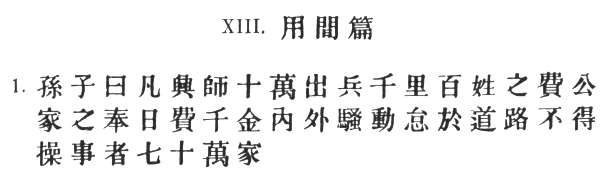

### XIII. THE USE OF SPIES [1](#fn_734).

1\. Sun Tzŭ said: Raising a host of a hundred thousand men and marching
them great distances entails heavy loss on the people and a drain on the
resources of the State. The daily expenditure will amount to a thousand
ounces of silver. [2](#fn_735)

p. 161

 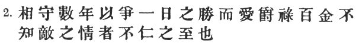

\[paragraph continues\] There will be
commotion at home and abroad, and men will drop down exhausted on the
highways. [1](#fn_736)

As many as seven hundred thousand families will be impeded in their
labour. [2](#fn_737)

2\. Hostile armies may face each other for years, striving

p. 162

 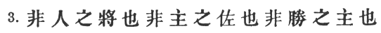

for the victory which is decided in a single day. This being so, to
remain in ignorance of the enemy's condition simply because one grudges
the outlay of a hundred ounces of silver in honours and
emoluments, [1](#fn_738) is the height of
inhumanity. [2](#fn_739)

3\. One who acts thus is no leader of men, no present help to his
sovereign, [3](#fn_740) no master of
victory. [4](#fn_741)

p. 163

 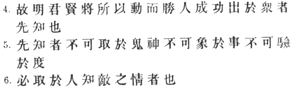

4\. Thus, what enables the wise sovereign and the good general to strike
and conquer, and achieve things beyond the reach of ordinary men, is
*foreknowledge*. [1](#fn_742)

5\. Now this foreknowledge cannot be elicited from spirits; [2](#fn_743) it cannot be obtained inductively from
experience, [3](#fn_744) nor by any deductive
calculation. [4](#fn_745)

6\. Knowledge of the enemy's dispositions can only be obtained from
other men. [5](#fn_746)

p. 164

 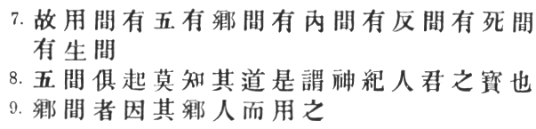

7\. Hence the use of spies, of whom there are five classes: (1) Local
spies; (2) inward spies; (3) converted spies; (4) doomed spies; (5)
surviving spies.

8\. When these five kinds of spy are all at work, none can discover the
secret system. [1](#fn_747) This is
called [2](#fn_748) "divine manipulation of the
threads." [3](#fn_749) It is the sovereign's
most precious faculty. [4](#fn_750)

9\. Having *local spies* [5](#fn_751) means
employing the services of the inhabitants of a district. [6](#fn_752)

p. 165

 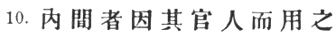

10\. Having inward spies, making use of officials of the enemy. [1](#fn_754)

p. 166

 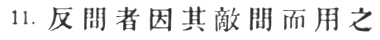

11\. Having *converted spies*, getting hold of the enemy's spies and
using them for our own purposes. [1](#fn_755)

p. 167

 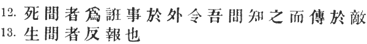

12\. Having *doomed spies*, doing certain things openly for purposes of
deception, and allowing our own spies to know of them and report them to
the enemy. [1](#fn_756)

13\. *Surviving spies*, finally, are those who bring back news from the
enemy's camp. [2](#fn_758)

p. 168

 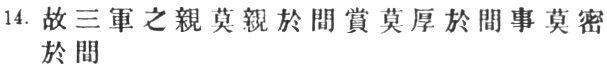

14\. Hence it is that with none in the whole army are more intimate
relations to be maintained than with spies. [1](#fn_760)

p. 169

 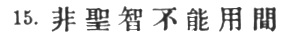

\[paragraph continues\] None should be
more liberally rewarded. [1](#fn_761) In no
other business should greater secrecy be preserved. [2](#fn_762)

15\. Spies cannot be usefully employed [3](#fn_764) without a certain intuitive
sagacity. [4](#fn_765)

p. 170

 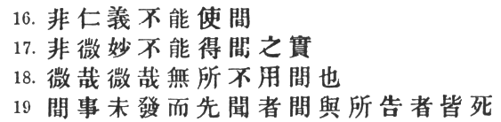

16\. They cannot be properly managed without benevolence and
straightforwardness. [1](#fn_766)

17\. Without subtle ingenuity of mind, one cannot make certain of the
truth of their reports. [2](#fn_767)

18\. Be subtle! be subtle! [3](#fn_768) and use
your spies for every kind of business.

19\. If a secret piece of news is divulged by a spy before the time is
ripe, he must be put to death together with the man to whom the secret
was told. [4](#fn_769)

p. 171

 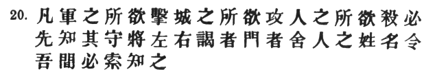

20\. Whether the object be to crush an army, to storm a city, or to
assassinate an individual, it is always necessary to begin by finding
out the names of the attendants, [1](#fn_770)
the aides-de-camp, [2](#fn_771) the
door-keepers and sentries [3](#fn_772) of the
general in command. [4](#fn_773) Our spies must
be commissioned to ascertain these. [5](#fn_774)

p. 172

 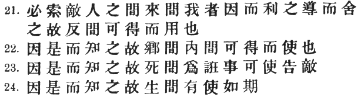

21\. The enemy's spies who have come to spy on us must be sought
out, [1](#fn_775) tempted with bribes, led away
and comfortably housed. [2](#fn_776) Thus they
will become converted spies and available for our service.

22\. It is through the information brought by the converted spy that we
are able to acquire and employ local and inward spies. [3](#fn_777)

23\. It is owing to his information, again, that we can cause the doomed
spy to carry false tidings to the enemy. [4](#fn_778)

24\. Lastly, it is by his information that the surviving spy can be used
on appointed occasions. [5](#fn_779)

p. 173

 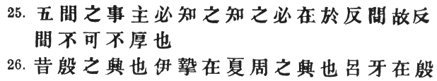

25\. The end and aim of spying in all its five varieties is knowledge of
the enemy; [1](#fn_780) and this knowledge can
only be derived, in the first instance, from the converted spy. [2](#fn_781) Hence it is essential that the converted
spy be treated with the utmost liberality.

26\. Of old, the rise of the Yin dynasty [3](#fn_782) was due to I Chih [4](#fn_783)

p. 174

 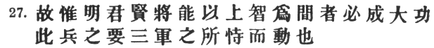

who had served under the Hsia. Likewise, the rise of the Chou dynasty
was due to Lü Ya [1](#fn_784) who had served
under the Yin. [2](#fn_785)

27\. Hence it is only the enlightened ruler and the wise general who
will use the highest intelligence of the army for purposes of
spying, [3](#fn_786)

p. 175

and thereby they achieve great results. [1](#fn_787) Spies are a most important element in
war, because on them depends an army's ability to move. [2](#fn_788)

------------------------------------------------------------------------

### Footnotes

[160:1](aow21.htm#fr_735) \# is really a vulgar
form of \#, and does not appear in the *Shuo Wên*. In practice, however,
it has gradually become a distinct character with special meanings of
its own, and I have therefore followed my edition of the standard text
in retaining this form throughout the chapter. In VI. § 25, on the other
hand, the correct form \# will be found. The evolution of the meaning
"spy" is worth considering for a moment, provided it be understood that
this is very doubtful ground, and that any dogmatism is out of place.
The *Shuo Wên* defines \# as \# (the old form of \#) "a crack" or
"chink," and on the whole we may accept \# Hsü Ch‘ieh's analysis as not
unduly fanciful: \# "At night, a *door* is shut; if, when it is shut,
the light of the *moon* is visible, it must come through a *chink*."
From this it is an easy step to the meaning "space between," or simply
"between," as for example in the phrase \# "to act as a secret spy
between enemies." Here \# is the word which means "spy;" but we may
suppose that constant association so affected the original force of \#,
that \# could at last be dropped altogether, leaving \# to stand alone
with the same signification. Another possible theory is that the word
may first have come to mean \# "to peep" (see \#, quoted in *K‘ang
Hsi*), which would naturally be suggested by "crack" or "crevice," and
afterwards the man who peeps, or spy.

[160:2](aow21.htm#fr_736) p. 161 Cf. II. §§ 1, 13, 14.

[161:1](aow21.htm#fr_737) \#, which is omitted
by the *Yü Lan*, appears at first sight to be explained by the words
immediately following, so that the obvious translation would be
"(enforced) idleness along the line of march." \[Cf. *Tao Tê Ching*, ch.
30: \# "Where troops have been quartered, brambles and thorns spring
up."\] The commentators, however, say that \# is here equivalent to \#—a
meaning which is still retained in the phrase \#. Tu Mu refers \# to
those who are engaged in conveying provisions to the army. But this can
hardly be said to emerge clearly from Sun Tzŭ's text. Chang Yü has the
note: "We may be reminded of the saying: 'On serious ground, gather in
plunder' \[XI. § 13\]. Why then should carriage and transportation cause
exhaustion on the highways?—The answer is, that not victuals alone, but
all sorts of munitions of war have to be conveyed to the army. Besides,
the injunction to 'forage on the enemy' only means that when an army is
deeply engaged in hostile territory, scarcity of food must be provided
against. Hence, without being solely dependent on the enemy for corn, we
must forage in order that there may be an uninterrupted flow of
supplies. Then, again, there are places like salt deserts (\#), where
provisions being unobtainable, supplies from home cannot be dispensed
with."

[161:2](aow21.htm#fr_738) Mei Yao-ch‘ên says:
\# "Men will be lacking at the plough-tail," The allusion is to \# the
system of dividing land into nine parts, as shown in the character \#,
each consisting of a \# or \# (about 15 acres), the plot in the centre
being cultivated on behalf of the State by the tenants of the other
eight. It was here also, so Tu Mu tells us, that their cottages were
built and a well sunk, to be used by all in common. \[See II. § 12,
note.\] These groups of eight peasant proprietors were called \#. In
time of war, one of the families had to serve in the army, while the
other seven contributed to its support (\#). Thus, by a levy of 100,000
men (reckoning one able-bodied soldier to each family) the husbandry of
700,000 families would be affected.

[162:1](aow21.htm#fr_739) "For spies" is of
course the meaning, though it would spoil the effect of this curiously
elaborate exordium if spies were actually mentioned at this point.

[162:2](aow21.htm#fr_740) Sun Tzŭ's argument is
certainly ingenious. He begins by adverting to the frightful misery and
vast expenditure of blood and treasure which war always brings in its
train. Now, unless you are kept informed of the enemy's condition, and
are ready to strike at the right moment, a war may drag on for years.
The only way to get this information is to employ spies, and it is
impossible to obtain trustworthy spies unless they are properly paid for
their services. But it is surely false economy to grudge a comparatively
trifling amount for this purpose, when every day that the war lasts eats
up an incalculably greater sum. This grievous burden falls on the
shoulders of the poor, and hence Sun Tzŭ concludes that to neglect the
use of spies is nothing less than a crime against humanity.

[162:3](aow21.htm#fr_741) An inferior reading
for \# is \#, thus explained by Mei Yao-ch‘ên: \#.

[162:4](aow21.htm#fr_742) This idea, that the
true object of war is peace, has its root in the national temperament of
the Chinese. Even so far back as 597 B.C., these memorable words were
uttered by Prince \# Chuang of the Ch‘u State: \# "The character for
'prowess' (\#) is made up of \# 'to stay' and \# 'a spear' (cessation of
hostilities). Military prowess is seen in the repression of cruelty, the
calling in of weapons, the preservation of the appointment of Heaven,
the firm establishment of merit, the bestowal of happiness on the
people, putting harmony between the princes, the diffusion of wealth."
\[*Tso Chuan*, \# XII. 3 *ad fin*.\]

[163:1](aow21.htm#fr_743) That is, knowledge of
the enemy's dispositions, and what he means to do.

[163:2](aow21.htm#fr_744) \# "by prayers or
sacrifices," says Chang Yü. \# are the disembodied spirits of men, and
\# beings or "gods."

[163:3](aow21.htm#fr_745) Tu Mu's note makes
the meaning clear: \#, he says, is the same as \# reasoning by analogy;
\# "\[knowledge of the enemy\] cannot be gained by reasoning from other
analogous cases."

[163:4](aow21.htm#fr_746) Li Ch‘üan says: \#
"Quantities like length, breadth, distance and magnitude, are
susceptible of exact mathematical determination; human actions cannot be
so calculated."

[163:5](aow21.htm#fr_747) Mei Yao-ch‘ên has
rather an interesting note: \# "Knowledge of the spirit-world is to be
obtained by divination; information in natural science may be sought by
inductive reasoning; the laws of the universe can be verified by
mathematical calculation: but the dispositions of an enemy are
ascertainable through spies and spies alone."

[164:1](aow21.htm#fr_748) \# is explained by Tu
Mu as \# "the way in which facts leak out and dispositions are
revealed."

[164:2](aow21.htm#fr_749) \# the reading of the
standard text, but the *T‘ung Tien*, *Yü Lan* and *T‘u Shu* all have \#.

[164:3](aow21.htm#fr_750) Capt. Calthrop
translates \# "the Mysterious Thread," but Mei Yao-ch‘ên's paraphrase \#
shows that what is meant is the *control* of a number of threads.

[164:4](aow21.htm#fr_751) "Cromwell, one of the
greatest and most practical of all cavalry leaders, had officers styled
'scout masters,' whose business it was to collect all possible
information regarding the enemy, through scouts and spies, etc., and
much of his success in war was traceable to the previous knowledge of
the enemy's moves thus gained." [\*](#fn_753)

[164:5](aow21.htm#fr_753) \# is the emended
reading of Chia Lin and the *T‘u Shu* for the unintelligible \#, here
and in § 7, of the standard text, which nevertheless reads \# in § 22.

[164:6](aow21.htm#fr_754) Tu Mu says: "In the
enemy's country, win people over by kind treatment, and use them as
spies."

[164:\*](aow21.htm#fr_752) "Aids to Scouting,"
p. 2.

[165:1](aow21.htm#fr_755) \# includes both
civil and military officials. Tu Mu enumerates the following classes as
likely to do good service in this respect: "Worthy men who have been
degraded from office, criminals who have undergone punishment; also,
favourite concubines who are greedy for gold, men who are aggrieved at
being in subordinate positions, or who have been passed over in the
distribution of posts, others who are anxious that their side should be
defeated in order that they may have a chance of displaying their
ability and talents, fickle turncoats who always want to have a foot in
each boat (\#). Officials of these several kinds," he continues, "should
be secretly approached and bound to one's interests by means of rich
presents. In this way you will be able to find out the state of affairs
in the enemy's country, ascertain the plans that are being formed
against you, and moreover disturb the harmony and create a breach
between the sovereign and his ministers." The necessity for extreme
caution, however, in dealing with "inward spies," appears from an
historical incident related by Ho Shih: "\# Lo Shang, Governor of \#
I-chou, sent his general \# Wei Po to attack the rebel \# Li Hsiung of
Shu in his stronghold at \# P‘i. After each side had experienced a
number of victories and defeats, Li Hsiung had recourse to the services
of a certain \# P‘o-t‘ai, a native of \# Wu-tu. He began by having him
whipped until the blood came, and then sent him off to Lo Shang, whom he
was to delude by offering to co-operate with him from inside the city,
and to give a fire signal at the right moment for making a general
assault. Lo Shang, confiding in these promises, marched out all his best
troops, and placed Wei Po and others at their head with orders to attack
at P‘o-t‘ai's bidding. Meanwhile, Li Hsiung's general, \# Li Hsiang, had
prepared an ambuscade on their line of march; and P‘o-t‘ai, having
reared long scaling-ladders against the city walls, now lighted the
beacon-fire. Wei Po's men raced up on seeing the signal and began
climbing the ladders as fast as they could, while others were drawn up
by ropes lowered from above. More than a hundred of Lo Shang's soldiers
entered the city in this way, every one of whom was forthwith beheaded.
Li Hsiung then charged with all his forces, both inside and outside the
city, and routed the enemy completely." \[This happened in 303 A.D. I do
not know where Ho Shih got the story from. It is not given in the
biography of Li Hsiung or that of his father Li \# Tê, *Chin Shu*, ch.
120, 121.\]

[166:1](aow21.htm#fr_756) By means of heavy
bribes and liberal promises detaching them from the enemy's service, and
inducing them to carry back false information as well as to spy in turn
on their own countrymen. Thus Tu Yu: \#. On the other hand, \# Hsiao
Shih-hsien in defining the \# says that we pretend not to have detected
him, but contrive to let him carry away a false impression of what is
going on (\#). Several of the commentators accept this as an alternative
definition; but that it is not what Sun Tzŭ meant is conclusively proved
by his subsequent remarks about treating the converted spy generously (§
21 *sqq*.). Ho Shih notes three occasions on which converted spies were
used with conspicuous success: 1) by T‘ien Tan in his defence of Chi-mo
(see *supra*, [p. 90](aow17.htm#page_90)); 2) by Chao Shê on his march
to O-yü (see [p. 57](aow15.htm#page_57)); and by the wily \# Fan Chü in
260 B.C., when Lien P‘o was conducting a defensive campaign against
Chin. The King of Chao strongly disapproved of Lien P‘o's cautious and
dilatory methods, which had been unable to avert a series of minor
disasters, and therefore lent a ready ear to the reports of his spies,
who had secretly gone over to the enemy and were already in Fan Chü's
pay. They said: "The only thing which causes Ch‘in anxiety is lest \#
Chao Kua should be made general. Lien P‘o they consider an easy
opponent, who is sure to be vanquished in the long run." Now this Chao
Kua was a son of the famous Chao Shê. From his boyhood, he had been
wholly engrossed in the study of war and military matters, until at last
he came to believe that there was no commander in the whole Empire who
could stand against him. His father was much disquieted by this
overweening conceit, and the flippancy with which he spoke of such a
serious thing as war, and solemnly declared that if ever Kua was
appointed general, he would bring ruin on the armies of Chao. This was
the man who, in spite of earnest protests from his own mother and the
veteran statesman \# Lin Hsiang-ju, was now sent to succeed Lien P‘o.
Needless to say, he proved no match for the redoubtable Po Ch‘i and the
great military power of Ch‘in. He fell into a trap by which his army was
divided into two and his communications cut; and after a desperate
resistance lasting 46 days, during which the famished soldiers devoured
one another, he was himself killed by an arrow, and his whole force,
amounting, it is said, to 400,000 men, ruthlessly put to the sword.
\[See \#, ch. 19, ff. 48–50\].

[167:1](aow21.htm#fr_757) \# is Li Ch‘üan's
conjecture for \#, which is found in the *T‘ung Tien* and the *Yü Lan*.
The *T‘u Shu*, unsupported by any good authority, adds \# after \#. In
that case, the doomed spies would be those of the enemy, to whom our own
spies had conveyed false information. But this is unnecessarily
complicated. Tu Yu gives the best exposition of the meaning: "We
ostentatiously do things calculated to deceive out own spies, who must
be led to believe that they have been unwittingly disclosed. Then, when
these spies are captured in the enemy's lines, they will make an
entirely false report, and the enemy will take measures accordingly,
only to find that we do something quite different. The spies will
thereupon be put to death." Capt. Calthrop makes a hopeless muddle of
the sentence. As an example of doomed spies, Ho Shih mentions the
prisoners released by Pan Ch‘ao in his campaign against Yarkand. (See
[p. 132](aow19.htm#page_132).) He also refers to \# T‘ang Chien, who in
630 A.D. was sent by T‘ai Tsung to lull the Turkish Khan \# Chieh-li
into fancied security, until Li Ching was able to deliver a crushing
blow against him. Chang Yü says that the Turks revenged themselves by
killing T‘ang Chien, but this is a mistake, for we read in both the Old
and the New T‘ang History (ch. 58, fol. 2 and ch. 89, fol. 8
respectively) that he escaped and lived on until 656. \# Li I-chi [\*](#fn_757) played a somewhat similar part in 203
B.C., when sent by the King of Han to open peaceful negotiations with
Ch‘i. He has certainly more claim to be described as a \#; for the King
of Ch‘i, being subsequently attacked without warning by Han Hsin, and
infuriated by what he considered the treachery of Li I-chi, ordered the
unfortunate envoy to be boiled alive.

[167:\*](aow21.htm#fr_758) *Ch‘ien Han Shu*,
ch. 43, fol. 1. \# Yen Shih-ku *in loc*. says: \#.

[167:2](aow21.htm#fr_759) This is the ordinary
class of spies, properly so called, forming a regular part of the army.
Tu Mu says: \# "Your surviving spy must be a man of keen intellect,
though p. 168 in outward appearance a fool;
of shabby exterior, but with a will of iron. He must be active, robust,
endowed with physical strength and courage; thoroughly accustomed to all
sorts of dirty work, able to endure hunger and cold, and to put up with
shame and ignominy." Ho Shih tells the following story of \# Ta-hsi Wu
of the Sui dynasty: "When he was governor of Eastern Ch‘in, \# Shên-wu
of Ch‘i made a hostile movement upon \# Sha-yüan. The Emperor T‘ai Tsu
\[? Kao Tsu\] sent Ta-hsi Wu to spy upon the enemy. He was
[accompanied](errata.htm#8) by two other men. All three were on
horseback and wore the enemy's uniform. When it was dark, they
dismounted a few hundred feet away from the enemy's camp and stealthily
crept up to listen, until they succeeded in catching the passwords used
by the army. Then they got on their horses again and boldly passed
through the camp under the guise of night-watchmen (\#); and more than
once, happening to come across a soldier who was committing some breach
of discipline, they actually stopped to give the culprit a sound
cudgelling! Thus they managed to return with the fullest possible
information about the enemy's dispositions, and received warm
commendation from the Emperor, who in consequence of their report was
able to inflict a severe defeat on his adversary." With the above
classification it is interesting to compare the remarks of Frederick the
Great: [\*\*](#fn_759) "Es giebt vielerley
Sorten von Spions: 1. Geringe Leute, welche sich von diesem Handwerk
meliren. 2. Doppelte Spions. 3. Spions von Consequenz, and endlich 4.
Diejenigen, welche man zu diesem unglücklichen Hankwerk zwinget." This
of course is a bad cross-division. The first class ("Bürgersleute,
Bauern, Priesters, etc.") corresponds roughly to Sun Tzŭ's "local
spies," and the third to "inward spies." Of "Doppelte Spions" it is
broadly stated that they are employed "um dem Feinde falsche Nachrichten
aufzubinden." Thus they would include both converted and doomed spies.
Frederick's last class of spies does not appear in Sun Tzŭ's list,
perhaps because the risk in using them is too great.

[167:\*\*](aow21.htm#fr_760) p. 168 "Unterricht des Königs von Preussen an die
Generale seiner Armeen," cap. 1 (edition of 1794).

[168:1](aow21.htm#fr_761) The original text and
the *T‘u Shu* have \# in place of the first \#. Tu Mu and Mei Yao-ch‘ên
point out that the spy is privileged to enter even the general's private
sleeping-tent. Capt. Calthrop has an inaccurate translation: "In
connection with the armies, spies should be treated with the greatest
kindness."

[169:1](aow21.htm#fr_762) Frederick concludes
his chapter on spies with the words: "Zu allem diesem füge ich noch
hinzu, dass man in Bezahlung der Spions freygebig, ja verschwenderisch
seyn muss. Ein Mench, der um eures Dienstes halber den Strick waget,
verdienet dafür belohnet zu werden."

[169:2](aow21.htm#fr_763) Tu Mu gives a graphic
touch: \#, that is to say, all communications with spies should be
carried on "mouth-to-ear." Capt. Calthrop has: "All matters relating to
spies are secret," which is distinctly feeble. An inferior reading for
\# is \#. The following remarks on spies may be quoted from Turenne, who
made perhaps larger use of them than any previous commander: "Spies are
attached to those who give them most, he who pays them ill is never
served. They should never be known to anybody; nor should they know one
another. When they propose anything very material, secure their persons,
or have in your possession their wives and children as hostages for
their fidelity. Never communicate anything to them but what it is
absolutely necessary that they should know." [\*](#fn_763)

[169:\*](aow21.htm#fr_764) "Marshal Turenne,"
p. 311.

[169:3](aow21.htm#fr_765) This is the *nuance*
of Tu Yu's paraphrase \#.

[169:4](aow21.htm#fr_766) Mei Yao-ch‘ên says:
\# "In order to use them, one must know fact from falsehood, and be able
to discriminate between honesty and double-dealing." Wang Hsi takes \#
and \# separately, defining the former as \# "intuitive perception" and
the latter as \# "practical intelligence." Tu Mu strangely refers these
attributes to the spies themselves: \# "Before using spies we must
assure ourselves as to their integrity of character and the extent of
their experience and skill." But he continues: \# "A brazen face and a
crafty disposition are more dangerous than mountains or rivers; it takes
a man of genius to penetrate such." So that we are left in some doubt as
to his real opinion on the passage.

[170:1](aow21.htm#fr_767) Chang Yü says that \#
means "not grudging them honours and pay;" \# "showing no distrust of
their honesty." "When you have attracted, them by substantial offers,
you must treat them with absolute sincerity; then they will work for you
with all their might."

[170:2](aow21.htm#fr_768) Mei Yao-ch‘ên says:
"Be on your guard against the possibility of spies going over to the
service of the enemy." The *T‘ung Tien* and *Yü Lan* read \# for \#.

[170:3](aow21.htm#fr_769) Cf. VI. § 9: \#.
Capt. Calthrop translates: "Wonderful indeed is the power of spies."

[170:4](aow21.htm#fr_770) The Chinese here is
so concise and elliptical that some expansion is necessary for the
proper understanding of it. \# denotes important information about the
enemy obtained from a surviving spy. The subject of \#, however, is not
this information itself, but the secret stratagem built up on the
strength of it. \# means "is heard"—by anybody else. Thus, word for
word, we get: "If spy matters are heard before \[our plans\] are carried
out," etc. Capt. Calthrop, in translating \# "the spy who told the
matter, and the man who repeated the same," may appeal to the authority
of the commentators; but he surely misses the main point of Sun Tzŭ's
injunction. For, whereas you kill the spy himself \# "as a punishment
for letting out the secret," the object of killing the other man is
only, as Ch‘ên Hao puts it, \# "to stop his mouth" and prevent the p. 171 news leaking any further. If it had already
been repeated to others, this object would not be gained. Either way,
Sun Tzŭ lays himself open to the charge of inhumanity, though Tu Mu
tries to defend him by saying that the man deserves to be put to death,
for the spy would certainly not have told the secret unless the other
had been at pains to worm it out of him. The *T‘ung Tien* and *Yü Lan*
have the reading … \#, etc., which, while not affecting the sense,
strikes me as being better than that of the standard text. The *T‘u Shu*
has … \#, which I suppose would mean: "the man who heard the secret and
the man who told it to him."

[171:1](aow21.htm#fr_771) \# is a comprehensive
term for those who wait on others, servants and retainers generally.
Capt. Calthrop is hardly happy in rendering it "right-hand men."

[171:2](aow21.htm#fr_772) \#, literally
"visitors," is equivalent, as Tu Yu says, to \# "those whose duty it is
to keep the general supplied with information," which naturally
necessitates frequent interviews with him. Chang Yü goes too far afield
for an explanation in saying that they are \# "the leaders of mercenary
troops.".

[171:3](aow21.htm#fr_773) \# and \#.

[171:4](aow21.htm#fr_774) \#, according to
Chang Yü, is simply \# "a general on active service." Capt. Calthrop is
wrong, I think, in making \# directly dependent on (… "the names of the
general in charge," etc.).

[171:5](aow21.htm#fr_775) As the first step, no
doubt, towards finding out if any of these important functionaries can
be won over by bribery. Capt. Calthrop blunders badly with: "Then set
the spies to watch them."

[172:1](aow21.htm#fr_776) \# is omitted by the
*T‘ung Tien* and *Yü Lan*. Its recurrence is certainly suspicious,
though the sense may seem to gain by it. The *T‘u Shu* has this
variation: . . . \#, etc.

[172:2](aow21.htm#fr_777) \# is probably more
than merely \# or "detain." Cf. § 25 *ad fin*., where Sun Tzŭ insists
that these converted spies shall be treated well. Chang Yü's paraphrase
is \#.

[172:3](aow21.htm#fr_778) Tu Yu expands \# into
\# "through conversion of the enemy's spies we learn the enemy's
condition." And Chang Yü says: \# "We must tempt the converted spy into
our service, because it is he that knows which of the local inhabitants
are greedy of gain, and which of the officials are open to corruption."
In the *T‘ung Tien*, \# has been altered to \#, doubtless for the sake
of uniformity with § 9.

[172:4](aow21.htm#fr_779) "Because the
converted spy knows how the enemy can best be deceived!' (Chang Yü) The
*T‘ung Tien* text, followed by the *Yü Lan*, has here the obviously
interpolated sentence \#.

[172:5](aow21.htm#fr_780) Capt. Calthrop omits
this sentence.

[173:1](aow21.htm#fr_781) I have ventured to
differ in this place from those commentators—Tu Yu and Chang Yü—who
understand \# as \#, and make \# the antecedent of \# (the others
ignoring the point altogether). It is plausible enough that Sun Tzŭ
should require the ruler to be familiar with the methods of spying
(though one would rather expect \# "general" in place of \#). But this
involves taking \# here in quite a different way from the \# immediately
following, as also from those in the previous sentences. \# there refers
vaguely to the enemy or the enemy's condition, and in order to retain
the same meaning here, I make \# a verb, governed by \#. Cf. XI. § 19,
where \# is used in exactly the same manner. The sole objection that I
can see in the way of this interpretation is the fact that the \#, or
fourth variety of spy, does not add to our knowledge of the enemy, but
only misinforms the enemy about us. This would be, however, but a
trivial oversight on Sun Tzŭ's part, inasmuch as the "doomed spy" is in
the strictest sense not to be reckoned as a spy at all. Capt. Calthrop,
it is hardly necessary to remark, slurs over the whole difficulty.

[173:2](aow21.htm#fr_782) As explained in §§
22–24. He not only brings information himself, but makes it possible to
use the other kinds of spy to advantage.

[173:3](aow21.htm#fr_783) Sun Tzŭ means the \#
Shang dynasty, founded in 1766 B.C. Its name was changed to Yin by \#
P‘an Kêng in 1401.

[173:4](aow21.htm#fr_784) Better known as \# I
Yin, the famous general and statesman who took part in Ch‘êng T‘ang's
campaign against \# Chieh Kuei.

[174:1](aow21.htm#fr_785) \# Lü Shang, whose
"style" was \#, rose to high office under the tyrant \# Chou Hsin, whom
he afterwards helped to overthrow. Popularly known as \#, a title
bestowed on him by Wên Wang, he is said to have composed a treatise on
war, erroneously identified with the \#.

[174:2](aow21.htm#fr_786) There is less
precision in the Chinese than I have thought it well to introduce into
my translation, and the commentaries on the passage are by no means
explicit. But, having regard to the context, we can hardly doubt that
Sun Tzŭ is holding up I Chih and Lü Ya as illustrious examples of the
converted spy, or something closely analogous. His suggestion is, that
the Hsia and Yin dynasties were upset owing to the intimate knowledge of
their weaknesses and shortcomings which these former ministers were able
to impart to the other side. Mei Yao-ch‘ên appears to resent any such
aspersion on these historic names: "I Yin and Lü Ya," he says, "were not
rebels against the Government (\#). Hsia could not employ the former,
hence Yin employed him. Yin could not employ the latter, hence Chou
employed him. Their great achievements were all for the good of the
people." Ho Shih is also indignant: \# "How should two divinely inspired
men such as I and Lü have acted as common spies? Sun Tzŭ's mention of
them simply means that the proper use of the five classes of spies is a
matter which requires men of the highest mental calibre like I and Lü,
whose wisdom and capacity qualified them for the task. The above words
only emphasise this point." Ho Shih believes then that the two heroes
are mentioned on account of their supposed skill in the use of spies.
But this is very weak, as it leaves totally unexplained the significant
words \# and \#. Capt. Calthrop speaks, rather strangely, of "the
province of Yin … the country of Hsia … the State of Chu … the people of
Shang."

[174:3](aow21.htm#fr_787) p. 175 Ch‘ên Hao compares § 15: . He points out
that \# "the god-like wisdom of Ch‘êng Tang and Wu Wang led them to
employ I Yin and Lü Shang." The *T‘u Shu* omits \#.

[175:1](aow21.htm#fr_788) Tu Mu closes with a
note of warning: \# "Just as water, which carries a boat from bank to
bank, may also be the means of sinking it, so reliance on spies, while
productive of great results, is oft-times the cause of utter
destruction."

[175:2](aow21.htm#fr_789) The antecedent to \#
must be either \# or \# understood from the whole sentence. Chia Lin
says that an army without spies is like a man without ears or eyes.

------------------------------------------------------------------------

[Next: Chinese Concordance](aow22)
