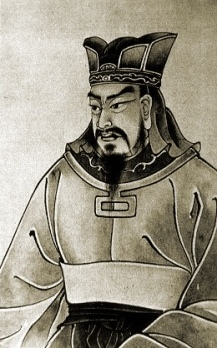

  
[Intangible Textual Heritage](../../index)  [Taoism](../index) 
[Confucianism](../../cfu/index) 

------------------------------------------------------------------------

[Buy this Book at
Amazon.com](https://www.amazon.com/exec/obidos/ASIN/1934255122/internetsacredte)

------------------------------------------------------------------------

<table width="75%">
<colgroup>
<col style="width: 50%" />
<col style="width: 50%" />
</colgroup>
<tbody>
<tr class="odd">
<td width="50%" data-valign="TOP"></td>
<td width="50%" data-valign="CENTER"><h1 id="the-art-of-war" data-align="CENTER">The Art of War</h1>
<h2 id="tr.-by-lionel-giles" data-align="CENTER">tr. by Lionel Giles</h2>
<h4 id="section" data-align="CENTER">[1910]</h4></td>
</tr>
</tbody>
</table>

------------------------------------------------------------------------

[Contents](#contents)    [Start Reading](aow00)    [Page
Index](pageidx)    [Text \[Zipped\]](aow.txt.gz)

------------------------------------------------------------------------

|                                                                                                                           |
|---------------------------------------------------------------------------------------------------------------------------|
|  |

If you know neither the enemy nor yourself, you will
succumb in every battle.--p. 25, II:18.

Anger may in time change to gladness;  
Vexation may be succeeded by content.  
But a kingdom that has once been destroyed  
Can never come again into being;  
Nor can the dead ever be brought back to life.  
Hence the enlightened ruler is heedful,  
And the good general full of caution.  
This is the way to keep a country at peace and an army intact.  
   --p. 159, XII:20-22.

Attributed to the legendary Chinese general, Sun Tzu, the Art of War
also has a strong spiritual component. The work blends Taoism with the
art of statecraft, applying concepts such as 'doing without doing' to
the battlefield. Traditionally written during the Spring and Autumn
period (722-481 BCE), others date it, based on historical and internal
evidence, to the Warring States Period (403-221 BCE). Sun Tzu is
traditionally identified with an historical figure who lived from
544-496 BCE, a general of the King of Wu. Since it first came to the
attention of Westerners in the 19th century, the Art of War has
influenced leaders from Napoleon to Norman Schwarzkopf. Mao tse Tung
attributed it as a source of his thinking on guerilla warfare. The work
is considered a masterpiece of military theory.

*Production notes:* This is the classic Giles
translation of the work, scanned from a reprint of the first edition.
The Chinese text of the book is displayed using image files. Other
Chinese text in the work is indicated by a hash sign (\#). The Chinese
concordance is omitted, but all of the rest of the book is presented
intact. John Bruno Hare, October 12, 2008.

------------------------------------------------------------------------

 [Title Page](aow00)  
[Contents](aow01)  
[Preface](aow02)  

### Introduction

[Sun Wu and his Book](aow03)  
[The Text of Sun Tzŭ](aow04)  
[The Commentators](aow05)  
[Appreciations Of Sun Tzŭ](aow06)  
[Apologies for War](aow07)  
[Bibliography](aow08)  

 

[I. Laying Plans.](aow09)  
[II. Waging War](aow10)  
[III. Attack By Stratagem](aow11)  
[IV. Tactical Dispositions](aow12)  
[V. Energy](aow13)  
[VI. Weak Points and Strong](aow14)  
[VII. Manœuvring](aow15)  
[VIII. Variation of Tactics](aow16)  
[IX. The Army on the March](aow17)  
[X. Terrain](aow18)  
[XI. The Nine Situations](aow19)  
[XII. The Attack By Fire](aow20)  
[XIII. The Use of Spies](aow21)  
[Chinese Concordance](aow22)  
[Index](aow23)  
[Corrigenda](aow24)  
