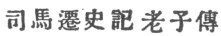
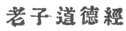

  
[Intangible Textual Heritage](../../index)  [Taoism](../index) 
[Index](index)  [Previous](crv000)  [Next](crv002) 

------------------------------------------------------------------------

p. 1

# TABLE OF CONTENTS.

|                                                  |                            |
|--------------------------------------------------|----------------------------|
|                                                  | PAGE                       |
| Foreword                                         | [3](crv002.htm#page_3)     |
| Introduction                                     | [13](crv003.htm#page_13)   |
| Lao-tze's Tao-Teh-King in Chinese                | [23](crv004.htm#page_23)   |
|    | [25](crv004.htm#page_25)   |
|    | 27                         |
| English Translation                              | [67](crv005.htm#page_67)   |
| Sze-ma Ch‘ien on Lao-tze                         | [69](crv006.htm#page_69)   |
| The Old Philosopher's Canon of Reason and Virtue | [73](crv007.htm#page_73)   |
| Comments and Alternative Readings                | [131](crv088.htm#page_131) |
| Table of References                              | 189                        |
| Index                                            | 207                        |

 NOTE: in this etext each of the Chinese texts accompany the English
translation, rather than being placed in a separate section as in the
printed book. The Index, as usual, is omitted.

------------------------------------------------------------------------

[Next: Foreword](crv002)
