  
[Intangible Textual Heritage](../../index)  [Taoism](../index.md) 
[Index](index)  [Previous](crv002)  [Next](crv004.md) 

------------------------------------------------------------------------

p. 13

# INTRODUCTION.

A few comments on Lao-tze's favorite expressions will help the reader to
understand the drift of his thought.

The character *tao* [1](#fn_0.md) being composed of
the characters "moving on" and "head," depicts a "going ahead." The
original meaning of the word is "way" in the same sense as in English,
denoting both "path" and "method."

The same association of ideas prevails in almost all languages. The
Greek word *methodos* [2](#fn_1.md) is a derivative
of *hodos* [3](#fn_2.md) "path" (combined with the
preposition *meta*, "according to," "after") and so "method" too
originally means "way" or rather "according to a way." In the sense of
method the word Tao acquires the significance of "principle,
rationality,

p. 14

or reason," then "the right way," or "truth," the *Urvernunft* of German
mystics. Finally Tao comes to possess the meaning of "rational speech"
or "word," and in this sense it closely resembles the Greek *Logos*, for
in addition to its philosophical significance the term Tao touches a
religious chord in the souls of the Chinese just as did the word Logos
among the Platonists and the Greek Christians. The term Tao denotes
"word" and also "way" in the same religious sense in which they are used
in the New Testament: the former in the first verse of the Fourth
Gospel, "In the beginning was the *word*"; and the latter in the saying
of Christ, "I am the way, the *truth*, and the life" (John xiv. 6). In
both passages the word Tao is the right term by which to translate
"word," "way," and "truth."

The Tao of man, *jan tao*, [4](#fn_3.md) is the
process of ratiocination, and as such it is fallible; but there is an
Eternal Reason, *ch‘ang tao*, [5](#fn_4.md) also
called *t‘ien tao*, [6](#fn_5.md) "Heaven's

p. 15

\[paragraph continues\] Reason," i. e., the world-order which shapes all
things, and the burden of Lao-tze's message is to let this Heaven's
Reason or Eternal Reason prevail. The man who is guided by the Eternal
Reason is the master, *chiün*; [7](#fn_6.md) the
superior thinker, *chiün tze*; [8](#fn_7.md) he is
the holy man, *shan jan*; [9](#fn_8.md) the man of
Reason, *yin tao che* [10](#fn_9.md) or *tung yü tao
che*; [11](#fn_10.md) and the man of truth, *chen
jan*. [12](#fn_11.md)

We translate Tao by "Reason," and we capitalize the word in order to
remind the reader that it is not the reason of the rationalist, nor the
rationality of argument, but the universal world-order, or in other
words, the eternal Reason of the divine dispensation, the Logos, to
which man looks up with reverence.

The second word of the title, *Teh*, [13](#fn_12.md), "virtue," which, strange enough, Legge
translates "attribute," is made up of characters meaning "man," "heart"
and

p. 16

\[paragraph continues\] "straight." It denotes man's straightness of
heart.

The favorite phrase of Lao-tze's ethics, which furnishes a key to his
mode of thought, reads *wei wu wei*, (
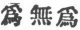) "act non-act," and we have commonly translated the
words by "act with non-assertion."

The Chinese *wei* means not only "to do something," but also "to act" as
on the stage, or "'to make a show, to show off, to pose, to parade
oneself." The phrase *wei wu wei* might be translated "to do without
ado" or "to act without acting" (viz., without posing), were it not for
the fact that the moral element is uppermost in Lao-tze's mind. He
denounces the vanity of self-display and egotism, and so we believe that
*wei wu wei* is best rendered by "acting with non-assertion." The
meaning is clear through the context, and there is no need of
interpreting Lao-tze's words either in a mystical or a quietist sense.

There are three negatives in Chinese: *pu*, "not," the simple negation;
*wu*, "lacking in, non-existent, without"; and *fei*,

p. 17

\[paragraph continues\] "by no means." Though we can not lay down a
general rule about their distinctions, there are different shades of
meaning according to the context which we have tried to bring out in our
English version. Sometimes the meaning of the negated word, or the
ironic sense in which it is used, influences the negative. In Chapter 49
*pu shan*, "ungoodness", means "evil," but in Chapter 38, *pu teh*,
"unvirtue," means that higher virtue which makes no show and does not
even assume the name. In Chapter 57 *wu shi*, "non-diplomacy," is that
higher mode of statesmanship with which a good ruler will
unostentatiously govern the empire. On the other hand Lao-tze speaks of
both *fei tao*, i. e., "lack of reason" or "anti-reason" (Chapter 53)
and *pu tao* (Chapters 30 and 55) "unreason," which soon ceases, while
"the reason that can be reasoned" (*tao ko tao*) is declared to be "by
no means the eternal Reason (*fei ch‘ang tao*)."

The term *wu*, "non-existence" (Chapter 40), is not annihilation but
denotes absence of concrete particularity or of

p. 18

materiality. It is intended to describe what we would call the purely
formal, including purely formal thought, viz., the prototypes of things
as well as ideals. Materiality makes things real but
non-materiality, [14](#fn_13.md) as set forth in
Chapter 11, while giving shape to things by cutting away certain
portions, renders them useful.

Lao-tze's appreciation of oneness is to be expected of a philosopher of
the Tao, of Divine Reason. He speaks of oneness [15](#fn_14.md) as giving character to things that are
units (Chapter 39) and unity cannot be disintegrated (Chapter 10).

Lao-tze's reference to trinity as begetting all things (Chapter 42) is,
to say the least. curious, perhaps profound, and

p. 19

\[paragraph continues\] Christians will also be interested in the idea
that the Son of Heaven as the High Priest of the people must bear the
sins of mankind (Chapter 78).

Lao-tze's style is characterized by paradox as in "do without ado"
(commonly translated "act with non-assertion" as in Chapters 2, 3, 10,
etc.); "know the unknowable," "be sick of sickness" (Chapter 71);
"practice non-practice," "taste the tasteless" (Chapter 63); "marching
without marching" (Chapter 69). Similarly the phrases "the form of the
formless" [16](#fn_15.md) and "the image of the
imageless" [17](#fn_16) (Chapter 14.md) etc. are
used to describe what Kant calls "pure form," i. e., non-material or
ideal forms such as geometrical figures, and which corresponds to the
Buddhist term *arupo*, "the formless," in the sense of "the bodiless."

Undoubtedly the best sayings of Lao-tze are: "Requite hatred with
goodness" [18](#fn_17) (Chapter 63.md); and "The
good I meet with goodness; the bad I also meet with

p. 20

goodness [19](#fn_18.md) . . . . The faithful I
meet with faith, the faithless I also meet with faith" (Chapter 49).

Other remarkable ideas of Lao-tze are his preference for simplicity
(Chapters 17, 28, 37, 57), for purity (Chapter 45), for emptiness
(Chapters 3, 4, 5), for rest and peace [20](#fn_19) (Chapter 31.md), for silence (Chapters 2,
23, 43, 56), for tenderness (Chapters 52, 76, 78), especially the
tenderness of water (Chapter 78), for weakness (Chapters 36, 40) for
compassion (Chapter 67), for lowliness or humility (Chapter 61), for
thrift (Chapter 59), for returning home to the Tao (Chapters 25, 40),
for spontaneity or lack of effort (Chapter 6), etc.

He is against restrictions and prohibitions as producing disorder
(Chapter

p. 21

\[paragraph continues\] 57), against ostentation (Chapter 58), against
learnedness as unwisdom (Chapter 81). He believes that the Tao when
sought is found (Chapter 62), and he praises the state of a little child
(Chapters 10, 28, 55). He compares himself to a babe (Chapter 20) and
calls himself the child or son of the Tao and the Tao his mother
(Chapter 52); on the other hand the sage looks upon the people as
children (Chapter 49).

Heaven's impartiality [21](#fn_20)(Chapter 79.md)
which shows no preference to favorites is expected of the sage by
Lao-tze who praises the emptiness of heaven (Chapter 5), the lowliness
of the valley (Chapters 32, 39, 41, 66), and the stretching of the bow
which brings down the high and raises the low (Chapter 77), etc.

Though the Tao, being an abstract philosophical principle, seems to
leave no room for a belief in God, Lao-tze refers repeatedly to God,
first identifying God with Reason as "the arch-father of the ten
thousand things," (Chapter 4), and then he speaks of Reason as preceding

p. 22

even "the Lord" (Chapter 4). In Chapter 70 he calls the Tao "the
ancestor of words" and "the master of deeds" which also personifies
Reason. The passage where he speaks of "the father of the doctrine"
(Chapter 42) may be doubtful, for the commentators explain it to mean
"the foundation of the doctrine"; but the idea of calling the Tao the
father of truth is not contrary to Lao-tze's thought; for he speaks of
the Tao twice as the "mother" (Chapters 20 and 52) and once as "the
world's mother" (Chapter 52). In Chapter 74, when referring to divine
justice cutting short the lives of men, the Tao is compared to "the
great carpenter who hews." All these passages are figures of speech, but
are not the Christian ideas of God as a Lord, as a father, as an
architect (as the Freemasons have it), also allegories?

------------------------------------------------------------------------

### Footnotes

[13:1](crv003.htm#fr_0.md)  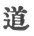

[13:2](crv003.htm#fr_1.md) μέθοδος.

[13:3](crv003.htm#fr_2.md) ὁδός.

[14:4](crv003.htm#fr_3.md)  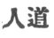

[14:5](crv003.htm#fr_4.md)  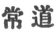

[14:6](crv003.htm#fr_5.md)  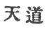

[15:7](crv003.htm#fr_6.md)  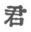

[15:8](crv003.htm#fr_7.md)  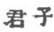

[15:9](crv003.htm#fr_8.md)  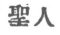

[15:10](crv003.htm#fr_9.md) Literally, "having
Reason the one."

[15:11](crv003.htm#fr_10.md) Literally, "identified
with Reason the one."

[15:12](crv003.htm#fr_11.md)  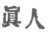

[15:13](crv003.htm#fr_12.md)  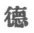

[18:14](crv003.htm#fr_13.md) For the meaning of
"nought" in Oriental thought see the author's *Foundations of
Mathematics*, pp. 134 ff. Compare also on the significance of
non-realities the article "Mysticism" in *The Monist*, Vol. XVIII, p.
86; further, *Buddhism and Its Christian Critics*, pp. 110, 119 ff. and
218, where Goethe is quoted on nothingness.

[18:15](crv003.htm#fr_14.md) For the connection of
Oneness with Quality see the author's Personality, pp. 36-38, and "The
Significance of Quality," *Monist*, XV, 375. Cf. *The*
[*Philosophy*](errata.htm#0.md) *of Form*, pp. 12-13.

[19:16](crv003.htm#fr_15.md)  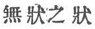

[19:17](crv003.htm#fr_16.md)  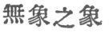

[19:18](crv003.htm#fr_17.md)  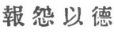 (Literally, "with virtue.")

[20:19](crv003.htm#fr_18.md)  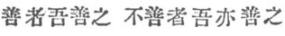

[20:20](crv003.htm#fr_19.md) Lao-tze uses no less
than eight synonyms for "rest" or "quietude": (1) *t‘ien tan*, "quietude
and peace," Chap. 31; (2) *tsing*, "quietude," Chaps. 16, 26, 37, 45,
61; (3) *ngan*, "still," Chap. 15, and "rest", Chap. 35; (4) *p‘ing*,
"contentment," Chap. 35; (5) *t‘ai*, "comfort," Chap. 35; (6) *tsan*,
"calm," Chap. 4; (7) *tsih*, "calm," Chap. 25; (8) *yen*, "calmly,"
Chap. 26.

[21:21](crv003.htm#fr_20.md) Compare with this
Matt. v. 45.

------------------------------------------------------------------------

[Next: Introduction to the Chinese](crv004.md)
