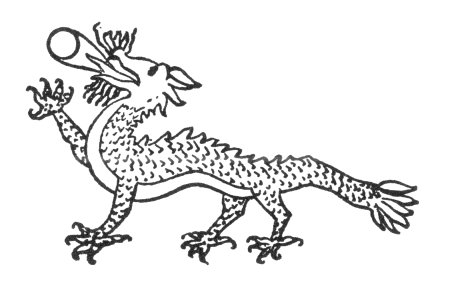
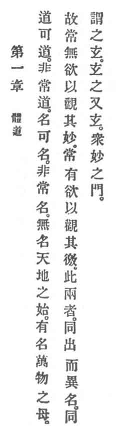

  
[Intangible Textual Heritage](../../index)  [Taoism](../index) 
[Index](index)  [Previous](crv006)  [Next](crv008) 

------------------------------------------------------------------------

p. 72

 

p. 73

# THE OLD PHILOSOPHER'S CANON OF REASON AND VIRTUE.

### I.

### 1. REASON'S REALIZATION.

|                    |
|--------------------|
|  |

1\. The Reason that can be reasoned is not the eternal Reason. The name
that can be named is not the eternal Name. The Unnamable is of heaven
and earth the beginning. The Namable becomes of the ten thousand things
the mother.

Therefore it is said:

2\. "He who desireless is found  
The spiritual of the world will sound.  
But he who by desire is bound  
Sees the mere shell of things around."

3\. These two things are the same in source but different in name. Their
sameness is called a mystery. Indeed, p. 74 it
is the mystery of mysteries. Of all spirituality it is the door.

------------------------------------------------------------------------

[Next: 2. Self-Culture](crv008)
