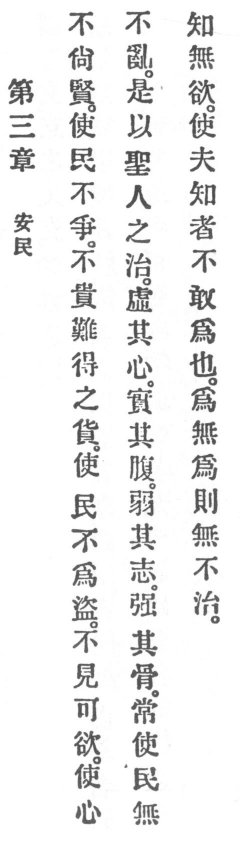

  
[Intangible Textual Heritage](../../index)  [Taoism](../index) 
[Index](index)  [Previous](crv008)  [Next](crv010) 

------------------------------------------------------------------------

### 3. KEEPING THE PEOPLE QUIET.

|                    |
|--------------------|
|  |

1\. Not boasting of one's worth forestalls people's envy.

Not prizing treasures difficult to obtain keeps people from committing
theft.

2\. Not contemplating what kindles desire keeps the heart unconfused.

3\. Therefore the holy man when he governs empties the people's hearts
but fills their stomachs. He weakens their ambition but strengthens
their bones. Always he keeps the people unsophisticated and without
desire. He causes that the crafty do not dare to act. When he acts with
non-assertion there is nothing ungoverned.

------------------------------------------------------------------------

[Next: 4. Sourceless](crv010)
