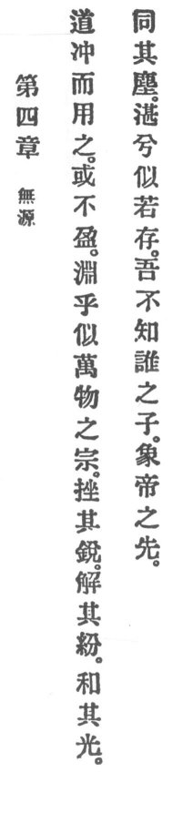

  
[Intangible Textual Heritage](../../index)  [Taoism](../index.md) 
[Index](index)  [Previous](crv009)  [Next](crv011.md) 

------------------------------------------------------------------------

### 4. SOURCELESS.

|                    |
|--------------------|
|  |

1\. Reason is empty, but its use is inexhaustible. In its profundity,
verily, it p. 76 resembleth the arch-father of
the ten thousand things.

2\. "It will blunt its own sharpness,  
Will its tangles adjust;  
It will dim its own radiance  
And be one with its dust."

3\. Oh, how calm it seems to remain! I know not whose son it is.
Apparently even the Lord it precedes.

------------------------------------------------------------------------

[Next: 5. The Function of Emptiness](crv011.md)
