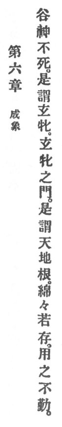

  
[Intangible Textual Heritage](../../index)  [Taoism](../index.md) 
[Index](index)  [Previous](crv011)  [Next](crv013.md) 

------------------------------------------------------------------------

p. 77

### 6. THE COMPLETION OF FORM.

|                    |
|--------------------|
|  |

1\. "The valley spirit not expires,  
Mysterious woman ’tis called by the sires.  
The mysterious woman's door, to boot,  
Is called of heaven and earth the root.  
Forever and aye it seems to endure  
And its use is without effort sure."

 

------------------------------------------------------------------------

[Next: 7. Dimming Radiance](crv013.md)
