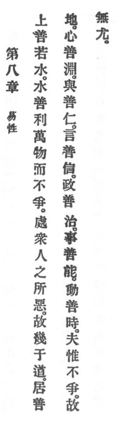

  
[Intangible Textual Heritage](../../index)  [Taoism](../index.md) 
[Index](index)  [Previous](crv013)  [Next](crv015.md) 

------------------------------------------------------------------------

### 8. EASY BY NATURE.

|                    |
|--------------------|
|  |

1\. Superior goodness resembleth water. The water's goodness benefiteth
the ten thousand things, yet it quarreleth not.

p. 78

2\. Water dwelleth in the places which the multitudes of men shun;
therefore it is near unto the eternal Reason

3\. The dwelling of goodness is in lowliness. The heart of goodness is
in commotion. When giving, goodness showeth benevolence. In words,
goodness keepeth faith. In government goodness standeth for order. In
business goodness exhibiteth ability. The movements of goodness keep
time.

4\. It quarreleth not. Therefore it is not rebuked.

------------------------------------------------------------------------

[Next: 9. Practising Placidity](crv015.md)
