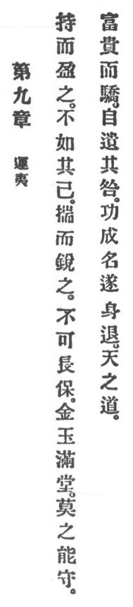

  
[Intangible Textual Heritage](../../index)  [Taoism](../index.md) 
[Index](index)  [Previous](crv014)  [Next](crv016.md) 

------------------------------------------------------------------------

### 9. PRACTISING PLACIDITY.

|                    |
|--------------------|
|  |

1\. Grasp to the full, are you not likely foiled? Scheme too sharply,
can you wear long? If gold and jewels fill the hall no one can protect
it.

2\. Rich and high but proud, brings about its own doom. To accomplish
merit and acquire fame, then to withdraw, that is Heaven's Way.

------------------------------------------------------------------------

[Next: 10. What Can Be Done?](crv016.md)
