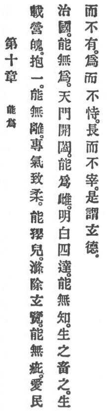

  
[Intangible Textual Heritage](../../index)  [Taoism](../index) 
[Index](index)  [Previous](crv015)  [Next](crv017) 

------------------------------------------------------------------------

### 10. WHAT CAN BE DONE?

|                    |
|--------------------|
|  |

1\. Who by unending discipline of the senses embraces unity cannot be
disintegrated. p. 79 By concentrating his
vitality and inducing tenderness he can become like a little child. By
purifying, by cleansing and profound intuition he can be free from
faults.

2\. Who loves the people when administering the country will practise
nonassertion.

Opening and closing the gates of heaven, he will be like a mother-bird;
bright, and white, and penetrating the four quarters, he will be
unsophisticated. He quickens them and feeds them. He quickens but owns
not. He acts but claims not. He excels but rules not. This is called
profound virtue.

------------------------------------------------------------------------

[Next: 11. The Function of the Non-Existent](crv017)
