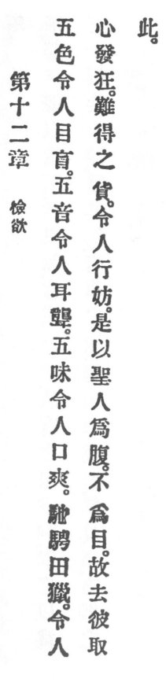

  
[Intangible Textual Heritage](../../index)  [Taoism](../index.md) 
[Index](index)  [Previous](crv017)  [Next](crv019.md) 

------------------------------------------------------------------------

### 12. ABSTAINING FROM DESIRE.

|                    |
|--------------------|
|  |

1\. "The five colors \[combined\] the human eye will blind;  
The five notes \[in one sound\] the human ear confound;  
The five tastes \[when they blend\] the human mouth offend."

2\. "Racing and hunting will human hearts turn mad,  
Treasures high-prized make human conduct bad."

3\. Therefore

The holy man attends to the inner and not to the outer. He abandons the
latter and chooses the former.

------------------------------------------------------------------------

[Next: 13. Loathing Shame](crv019.md)
