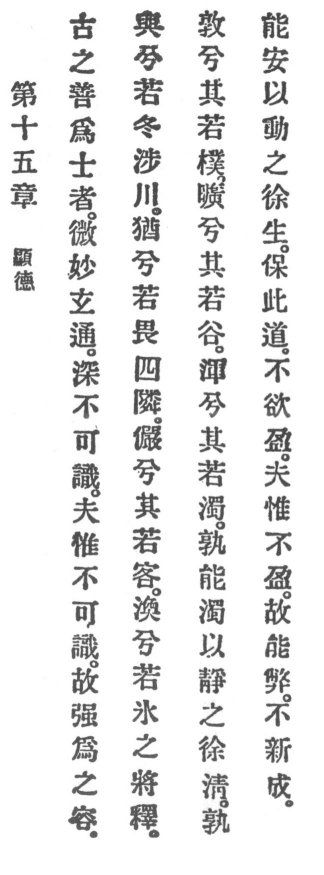

  
[Intangible Textual Heritage](../../index)  [Taoism](../index) 
[Index](index)  [Previous](crv020)  [Next](crv022) 

------------------------------------------------------------------------

### 15. THE REVEALERS OF VIRTUE.

|                    |
|--------------------|
|  |

1\. Those of yore who have succeeded in becoming masters are subtile,
spiritual, profound, and penetrating. On account of their profundity
they can not be understood. Because they can not be understood,
therefore I endeavor to make them intelligible.

2\. How cautious they are! Like men in winter crossing a river. How
reluctant! Like men fearing in the four quarters their neighbors. How
reserved! They behave like guests. How elusive! They resemble ice when
melting. How simple! They resemble rough wood. p.
83 How empty! They resemble the valley. How obscure! They
resemble troubled waters.

3\. Who by quieting can gradually render muddy waters clear? Who by
stirring can gradually quicken the still?

4\. He who cherishes this Reason is not anxious to be filled. Since he
is not filled, therefore he may grow old; without renewal he is
complete.

------------------------------------------------------------------------

[Next: 16. Returning to the Root](crv022)
