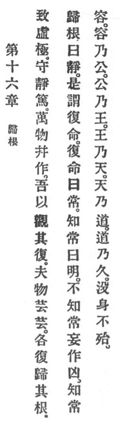

  
[Intangible Textual Heritage](../../index)  [Taoism](../index) 
[Index](index)  [Previous](crv021)  [Next](crv023) 

------------------------------------------------------------------------

### 16. RETURNING TO THE ROOT.

|                    |
|--------------------|
|  |

1\. By attaining the height of abstraction we gain fulness of rest.

2\. All the ten thousand things arise, and I see them return. Now they
bloom in bloom but each one homeward returneth to its root.

3\. Returning to the root means rest. It signifies the return according
to destiny. Return according to destiny means the eternal. Knowing the
eternal means enlightenment. Not knowing the eternal causes passions to
rise; and that is evil.

4\. Knowing the eternal renders comprehensive. Comprehensiveness renders
p. 84 broad. Breadth renders royal. Royalty
renders heavenly. Heaven renders Reason-like. Reason renders lasting.
Thus the decay of the body implies no danger.

------------------------------------------------------------------------

[Next: 17. Simplicity In Habits](crv023)
