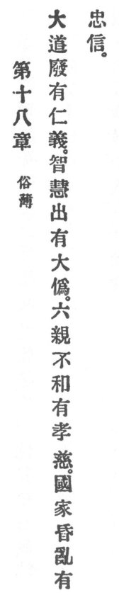

  
[Intangible Textual Heritage](../../index)  [Taoism](../index) 
[Index](index)  [Previous](crv023)  [Next](crv025) 

------------------------------------------------------------------------

### 18. THE PALLIATION OF VULGARITY.

|                    |
|--------------------|
|  |

1\. When the great Reason is obliterated, we have benevolence and
justice. Prudence and circumspection appear, and we have much hypocrisy.

2\. When family relations no longer harmonize, we have filial piety and
paternal p. 85 devotion. When the country and
the clans decay through disorder, we have loyalty and allegiance.

------------------------------------------------------------------------

[Next: 19. Returning to Simplicity](crv025)
