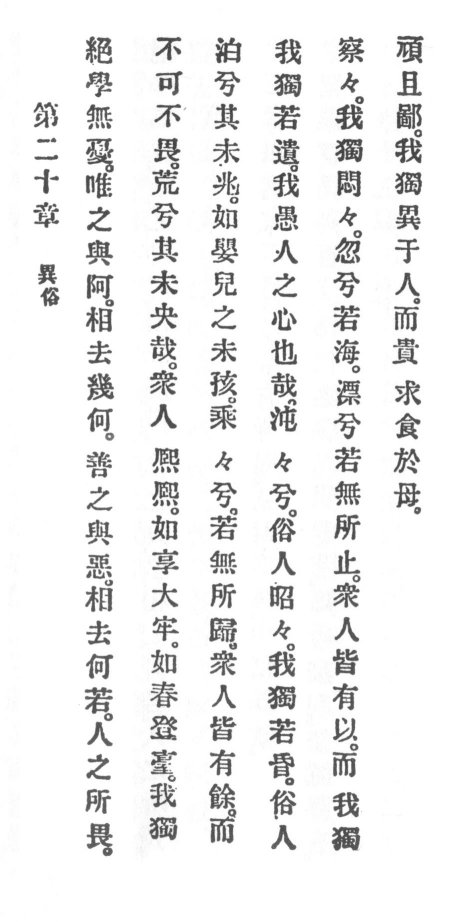

  
[Intangible Textual Heritage](../../index)  [Taoism](../index) 
[Index](index)  [Previous](crv025)  [Next](crv027) 

------------------------------------------------------------------------

### 20. DIFFERENT FROM THE VULGAR.

|                    |
|--------------------|
|  |

1\. Abandon learnedness, and you have no vexation. The "yes" compared
with the "yea," how little do they differ! p.
86 But the good compared with the bad, how much do they differ!

2\. If what the people dread cannot be made dreadless, there will be
desolation, alas! and verily, there will be no end of it.

3\. The multitudes of men are happy, so happy, as though celebrating a
great feast. They are as though in springtime ascending a tower. I alone
remain quiet, alas! like one that has not yet received an omen. I am
like unto a babe that does not yet smile.

4\. Forlorn am I, O so forlorn! It appears that I have no place whither
I may return home.

5\. The multitude of men all have plenty and I alone appear empty. Alas!
I am a man whose heart is foolish.

6\. Ignorant am I, O, so ignorant! Common people are bright, so bright,
I alone am dull.

7\. Common people are smart, so smart, I alone am confused, so confused.

8\. Desolate am I, alas! like the sea. Adrift, alas! like one who has no
place where to stay.

p. 87

9\. The multitude of men all possess usefulness. I alone am awkward and
a rustic too. I alone differ from others, but I prize seeking sustenance
from our mother.

------------------------------------------------------------------------

[Next: 21. Emptying the Heart](crv027)
