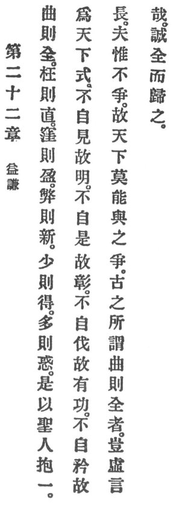

  
[Intangible Textual Heritage](../../index)  [Taoism](../index.md) 
[Index](index)  [Previous](crv027)  [Next](crv029.md) 

------------------------------------------------------------------------

p. 88

### 22. HUMILITY'S INCREASE.

|                    |
|--------------------|
|  |

1\. "The crooked shall be straight,  
Crushed ones recuperate,  
The empty find their fill.  
The worn with strength shall thrill;  
Who little have receive,  
And who have much will grieve."

2\. Therefore

The holy man embraces unity and becomes for all the world a model.

Not self-displaying he is enlightened;

Not self -approving he is distinguished;

Not self-asserting he acquires merit;

Not self-seeking he gaineth life.

Since he does not quarrel, therefore no one in the world can quarrel
with him.

3\. The saying of the ancients: "The crooked shall be straight," is it
in any way vainly spoken? Verily, they will be straightened and return
home.

------------------------------------------------------------------------

[Next: 23. Emptiness and Non-Existence](crv029.md)
