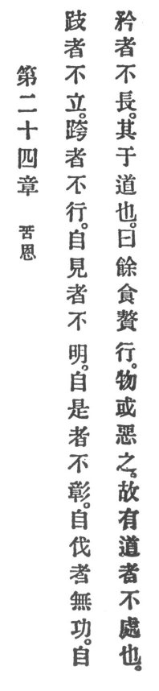

  
[Intangible Textual Heritage](../../index)  [Taoism](../index) 
[Index](index)  [Previous](crv029)  [Next](crv031) 

------------------------------------------------------------------------

### 24. TROUBLE FROM INDULGENCE.

|                    |
|--------------------|
|  |

1\. One on tiptoe is not steady;  
One astride makes no advance.  
Seff-displayers are not enlightened,  
Self-asserters lack distinction, p. 90  
Self-approvers have no merit,  
And self-seekers stunt their lives.

2\. Before Reason this is like surfeit of food; it is like a wen on the
body with which people are apt to be disgusted.

3\. Therefore the man of reason will not indulge in it.

------------------------------------------------------------------------

[Next: 25. Imaging the Mysterious](crv031)
