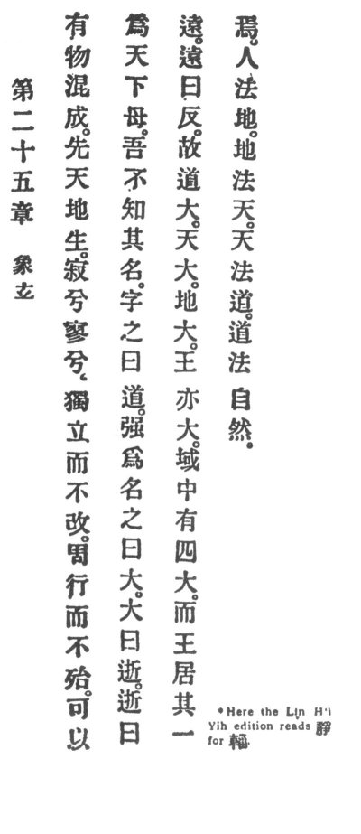

  
[Intangible Textual Heritage](../../index)  [Taoism](../index) 
[Index](index)  [Previous](crv030)  [Next](crv032) 

------------------------------------------------------------------------

### 25. IMAGING THE MYSTERIOUS.

|                    |
|--------------------|
|  |

1\. There is a Being wondrous and complete. Before heaven and earth, it
was. How calm it is! How spiritual!

2\. Alone it standeth, and it changeth not; around it moveth, and it
suffereth not; yet therefore can it be the world's mother.

3\. Its name I know not, but its nature I call Reason.

4\. Constrained to give a name, I call it the great. The great I call
the departing, and the departing I call the beyond. The beyond I call
home.

5\. The saying goes: "Reason is great, heaven is great, earth is great,
and royalty also is great. \[There are four things p.
91 in the world that are great, and royalty is one of them.\]

6\. Man's standard is the earth. The earth's standard is heaven.
Heaven's standard is Reason. Reason's standard is intrinsic.

------------------------------------------------------------------------

[Next: 26. The Virtue of Gravity](crv032)
