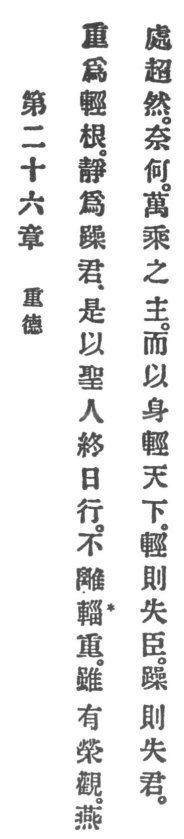

  
[Intangible Textual Heritage](../../index)  [Taoism](../index.md) 
[Index](index)  [Previous](crv031)  [Next](crv033.md) 

------------------------------------------------------------------------

### 26. THE VIRTUE OF GRAVITY.

|                    |
|--------------------|
|  |

1\. The heavy is of the light the root, and rest is motion's master.

2\. Therefore the holy man in his daily walk does not depart from
gravity. Although he may have magnificent sights, he calmly sits with
liberated mind.

3\. But how is it when the master of the ten thousand chariots in his
personal conduct is too light for the empire? If he is too light he will
lose his vassals. If he is too passionate he will lose the throne.

------------------------------------------------------------------------

[Next: 27. The Function of Skill](crv033.md)
