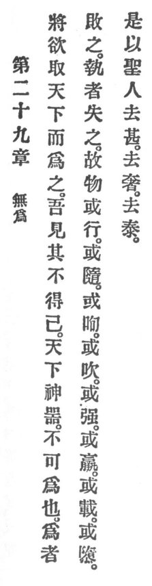

  
[Intangible Textual Heritage](../../index)  [Taoism](../index) 
[Index](index)  [Previous](crv034)  [Next](crv036) 

------------------------------------------------------------------------

### 29. NON-ASSERTION.

|                    |
|--------------------|
|  |

1\. When one desires to take in hand the empire and make it, I see him
not succeed. The empire is a divine vessel which cannot be made. One who
makes it, mars it. One who takes it, loses it.

p. 94

2\. And it is said of beings:  
"Some are obsequious, others move boldly,  
Some breathe warmly, others coldly,  
Some are strong and others weak,  
Some rise proudly, others sneak."

3\. Therefore the holy man abandons excess, he abandons extravagance, he
abandons indulgence.

------------------------------------------------------------------------

[Next: 30. Be Chary of War](crv036)
