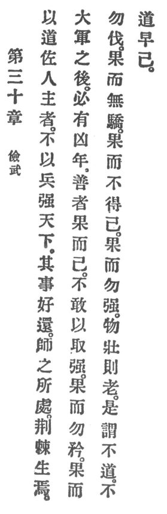

  
[Intangible Textual Heritage](../../index)  [Taoism](../index) 
[Index](index)  [Previous](crv035)  [Next](crv037) 

------------------------------------------------------------------------

### 30. BE CHARY OF WAR.

|                    |
|--------------------|
|  |

1\. He who with Reason assists the master of mankind will not with arms
strengthen the empire. His methods invite requital.

2\. Where armies are quartered briars and thorns grow. Great wars
unfailingly are followed by famines. A good man acts resolutely and then
stops. He ventures not to take by force.

3\. Be resolute but not boastful; resolute but not haughty; resolute but
not arrogant; resolute because you cannot avoid it; resolute but not
violent.

4\. Things thrive and then grow old. p. 95
This is called un-Reason. Un-Reason soon ceases.

------------------------------------------------------------------------

[Next: 31. Quelling War](crv037)
