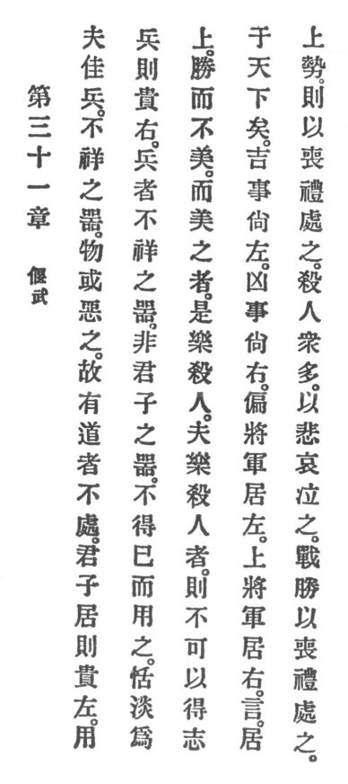

  
[Intangible Textual Heritage](../../index)  [Taoism](../index.md) 
[Index](index)  [Previous](crv036)  [Next](crv038.md) 

------------------------------------------------------------------------

### 31. QUELLING WAR.

|                    |
|--------------------|
|  |

1\. Even victorious arms are unblest among tools, and people had better
shun them. Therefore he who has Reason does not rely on them.

2\. The superior man when residing at home honors the left. When using
arms, he honors the right.

3\. Arms are unblest among tools and not the superior man's tools. Only
when it is unavoidable he uses them. Peace and quietude he holdeth high.

4\. He conquers but rejoices not. Rejoicing at a conquest means to enjoy
the slaughter of men. He who enjoys the slaughter of men will most
assuredly not obtain his will in the empire.

------------------------------------------------------------------------

[Next: 32. The Virtue of Holiness](crv038.md)
