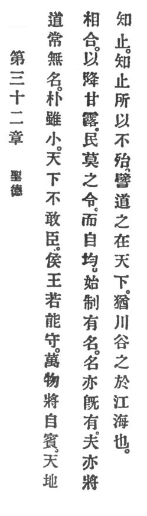

  
[Intangible Textual Heritage](../../index)  [Taoism](../index.md) 
[Index](index)  [Previous](crv037)  [Next](crv039.md) 

------------------------------------------------------------------------

### 32. THE VIRTUE OF HOLINESS.

|                    |
|--------------------|
|  |

1\. Reason, in its eternal aspect, is unnamable.

2\. Although its simplicity seems insignificant, the whole world does
not dare to suppress it. If princes and kings p.
96 could keep it, the ten thousand things would of themselves pay
homage. Heaven and earth would unite in dripping sweet dew, and the
people with no one to command them would of themselves be righteous.

3\. As soon as Reason creates order, it becomes namable. Whenever the
namable in its turn acquires existence, one learns to know when to stop.
By knowing when to stop, one avoids danger.

4\. To illustrate Reason's relation to the world we compare it to
streams and creeks in their course towards rivers and the ocean.

------------------------------------------------------------------------

[Next: 33. The Virtue of Discrimination](crv039.md)
