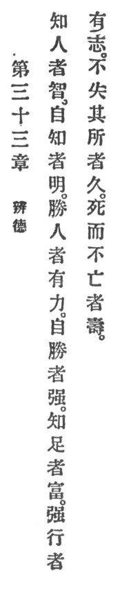

  
[Intangible Textual Heritage](../../index)  [Taoism](../index.md) 
[Index](index)  [Previous](crv038)  [Next](crv040.md) 

------------------------------------------------------------------------

### 33. THE VIRTUE OF DISCRIMINATION.

|                    |
|--------------------|
|  |

1\. One who knows others is clever, but one who knows himself is
enlightened.

2\. One who conquers others is powerful, but one who conquers himself is
mighty.

3\. One who knows contentment is rich and one who pushes with vigor has
will.

4\. One who loses not his place endures.

5\. One who may die but will not perish, has life everlasting.

------------------------------------------------------------------------

[Next: 34. Trust in its Perfection](crv040.md)
