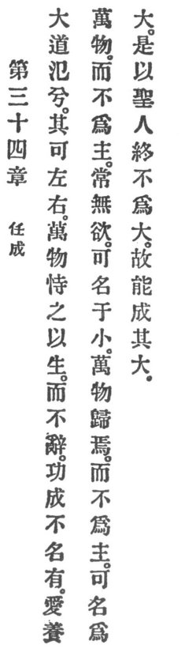

  
[Intangible Textual Heritage](../../index)  [Taoism](../index) 
[Index](index)  [Previous](crv039)  [Next](crv041) 

------------------------------------------------------------------------

p. 97

### 34. TRUST IN ITS PERFECTION.

|                    |
|--------------------|
|  |

1\. How all-pervading is the great Reason! It can be on the left and it
can be on the right.

2\. The ten thousand things depend upon it for their life, and it
refuses them not. When its merit is accomplished it assumes not the
name. Lovingly it nourishes the ten thousand things and plays not the
lord. Ever desireless it can be classed with the small. The ten thousand
things return home to it. It plays not the lord. It can be classed with
the great.

3\. Therefore

The holy man unto death does not make himself great and can thus
accomplish his greatness.

------------------------------------------------------------------------

[Next: 35. The Virtue of Benevolence](crv041)
