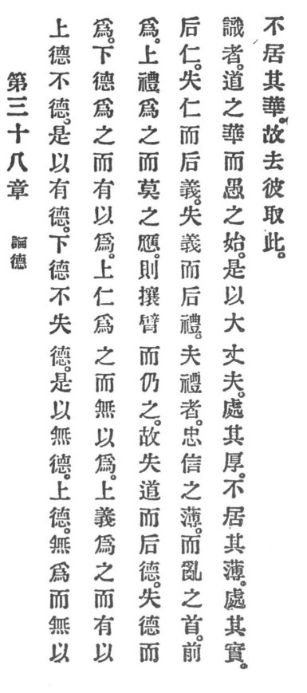

  
[Intangible Textual Heritage](../../index)  [Taoism](../index.md) 
[Index](index)  [Previous](crv043)  [Next](crv045.md) 

------------------------------------------------------------------------

# II.

### 38. DISCOURSE ON VIRTUE.

|                    |
|--------------------|
|  |

1\. Superior virtue is unvirtue. Therefore it has virtue. Inferior
virtue never loses sight of virtue. Therefore it has no virtue.

2\. Superior virtue is non-assertion and without pretension. Inferior
virtue asserts and makes pretensions.

3\. Superior benevolence acts but makes no pretensions. Superior justice
acts and makes pretensions.

4\. Superior propriety acts and when p. 100
no one responds to it, it stretches its arm and enforces its rules.

5\. Thus one loses Reason and then virtue appears. One loses virtue and
then benevolence appears. One loses benevolence and then justice
appears. One loses justice and then propriety appears. The rules of
propriety are the semblance of loyalty and faith, and the beginning of
disorder.

6\. Traditionalism is the flower of Reason, but of ignorance the
beginning.

7\. Therefore a great organizer abides by the solid and dwells not in
the external. He abides in the fruit and dwells not in the flower.

8\. Therefore he discards the latter and chooses the former.

------------------------------------------------------------------------

[Next: 39. The Root of Order](crv045.md)
