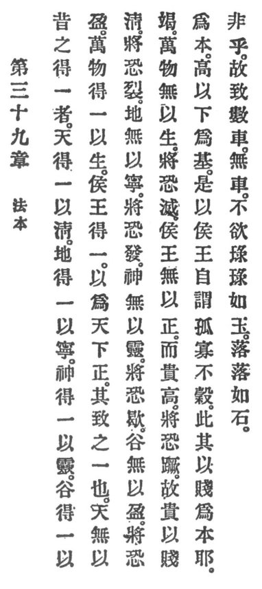

  
[Intangible Textual Heritage](../../index)  [Taoism](../index.md) 
[Index](index)  [Previous](crv044)  [Next](crv046.md) 

------------------------------------------------------------------------

### 39. THE ROOT OF ORDER.

|                    |
|--------------------|
|  |

1\. From of old these things have obtained oneness:

2\. "Heaven by oneness becometh pure.  
Earth by oneness can endure.  
Minds by oneness souls procure.  
Valleys by oneness repletion secure. p. 101  
"All creatures by oneness to life have been called.  
And kings were by oneness as models installed."

Such is the result of oneness.

3\. "Were heaven not pure it might be rent.  
Were earth not stable it might be bent.  
Were minds not ensouled they'd be impotent.  
Were valleys not filled they'd soon be spent.  
When creatures are lifeless who can their death prevent?  
Are kings not models, but on haughtiness bent,  
Their fall, forsooth, is imminent."

4\. Thus, the nobles come from the commoners as their root, and the high
rest upon the lowly as their foundation. Therefore, princes and kings
call themselves orphaned, lonely, and unworthy. Is this not because they
take lowliness as their root?

p. 102

5\. The several parts of a carriage are not a carriage.

6\. Those who have become a unity are neither anxious to be praised with
praise like a gem, nor disdained with disdain like a stone.

------------------------------------------------------------------------

[Next: 40. Avoiding Activity](crv046.md)
