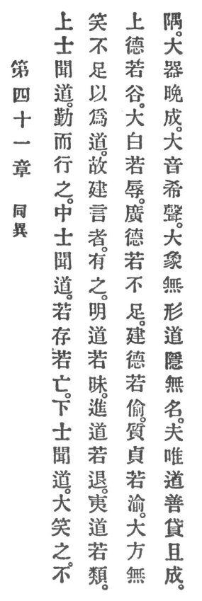

  
[Intangible Textual Heritage](../../index)  [Taoism](../index.md) 
[Index](index)  [Previous](crv046)  [Next](crv048.md) 

------------------------------------------------------------------------

### 41. SAMENESS IN DIFFERENCE.

|                    |
|--------------------|
|  |

1\. When a superior scholar hears of Reason he endeavors to practise it.

2\. When an average scholar hears of Reason he will sometimes keep it
and sometimes lose it.

3\. When an inferior scholar hears of Reason he will greatly ridicule
it. Were it not thus ridiculed, it would as Reason be insufficient.

4\. Therefore the poet says:

5\. "The Reason--enlightened seem dark and black, p.
103  
The Reason--advanced seem going back,  
The Reason--straight-levelled seem rugged and slack.

6\. "The high in virtue resemble a vale,  
The purely white in shame must quail,  
The staunchest virtue seems to fail.

7\. "The solidest virtue seems not alert,  
The purest chastity seems pervert,  
The greatest square will rightness desert.

8\. "The largest vessel is not yet complete,  
The loudest sound is not speech replete,  
The greatest form has no shape concrete."

9\. Reason so long as it remains latent is unnamable. Yet Reason alone
is good for imparting and completing.

------------------------------------------------------------------------

[Next: 42. Reason's Modifications](crv048.md)
