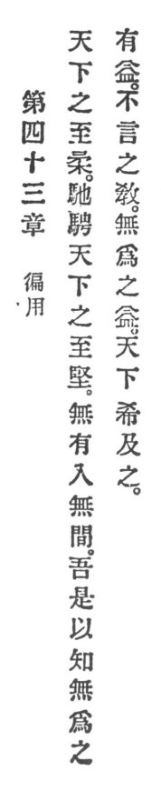

  
[Intangible Textual Heritage](../../index)  [Taoism](../index.md) 
[Index](index)  [Previous](crv048)  [Next](crv050.md) 

------------------------------------------------------------------------

### 43. ITS UNIVERSAL APPLICATION.

|                    |
|--------------------|
|  |

1\. The world's weakest overcomes the world's hardest.

2\. Non-existence enters into the impenetrable.

3\. Thereby I comprehend of non-assertion the advantage. There are few
in the world who obtain of non-assertion the advantage and of silence
the lesson.

------------------------------------------------------------------------

[Next: 44. Setting Up Precepts](crv050.md)
